# Absentee Administration {#h-1fob9te}

ADAM allows for the daily recording of absentees using any number of customisable absentee reasons. Typically, the absentee reasons should be as broad as possible to save you from having to create a new reason every time there is a new excuse to stay away from school. As most school secretaries will agree, parents and pupils can be very inventive!

Each absentee reason will either count as an absence from school or not. Examples of absentee reasons might include:

-   **Absent**: this would count as a day’s absence from school.
-   **School Tour**: while the pupil is absent from school, this should not count towards the absentee total for the pupil since they are on a sanctioned school excursion.
-   **Arrived Late**: the pupils was at school for part of the day and thus this reason should not count as absent. However, it is useful to count the number of times that a pupil does arrive late to detect patterns in behaviour.

## Absentee Reasons {#h-i74ma3ruchb0}

Absentee Reasons allow us to categorise the pupil’s absence from school. While it is tempting to create very specific reasons, you are advised to create wide-ranging reasons since this will simplify the reporting aspects later. Many school adopt the following - or similar - approach:

-   Absent (not excused) - counts as absent
-   Absent (excused) - counts as absent
-   Arrived late - counts as *not* absent
-   Left early - counts as *not* absent
-   School tour - counts as *not* absent
-   Exchange - counts as *not* absent

### Editing the Absentee Reasons {#h-s9fzxgzrwfk}

To manage the list of absentee reasons, click on the **Administration** tab and then, under the **Absentee Administration** heading, click on the ocption **Edit the absentee reasons**.

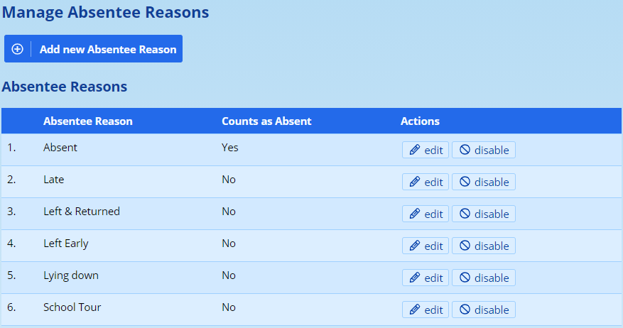

To add a new absentee reason, click on the link at the top of the page **Add new Absentee Reason**. You can also choose to edit an existing reason by clicking on the **edit** link next to the reason.

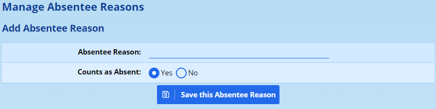

In this screen you can give a name for the absentee reason (or change it, if you are editing an existing reason). The second option will tell ADAM whether this reason should count as absent.

!!! warning
    Be aware that changing the name of the absentee reason - specifically where such a change has a difference in meaning - that past records that have been recorded with this reason will still be shown against this reason, even with its new meaning.

### Disabling an absentee reason {#h-nxacksw2zjom}

Disabling an absentee reason won’t remove or affect any pupils who have had the reason recorded against their absentee records. However, a disabled absentee reason won’t be shown in the list of absentee reasons when recording pupils as absent.

If a disabled absentee reason is enabled again, it becomes available for chosing once again.

## Default Absentee Reasons {#h-avdryvnl34qb}

When [recording absentees by class](#h-lqjnm138tqgm), ADAM normally marks all pupils as “present” and teachers much then specifically mark pupils who are absent as such. This system works well for most scenarios where a register teacher is guaranteed of seeing all the pupils in the class at once and is thus able to easily determine whether a pupil is absent or present.

However, there can be many reasons that cause a pupil to miss morning registration. This is particularly the case where there are morning activities that might cause a pupil to miss their home room or registration session, or have their absentee record recorded by another teacher.

The default behaviour, when doing a class’s absentees, is for ADAM to show all pupils as “present”:

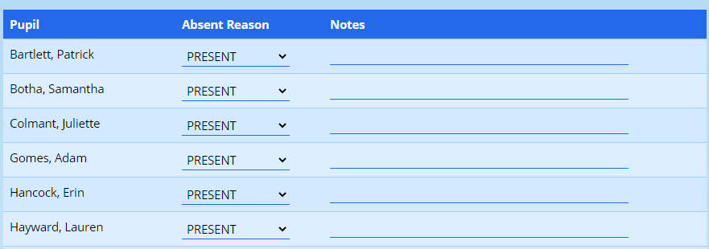

A teacher must now mark pupils who are absent as such.

***This can lead to problems, however.*** Consider the scenario where a morning meeting happens during the registration period. The registration teacher would open the class and, seeing that a pupil was not there, mark them as absent. However, the other teacher running the morning meeting would see that the pupil is there and mark them as present. In this instance, if the registration teacher saved their records second, the absent record would be the last one saved and the pupil would be marked as absent for the day.

A teacher could select “Unknown” from the list above and this would avoid this problem. Where a pupil is marked as “Unknown”, ADAM will not update the absentee record meaning that the conflicting information above could be avoided.

### Dealing with unaccounted for pupils {#h-8lgz9sjqpbl2}

In the above scenario, two teachers added conflicting information and the person who saved their absentee records last was the record that remained.

To avoid this and to force more accountability on teachers when taking absentees, ADAM can default this decision to “Unknown”. If a pupil is marked as “Unknown”, ADAM does not make any attempt to save the absentee record. Such pupils will appear on the “Unaccounted for” list of the [daily absentee report](#h-eks8qfjv0wac).

To change the default absentee reason to “Unknown”, navigate to **Administration → Site Administration → Edit site settings**. In the site settings, click on the **Attendance** tab and, under the **Absentee Recording** subheading, change the value of **Default Absentee Reason** to say “unknown”.

## Absentee Records {#h-eaq9keutv9qf}

There are a number of ways in which absentees can be recorded, depending on how your school works.

### Adding Absentees Individually {#h-to08kmy21hbm}

Navigate to the **Pupils** tab and, under the **Absentee Administration**, click on the option **Add Absentee Records (individually)**.

Type in the name of the pupil and click on the **Next** button.

The following screen is shown:

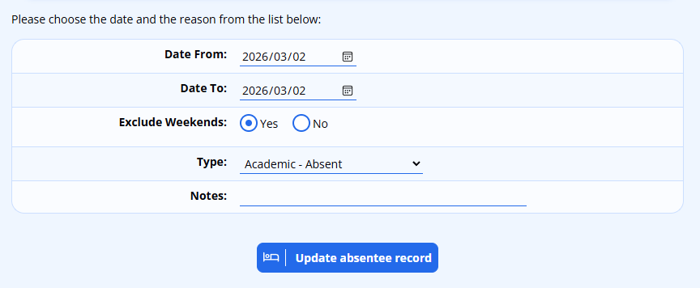

Choose the “**Date From**” and “**Date To**” (if the pupil has been off for multiple days). Both dates will start off showing the current date.

Please note that if you wish to record a single day’s absence in advance of their absence (for example, you receive a letter from the parents to excuse the child from school at the end of the week), you will need to change the “Date To” field to in order to reflect a date that is either the same or after the “Date From”. Otherwise, not absentee record will be recorded.

If you are entering in absentee records for a large range of dates (perhaps a pupil is on exchange for a month), you can choose to **ignore weekends**. If you set this to “No”, ADAM will also add in absentee records for Saturdays and Sundays which may spoil your absentee statistics.

Choose an **absentee type** (see [Absentee Reasons](#h-i74ma3ruchb0) for more information). If you wish to enter a note to explain the absence, you may do so in the “Notes” block.

Click on **Record absenteeism** to record this.

Once saved, the new absentee record should appear in the log and summary at the bottom of the page.

#### Clearing an absentee record {#h-7rr6i68d1zeq}

If you add a date by accident, you simply need to enter in the erroneous date again, as if you were about to repeat the error, and then choose the **type** “PRESENT” from the drop-down list. Any absentees for the dates selected in the date range will be removed.

### Adding Absentees by Class {#h-lqjnm138tqgm}

One can either select a specific subject and class - useful for schools that perform registration during lesson 1, for example - or you can click on the option immediately under the heading which will take you to select one of the classes belonging to the “Default Subject”.

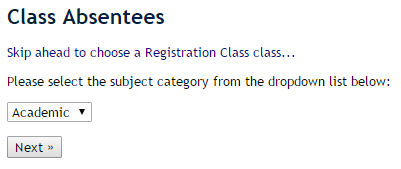

Once you have selected your class, confirm that you wish to enter absentees for today’s date (you can change it if you wish).

You will then see a list of pupils in that class. All pupils are assumed present unless otherwise indicated.

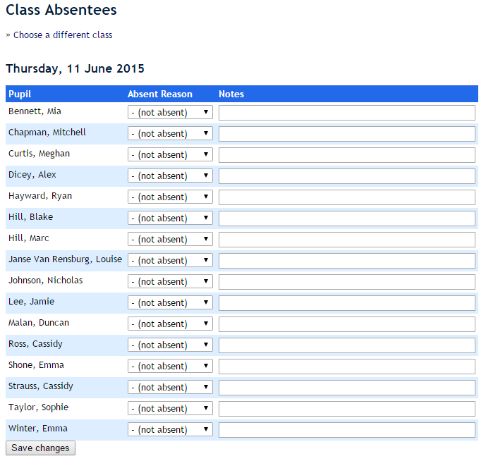

Once you have selected the reason for the absent pupils and recorded it, you should click on the **Save changes** button at the bottom of the screen. Any notes will also be recorded.

### Adding Bulk Absentees {#h-iydok2xisflu}

Bulk absentees allows you to enter absentees for a group of pupils for an extended date range.

Choose the group of pupils that you wish to enter the absentee records for and then you will see a list of the pupils in that class. The pupils are all ticked by default but you can untick any if you need to.

At the bottom of the list are the same fields as when recording [individual absentees](#h-to08kmy21hbm). Please note, however, that undoing bulk absentees must be done individually. Please use the feature carefully!

## Absentee Recording Reminders {#h-kxvacfgasng0}

ADAM is able to send out an email reminder to staff who might not have recorded their absentees by a specific time. Ideally this reminder should be sent before the [Absentee Alerts](#h-e1rizcwckki9) to give teachers who have not completed their absentees a chance to do so.

This alert can only be sent to teachers of the “Default Subject” - which is normally a home room or registration class in most schools.

To enable the reminders, navigate to the Site Settings (**Administration → Site Administration → Edit Site Settings**) and, on the **Attendance** tab, scroll down to the **Absentee Alerts** heading.

Add in a **Time at which to send absentee recording reminders**.

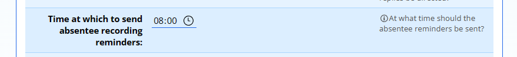

To stop ADAM sending these reminders, remove the time.

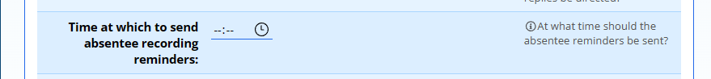

Don’t forget to save the site settings by clicking on the **Save** button at the bottom of the page.

The content of the email that is sent to staff can be customised by editing the **Absentee Recording Reminder** email in the [Email Message Templates](email-message-templates.md#h-5rkfadj40kta).

## Absentee Alerts {#h-e1rizcwckki9}

Absentee alerts are a great way to alert staff about which pupils they teach are absent for the day. Using this feature, ADAM can email each staff member and tell them which pupils - of the ones that they teach - will be absent today. If there are no pupils absent for a particular teacher, then no email will be sent to that teacher.

In addition, the Absentee Alerts can be used to alert pastoral care staff to the sudden and frequent absence of a pupil allowing them to follow up with parents.

### Creating an Absentee Alert {#h-qdhoad2fu8ta}

Navigate to **Administration → Absentee Administration → Edit absentee alerts**.

Click on “Add a new absentee alert”:

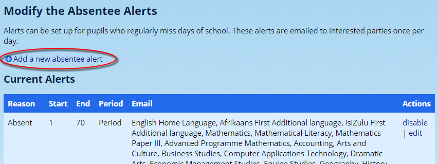

The following screen will appear:

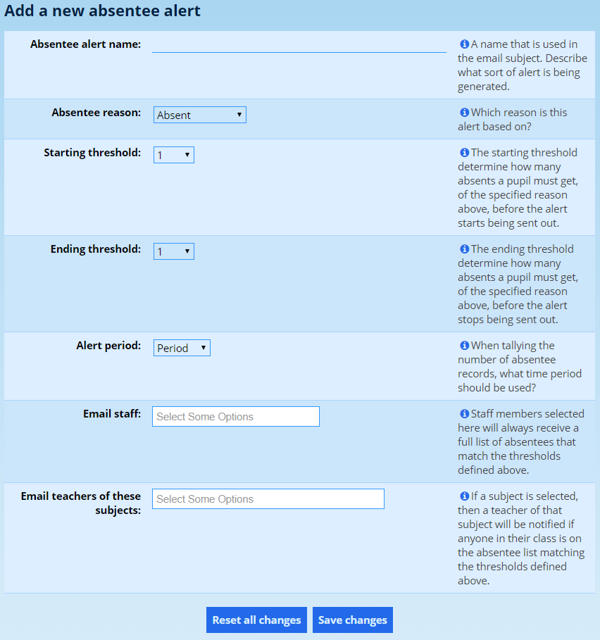

The **Absentee alert name** is used as a heading within the mail to indicate which type of alert this is. Examples might be:

-   Daily absenteeism
-   Frequent late arrivals
-   Frequent absenteeism

Choose an **Absentee reason** that ADAM should monitor for this alert. If you were monitoring late arrivals, you would choose “Late” from the list, for example. While you can have multiple alerts set up, each monitoring a different reason, a single alert cannot monitor more than one reason.

The **Start** and **End threshold** are used to determine between which two counts the alerts should be sent. For example:

-   Daily absentee alerts would have a start threshold at 1 and an end threshold at 365. Alerts would then be sent each time they were absent.
-   To alert a pastoral care member of staff if the pupil has been absent exactly 5 times, the start and end threshold would both be set to 5. In this case, an alert would be sent on the occasion of their fifth absence, but not their fourth or sixth.
-   The **Alert period** determines the time frame over which to monitor. This allows for monitoring of absences over a specific time frame. For example, three or more absences in a week could indicate health issues which the school should follow up on. Options are:

-   “Total” counts a pupils absentee records over their entire career at the school.
-   “Year” counts all absentee records for the current calendar year.
-   “Period” which will use the current reporting period to work out which absences are valid. Note that schools that use concurrent reporting periods *may* find unexpected results when using “Period”.
-   “Month” counts all absentee records in the preceding 30 days.
-   “2 Weeks” counts all absentee records from the last two weeks
-   “Week” counts all absentee records from the last 7 days.

-   ADAM allows specific staff to be emailed for a particular alert. Enter their names in the **Email staff** field. Such staff would typically be a deputy head in charge of pastoral care, the absentee administrator or so on. If a staff member’s name is entered here, they will receive a list of *all* absentees and not simply the pupils that they teach. As a general rule of thumb, names should be entered here as an exception rather than a rule.
-   In contrast with the setting above, one can choose to simply **Email teachers of these subjects**. Entering in subjects here will email those teachers of pupils who are registered for a class in that subject. Often, all academic subjects will be chosen as well as a Register Class and Grade Head subjects. This ensures that a register teacher will receive confirmation of their absences and a grade head will have a comprehensive view of their grade’s absences for that day.

Once you’ve set up these options, click on **Save Changes**. Your alert is now saved.

### Managing Existing Alerts {#h-u200nlj9k7b6}

Next to each Absentee Alert is the option to **edit** or **disable** it:

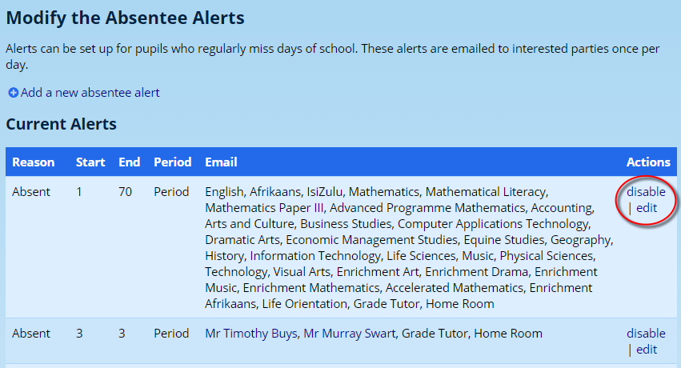

### Customising when the alerts are sent {#h-n919qocjts2c}

For absentee alerts to work properly, daily absentees must be completed by a certain time. Most schools will have their absentees captured by 9am. ADAM is then set to automatically send the alerts at this time. The automated sending is necessary to ensure that the alerts are sent.

To change the time, navigate to **Administration → Site Administration → Edit site settings**. On the **Attendance** tab under the **Absentee Alerts** heading within the settings, look for the **Absentee alert times** option and select the time of day to send the alerts.

It is possible for more than a single time to be chosen and in this instance, ADAM will send out a complete, albeit revised if applicable, list at each time selected.

### Directing responses to Absentee Alerts to the Absentee Administrator {#h-im6mavyeg8rx}

ADAM sends out the Absentee Alerts from the configured default “From” address (see [Communication Settings](communication-settings-in-adam.md#h-i4b0jd1w7v0v)). However, it is often useful for the person in charge of absentees to get responses from teachers who may wish to report errors or changes to the absentees (i.e. a pupil arrives late, yet was marked as absent).

To set a specific reply address, navigate to **Administration → Site Administration → Edit Site Settings** and look on the **Attendance** tab under the **Absentee Alerts** heading for the **Absentee Alert Reply Address**. Add in the email address of the person who should receive replies to the alerts.

## Absentee Recording Report {#h-cxh5d5q9r7dx}

ADAM is able to send an emailed report to one or more email addresses with a summary of the absentees for the day. This will include a list of all the default classes, the number of pupils present, absent and unaccounted for.

To enable the reminders, navigate to the Site Settings (**Administration → Site Administration → Edit Site Settings**) and, on the **Cron** tab, scroll down to the **Absentees** heading.

Add in a **Time at which to send absentee recording report**. Also add in one or more email addresses in the **Recipients for absentee recording report** setting.

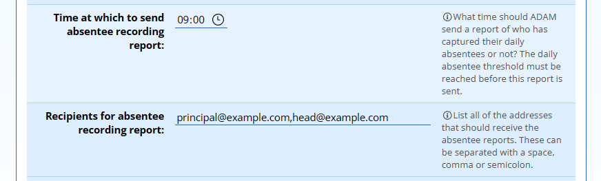

Don’t forget to click on the **Save** button at the bottom of the screen!

The text of the email that is sent can be customised by editing the **Absentee Recording Report** email template in the [Email Message Templates](email-message-templates.md#h-5rkfadj40kta).

## Absentee Reports {#h-3dy6vkm}

### Daily Absentees {#h-eks8qfjv0wac}

A list of daily absentees can be generated by visiting **Pupils → Absentees → Daily Absentee List**. When opening this link, a number of options are provided.

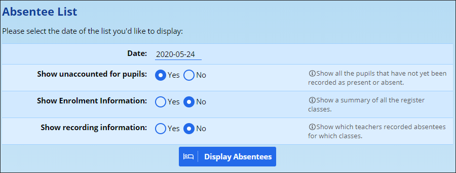

Change the **Date** to show absentees from another date if required. This should always have today’s date in by default.

ADAM allows you to **show unaccounted for pupils** in this list. Depending on one of the configuration options for absentees, ADAM may default pupils as “present” or “unknown” during a class register. Any pupil who has been recorded as “unknown” or who has not been recorded at all will show up as an unaccounted for pupil.

The option to **show enrolment information** will show a list of the default classes (normally “Registration Class”, but your school may have a different default subject chosen). With each class, a count of present, absent, and unaccounted for pupils is shown.

Lastly, the option to **show recording information** will show which teachers recorded absentees for which classes. Note that this will *not* show recording detail for individuals and only for classes. Schools use this as a monitoring tool to ensure that their teachers have all completed their absentee records for the day.

## Absentee SMSs {#h-njiocdyhtdsh}

ADAM allows a user with the appropriate privileges to send SMS notifications to Family members, Pupils and Staff of absent pupils.

*Note that sending SMSs is not free and this can be an expensive undertaking! It is partly for this reason, and to ensure no false positives are triggered, that absentee SMS alerts* cannot *be set up to be processed automatically.*

Navigate to **Pupils → Absentee Administration → Send absentee SMSs**.

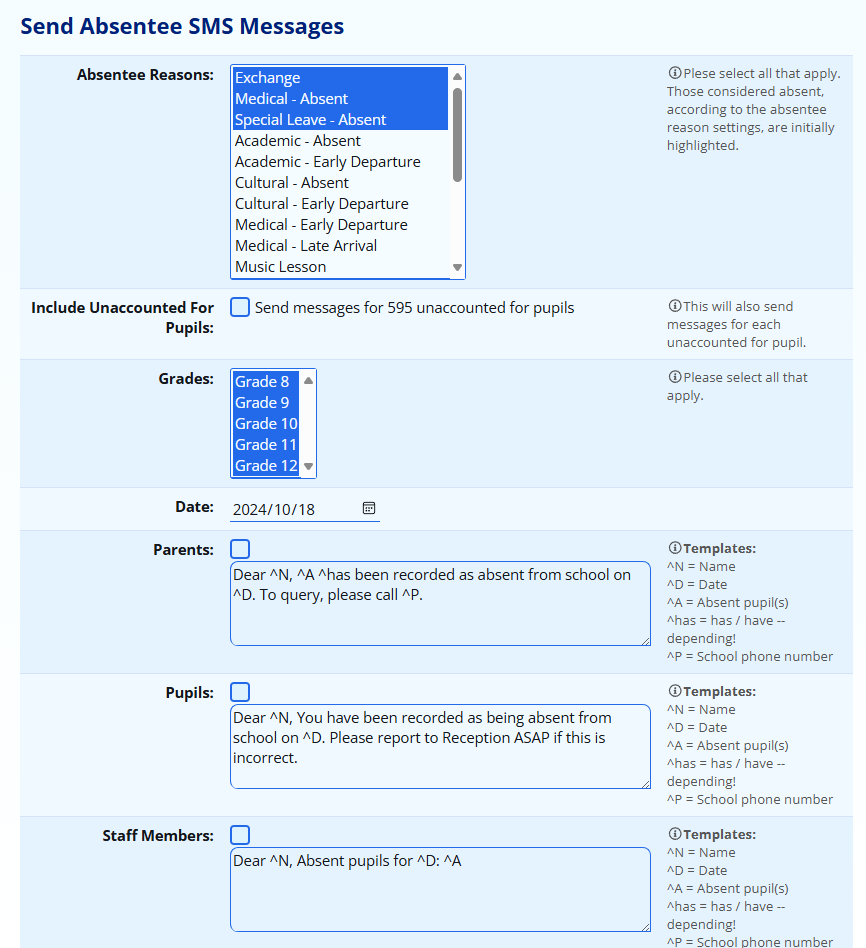

Here you can choose which absentee reasons you would like to select to send to. By default, only absentee reasons that are considered **absent** will be selected.

You can also choose whether ADAM should send SMS messages to **Unaccounted For pupils** (a list of unaccounted for pupils can be seen on the [Daily Absentee](#h-eks8qfjv0wac) report).

ADAM allows you to filter by grade so that if you have a grade that is away (e.g. on camp, or writing exams), you can ignore them from the list of messages to be sent. This will also filter the unaccompanied pupils.

You can choose a **date** that ADAM should use to look at for absentee records. Please be very careful when changing the date since your message will need to make it very clear that you are looking at another day’s records.

Finally, ADAM lets you select which audiences you want to send the alerts to and provides some template messages for you to use. Note the special codes and the substitutions that are listed on the side.

-   Pupils will each receive their own individual message.
-   Parents will receive one message, combining the names of absent pupils.
-   Staff will receive one message, combining the names of absent pupils that they teach. Note that it is possible that the message will be chopped off at the end if there are too many pupils.

## Absentee Kiosk {#h-2b16zpljprop}

ADAM allows for an terminal to be set up, with a web camera, that allows pupils to self-register by scanning their ADAM QR code.

### Configuring the Module {#h-mby57sixadwf}

The module can be configured with a start time, two windows (one to record pupils as present, one to record them as late) and then a closing time. Before the start time and after the closing time, any scans will be rejected.

The times for these windows are configured in the **Site Settings** (navigate to **Administration -→ Site Administration → Edit site settings**). On the **Attendance** tab under the **Automatic Registration** heading, have a look at the **Absentees - Automatic Registration** settings:

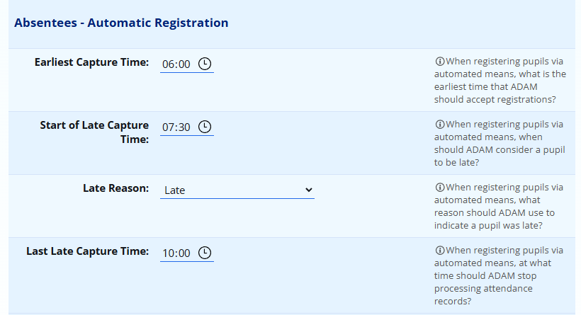

In the example above, no scans will be accepted prior to 06h00. People scanned in between 06h00 and 07h30 will be marked as present. Those scanned between 07h30 and 10h00 will be marked as “Late” - the exact reason may be chosen. After 10h00, no scans will be accepted. This means that pupils who are very late should report to the office, for example, to be processed in.

Once configured, please remember to **Save** the site settings.

### Allowing Pupils to find their QR Code via the Pupil Portal {#h-3lr3dupqts1t}

The QR Codes can be made available in a number of ways - including the printing of physical student cards, or by accessing the QR Code via the Pupil Portal.

Pupils will need the ability to log into the Portal as well as be assigned permissions to see their QR Code. These processes are discussed elsewhere in this document.

### Accessing the Absentee Kiosk {#h-jo979yq97zfo}

Navigate to **Pupils → Absentee Administration → Absentee Kiosk**. Once here, ADAM will attempt to activate the web camera attached to the computer. The first time this happens, the web browser will require permission to be granted.

Once permission has been granted, the web camera’s view will be shown on the browser screen. A pupil QR Code can now be held up to the scanner, and the absentee record will be captured. A confirmation message will be shown below:

The absentee records are updated based on the time of the scan, and make use of the server’s time to determine whether the scan was in time or not.
