# Academic Points

Academic Points are an extension of the [Record and Points](records-and-points-administration.md#records-and-points-administration) Module which inspects results from a reporting period in order to add records to a pupil’s Records and Points records.

## An Overview of Academic Points

Academic Points are awarded for one of three things:

1.  Subject Results (marks-based)
2.  Aggregate Results (marks-based)
3.  Subject Symbols (symbol-based)
4.  Aggregate Symbols (symbol-based)

In each case, ADAM will be told to use either the Reporting Period’s Term mark or Year-to-date (YTD) mark.

ADAM will use rule sets to determine how many points should be awarded to a pupil for either their mark or their symbol.

Academic Points can be displayed on a report, or they can be saved to the Records and Points module where they might be part of a larger system involving consequences that lead to other Academic Awards, for example.

## Maintaining the Rule Sets

Navigate to **Reporting → Academic Points → Maintain rule sets**.

Here you will be shown a list of existing rule sets, if there are any.

### Adding a New Rule Set

Click on the button at the top to **Add a new rule set**.

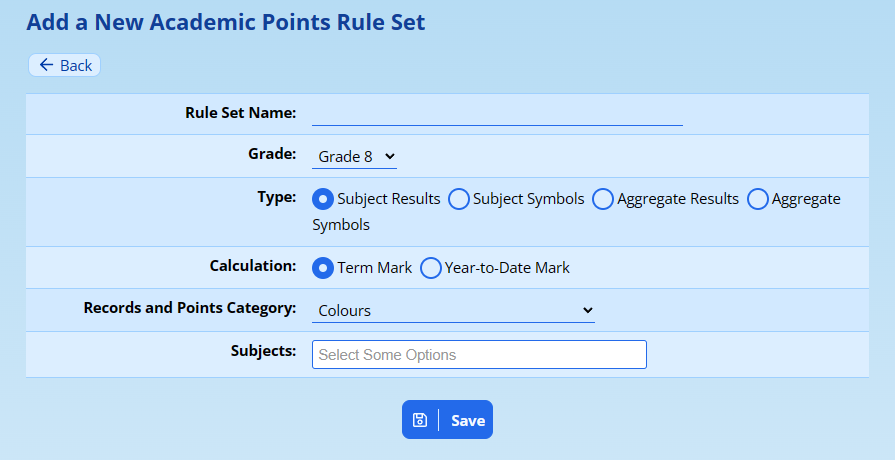

The **Rule Set Name** allows you to refer back to what this particular rule does. Since a rule-set can only belong to a single **Grade**, it would make sense to include the Grade name here too. Examples might be:

-   “Grade 10 Academic Points - Subjects”
-   “Grade 11 Performance Points”

The **Type** of rule is next and depends on how your points are calculated.

-   If you award points for the marks obtained in individual subjects, then you can choose “Subject Results”.
-   If you award points for the symbols obtained in individual subjects, then you can choose “Subject Symbols”. This option can be useful if your teachers don’t make use of the markbook.
-   If you award points for their overall aggregate at the end of the reporting cycle, then you can choose “Aggregate Results”.
-   If you award points for their overall aggregate symbol at the end of the reporting cycle, then you can choose “Aggregate Symbol”.

The **Calculation** setting tells ADAM whether it should consult their Term Mark or their Year-to-Date Mark. If you’ve chosen “Symbol” options above, ADAM will look at the symbols in the Term or YTD results accordingly.

You will need to choose a **[Records and Points category](records-and-points-administration.md#adding-a-new-records-and-points-category)** where these points will be saved if you choose to save these points to the Records and Points module. If you haven’t yet set up a Records and Points category, now might be a good time to do so.

If you have chosen one of the **Subject** types above, then you must specify which subjects ADAM must look at in order to determine the final results. If you have chosen an “Aggregate” type, then this setting is ignored.

*Please remember, if you add new subjects in future, they will not automatically be included in this calculation.*

Click on the **Save** button to save the rule set.

Here is an example of a completed rule set:

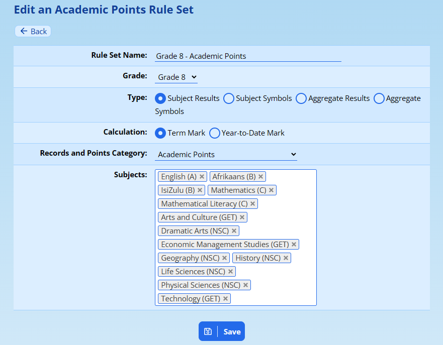

### Maintaining Rules

Navigate to **Reporting → Academic Points → Maintain rule sets**.

Here you will be shown a list of existing rule sets, if there are any.

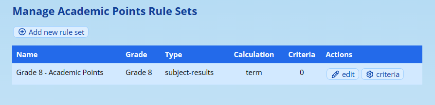

Click on the **Criteria** option next to the rule set you’d like to update. In the example above, we can see that there are no criteria yet (there is a “0” in the criteria column).

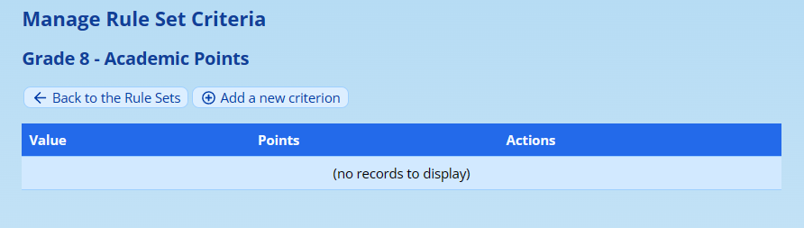

We can now add new criteria to the list. Click on **Add new criterion**.

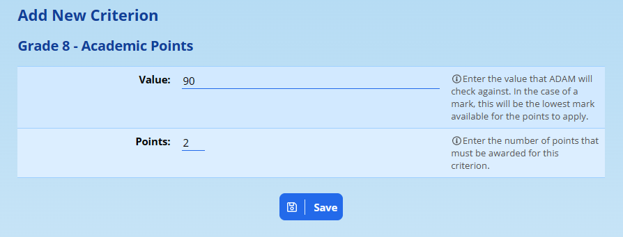

In this example, we are asking ADAM to award any result of **90% or over** with 2 points. If a person got 89%, they would not get these 2 points. Note that ADAM will always round the results to the nearest percentage (using normal mathematical rounding practices) and so a person who scored 89.6% would also get 2 points with this criterion in place.

Symbol rules are slightly different in that ADAM must check to see that the symbol matches exactly. If there is no exact matching symbol, then no points are awarded.

Points awarded can only be whole numbers. If your system depends on decimal points, then you will have to modify it - so that ADAM can work with whole numbers.

Click on **Save** to add this criterion to the list.

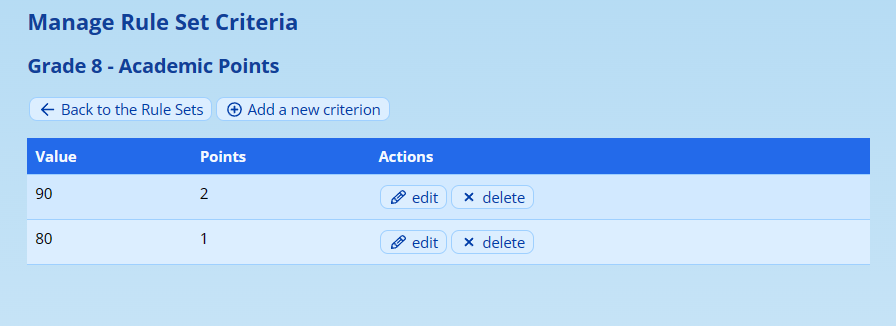

With multiple criteria in the list, note that ADAM will always sort it by the number of points in descerding order.

*It is not possible to use this in “reverse” where low marks get higher points (perhaps this might be part of a flagging system where the poorer your mark the more “flagging points” you get?).* 

You can **edit** and **delete** criteria using the appropriate buttons next to each option.

## Academic Points Report

Once you have at least one [rule set](#maintaining-the-rule-sets) in place, you can produce a report of the Academic Points. Note that ADAM displays these points only and does not record them in the Records and Points module. It is always advisable to ensure that your points generate correctly before committing them to the Records and Points module. More information on the problems that it can cause if you need to submit corrections are [discussed later on](#saving-academic-points-to-records-and-points).

To generate an Academic Points Report, navigate to **Reporting → Academic Points → Academic Points report**.

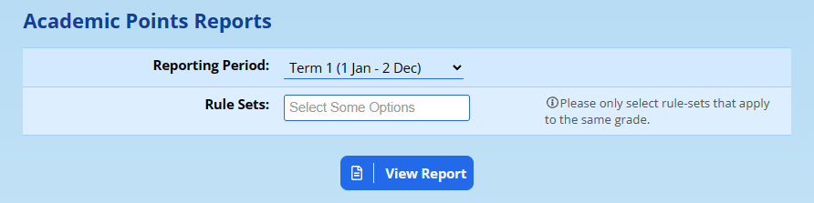

Choose the **reporting period** that you wish to see points from and choose one or more rule sets to determine the points to generate.

*Note that one limitation with this report is that it can only display one grade of pupils at a time and so you must choose rule sets that apply to the same grade. If you choose rule sets from different grades, ADAM will show a warning and ask you to adjust your choices.*

The report will then be displayed, indicating the number of points per subject.

## Saving Academic Points to Records and Points

Once you are happy that your marks are finalised and that your Academic Points are accurate, you can have them recorded in the Records and Points modules for each pupil.

### Setting up Records and Points

It is useful to consider a common use-case with the Records and Points when setting up your categories. Specific instructions for [setting up Records and Points](records-and-points-administration.md#adding-a-new-records-and-points-category) are discussed elsewhere in this documentation.

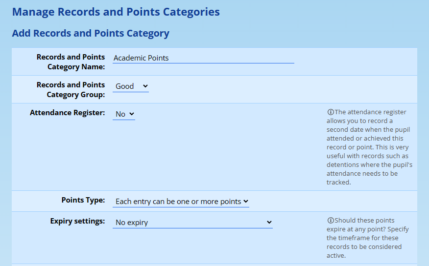

Two aspects to consider here: firstly, that the **Points Type** should be “one or more points”. If you leave this set to the default option, which is “count individual entries”, then the Academic Points will not be of much use - only the number of times a pupil has been awarded points will essentially be recorded - and that defeats the purpose of this module.

The second aspect, less important, is that your **Expiry Settings** should be carefully considered. Most schools will probably use a “No expiry” scenario, but some may wish to reset their points at the start of the year, in which case choosing an option like “Expire after a number of calendar years” and setting that number of years to “1”.

The next common use-case is that these points should lead to consequences. In the example below, these are called “Academic Awards”, but this can be changed to better suit your needs.

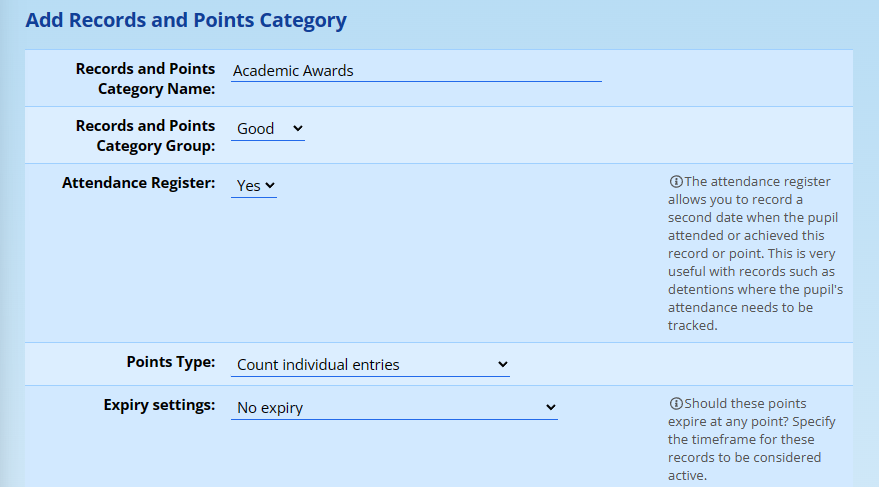

The most important aspects with this second category are that there is an **Attendance Register** set - this is so that ADAM can help you determine which awards are new and which are old, and the **Points Type** here can be set to “count individual entries” because this category will store only the awards that result from the points and not the points themselves. The expiry settings should be customised to your needs.

Finally, in the setup, we will deal with the consequences of the “Academic Points”.

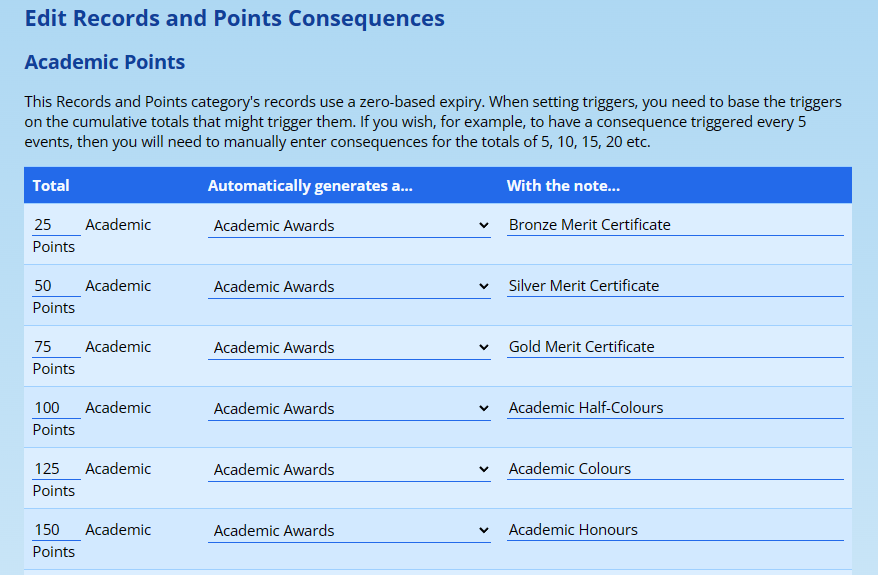

In this example, there are six levels of academic award - each received after a certain point threshold is reached (this example does not consider whether these levels are realistic or not!). Note how each level creates an “Academic Award” and that each award contains a note explaining the award that has been given.

### Saving the Academic Points into Records and Points

Navigate to **Reporting → Academic Points → Save Academic Points to Records and Points**.

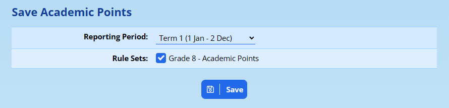

ADAM now asks you which reporting period you’d like to consider and which rule-sets you’d like ADAM to check.

*Note that, unlike the* *[Academic Points Report](#academic-points-report)**, you can mix-and-match Grades here - ADAM will work through each rule-set and apply those points to the applicable grade.*

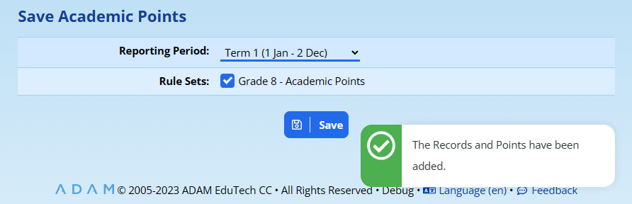

ADAM will confirm, with a green success message if the records and points were added.

If you attempt to add a set of Academic Points twice, ADAM will warn you first:

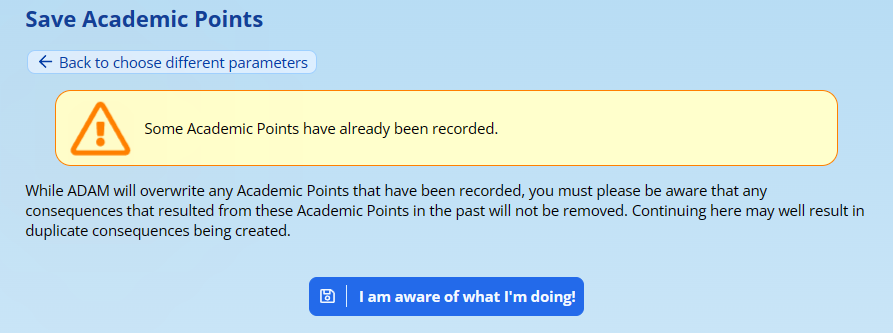

If you proceed past this warning, two things will happen:

1.  The previously added Records and Points will be deleted and replaced with new ones.
2.  The consequences that were previously generated will NOT be removed and ***duplicate consequences will be added***.

Please ensure that you are aware of the consequences of continuing before doing so.

## Next Steps

Now that you’ve added your records and points to the academic consequences, you can use the normal Records and Points module features for your next step.

Typical steps would be to check the Records and Points Registers to see if there are any new academic awards that have been generated:

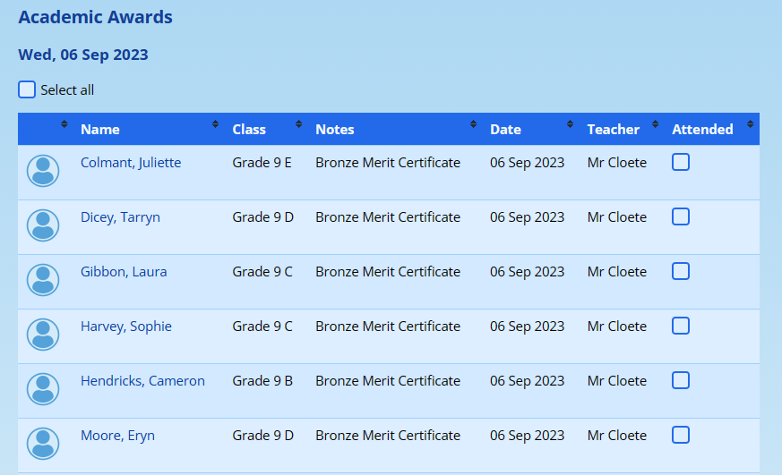

With this list, you can tick them off to mark them as having received their award or certificate and this will remove them from the list for next time so that each time you look at this list, it has only the new awards. Regardless, the date that the award was made is shown.

You can the prepare your awards ceremony.

### Pupil Records

These now behave in exactly the same way as other Records and Points that a pupil might accumulate. If, for example, you need to correct an error in a pupil’s records, it is as simple as visiting their records and points page and making the change:

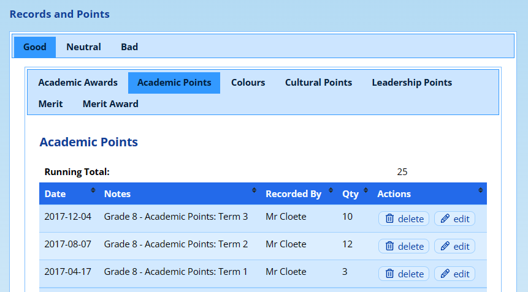

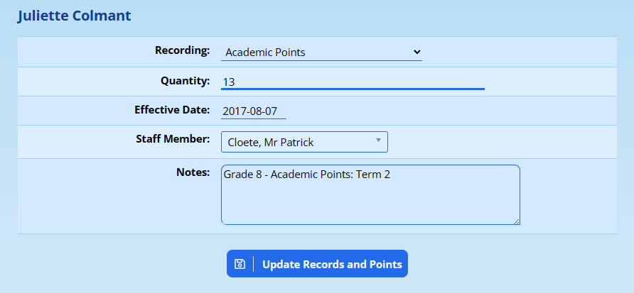
