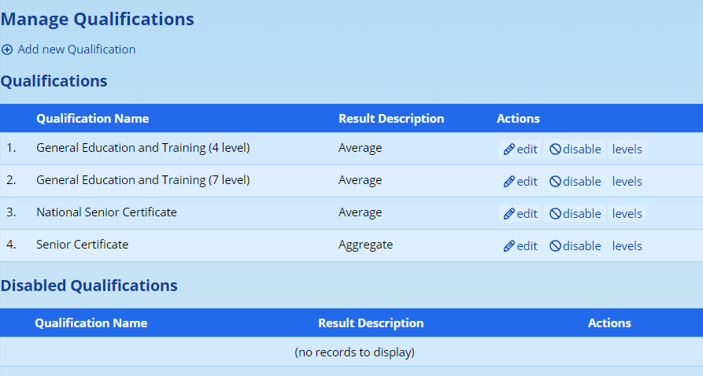
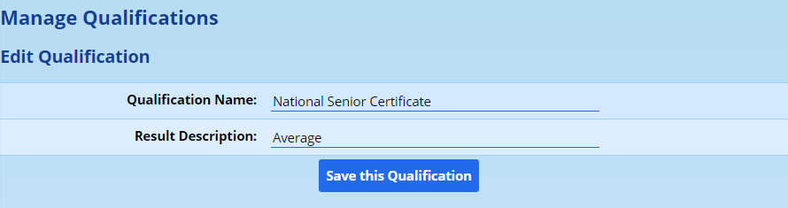
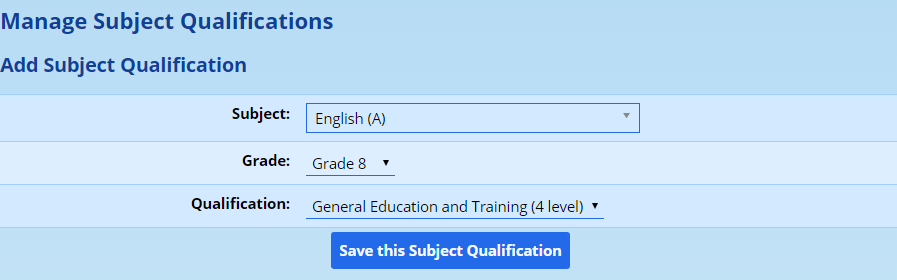

# Academic Qualifications {#h-lnxbz9}

ADAM uses the idea of an Academic Qualification to determine the [levels and symbol set](level-descriptors.md#h-pkwqa1) that should be used and how the [promotion results](#h-3ks3rjh683tz) are calculated.

Schools typically assign qualifications to different grade years. For example, Grade 8 and 9 would belong to the GETC qualification whereas Grades 10 through 12 would belong to the National Senior Certificate qualification. The symbol sets for these two qualifications are the same, but their promotion criteria are different.

Schools that run parallel qualification streams (such as NSC and IB, or Cambridge), will need qualifications set up for each but in this instance will need to assign the qualifications to pupils specifically since the same grade offers multiple qualifications.

## Adding and Editing Academic Qualifications {#h-35nkun2}

To add or edit a new academic qualification, please navigate to **Administration → Academic Administration → Edit the qualifications**.

ADAM will show a list of qualifications and next to each the option to **edit** the qualification, to **disable** it or to adjust its **levels**. Please see the separate section on editing a qualification’s [Level Descriptors](level-descriptors.md#h-pkwqa1).

A new qualification can be added by clicking on the option at the top of the screen. Any of the qualifications can be edited or disabled. Disabled qualifications are listed in the second table at the bottom of the screen. They will show the option to “enable” them.

Clicking on **edit** next to one of the qualifications will show two very simple options:

The **Qualification Name** is a descriptor for internal reference and is very seldom used for publication. The **Description** is used to describe the summary pupil result. In most cases the word “Average” is required, but in some instances, one might prefer a word such as “Aggregate”. This word has very little meaning to ADAM and is intended to provide context to your users.

Once these details are confirmed, click on **Save this Qualification**.

## Changing the Levels associated with a Qualification {#h-na9bhhy3ctnw}

When managing the Academic Qualifications (**Administration → Academic Administration → Edit the qualifications**), an option appears to edit the associated level indicators. Click on **levels** next to the appropriate qualification to edit the levels.

For more information on editing the levels, please refer to the section on editing [Level Descriptors](level-descriptors.md#h-6a8lnab0ex1v). Note that this section describes an alternative way of getting to the Level Descriptors, but ultimately result in the same process.

## Setting the Qualification for Use {#h-2ffvrmhdmxbp}

The qualifications are typically set as part of the Reporting Period Settings. Each grade has the option to have a single qualification set for it. More information can be found in the section on [Grade Specific Settings](reporting-period-administration.md#h-u5xim02o9rs5) within Reporting Period Administration.

### Working with Multiple Qualifications in a Single Grade {#h-4t76mgopfv4v}

ADAM uses a heirarchichal structure when determining which qualification should be used. If a pupil has had a specific qualification assigned to them in their pupil information, then this qualification takes priority and will override any other qualification that has been assigned to them.

If a pupil has not - which is typically the case and which should be considered the ideal case in schools where a dual qualification is not offered - then ADAM will use the qualification that has been set as part of the  [Grade Specific Settings](reporting-period-administration.md#h-u5xim02o9rs5) within Reporting Period Administration.

### Changing an Individual Pupil’s Qualification {#h-19yhnak0mm6}

When [editing a pupil’s information](pupil-information.md#h-4fsjm0b), one of the options in that page will be “Registered Qualification”. Here, ADAM will allow you to choose either “Default” or one of the enabled qualifications.

## Using Customised Symbol Sets for a for a specific Subject or Learning Outcome {#h-zc0sv9z7mzke}

In some instances, particularly at a Foundation Phase level, it is desirable to assess different subjects or different learning outcomes in different ways. These different assessment methods often mean different Level Descriptors are required.

To begin, set up a [new Academic Qualification](#h-35nkun2) with a descriptive name to explain what the qualification is to be used for. The precise name of the qualification is unimportant, but make sure to be clear what its purpose is.

Once done, add the appropriate [level descriptors](level-descriptors.md#h-pkwqa1) for the qualification.

Finally, navigate to **Administration → Academic Administration → Assign specific qualifications to subjects / learning outcomes**.

Choose the option at the top to add a new Subject Qualification or Learning Outcome Qualification, as is appropriate:

When adding a subject, choose the appropriate subject, grade and qualification and then click on **Save this Subject Qualification**:

When adding a qualification to a Learning Outcome, choose the appropriate Learning Outcome from the list (note that each LO is listed under a subject / grade heading since each LO is specific to a grade). Then click on **Save this Learning Outcome Qualification** to save.

