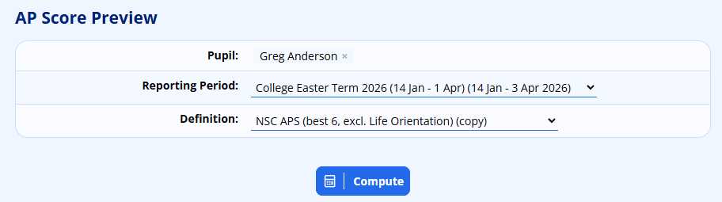
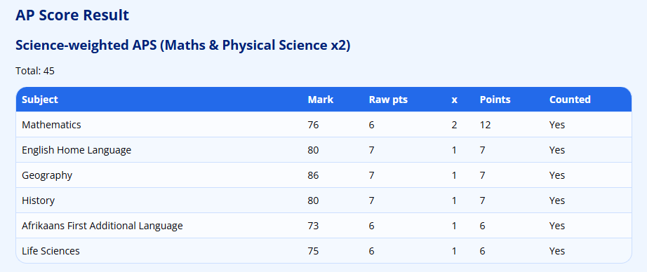
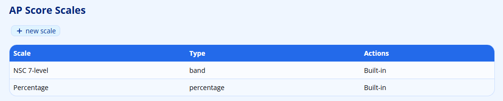
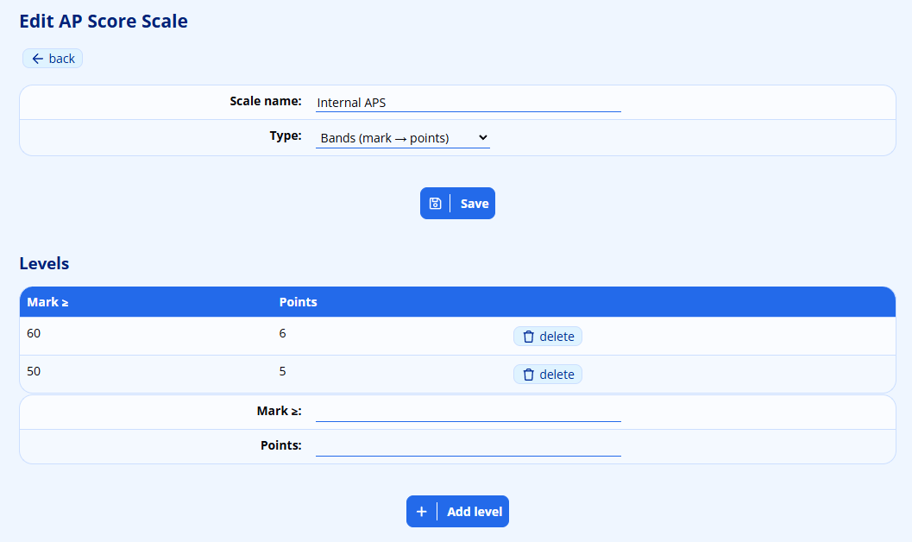
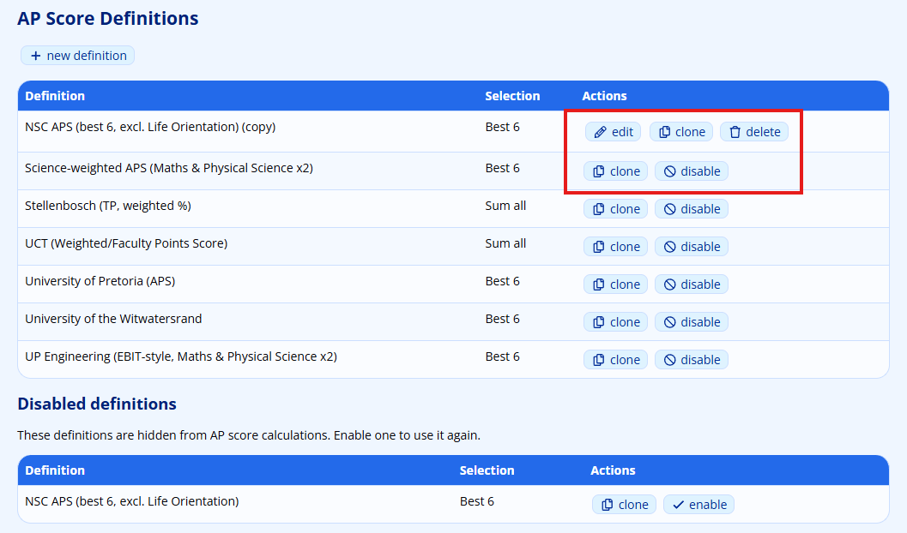
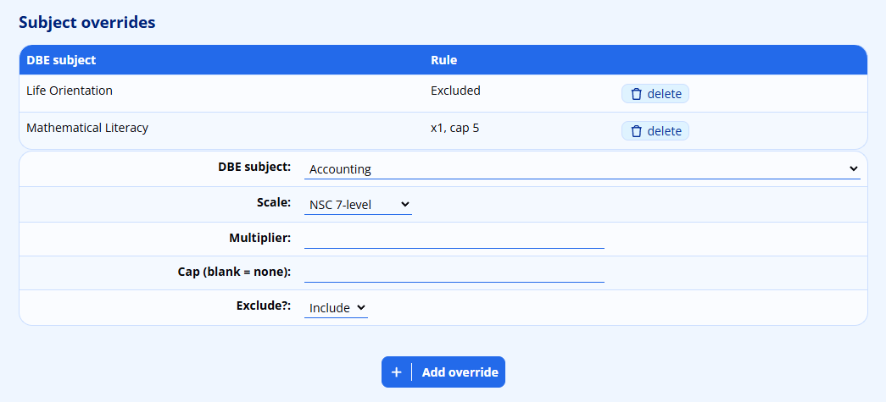

# Admission Point Score

The Admission Point Score (APS) module works out university-style admission scores from a pupil’s academic results. It converts each subject mark into points using a configurable **scale**, then combines those points according to a **definition** that decides which subjects count, how many of them count and whether any subjects are weighted, capped or excluded.

ADAM ships with a set of built-in scales and definitions so that you can start computing scores immediately, and it lets you build your own definitions for any institution or internal award that you need to model.

!!! note
    This is a different feature to [Admissions Points](admissions-points.md#admissions-points), which awards entry-preference points to *applicants* based on their profile (for example, favouring staff children or alumni). If you are looking to rank applicants for admission, that is the page you want. The Admission Point Score described here works out academic point scores from *existing pupils’* subject results.

## How APS is Made Up

There are three building blocks:

-   A **scale** turns a single subject mark into points. ADAM supports two kinds of scale: a **band** scale (a mark at or above a threshold earns a fixed number of points, such as the NSC 7-level scale) and a **percentage** scale (the points are simply the percentage itself).
-   A **definition** describes a complete admission rule: which base scale to use, which subjects to include, how many subjects count towards the total, and any per-subject adjustments.
-   A **subject override** lets a definition treat a particular subject differently — excluding it, multiplying its points, capping its points, or scoring it on a different scale.

Once these are in place, you can compute and preview any pupil’s score for a chosen reporting period.

## Who Can See APS

The APS menu entries are only shown to staff whose accounts hold the relevant privilege:

-   **View & Compute APS** lets a user open **Compute an AP Score** and calculate a pupil’s score.
-   **Manage APS Definitions & Scales** lets a user create and edit the scales, definitions and subject overrides.

Both privileges are found in the **Reporting** section of the staff privileges, under the **Admission Point Score** heading. A user with neither privilege will not see any APS options.

## Computing a Pupil’s Score

Navigate to **Reporting → Admission Point Score → Compute an AP Score**.

Search for and select the **Pupil**, choose the **Reporting Period** you want to score (past and current periods are listed), and choose one of the available **Definition** entries (only enabled definitions are offered here). Click **Compute**.

ADAM then shows the **AP Score Result**, starting with the definition name and the overall **Total**. If the pupil has fewer counting subjects than the definition requires, the total is marked *incomplete*.

Below the total is a breakdown with one row per subject, showing the **Subject**, the **Mark**, the **Raw pts** earned from the scale, the multiplier (**x**), the final **Points** (a subject whose points were limited by a cap is marked *capped*), and whether the subject was **Counted**. Where a subject was not counted, the reason is shown in place of “No” — for example, a subject that was excluded or dropped because only the best few subjects were kept.

!!! note
    The preview is a calculation tool: it displays a score but does not store it against the pupil. Run it as often as you like to check results before you rely on them.

## Managing Scales

Navigate to **Administration → Admission Point Score → AP Score Scales**.

The **AP Score Scales** page lists every scale with its **Scale** name and **Type**. Built-in scales are labelled **Built-in** in the **Actions** column and cannot be changed; your own scales show an **edit** option instead.

### Adding a Scale

Click **new scale** at the top of the list. On the **New AP Score Scale** page, give the scale a **Scale name** and choose a **Type**:

-   **Bands (mark → points)** — you define a set of levels, each awarding a fixed number of points to marks at or above a threshold.
-   **Percentage (points = the %)** — the points simply equal the mark, so no levels are needed.

Click **Save**.

### Editing a Scale and its Levels

Open a scale you own with its **edit** option to reach the **Edit AP Score Scale** page. You can change the name and type here, and a **back** link returns you to the list.

For a band scale, a **Levels** table is shown beneath the form. Each level lists the **Mark ≥** threshold and the **Points** awarded at or above it. To add a level, enter a **Mark ≥** value and the **Points**, then click **Add level**. To remove a level, use its **delete** option; ADAM asks you to confirm before removing it.

!!! warning
    Built-in scales are read-only. There is no edit option beside them, and ADAM will turn you away if you try to reach one directly. To base your work on a built-in scale, create a new scale of your own instead.

## Managing Definitions

Navigate to **Administration → Admission Point Score → AP Score Definitions**.

The **AP Score Definitions** page lists each definition with its **Definition** name and a **Selection** summary (either “Sum all”, or “Best” followed by the number of subjects kept). The **Actions** available depend on whether the definition is built-in or one of your own.

Any definitions that have been disabled are gathered into a separate **Disabled definitions** list lower down the page, introduced by the note *“These definitions are hidden from AP score calculations. Enable one to use it again.”*

### Adding a Definition

Click **new definition**. On the **New AP Score Definition** page, complete the following:

-   **Name** — a label for the definition.
-   **Notes** — a free-text note, useful for recording the source or the exact institutional rule you are modelling.
-   **Subject scope** — either **All aggregate subjects (minus exclusions)**, which starts from every aggregate subject and removes only those you exclude, or **Only listed subjects**, which counts just the subjects you add as overrides.
-   **Selection** — either **Sum all counting subjects**, which adds up every counting subject, or **Best N counting subjects**, which keeps only the strongest few.
-   **Best-N count** — how many subjects to keep when the selection is set to best-of.
-   **Base scale** — the scale used to convert marks to points for subjects that do not have their own override.

Click **Save**. You are taken straight to the edit page, where you can add subject overrides.

### Editing a Definition and its Subject Overrides

Open one of your own definitions with **edit** to reach the **Edit AP Score Definition** page. The same fields are available, and beneath them is the **Subject overrides** section.

Each override lists the **DBE subject** it applies to and the **Rule** in force — either *Excluded*, or the multiplier (and cap, if one is set). To add an override, choose the **DBE subject**, then set:

-   **Scale** — the scale to use for this subject, or **(use base scale)** to fall back to the definition’s base scale.
-   **Multiplier** — how many times the subject’s points count.
-   **Cap (blank = none)** — an upper limit on the points this subject can contribute; leave it blank for no limit.
-   **Exclude?** — choose **Exclude** to leave the subject out of the score entirely, or **Include** to keep it.

Click **Add override**. To remove an override, use its **delete** option.

### Built-in versus Custom Definitions

ADAM ships with a set of built-in definitions (see [What Ships with APS](#what-ships-with-aps) below) that you cannot edit or delete. Instead, each built-in definition offers:

-   **clone** — makes an editable copy that you own and can adjust freely. This is the intended way to base your own rule on a built-in one.
-   **disable** / **enable** — hides a built-in definition from the **Compute an AP Score** list (or brings it back). Disabling is reversible and does not remove anything.

Your own custom definitions instead offer **edit**, **clone** and **delete**. Deleting is permanent, and ADAM asks you to confirm first.

!!! warning
    Built-in definitions and scales cannot be edited or deleted, and their subject overrides cannot be changed. If you try to reach a built-in item’s edit page directly, ADAM returns you to the list with a message. Use **clone** to create an editable copy when you need to change a built-in definition.

## What Ships with APS

ADAM installs the following built-in items so you can compute scores straight away. They are provided as a convenient starting point — always confirm any institution-specific rule against that institution’s current prospectus before relying on it, and clone a definition to make your own adjustments.

**Built-in scales**

-   **NSC 7-level** — a band scale awarding 7 points from 80%, 6 from 70%, 5 from 60%, 4 from 50%, 3 from 40%, 2 from 30% and 1 below that.
-   **Percentage** — a percentage scale where the points equal the mark.

**Built-in definitions**

-   **NSC APS (best 6, excl. Life Orientation)** — a generic National Senior Certificate score: the best six subjects on the NSC 7-level scale, with Life Orientation excluded and Mathematical Literacy capped.
-   **University of Pretoria (APS)**, **University of the Witwatersrand**, **Stellenbosch (TP, weighted %)**, **UCT (Weighted/Faculty Points Score)** and **UP Engineering (EBIT-style, Maths & Physical Science x2)** — supplied as structure-only starting points; confirm the exact rule against each institution’s current prospectus before use.
-   **Science-weighted APS (Maths & Physical Science x2)** — a generic science-weighted variant for internal awards, counting Mathematics and Physical Sciences double on the NSC scale.

!!! note
    The university definitions are deliberately supplied as structure only, because admission rules change from year to year and vary by faculty. Treat them as templates: clone one, verify its subjects and weights against the current prospectus, and record the source in the definition’s **Notes**.
