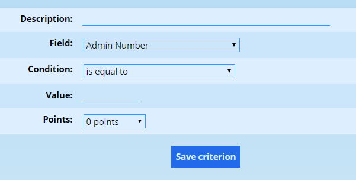
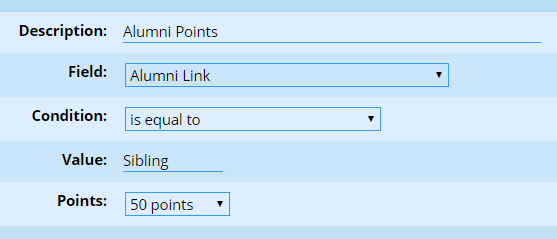
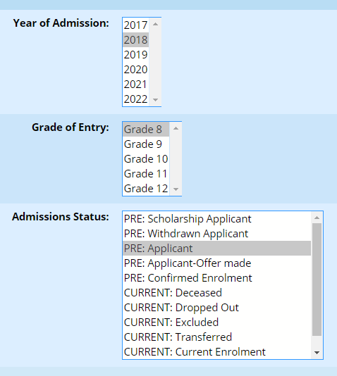
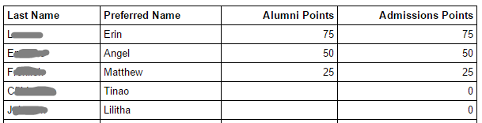

# Admissions Points {#h-wygf848tdmvz}

ADAM is capable of creating a list of applicants that can be assigned points based on their profile properties. In so doing, it is possible to favour entry to pupils of staff children, alumni and so on.

The list of Admissions Points is static and applies to all grades within the school.

## Managing Admissions Points {#h-nrzmub9mpeq9}

On the **Admissions** tab, click on the entry **Modify the Admissions Points** which can be found under the heading **Admissions Points**.

The next screen will show a list of admissions points, if any, that are currently in operation. Individual entries can be edited or disabled using the options on the right-hand side of that table.

The option to **Add a New Criterion** can be found at the top of the page.

The **Description** allows a short description of the reason that points are being awarded. A typical admissions system would allow for many different criteria based on a number of different fields.

Note that if you wish for varying numbers of points to apply for a single aspect, one must name the criteria identically for each points level. For example:

A school might decide to award *Alumni Points*: 50 points if the pupil has a current sibling at the school, 25 if the pupil had a parent at the school and 75 points if both conditions are true. We will assume that the school has added a custom field to keep track of this information with the four values: No link, Parent, Sibling, Both

In this instance, three criteria would need to be added (we can ignore the “no points” option). Each should be labelled with the description of “Alumni Points”. The other values would be set to look at the custom field and check for the respective values of “Parent”, “Sibling”, “Both” and assign the appropriate number of points.

The **Field** tells ADAM where it should look. These fields contain the output that might be seen on a scratch list. That is often an excellent place to start looking if your criteria are not awarding points and you feel that they should be.

ADAM allows for a number of comparative **conditions** to be used to compare the data in the field. The default option, “is equal to”, would be used if the field should be an exact match to the **Value**. There are, however, other comparative conditions which can be used to create other criteria.

Finally, specify the number of **Points** that ADAM should award if the criteria are met for a particular pupil.

## Generating the Points List {#h-yd15gxy311rt}

On the **Admissions** tab, click on the entry **View the Admissions Points** which can be found under the heading **Admissions Points**.

You will need to select which pupils you want to rank by choosing one or more years of admission, one of more grades of entry and one or more admission statuses:

You also have the option of including any of the scratch list fields in the displayed list - sometimes it is useful to include the fields that ADAM uses to produce the list so that you can verify that the points have been assigned correctly.

These show up as follows in the admissions points list:

Pupils are automatically sorted into descending rank order. Where pupils have the same number of points, they are sorted alphabetically.

The column headers are always shown alphabetically. If you require them in a different order, you can prefix the descriptions with a number since that will result in them being sorted by that number first. (e.g. “4. Alumni Points” instead of simply “Alumni Points”).

## Troubleshooting Issues {#h-mbx8u751993}

Because the comparisons that ADAM does in order to generate the admissions points are exact, there might be cases where data inconsistency results in some pupils missing out on points because of spelling mistakes in the data. Schools are advised to audit and check their admissions criteria carefully, along with the actual data that they are based on and identify any problems. Once problems are identified, they can be corrected in two ways:

1.  Correct the original data.
2.  Modify the criterion to include that data. This may require adding additional points criteria to the list.
