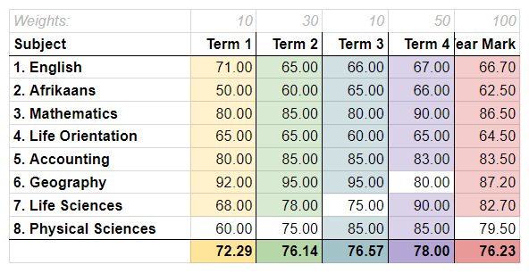

# Aggregate Calculations {#h-n3thyo3fac7f}

Aggregates are the overall average across subjects for either a single reporting period or multiple reporting periods in the case of a year-to-date aggregate.

## Calculating Year-to-Date Aggregates {#h-91shwzeoum8u}

ADAM uses the year-to-date results for each subject and then uses your chosen aggregate calculation to calculate a year-to-date aggregate.

This means that ADAM does *not* calculate the year-to-date aggregate in the same way that ADAM calculates the year-to-date results for each subject. The year-to-date calculation looks “across” the year, whereas an aggregate calculation looks “down” the subjects. The promotion aggregate makes use of an aggregate calculation that looks “down” the subjects’ year-to-date results.

### Example Calculation {#h-hcd5epe4fge6}



In the example above, the pupil takes 8 subjects, and only the top 3 electives are considered. In each column, you can see that the lowest result in each term is omitted - these omitted results have not been shaded.

In Term 1 and Term 2, Physical Science is omitted. In Term 3 Life Sciences is omitted and in Term 4, Geography is omitted from the aggregate results.

The final year aggregate is based on the year marks of each subject. Thus, the result of **76.23** is calculated by **omitting Physical Sciences** which is the lowest year mark.

### Possible discrepancies in calculation methods {#h-wzz26vinlzy4}

Normally, the final year aggregate will match the result if you were to weight the aggregates for each term (in the example above 72.29, 76.14, 76.57 and 78.00). However, because the final year aggregate does not include Phsyical Science when Term 3 and Term 4 results do, and the final year aggregate includes Life Sciences when Term 3’s aggregate does not, and the final year aggregate includes Geography when Term 4’s aggregate does not, the weighted averages are not equivalent.

The weighted average of the Terms in the above example (10% of 72.29 + 30% of 76.14 + 10% of 76.57 + 50% of 78.00) yield a result of 76.73, which is different to the calculated final year aggregate.

### Why this method? {#h-34w3uomyakng}

This method is important to keep consistency and fairness, particularly in instances where a pupil has dropped a subject. Using the YTD results ensures that only the final subject choice is considered. If ADAM were to use the aggregates from each term, the final aggregate would be negatively impacted by a subject that is no longer offered by the pupil.

## Calculation Methods {#h-iw2vqu6bd3ta}

### Weighted Average {#h-7tysxcf68rgs}

In each [subject’s settings](subjects.md#h-nqu9bv1rb1n), a weighting is specified. This weighting determines the importance of that subject in the aggregate total. Some schools may choose to weight Life Orientation as 0.5 of a subject. If ADAM uses the “weighted average” method within the reporting period settings, these weightings are used.

ADAM calculates the weighted average using the subject’s weighting as a proportion of the total weights across all subjects offered by a pupil.

### Top 7 Subjects {#h-47y3958y0sx}

ADAM will only consider the top 7 subjects in an aggregate calculation and, using those top 7 results, will calculate a weighted average as discussed above.

### Top 7 Subjects (including compulsory) {#h-90tx1ue4brr7}

If a pupil offers any subjects that are marked as “compulsory” subjects, within the [subject settings](subjects.md#h-nqu9bv1rb1n), that subject will be used as part of the calculation. Once ADAM has considered all the compulsory subjects offered by a pupil, the remaining subjects are ranked and used to fill the remaining spots to reach 7 subjects in total. A weighted average, as discussed above, is then calculated.

### Top 7 Subjects (including compulsory, Maths/Lit combo {#h-9qnvy8bcguos}

This operates similarly to the calculation above, except it takes into account the directive from the IEB on how Maths is accounted for when a pupil offers both Mathematics and Mathematical Literacy.

If Mathematics is above 50%, its result is used in the calculation. If it is below 50% and the pupil does Mathematical Literacy, then the Mathematical Literacy result is used instead. If the pupil does not offer Mathematical Literacy, then the Mathematics result, no matter how low, is used.

### Custom Aggregate Calculation {#h-rao1bqqoxbs6}

ADAM can use a custom aggregate calculation where schools have more complex requirements. These are discussed in [detail below](#h-dhwiuunreiv7).

## Custom Aggregate Calculations {#h-dhwiuunreiv7}

When [editing a reporting period’s settings](reporting-period-administration.md#h-u5xim02o9rs5), it is possible to choose from one of four pre-defined aggregate calculations designed for the South African context. However, some schools prefer to create their own calculations which take their specific circumstances into account.

Custom calculations are entered using a text box which requires knowledge of the following syntax to express the calculation.

There are five elements that you can use in the formulae:

-   `M(<subject>, <weighting>)`: A Mark. fetch the mark from a single subject, provided it with a weighting
-   `W(<weighting>, <Mark>, <Mark>, …)`: calculate a weighted average of many `<Mark>`s, provide it with a weighting.
-   `T(<number>, <weighting>, <Mark>, <Mark>, …)`: find the top `<number>` of  `<Mark>`s from the list provided and give it a weighting. Note that if fewer marks are available, the weighting is reduced by the same ratio. For example, if “top 3 marks with a weighting of 3” is selected, but only 2 marks are available, the weighting will be adjusted to two thirds of the original weighting: 2.
-   `F(<number>, <weighting>, <Mark>, <Mark>, …)`: find the first `<number>` of `<Mark>`s from the list provided and weight them. Note that if fewer marks are available, the weighting is reduced by the same ratio. For example, if “first 3 marks with a weighting of 3” is selected, but only 2 marks are available, the weighting will be adjusted to two thirds of the original weighting: 2.
- `P(<subject>, <minimum>, <alternative subject>, <weighting>)`: This fetches a subject’s mark provided it meets the `<minimum>` mark provided, otherwise it will fetch the mark from the given alternative, if it exists. The alternative could be higher or lower than the preferred mark. If the alternative is not present but the preferred subject is (and is below the minimum result) the preferred subject result is used.

!!! tip
    This is used specifically in the scenario where schools offer the Mathematics/Mathematical Literacy combination and want to count Mathematics in the aggregate if it is over 50%, otherwise count Mathematical Literacy. Note also, that the subject results and the minimum requirement are both rounded to their nearest percentages before the comparison is done.

Each of the “`<parts>`” indicated above is now explained:

-   `<subject>` refers to the subject code. This is a whole number such as 15 or 44.
-   `<weighting>` refers to the relative weighting of this result to other results in the calculation.
-   `<number>` refers to the number of marks that should be selected from the list of marks provided.
-   `<Mark>` can be replaced by any one or more of the five elements above.

An example of an aggregate calculation might look like this:

```
W(1,
        M(1, 1),
        M(2, 1),
        P(3, 50, 4, 1),
        W(0.5,
                M(5, 0.25),
                M(6, 0.75)
        )
        T(3, 3,
                M(7, 1),
                M(8, 1),
                M(9, 1),
                M(10, 1)
        )
)
```

This can be interpreted as follows:

> Calculate the weighted average of the following marks (note that this has a weighting of 1, but that is ultimately irrelevant because this result of this bracket is not weighted against anything else):
> 
> - Subject 1, adjusted to a mark out of 1
> - Subject 2, adjusted to a mark out of 1
> - Subject 3 (e.g. “Mathematics”), if it is over 50%, otherwise subject 4 (e.g. “Mathematical Literacy”), adjusted to a mark out of 1
> - A result to count as half a subject (e.g. “Life Orientation”), consisting of a weighted average of:
> - Subject 5, adjusted to a mark out of 0.25 (e.g. “Physical Education”)
> - Subject 6, adjusted to a mark out of 0.75 (e.g. “LO Theory”)
> - The best three results from the list of subject results, weighted to count as three subjects

Note that the use of “Life Orientation” and “Physical Education” above are just to provide a context where such a calculation might be used and does not imply a recommended approach!

All spacing and commas in the calculation are entirely optional. New lines are not required and do not convey any meaning. The brackets that are used for grouping are very important. The colour used here is merely for illustrative purposes to indicate what each part represents. The colour does not appear in ADAM.

The expression below is identical in function to the one above, but, I think you’ll agree, a bit more difficult to understand!

```
W(1 M(1 1) M(2 1) P(3 50 4 1) W(0.5 M(5 0.25) M(6 0.75)) T(3 3 M(7 1) M(8 1) M(9 1) M(10 1)))
```