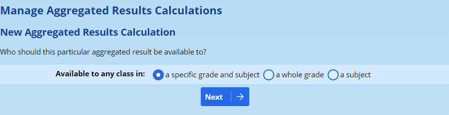
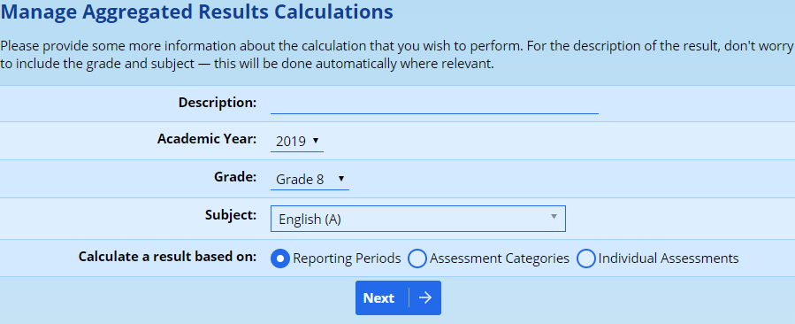
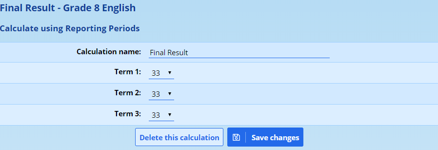
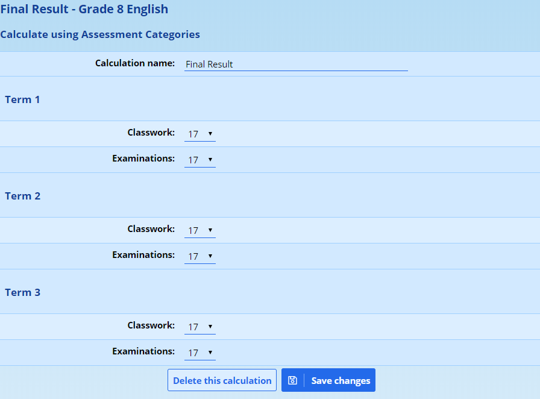
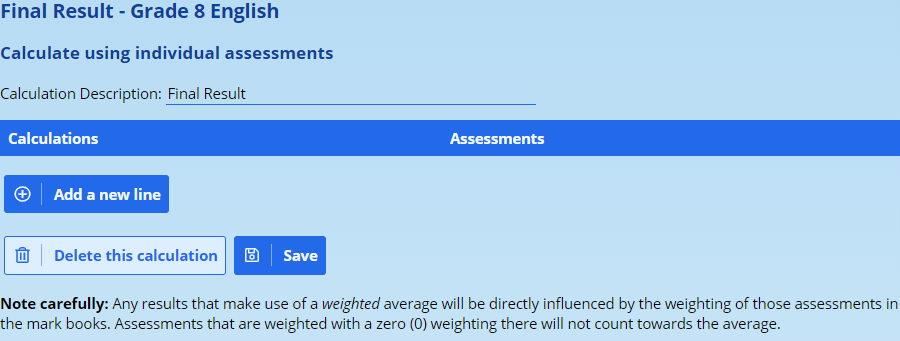
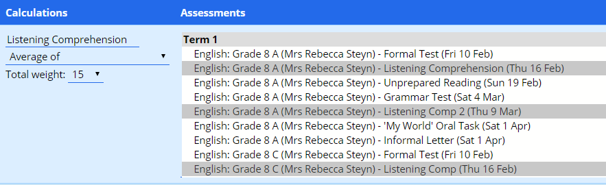
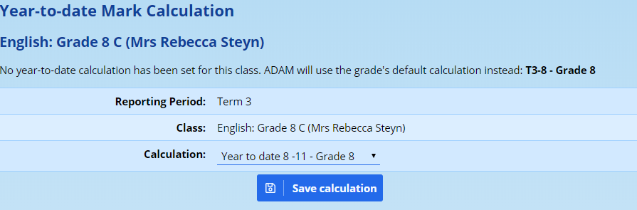
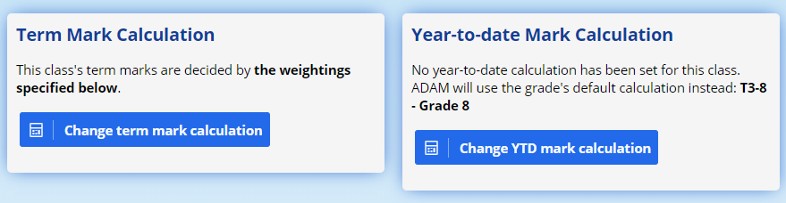
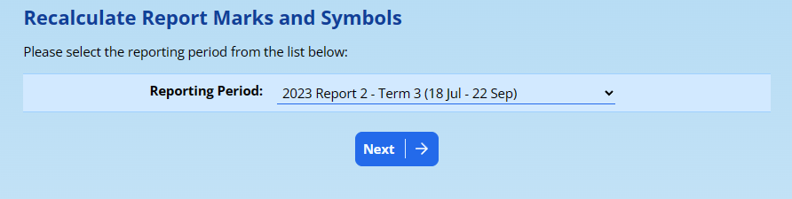
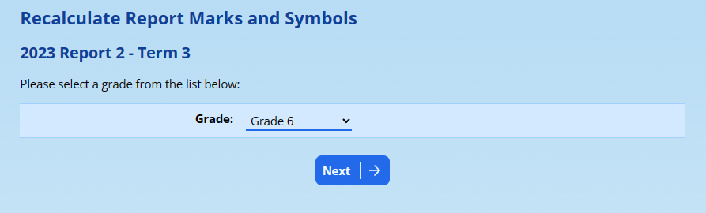

# Aggregated Results {#h-pczqwhx0flp6}

ADAM has a feature called “Aggregated Results” which are used to create aggregated results reports for pupils. This feature has two purposes:

-   **Year-to-date and year-end marks:** Most commonly, ADAM will use Aggregated Results to calculate a “Year-To-Date” mark for a class or grade. You will choose an aggregated result to use as the default result. Classes, however, have the opportunity of overriding that default aggregated result by choosing one of their own. This provides the opportunity for some subjects to have their year marks calculated differently to other subjects.
-   **Analysis and statistical tools:** We might use this to calculate an aggregated examination result or to perhaps use a “best of” scenario to include and exclude some assessments. In some subjects, it might be useful to create a “practical” and a “theory” result, and the Aggregated Results now allows for this.

## Types of Aggregated Result Calculations {#h-vlgi83viv9xu}

ADAM has three categories of Aggregated Result Calculations. You can choose whichever is best suited for your needs.

### Reporting Periods {#h-yw6olea9p746}

ADAM will take the final term results from each reporting period and weight them to reach a final aggregated result for a pupil in that subject.

For example:

-   Term 1: 10%
-   Term 2: 30%
-   Term 3: 10%
-   Term 4: 50%

### Assessment Categories {#h-3a9nqa94b1my}

ADAM will take results from each assessment category and allow you to specify an individual weighting for each to reach a final result.

For example:

-   Term 1 Classwork: 10%
-   Term 2 Classwork: 10%
-   Term 3 Classwork: 10%
-   Term 4 Classwork: 5%
-   Term 2 Examination: 25%
-   Term 4 Examination: 40%

### Individual Assessments {#h-etxm8obydvrr}

*This option is only available if you wish to create an Aggregated Result Calculation for a specific grade and subject.*

In this calculation, ADAM will allow you to select individual assessments and weight them to reach a final result. This technique can be used to generate portfolio marksheets, for example, which may only use specific assessments and at specific weightings which might not reflect the weighting that was used for the term results.

For example:

-   Test 1: 5%
-   Test 2: 5%
-   Mid-year exam: 20%
-   Investigation: 30%
-   Trial Examinations: 40%

## Creating Aggregated Result Calculations {#h-mk1c22te1pt8}

<iframe src="https://www.youtube.com/embed/F1z8DAcEVbo" frameborder="0" allow="accelerometer; autoplay; encrypted-media; gyroscope; picture-in-picture" allowfullscreen></iframe>

To create a new Aggregated Result Calculation, navigate to **Reporting → Aggregated Result Calculations → Manage aggregated result calculations**. A list of already created calculations will be shown to you, if any exist.

At the top of the screen, click on the option to **Add a new Aggregated Result Calculation**.

Specify which audience you’d like this calculation to be made available to:

The most common choices are **a whole grade** or **a specific grade and subject**. If you wish to make an aggregated result calculation that is based on *individual assessment results*, then you must choose **a specific grade and subject**. ADAM cannot create a calculation based on individual assessments across subjects or across grades.

Once you have selected the audience, click on **Next** and ADAM will ask for details of the calculation:

The **Description** field should be something to identify the calculation, such as “year mark,” “portfolio result” or even “practical results”.

You will need to specify the **Academic Year** that this applies to. ADAM cannot create a calculation that has results from multiple years.

If you chose to make a calculation available to a **grade** or a **specific grade and subject**, then you will be asked to specify which **Grade** that is. If you chose to make a calculation available to a **subject** or a **specific grade and subject**, then you will be asked to specify which **Subject** that is. Because we chose “specific grade and subject” on the previous page, ADAM is asking us for both the grade and the subject.

Finally, tell ADAM what results your **calculation will be based on**.

Click on **Next** when you want to proceed.

Depending on the type of calculation, you will see one of the following screens. Jump to the appropriate section below!

### Reporting Periods {#h-84h1tip0xjok}

A list of reporting periods from the chosen academic year is displayed. The initial weightings are calculated automatically and are equally divided. You are welcome to change them to suit your needs.

*While these numbers look suspiciously like percentages in the screenshot above, they are not: ADAM will treat them as proportions of a total.*

*For example, if we entered the weightings for the three terms as 1, 2 and 4, ADAM would see that the total for the terms is 7 and weight Term 1 as 1 out of 7 (14,29%), Term 2 will be 2 out of 7 (28,57%) and Term 3 will be weighted as 4 out of 7 (57,14%).*

Once happy with the weightings you’ve captured, click on **Save changes**.

### Assessment Categories {#h-gbli5ep2t9bq}

ADAM will show a list of assessment categories for the chosen academic year. The initial weightings are calculated automatically and are divided equally. You are then welcome to change them to suit your needs.

In the diagram above, one might set the “Examinations” section of “Term 1” to 0 since there are no exams to take into account. Other weightings could be set accordingly.

*Take note that the numbers you see are not strictly percentages (they can be if you want them to be). ADAM will work them out as fractions of the total. Above, the total of all the 17s adds to 102. ADAM will actually use 17 / 102 as the fraction to work out the percentage weighting (16.67%)*

Click on the **Save changes** button when you’re happy with your weightings.

### Individual Assessments {#h-10sgl4v3x121}

If you choose to create a calculation based on the results of individual assessments, ADAM shows a very different screen to the ones in the diagrams above:

Start by clicking on the button **Add a new line**. ADAM will show a list of assessments that have been written in the grade this year - from all of the classes:

On the left, write a description for the assessment. For example “Listening Comprehension”. Choose how you want ADAM to treat the result (more on this below) and the total weighting that should be applied to these results.

The types of calculation include:

-   **Average of:** here, ADAM works out a simple average of all the results.
-   **Weighted average of:** when working out the averages, ADAM will take the markbook weightings into account.
-   **Best 1 from:** ADAM will take the result with the highest percentage for each pupil of the assessments selected.
-   **Best X of (weighted average):** Here ADAM will take the best number of assessment results for each pupil from the ones selected and produce a weighted averages (based on markbook weightings).

Note well that the assessments selected can be from multiple classes. This is useful so that you only need one calculation for all the classes in that grade. Also, it is necessary to catch results from pupils who may have written an assessment in one class in the first term, but moved to another class in the second term.

You can add as many lines as you like. Each line will appear as a separate column in the report view for this calculation.

## Using an Aggregated Result Calculation as a Year-To-Date Result {#h-40bijf1pspnp}

<iframe src="https://www.youtube.com/embed/hZjMpQKarA4" frameborder="0" allow="accelerometer; autoplay; encrypted-media; gyroscope; picture-in-picture" allowfullscreen></iframe>

You must have [created your aggregated result calculation](#h-mk1c22te1pt8) first.

There are two ways to set an aggregated result calculation as a Year-to-date result.

### Method 1: Reporting Period Settings {#h-t96420tiiqlj}

The first - and most commonly used - is to set it as a grade-wide calculation in the [Reporting Period Settings](reporting-period-administration.md#h-u5xim02o9rs5). This is used when every class and subject in the grade will make use of the same set of weightings across the year to calculate their year-to-date result.

Note that only “whole grade” calculations can be selected to apply to a whole grade.

### Method 2: Markbook Calculation {#h-r9auam476yp4}

The second is to set the calculation in the [mark book](mark-book-administration.md#h-haapch). This is done either when each class requires an individual calculation, or the calculation for a specific class must differ, for some reason, from the rest of the grade.

*Setting a calculation in the mark book will* ***override*** *any calculation that might be set for the grade in the reporting period settings.*

At the bottom right of the mark book screen is a block that shows the currently applicable **Year-to-Date Mark Calculation**. If none has been set in the reporting period settings, then ADAM will simply be duplicating the Term result as a year-to-date result. If one has been set in the reporting period settings, then ADAM will use that one to calculate the results.

Note in the diagram above, the calculation is being pulled from the **grade’s default calculation** which is set in the reporting period settings.

Click on the button to **Change YTD mark calculation**. A list of available calculations will be shown in the dropdown list. Choose the appropriate one and click on **Save calculation**.

## Using an Aggregated Result Calculation to calculate Term Results {#h-9mnlbpvdoc6s}

While an aggregated result can be used to calculate a Year-to-Date result, as shown above, it is also useful to use such calculations to calculate a term mark. This is particularly the case when a mark is to be calculated using a “best-of” functionality for the assessments.

Use the instructions above to create an Aggregated Result based on subject and grade and then individual assessments.

*It is not possible to have a term mark based on overall marks from other terms. It is, however, possible, to use assessments from previous terms.*

In the assessment summary and weighting page, one would set the Year-to-Date calculation at the bottom of the page. However, to change the term mark to use an Aggregated Result, look for the following option at the top of the page:

Click on the button **Change term mark calculation** and then choose the Aggregate Result Calculation that you created above.

## Semesterised Subjects on Reports {#h-q7eid662h8m0}

### What are semesterised subjects? {#h-m9ml5h2b3pxx}

Many schools, due to timetable constraints or teaching load considerations, will elect to semesterise certain subjects, specifically at the Grade 8 and 9 GET levels. Specific subjects which are normally taught as Learning Area Modules are separated into individual subjects, each taught in one semester to allow those teachers more contact time and more continuity between lessons. This often happens with Learning Areas such as “Natural Sciences” and “Social Sciences”. In these examples, a school might elect to have half the grade do the Physical Sciences component in the first semester and the other half do the Life Sciences component. Then, in the second semester, the classes will swap modules.

The first semester subjects, though, because there are no marks in the second semester, will fall off the report because of how ADAM normally treats subjects with no marks: these subjects are not shown on the reports.

An extension of this also means that a first semester subject will not count towards the Year-to-date aggregate on the pupil’s report because there are no year-to-date results for that subject.

The Year-to-date results are normally set in the Reporting Period Settings for a grade and ADAM will use those to calculate a YTD result for a subject each time their Term marks are updated.

The problem is that these first semester subjects never get their results updated in the second semester and thus no YTD result is ever calculated for them. It therefore requires specific action for that result to be calculated.

### Calculate Year-to-Date results for Semesterised Subjects {#h-rg60asoo29f6}

To force ADAM to calculate a YTD result, you can visit **Reporting → Promotion Results → Recalculate Marks and Symbols**.

Choose the appropriate reporting period and click on the **Next** button.

Then choose the appropriate grade. ADAM will now recalculate all the marks for the classes in that grade. This will include those with no marks, but who may get a YTD result.

### Using a different calculation for Semesterised Subjects {#h-pwkdt4akxw4u}

It is possible that your semesterised subjects will require a different aggregated calculation to provide different weightings when compared to subjects that are taught across the whole year. For example, some subjects may not have a mid-year exam, but the semesterised subjects require a midyear exam. [Setting a different YTD calculation for a specific class](#h-r9auam476yp4) is dealt with above.

This is an example of how a Year-to-date result might be calculated for a subject taught over a whole year, emphasising Terms 2 and 4 because they contain exam results.

-   15% Term 1
-   30% Term 2
-   15% Term 3
-   40% Term 4

However, if this calculation was applied to the semesterised subjects, it becomes apparent that the first semester subjects use different weightings (15%/30% which will be converted to 33%/67% when ADAM can’t find Term 3/4 results for the subject) to the second semester subjects (15%/40% which will be converted to 27%/73% when ADAM can’t find Term 1/2 results).

Therefore, many schools will set up separate calculations for the semesterised subjects that can be applied. Generally, a first semester calculation and a second semester calculation will be created. Perhaps they look like this:

-   Semester 1 Calculation

-   40% Term 1
-   60% Term 2
-   0% Term 3 - since there won’t be any Term 3 marks for a Semester 1 subject, we weight the term zero.
-   0% Term 4 - since there won’t be any Term 4 marks for a Semester 1 subject, we weight the term zero.

-   Semester 2 Calculation

-   0% Term 1 - since there won’t be any Term 1 marks for a Semester 2 subject, we weight the term zero.
-   0% Term 2 - since there won’t be any Term 2 marks for a Semester 2 subject, we weight the term zero.
-   40% Term 3
-   60% Term 4

These calculations can now be assigned to the different terms, [as described above](#h-r9auam476yp4).
