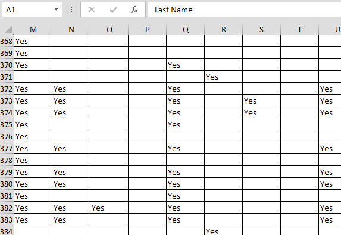
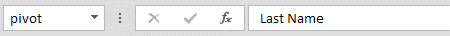
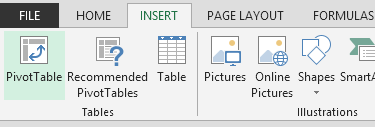
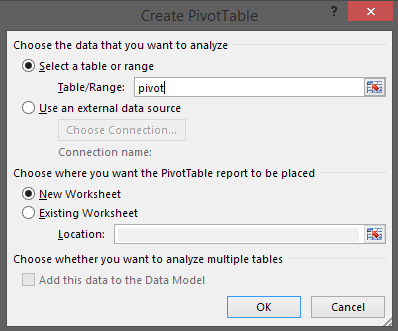
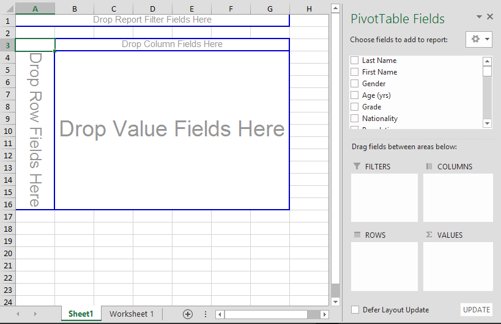
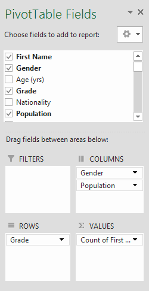
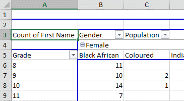

# Annual Survey {#h-1ksv4uv}

ADAM provides access to the information, but because of changing needs of the report, and the introduction of LURITS, this process will not be further developed. It is hoped that LURITS will replace the need for this survey.

Essentially, we will exploit the “pivot table” functionality in Excel to calculate the totals we need:

## Exporting Data {#h-44sinio}

In ADAM, under the “**Administration**” tab, find the “**Import & Export**” heading and click on the option to “**Export pupil data to Excel**”. You should be prompted to save an Excel spreadsheet.

Once saved, open the spreadsheet.

## Setting up the Pivot Table {#h-2jxsxqh}

Once opened in Excel, you will be faced with “Worksheet 1” which contains the information that is requested in the survey. Select all the information in the first sheet. Because there are many columns, the following key presses will achieve this:

-   Ctrl + Home (this moves you to the top left cell, A1)
-   Press down the Shift key and hold it down while pressing the following keys individually:

-   End
-   →
-   End
-   ↓

The data in the sheet should now be selected.

In the top-left hand corner, you should see a reference to “A1”:

Click there and type “pivot” and press Enter. This just a name that we can use to easily refer to the range of cells that we selected.

Now click on the “Insert” ribbon and choose to insert a “Pivot Table”:

The following window will appear:

In the “Table/Range” field, type in the named range “pivot”. Leaving all other options as they are, click on “OK”. A new worksheet will be inserted into your spreadsheet with the pivot table controls:

## Using the Pivot Table {#h-z337ya}

Pivot tables seem daunting to those that haven’t used them, but they are remarkably simple to use. Essentially, we will use the “COLUMNS” and “ROWS” boxes to recreate the tables that need to be filled out on the survey form. For example, one table might be:

**Boys**

**Girls**

**White**

**Black**

**White**

**Black**

**Grade 8**

**Grade 9**

**Grade 10**

In this example, the row headings are “Grades” and the column headings are firstly “Gender” and then “Population Group”. We would drag the headings into the controls on the right. One last point to consider is that *we need a value to count*. Because all students will have a first or a last name, drag one of those fields into the “Values” block.

If we wish to re-order, we can drag the fields as we need.

On the left, you will notice that the pivot table has changed to resemble the table required.

One point to note is that the headings are sorted into alphabetical order and so the columns and rows might not match the same ordering presented in the survey, but importantly the data that are required to complete the survey are present.
