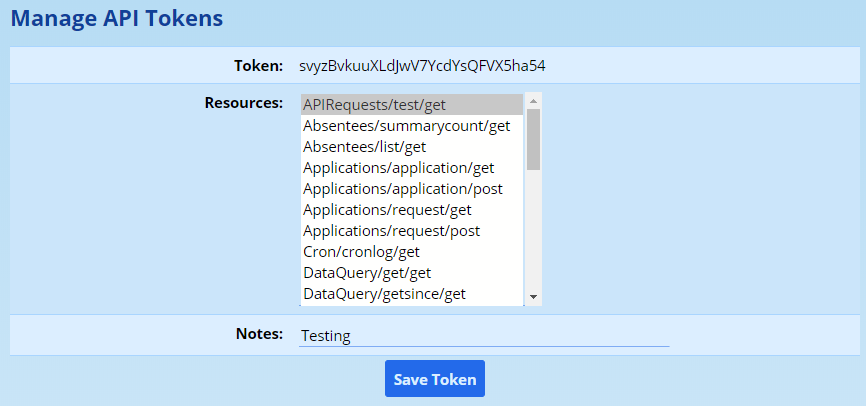
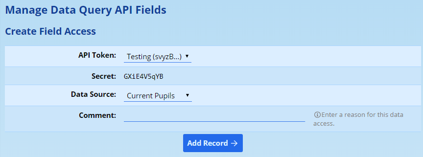
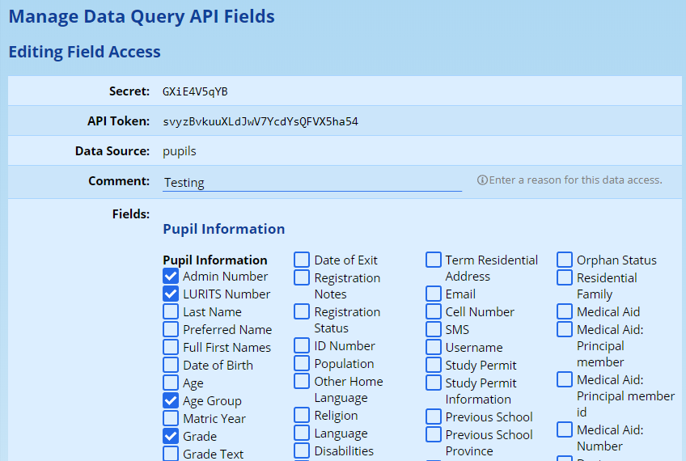

# API Access to ADAM {#h-kvj4kzzehoy5}

## Introduction the ADAM API {#h-gvx2caivkc8q}

An API allows for another computer program to connect to ADAM to either access data stored in its database or to make changes to that data. ADAM makes use of a “RESTful” API and returns data mostly in JSON format.

### What is a RESTful system? {#h-jt1520ptxz}

REST is a technique of communicating with an API which is very common amongst web-based applications - such as ADAM. Other programs will make one of four types of web request depending on what they are hoping to do in the database, and include the necessary information for ADAM. ADAM then responds to that request with the appropriate data or success code.

### How does access control work? {#h-2anco744ohi}

Access to the ADAM database is controlled using a token system. These are essentially random passwords that are created which are shared only with the other program that wishes to access the API. Because these tokens are really only meant to be used by a computer, it is not important that they are memorable or easy to type. In fact, ADAM will generate a random set of characters to be used as the API key and you are strongly encouraged to make use of the suggested token.

It is vitally important that the token is kept confidential between the person issuing it and the person using it. Anyone who knows the token will be able to access the API. Please read the [Best Practices](#h-cgkcahxt9qdq) section below for further information.

Each API token can be given access to one or more [API resources](#h-5w2169akgfvy). Anyone who knows the API token can access all the resources that have been allocated to that token.

API tokens can be revoked at any point and can have their resources changed and added to over time. Any changes you make to the token and its API resource assignments will take place immediately.

## Managing API Tokens in ADAM {#h-m0b4zvwuxgjc}

In ADAM: Navigate to **Administration → Security Administration → Manage API Tokens**.

A list of existing API tokens will be shown. Click on **Add new API Token** to begin the process of creating a new Token.

1.  A random 30-character **token** will be generated. This should be left unmodified unless you have a very specific reason to do so. Once set, token values cannot be changed. If you need to change the token, you must delete the existing endpoint and create a new one.
2.  Select the appropriate **resources** to allow the token to access. Hold down the “Ctrl” key on your keyboard to allow you to select multiple resources by then clicking on those resources while holding down that button.
3.  Add **notes** if required. It is a good idea to make note of what service is making use of the API token.
4.  Click on **Save Token**.

*The random 30 character token must be kept secret since will will allow anyone who knows it access to the data stored in the ADAM database. It will need to be shared with the integration provider and great care should be taken with how they are provided the API key. We strongly recommend against sending this information via email or other unsecured means.*

### Managing Existing Tokens {#h-6m7cajpelkf2}

In the table of existing API tokens, you have the option to **edit**, **delete** or **regenerate** the API token.

**Edit** allows you to change the **Resources** and **Notes** associated with an endpoint, but does not allow you to edit the Token.

**Regenerating** a token will create a new random value for the token but will keep your resources and notes the same. If you do regenerate a token, please remember to update your external systems with the new token.

**Deleting** the token will remove it from the list and it will no longer be available for use. Systems that rely on the resources will no longer have access to the data supplied by ADAM.

## Best Practice Security Principals {#h-cgkcahxt9qdq}

The following are provided as best practice guidelines for managing API tokens.

1.  Treat API Tokens as **top secret**. Do not send them via email and do not publish them in a place where they could be accessed by unauthorized personnel. API access can expose sensitive data. Allowing an API tokens to fall into the wrong hands could expose personal information about the users of your system and this would be considered an offence under the “Protection of Personal Information Act” (POPIA). Access to such personal information could become a security and safety issue.
2.  Each entity (e.g. a program that is accessing data from ADAM) should have its **own** token or tokens. Tokens should never be shared between entities. If another entity requires access to the same data, give it a new token. This allows you to revoke each token individually and stop one program from accessing the data without affecting any other programs.
3.  Programmers integrating with the ADAM API should not, under any circumstances, include API tokens in their source code and should always fetch them from some form of access controlled data storage.

## API Interactions {#h-gn5nnwf22e33}

### Authentication {#h-b32fflj8006}

All API requests should be authenticated using a Bearer Token.

**Example:**

Authenticating with the token value svyzBvkuuXLdJwV7YcdYsQFVX5ha54 would yield the following header:

Authorize: Bearer svyzBvkuuXLdJwV7YcdYsQFVX5ha54

ADAM also will accept a Basic Authorization header with an arbitrary username. Authenticating with the username apitoken token value svyzBvkuuXLdJwV7YcdYsQFVX5ha54 would yield the following header:

Authorize: Basic YXBpdG9rZW46c3Z5ekJ2a3V1WExkSndWN1ljZFlzUUZWWDVoYTU0

### API Requests {#h-auzo0pdekau3}

All API requests, as listed below, should be prefixed with the “api” folder to make the URL end-point:

https://*adam.example.com*/api/

The remainder of the URL generally consists of a module name, a data set and zero or more parameters. These should all be in lower-case. For example:

https://demo.adam.co.za/api/request/test/parameter

Parameters should be “[percent encoded](https://www.google.com/url?q=https://www.w3schools.com/tags/ref_urlencode.asp&sa=D&source=editors&ust=1778246675609863&usg=AOvVaw3YqxCg2gCwh23giGyigZmH)”. Spaces should be encoded as %20 and not as a “+”.

A GET request to this API end-point would require token access to the resource: request/test:get. Note that without specifically assigned access, access to the resource - even this test resource - will be denied.

### API Responses {#h-4ql5zp9n8ghq}

All responses will be returned within JSON objects. The basic structure of these objects is:

{

    "data": null,

    "message": "",

    "response": {

        "error": "",

        "code": 200

    }

}



Any response which does not have these properties as listed above, MUST be treated as invalid.

The contents of the **data** attribute will depend on the API endpoint being interrogated.

The **message** attribute contains a human-readable message which, in most cases, describes the data set that has been returned. This is intended for debugging and may change unpredictably with future versions of ADAM.

The **response code** should mirror the HTTP response code which will be descriptive of the success or failure of the call. The **error** attribute will provide a human-readable description of the error. The error message is not intended to be interpreted by machines.

## API Resources {#h-5w2169akgfvy}

These are the available documented resources. Other resources are available but are not listed here until their development is complete and considered stable.

### AbsenteeKiosk/register:post {#h-7ic9k29sv57f}

This registers a pupil as either present or late. It is intended to be used either by automated access control systems or ADAM’s own absentee kiosk.

#### Request {#h-fh0wszazdbkn}

-   POST to /api/absenteekiosk/register/<pupil>
-   POST to /api/absenteekiosk/register with pupil=<pupil> as a form variable in the POST body

#### Parameters {#h-zccg95c8sgxn}

-   <pupil>: The ADAM identifier of the pupil.

#### Response {#h-7rr5e18zgzuc}

If the pupil identifier can be matched against an existing pupil, the endpoint will return two items in the data object. These are used internally by ADAM’s “Absentee Kiosk” feature.

-   message: an HTML message which will contain the name of the pupil and confirmation that they have been registered.
-   colour: an HTML hex code either red, green or amber depending on the status.

The times and windows are configured in ADAM’s site settings. Depending on these settings, ADAM will report one of the following HTTP status codes:

-   The pupil identifier is not recognised: 404 (Not found)
-   The pupil is too early and registers before the earliest time allowed: 406 (Not acceptable)
-   The pupil registers during the first window and is recorded as present: 200 (OK)
-   The pupil registers during the second window and is recorded as late: 202 (Accepted)
-   The pupil is too late and registers after the second window closes: 406 (Not accetable)

In each case, the status code will be corroborated by a more descriptive message.

**Example:**

{

    "data": {

        "message": "<strong>Joe Smith</strong> has been recorded as <strong>present</strong>",

        "colour": "green"

    },

    "message": "",

    "response": {

        "error": "Present",

        "code": 200

    }

}



### Absentees/summarycount:get {#h-nywv6ove5uxk}

Returns a list of pupils and the number of days they’ve been absent. This counts all the absentees with a reason that is set to count as “absent”. Only pupils with absentee records are returned. All pupils, including those that might have left the school, are returned.

#### Request {#h-dvfpjjgq4lvo}

GET to /api/absentees/summarycount/<from>\[/<to>\]

#### Parameters {#h-t2xk5ih7pck7}

-   <from>: An ISO formatted date to begin the summary. This date is included in the summary.
-   <to>: OPTIONAL. An ISO formatted date to mark the end of the range of the summary. This date is included in the summary. If omitted, the current date is used instead.

#### Response {#h-k9204ev9ndv0}

The data attribute will be an array of zero or more JSON objects.

**Example:**

GET /api/absentees/summarycount/2018-01-01/2018-01-31

{

    "data": \[

        {

            "pupil\_id": 875,

            "pupil\_admin": "19634",

            "absent\_count": 1

        },

        {

            "pupil\_id": 879,

            "pupil\_admin": "52351",

            "absent\_count": 2

        }

    \],

    "message": "Absentee counts for all pupils from 2018-01-01 to 2018-01-31.",

    "response": {

        "error": "OK",

        "code": 200

    }

}



-   **pupil\_id** is ADAM’s internal database identifier and will always refer to a unique pupil.
-   **pupil\_admin** is the user-defined administration number. While this should not change, it may do so at the school’s discretion.
-   **absentee\_count** is the number of days that the pupil has been recorded as absent. This does not include absentee records which do not prejudice a pupil (such as “away on sports tour”). These reasons are customisable by the school.

### Absentees/list:get {#h-8c7t4x6gqzx2}

Gets a list of pupils absent with the reasons.

#### Request {#h-nxh0k0go56ms}

GET to /api/absentees/list/\[<date>\[/<to>\]\]

#### Parameters {#h-8mrj6qpygg2}

-   <date>: OPTIONAL. An ISO formatted date to query the absentees. If omitted, today’s date is used.
-   <to>: OPTIONAL. An ISO formatted date. If provided, all absentees on or between the <date> and <to> dates will be provided. If omitted, <to> effectively takes the same value as <date> and only absentees for that date are provided.

#### Response {#h-vlfjr0dk75bq}

GET /api/absentees/list/2018-01-30

{

    "data": \[

        {

            "pupil\_id": 1720,

            "pupil\_admin": "47547",

            "absent\_date": "2018-01-31",

            "absent\_reason\_id": 1,

            "absent\_reason\_description": "Absent",

            "absent\_notes": "App Test"

        }

    \],

    "message": "Absentee list for all pupils from 2018-01-31 to 2018-01-31.",

    "response": {

        "error": "OK",

        "code": 200

    }

}



The data attribute contains an array of zero or more absentee records. Each record is a JSON object with the following properties:

-   **pupil\_id** is ADAM’s internal identifier for the pupil.
-   **pupil\_admin** is a school-provided identifier for the pupil. While this should not change, it may do so at the school’s discretion.
-   **absent\_date** gives the date that the absentee occurred on in case a range of dates was requested. A pupil can only have a single absentee record per day.
-   **absent\_reason** is an internal identifier corresponding to the absentee reason that was chosen.
-   **absent\_reason\_description** is the descriptor for the absentee reason. It will be consistent per **absent\_reason** in any one API call, but may change between calls at the school’s discretion.
-   **absent\_notes** contain the end-user provided notes related to the pupil’s absence. This may contain personal information.

### Absentees/daysabsentforpupil:get {#h-nnqpu1tnbymr}

Returns the absentee log for a specific pupil.

#### Request {#h-4r4waxt52yrx}

GET /api/absentees/daysabsentforpupil/<pupil>/<year>

#### Parameters {#h-9od702ruous9}

-   <pupil>: ADAM internal pupil identifier (required)
-   <year>: Calendar year to filter by (optional; returns all records if omitted)

#### Response {#h-uh1dkkbmle6a}

Data attribute contains the pupil's absentee log entries.

### Admin/test:get {#h-pxhgatdl2pns}

Internal test endpoint for verifying API connectivity.

#### Request {#h-xybs4xa4q6n}

GET /api/admin/test

#### Parameters {#h-y6cnbcw1usxv}

None.

#### Response {#h-lds7m3749mdv}

****{

    "data": "Successfully fetched data by asynchronous call from the server at 2026-04-09 14:30:00",

    "message": "",

    "response": { "error": "OK", "code": 200 }

}



### Applications/applicationformfields:get {#h-1zn1xvss1ob4}

The ability to see which fields are accepted as part of the application form. These fields can be customised by updating the core and custom fields to change their availability in the application form.

#### Request {#h-mhjcyy28pcfu}

GET request to /api/applications/applicationformfields

#### Parameters {#h-748k94mg51af}

None

#### Response {#h-nt0xf4jnrd1g}

The output data will be a JSON object containing the fields that are accepted. Within the data property are two sub arrays for families and pupils. These list the field names that are accepted.

**Example:**

https://demo.adam.co.za/api/applications/applicationformfields

{

    "data": {

        "families": \[

            "family\_primary\_idnum",

            "family\_primary\_lastname",

            "family\_primary\_firstname",

            "family\_primary\_fullfirst",

            "family\_primary\_title",

            "family\_primary\_initials",

            "family\_primary\_gender",

            "family\_primary\_birth",

            "family\_primary\_occupation",

            "family\_primary\_employer",

            "family\_primary\_workphone",

            "family\_primary\_cell",

            "family\_primary\_cell\_sms",

            "family\_primary\_email",

            "family\_secondary\_idnum",

            "family\_secondary\_lastname",

            "family\_secondary\_firstname",

            "family\_secondary\_fullfirst",

            "family\_secondary\_title",

            "family\_secondary\_initials",

            "family\_secondary\_gender",

            "family\_secondary\_birth",

            "family\_secondary\_occupation",

            "family\_secondary\_employer",

            "family\_secondary\_workphone",

            "family\_secondary\_cell",

            "family\_secondary\_cell\_sms",

            "family\_secondary\_email",

            "family\_address\_residential\_1",

            "family\_address\_residential\_2",

            "family\_address\_residential\_suburb",

            "family\_address\_residential\_city",

            "family\_address\_residential\_province",

            "family\_address\_residential\_code",

            "family\_address\_residential\_country",

            "family\_address\_postal\_1",

            "family\_address\_postal\_2",

            "family\_address\_postal\_suburb",

            "family\_address\_postal\_city",

            "family\_address\_postal\_province",

            "family\_address\_postal\_code",

            "family\_address\_postal\_country",

            "family\_home\_phone",

            "family\_home\_fax",

            "family\_ice",

            "family\_ice\_number",

            "family\_report\_required"

        \],

        "pupils": \[

            "pupil\_lastname",

            "pupil\_fullfirst",

            "pupil\_firstname",

            "pupil\_gender",

            "pupil\_idnumber",

            "pupil\_birth",

            "pupil\_religion",

            "pupil\_population\_id",

            "pupil\_language\_id",

            "pupil\_language\_other",

            "pupil\_teaching\_language\_id",

            "pupil\_entry",

            "pupil\_final",

            "pupil\_email",

            "pupil\_cell",

            "pupil\_cell\_sms",

            "pupil\_allergies",

            "pupil\_medaid\_name",

            "pupil\_medaid\_number",

            "pupil\_medaid\_principal",

            "pupil\_medaid\_principal\_id",

            "pupil\_doctor",

            "pupil\_doctor\_phone",

            "pupil\_orphan\_status",

            "pupil\_relationships",

            "pupil\_atschool",

            "pupil\_prevschool\_firstprovince",

            "pupil\_prepschool",

            "pupil\_prevschool\_country",

            "pupil\_prevschool\_formalgrr",

            "pupil\_nationality",

            "pupil\_studypermit\_required",

            "pupil\_studypermit",

            "custom\_38",

            "custom\_36"

        \]

    },

    "message": "",

    "response": {

        "error": "OK",

        "code": 200

    }

}



### Applications/apply:post {#h-d7arjgqf95x7}

Submit an application to the site. Note that if the ID number submitted matches an existing parent, the child will automatically be linked to that parent. Note that when applications are submitted through ADAM’s web interface, ADAM automatically authenticates the parent to ensure that strange children are not linked to their profiles. Implicit in the web application is the validation of the email address which is done as part of the application process. Applications received via the API are not given such scrutiny and special care should be taken on the sending system to mitigate against spam and fraudulent attempts at applications.

#### Request {#h-7h0i59i4ebwq}

POST request to /api/applications/apply

#### Parameters {#h-kfmzot3y32ry}

None - data sent by message body.

#### Body {#h-l86r4mtrt8xa}

The body of the request should contain the data required for the application. The data should either be in JSON format, or as an encoded query string (as is typical with normal form-submitted data).

Fields: The three fields, idnumber, email, and phone, may be duplicated within the parent information. It is not necessary that they complete them twice, but it is necessary for the information to be submitted both with the family and as separate information.

Note carefully the point about existing parents: *if their ID or passport numbers already exist in ADAM’s database, the family information provided in the application will be silently discarded in favour of information already in the database.* Thus having updated contact information provided in the email and phone fields is important. The silent discarding is to ensure that malicious actors cannot update family information without their authorisation.

-   idnumber: The South African ID or passport number of the parent making the submission. This is used to match against other families. If omitted, no linking will take place. If this value matched the value of an existing family, the pupil will automatically be linked to that family and the information provided in the family info will be lost.
-   email: The email address to get in tough with the parents regarding the application.
-   phone: The phone number to get in touch with the parents regarding the application.
-   application: The body of the application. This contains:

-   pupil: An array of child information to be included on the application. Each element of the array is a sub-array of information for each child. A valid application must have at least one child and no more than 5 children.
-   family: An array of family fields to be included.
-   email: further details of the parents’ email addresses.

A minimum set of required fields is:

-   Families:

-   Primary last name (family\_primary\_lastname)
-   Primary first name (family\_primary\_firstname)
-   Primary full first names, can duplicate family\_primary\_firstname if required  (family\_primary\_fullfirst)

-   Pupils:

-   Last name (pupil\_lastname)
-   Preferred name (pupil\_firstname)
-   Full first name, can duplicate pupil\_firstname if required (pupil\_fullfirst)
-   Gender (pupil\_gender)
-   Year of entry (entry\_year) - note non-standard field naming
-   Month of entry (entry\_month) - note non-standard field naming
-   Grade of entry (entry\_grade) - note non-standard field naming. Note, integers accepted only. For grades prior to Grade 1, zero or negative grades: Grade R = 0, Grade RR = -1, Grade RRR = -2, etc.

##### Example (JSON): {#h-9h9ycmwhqeit}

{

  "idnumber": "1234567890123",

  "email": "morticia@adam.co.za",

  "phone": "0834699569",

  "application": {

    "pupil": \[

      {

        "pupil\_lastname": "Addams",

        "pupil\_firstname": "Wednesday",

        "pupil\_fullfirst": "Wednesday Jane",

        "pupil\_gender": "Female",

        "entry\_year": "2019",

        "entry\_month": "1",

        "entry\_grade": "10",

        "relationship": \[{

          "primary": "biological",

          "secondary": "step parent"

        }\]

      },

      {

        "pupil\_lastname": "Addams",

        "pupil\_firstname": "Pugsley",

        "pupil\_fullfirst": "Pugsley George",

        "pupil\_gender": "Male",

        "entry\_year": "2019",

        "entry\_month": "1",

        "entry\_grade": "8",

        "relationship": \[{

          "primary": "step parent",

          "secondary": "biological"

        }\]

      }

    \],

    "family": {

      "family\_primary\_idnum": "1234567890123",

      "family\_primary\_lastname": "Addams",

      "family\_primary\_firstname": "Gomez",

      "family\_primary\_fullfirst": "Gomez",

      "family\_secondary\_idnum": "1234567890123",

      "family\_secondary\_lastname": "Addams",

      "family\_secondary\_firstname": "Morticia",

      "family\_secondary\_fullfirst": "Morticia May"

    },

    "email": \[

      {

        "member": "primary",

        "address": "gomes@adam.co.za",

        "bulk": "Yes",

        "reports": "Yes"

      },

      {

        "member": "secondary",

        "address": "morticia@adam.co.za",

        "bulk": "Yes",

        "reports": "Yes"

      }

    \]

  }

}



##### Example (URL Encoded): {#h-ykyec7ttpm4j}

idnumber=1234567890123&email=morticia%40adam.co.za&phone=0834699569&application%5Bpupil%5D%5B0%5D%5Bpupil\_lastname%5D=Addams&application%5Bpupil%5D%5B0%5D%5Bpupil\_firstname%5D=Wednesday&application%5Bpupil%5D%5B0%5D%5Bpupil\_fullfirst%5D=Wednesday+Jane&application%5Bpupil%5D%5B0%5D%5Bpupil\_gender%5D=Female&application%5Bpupil%5D%5B0%5D%5Bentry\_year%5D=2019&application%5Bpupil%5D%5B0%5D%5Bentry\_month%5D=1&application%5Bpupil%5D%5B0%5D%5Bentry\_grade%5D=10&application%5Bpupil%5D%5B0%5D%5Brelationship%5D%5B0%5D%5Bprimary%5D=biological&application%5Bpupil%5D%5B0%5D%5Brelationship%5D%5B0%5D%5Bsecondary%5D=step+parent&application%5Bpupil%5D%5B1%5D%5Bpupil\_lastname%5D=Addams&application%5Bpupil%5D%5B1%5D%5Bpupil\_firstname%5D=Pugsley&application%5Bpupil%5D%5B1%5D%5Bpupil\_fullfirst%5D=Pugsley+George&application%5Bpupil%5D%5B1%5D%5Bpupil\_gender%5D=Male&application%5Bpupil%5D%5B1%5D%5Bentry\_year%5D=2019&application%5Bpupil%5D%5B1%5D%5Bentry\_month%5D=1&application%5Bpupil%5D%5B1%5D%5Bentry\_grade%5D=8&application%5Bpupil%5D%5B1%5D%5Brelationship%5D%5B0%5D%5Bprimary%5D=step+parent&application%5Bpupil%5D%5B1%5D%5Brelationship%5D%5B0%5D%5Bsecondary%5D=biological&application%5Bfamily%5D%5Bfamily\_primary\_idnum%5D=1234567890123&application%5Bfamily%5D%5Bfamily\_primary\_lastname%5D=Addams&application%5Bfamily%5D%5Bfamily\_primary\_firstname%5D=Gomez&application%5Bfamily%5D%5Bfamily\_primary\_fullfirst%5D=Gomez&application%5Bfamily%5D%5Bfamily\_secondary\_idnum%5D=1234567890123&application%5Bfamily%5D%5Bfamily\_secondary\_lastname%5D=Addams&application%5Bfamily%5D%5Bfamily\_secondary\_firstname%5D=Morticia&application%5Bfamily%5D%5Bfamily\_secondary\_fullfirst%5D=Morticia+May&application%5Bemail%5D%5B0%5D%5Bmember%5D=primary&application%5Bemail%5D%5B0%5D%5Baddress%5D=gomes%40adam.co.za&application%5Bemail%5D%5B0%5D%5Bbulk%5D=Yes&application%5Bemail%5D%5B0%5D%5Breports%5D=Yes&application%5Bemail%5D%5B1%5D%5Bmember%5D=secondary&application%5Bemail%5D%5B1%5D%5Baddress%5D=morticia%40adam.co.za&application%5Bemail%5D%5B1%5D%5Bbulk%5D=Yes&application%5Bemail%5D%5B1%5D%5Breports%5D=Yes

#### Response {#h-yd1j75jd4om9}

A simple object providing notification of success or failure. The application field gives a code unique to this application which will, in a future development, allow for editing of the application.

{

    "data": {

        "application": "6ESKmQYMWH3KbJUdAESsZUi3BysaLx"

    },

    "message": "",

    "response": {

        "error": "OK",

        "code": 200

    }

}



### Applications/verifyid:get {#h-szis8dwf6yey}

Checks whether an ID number is associated with an existing family login account.

#### Request {#h-pufrl6q1kbif}

GET /api/applications/verifyid?idNumber=<idNumber>

#### Parameters {#h-qs07qcskap85}

-   <idNumber>: South African ID number to look up (required)

#### Response {#h-3bgyfzoc7nth}

No data attribute. The response.message field indicates the result:

-   "authorization required" — ID number found and a password exists (family can log in)
-   "authorization not possible" — ID number found but no password set
-   "id number not found" (code 404) — no matching record

### Assessment/recentresults:get {#h-m6voq3ceumfa}

Returns recent assessment results for a pupil.

#### Request {#h-v9xprwdtdhee}

GET /api/assessment/recentresults/<pupil>

#### Parameters {#h-nywvovosbuxc}

-   <pupil>: ADAM internal pupil identifier (required)

#### Response {#h-8szk9unojvha}

Data attribute contains an array of assessment result objects:

{

    "data": \[

        {

            "assessment\_id": 42,

            "assessment\_period\_id": 3,

            "assessment\_description": "Term 1 Test",

            "assessment\_date": "2026-03-15",

            "assessment\_releasedate": "2026-03-20",

            "assessment\_total": 100,

            "assessment\_weighting": 1.0,

            "assessment\_weighting\_display": "10%",

            "result\_total": 78,

            "result\_comment": "",

            "class\_grade\_id": 10,

            "class\_description": "10A",

            "subject\_name": "Mathematics",

            "subject\_short": "Maths"

        }

    \]

}



### Questions/questionbreakdown:get {#h-klcy8hd45c31}

Returns a per-question breakdown of a pupil's assessment results.

#### Request {#h-txlfo8cftyu3}

GET /api/questions/questionbreakdown?pupil=<pupil>&assessment=<assessment>

#### Parameters {#h-l6lrxwmxbjt}

-   <pupil>: ADAM internal pupil identifier (required)
-   <assessment>: Assessment identifier (required)

#### Response {#h-djjtscp1icpp}

Data attribute contains an array of question result objects:

{

    "data": \[

        {

            "question\_description": "Algebra",

            "outcome\_name": "Patterns and Algebra",

            "answer\_total": 8.5,

            "answer\_level": "B",

            "question\_total": 10

        }

    \]

}



### Calendar/pupillinks:get {#h-sbvq0t3wwxb8}

This provides calendar subscription links for all current pupils. API keys are generated automatically for pupils who don't have one yet.

#### Request {#h-5t21pmnytj6q}

GET /api/calendar/pupillinks/

#### Parameters {#h-fqqi4bcko9mx}

None required.

#### Response {#h-l8gu0ce28nlr}

GET /api/calendar/pupillinks/

{                                                                                                                                                                  

    "data": \[                                                                                                                                                        

      {                                                                                                                                                              

        "pupil\_id": 142,                                                                                                                                                                                                                                                                            

        "calendar\_link": "webcal://adam.example.com/api/calendar/xK9mNp2qRs5tUv8wXy1zA4bCdEfGhIjKlMnOpQrStUvWxYz012"                                                

      }                                                                                                                                                              

    \],                                                                                                                                                              

    "message": "",                                                                                                                                                  

    "response": {                                                                                                                                                    

      "error": false,                                                                                                                                                

      "code": 200                                                                                                                                                    

    }                                                                                                                                                                

  }

     

### Calendar/stafflinks:get {#h-r4m5urz5ki}

This provides calendar subscription links for all current staff. API keys are generated automatically for staff who don't have one yet.

#### Request {#h-pw5r88qw3a2x}

GET /api/calendar/stafflinks/

#### Parameters {#h-3dsdod446rkj}

None required.

#### Response {#h-vwwczhyk0yxk}

GET /api/calendar/stafflinks/

{                                                                                                                                                                  

    "data": \[                                                                                                                                                        

      {                                                                                                                                                              

        "staff\_id": 3,                                                                                                                                                                                                                                                                          

"calendar\_link": "webcal://adam.example.com/api/calendar/gMSrVY4iGLAdk3RDks7AK3a2BTFW9PAGgpt9MgPDvVd6vBS7im"                                                

      }                                                                                                                                                              

    \],                                                                                                                                                              

    "message": "",                                                                                                                                                  

    "response": {                                                                                                                                                    

      "error": false,                                                                                                                                                

      "code": 200                                                                                                                                                    

    }                                                                                                                                                                

}      



### Changelog/undo:post {#h-j17xssofefwd}

Undoes a changelog entry, reverting a field to its previous value.

#### Request {#h-bfsocte3g78o}

POST /api/changelog/undo/<changeSet>

#### Parameters {#h-2gidy9oo3x8b}

-   <changeSet>: The changelog entry identifier (URL path parameter)

#### Response {#h-1t3qd1ma1t5t}

-   Code 200: Undo successful
-   Code 403: Cannot undo the original entry (no previous value to restore)
-   Code 202: Undo operation failed

### Classes/pupilteachers:get {#h-9h96nhf0btzh}

This provides a list of classes that an individual pupil is registered for.

#### Request {#h-c9a8uayt88yj}

GET /api/classes/pupilteachers/<pupil>

#### Parameters {#h-uma30ziaevm4}

-   <pupil> is the pupil identifier

#### Response {#h-icm0za8ogkk8}

GET /api/classes/pupilteachers/123

{

    "data": \[

        {

            "class\_id": 1111,

            "class\_description": "AB",

            "class\_gradeyear": 10,

            "subject\_name": "Geography",

            "subject\_short": "Geo",

            "staff": {

                "staff\_id": 321,

                "staff\_lastname": "Van Der Walt",

                "staff\_firstname": "Drikus",

                "staff\_title": "Mr",

                "staff\_email": "dvdwalt@school.example.com",

            },

            "teaching\_assistants": \[

                {

                    "staff\_id": 1234,

                    "staff\_lastname": "Smith",

                    "staff\_firstname": "James",

                    "staff\_title": "Mr",

                    "staff\_email": "jsmith@school.example.com",

                }

            \],

            "class\_friendly": "Geography Grade 10 AB"

        }

    \],

    "message": "",

    "response": {

        "error": "OK",

        "code": 200

    }

}



The **data** attribute contains one or more class objects. This contains the details of the subject, and the class.

Note that the **class\_gradeyear** property can be negative to represent pre-school grades. (e.g. Grade 0 = Grade R, Grade -1 = Grade RR, and so on).

One **staff** member (the teacher of the class) will be provided, and the **teaching\_assistants** may contain 0 or more staff objects.

### Classes/bygradeperiodsubject:get {#h-2twspce7y5jn}

Returns classes matching a specific grade, reporting period, and subject combination.

#### Request {#h-vn7fkqaengj}

GET /api/classes/bygradeperiodsubject/<grade>/<period>/<subject>

#### Parameters {#h-tyqfmukrxfe}

-   <grade>: Grade identifier (required)
-   <period>: Reporting period identifier (required)
-   <subject>: Subject identifier (required)

#### Response {#h-p3p2z9r9d2g0}

****{

    "data": \[

        {

            "id": 150,

            "grade": 10,

            "gradetext": "Grade 10",

            "description": "10A",

            "subject": 5,

            "fulldescription": "Grade 10 Mathematics 10A",

            "teacher\_id": 42,

            "teacher\_name": "Mr Smith"

        }

    \]

}



### Cron/cronlog:get {#h-rg3fgabjh8rv}

Returns cron job execution logs. Restricted to super-admin tokens.

#### Request {#h-4r965rgszt4z}

GET /api/cron/cronlog/<cronLogID>

#### Parameters {#h-w14gazzddzk3}

-   <cronLogID>: Either a numeric log entry ID (returns that specific record with full log content) or any non-numeric value (returns all records without log content)

#### Response {#h-6jis2wmkzc9q}

When requesting a specific entry, returns the full cron log record including log output. When requesting all entries, returns an array of records without the log body to reduce payload size.

### DataQuery/get:get {#h-mmc5jc17jjue}

Provides automated access to a whole-school scratch list. The contents of the scratch list fields can be customised as per the settings in ADAM found at **Administration → Security → Manage Data Query API Fields**.

Please treat this feature with the utmost care. By its very definition, it gives wide access to a range of personal data.

#### Create a Data Query Secret {#h-ucmmird25yvj}

In order to use this API endpoint, an additional data query token must be defined.

Note that field access definitions can only be linked to a single API Token. If multiple API tokens require access to the same fields, this process must be duplicated for each API token and a unique list created for each.

-   Select the **API Token** that you want to associate with this query. *Note that only API Tokens who have access to the* *DataQuery/get/get* *resource may be selected here.*
-   Make a note of the **Secret** and do not share this with unauthorized personnel.
-   Choose a **data source** for the query. Once set here, this cannot be changed later.
-   Add a **comment** to provide insight into the function and reason for this query.

Click on **Add record** when done.

A second screen will show, allowing you to select the fields required for this query:

Check the fields that you require and **save** your selections using the button at the bottom.

#### Request {#h-rizx5ahmic0h}

GET /api/dataquery/get/<secret>

OR, for a modified data structure to provide more consistency for automated systems, (see example response below), add the version parameter “2” to the end of the request.

GET /api/dataquery/get/<secret>/2

#### Parameters {#h-qk9i47vp7d2b}

-   <secret> is a series of random characters as [created above](#h-ucmmird25yvj).

#### Response {#h-wm3xrgk0hehr}

GET /api/dataquery/get/GXiE4V5qYB

{

    "data": {

        "49": {

            "admin\_number\_1": "3316",

            "lurits\_number\_177": "",

            "age\_6": "15 years, 200 days",

            "gender\_10": "Male"

        },

        "4688": {

            "admin\_number\_1": "6333",

            "lurits\_number\_177": "",

            "age\_6": "17 years, 10 days",

            "gender\_10": "Male"

        }

    },

    "message": "",

    "response": {

        "error": "OK",

        "code": 200

    }

}



The **data** attribute is a JSON object with zero or more attributes, each being the ID of the relevant data object as specified in the Data Query setup. Each of these objects will have a number of attributes depending on the fields chosen. Note that the names of these attributes **can** be overridden by the school. However, there is a unique numeric identifier that is appended to each which will remain constant. Logic should be based around that identifier. Note that custom fields will contain the word “custom” before the unique identifier and so that should also be checked for.

GET /api/dataquery/get/GXiE4V5qYB/2

Where the optional parameter “2” is included at the end, the structure of the returned data will change. An additional “fields” property is included with clearer textual descriptions of the fields. The fields in each of the data objects is identified by the immutable identifier. This allows automated systems to ignore parts of the field name that might change.

{

    "fields": \[

        {

           "id": 1,

           "name": "Admin Number"

        },

        {

           "id": 177,

           "name": "LURITS Number"

        },

        {

           "id": 6,

           "name": "Age"

        },

        {

           "id": 10,

           "name": "Gender"

        }  

    \],

    "data": {

        "49": {

            "1": "3316",

            "177": "",

            "6": "15 years, 200 days",

            "10": "Male"

        },

        "4688": {

            "1": "6333",

            "177": "",

            "6": "17 years, 10 days",

            "10": "Male"

        }

    },

    "message": "",

    "response": {

        "error": "OK",

        "code": 200

    }

}



### DataQuery/getsince:get {#h-vr7le3n3smfh}

See above.

#### Request {#h-w0o3jw8qmewg}

GET /api/dataquery/getsince/<secret>/<timestamp>\[/<version>\]

#### Parameters {#h-vzm8ze1h4nqk}

-   <secret> is the secret defined for a list. This also determines what type of data and which fields are returned.
-   <timestamp> is a [Unix integer timestamp](https://www.google.com/url?q=https://en.wikipedia.org/wiki/Unix_time&sa=D&source=editors&ust=1778246675689130&usg=AOvVaw3Bx1tu5NfQ41epG1AstACP).
-   <version> , if supplied, is the version of the data structure to be returned. See above.

#### Response {#h-syazfrp84dmm}

See above.

### DataQuery/getone:get {#h-ssc4le9b3oa0}

See above.

#### Request {#h-9fany0qb1zec}

GET /api/dataquery/getone/<secret>/<identifier>\[/<version>\]

#### Parameters {#h-pwp06ru0lij6}

-   <secret> is the secret defined for a list. This also determines what type of data and which fields are returned.
-   <identifier> is the identifier of the dataobject to be returned.
-   <version> , if supplied, is the version of the data structure to be returned. See above.

#### Response {#h-xwjizln86ukm}

See above.

### Documents/categories:get {#h-7y29se9q9gzy}

Returns a list of document categories that the current API token has any permissions for, along with the permission flags for each.

#### Request {#h-emfqylulawpt}

GET to /api/documents/categories

#### Parameters {#h-mtxu0dgwf4x1}

None.

#### Response {#h-r67famxx3rsa}

The data attribute will be an array of zero or more JSON objects representing categories.

Example:

GET /api/documents/categories

{

    "data": \[

        {

            "category\_id": 7,

            "category\_name": "Photographs",

            "description": "Pupil photographs",

            "parent\_id": 1,

            "permissions": {

                "read": true,

                "add": true,

                "delete": false

            }

        }

    \],

    "message": "",

    "response": {

        "error": "OK",

        "code": 200

    }

}



-   **category\_id** is ADAM's internal identifier for the category.
-   **category\_name** is the display name of the category.
-   **description** is the category's description text.
-   **parent\_id** is the identifier of the parent category (top-level categories have a parent of 0).
-   **permissions** indicates which operations the token is allowed to perform on this category.

### Documents/list:get {#h-r3bs9entcwaw}

Returns a list of documents for a given entity within a specific category.

#### Request {#h-2da42t11u5sq}

GET to /api/documents/list/<categoryId>/<entityId>

#### Parameters {#h-7azohi9ttu8m}

-   **categoryId**: The ADAM identifier of the document category.
-   **entityId**: The ADAM identifier of the entity (pupil, staff member, family, or site record).

#### Response {#h-jx1qc46ab2cc}

The data attribute will be an array of zero or more JSON objects representing documents. Requires **read** permission on the category.

Example:

GET /api/documents/list/108/4561

{

    "data": \[

        {

            "document\_id": 12345,

            "name": "Birth Certificate",

            "filename": "birth\_cert.pdf",

            "filetype": "application/pdf",

            "upload\_date": "2025-03-15 10:30:00",

            "category\_id": 108,

            "link": "a1b2c3d4e5f6g7h8i9j0k1l2m3n4o5p6"

        }

    \],

    "message": "",

    "response": {

        "error": "OK",

        "code": 200

    }

}



-   **document\_id** is ADAM's internal identifier for the document.
-   **name** is the descriptive name given to the document.
-   **filename** is the original filename of the uploaded file.
-   **filetype** is the MIME type of the document.
-   **upload\_date** is the date and time the document was uploaded.
-   **category\_id** is the category the document belongs to.
-   **link** is a unique random string identifier for the document.

### Documents/document:get {#h-rhf6oxkl663u}

Returns detailed metadata for a single document, including its entity links.

#### Request {#h-yojmefhkikif}

GET to /api/documents/document/<documentId>

#### Parameters {#h-c6qqzwhs2nt8}

-   **documentId**: The ADAM identifier of the document.

#### Response {#h-sr440dgx9m8e}

The data attribute will be a JSON object with document metadata and linked entities. Requires **read** permission on the document's category.

Example:

GET /api/documents/document/12345

{

    "data": {

        "document\_id": 12345,

        "name": "Birth Certificate",

        "notes": "",

        "filename": "birth\_cert.pdf",

        "filetype": "application/pdf",

        "upload\_date": "2025-03-15 10:30:00",

        "category\_id": 108,

        "category\_name": "Admin Documents",

        "link": "a1b2c3d4e5f6g7h8i9j0k1l2m3n4o5p6",

        "links": \[

            {

                "table": "pupils",

                "entity\_id": 4561,

                "link\_date": "2025-03-15 10:30:00"

            }

        \]

    },

    "message": "",

    "response": {

        "error": "OK",

        "code": 200

    }

}



-   **notes** is any additional notes attached to the document.
-   **category\_name** is the display name of the document's category.
-   **links** is an array of entity associations. Each link contains the entity **table** (pupils, staff, families, or site), the **entity\_id**, and the **link\_date**.

### Documents/download:get {#h-2jntd0hgizru}

Downloads the binary file content of a document.

#### Request {#h-9ka0iur6r0w2}

GET to /api/documents/download/<documentId>

#### Parameters {#h-kplgitdus0dr}

-   **documentId**: The ADAM identifier of the document.

#### Response {#h-1j9movgokc6t}

Returns the raw binary file content with the appropriate Content-type header. Requires **read** permission on the document's category.

If the document is not found, a standard JSON error response is returned with code 404.

### Documents/upload:post {#h-yhehd4ew7nox}

Uploads a new document and links it to an entity.

#### Request {#h-o1v9z1db2ftm}

POST to /api/documents/upload

The request body must be JSON with the following fields:

#### Parameters {#h-ali4rky530as}

-   **category** (required): The ADAM identifier of the target category.
-   **entity\_type** (required): The type of entity to link the document to. Must be one of: pupils, staff, families, site.
-   **entity\_id** (required): The ADAM identifier of the entity.
-   **name** (required): A descriptive name for the document.
-   **filename** (required): The filename (e.g. report.pdf).
-   **file\_data** (required): The file content encoded as a base64 string.
-   **mimetype** (optional): The MIME type. If omitted, ADAM will attempt to detect it automatically.

#### Response {#h-arisrlc8konc}

Returns the new document's identifier. Requires **add** permission on the target category.

Example request body:

{

    "category": 108,

    "entity\_type": "pupils",

    "entity\_id": 4561,

    "name": "Medical Certificate",

    "filename": "medical.pdf",

    "file\_data": "JVBERi0xLjQK..."

}



Example response:

{

    "data": {

        "document\_id": 12346,

        "message": "Document uploaded successfully"

    },

    "message": "",

    "response": {

        "error": "OK",

        "code": 200

    }

}



### Documents/document:patch {#h-3f17nel3k28s}

Updates the metadata of an existing document. Can change the name, notes, or move the document to a different category.

#### Request {#h-2rzfyo8593pd}

PATCH to /api/documents/document/<documentId>

The request body must be JSON with one or more of the following fields:

#### Parameters {#h-9mdrhbfl1exj}

-   **documentId** (URL): The ADAM identifier of the document.
-   **name** (optional): New descriptive name for the document.
-   **notes** (optional): New notes text for the document.
-   **category** (optional): ADAM identifier of a category to move the document to. The token must also have **add** permission on the destination category.

#### Response {#h-sbg26v1vx3d4}

Returns a success message. Requires **add** permission on the document's current category (and on the destination category if moving).

Example request body:

{

    "name": "Updated Certificate",

    "notes": "Verified by admin"

}



Example response:

{

    "data": {

        "message": "Document updated successfully"

    },

    "message": "",

    "response": {

        "error": "OK",

        "code": 200

    }

}



### Documents/document:delete {#h-22pu8hwmi7a}

Permanently deletes a document and its file from the repository.

#### Request {#h-bz8nttxpgx7j}

DELETE to /api/documents/document/<documentId>

#### Parameters {#h-n55t03wz7pfc}

-   **documentId**: The ADAM identifier of the document.

#### Response {#h-ujqpuav5fww0}

Returns a success message. Requires **delete** permission on the document's category.

Example:

DELETE /api/documents/document/12345

{

    "data": {

        "message": "Document deleted successfully"

    },

    "message": "",

    "response": {

        "error": "OK",

        "code": 200

    }

}



### Export/families:get {#h-muoin9bjt9vo}

Allows family information to be extracted easily.

#### Request {#h-qdxcy4y7fkki}

GET /api/export/families

GET /api/export/families/all

GET /api/export/families/current

GET /api/export/families?updated\_since=2024-10-01+08:15:30

GET /api/export/families/all?updated\_since=2024-10-01+08:15:30

GET /api/export/families/current?updated\_since=2024-10-01+08:15:30

#### Parameters {#h-kpnxw8n106rj}

The last parameter (all or current) may be omitted - the default setting is to return current families only. The structure of the data is unchanged.

An optional parameter, updated\_since, will only return changes that have been made on or after the time specified. Any valid timestamp, that is URL encoded, can be used.

*Note well that changes to email addresses are* ***not*** *reflected in the modified time.*

#### Response {#h-25dj22g6hmw7}

Valid responses will contain an array of family objects in the data property. The family\_primary\_email and family\_secondary\_email will be arrays of email addresses:

{

    "data": \[

        {

            "family\_id": 531,

            "family\_admin": "0",

            "family\_primary\_lastname": "Adamson",

            "family\_primary\_firstname": "Adam",

            "family\_primary\_title": "Mr",

            "family\_primary\_idnum": "1234567890123",

            "family\_primary\_occupation": "Businessman",

            "family\_primary\_employer": "ADAM EduTech",

            "family\_primary\_workphone": "0615096077",

            "family\_primary\_cell": "0615096077",

            "family\_secondary\_lastname": "",

            "family\_secondary\_firstname": "",

            "family\_secondary\_idnum": "",

            "family\_secondary\_occupation": "",

            "family\_secondary\_employer": "",

            "family\_secondary\_workphone": "",

            "family\_secondary\_cell": "",

            "family\_address\_postal\_1": "18 Lello Road",

            "family\_address\_postal\_2": "",

            "family\_address\_postal\_suburb": "Assagay",

            "family\_address\_postal\_city": "Outer West Durban",

            "family\_address\_postal\_province": "KwaZulu-Natal",

            "family\_address\_postal\_code": "3600",

            "family\_address\_postal\_country": "South Africa",

            "family\_address\_residential\_1": "18 Lello Road",

            "family\_address\_residential\_2": "",

            "family\_address\_residential\_suburb": "Assagay",

            "family\_address\_residential\_city": "Outer West Durban",

            "family\_address\_residential\_province": "KwaZulu-Natal",

            "family\_address\_residential\_code": "3610",

            "family\_address\_residential\_country": "South Africa",

            "family\_notes": "",

            "family\_modify": "2024-09-18 08:37:41",

            "family\_primary\_email": \[

                "testing+primary@testing.adam.co.za",

                "testing+primary2@testing.adam.co.za"

            \],

            "family\_secondary\_email": \[

            \]

        }

    \],

    "message": "",

    "response": {

        "error": "OK",

        "code": 200

    }

}



### ExternalAuth/auth:post {#h-lwdo8eq6q3q}

Allows ADAM to be used as an external authentication source.

***Note well:*** *This API endpoint will divulge user information for a valid login name. As with any API key, it is imperative that it is kept secret and changed if a breach is suspected.*

#### Request {#h-bb626l1bqpgh}

POST /api/externalauth/auth/

#### Parameters {#h-669w75xbdo8a}

These parameters are sent via form-data parameters.

-   username: The username of the staff member or pupil, or the Identification number or passport number of a family member.
-   password: The password associated with the username

#### Response {#h-hec68kie0nxy}

Integrating systems should check the HTTP response code rather than the presence of user information in the data object.

If a valid username and password are supplied, the HTTP response code will be 200. The data object contains the user information and the contained response code will be 200:

{

    "data": {

        "username": "admin",

        "firstname": "Patrick",

        "lastname": "Cloete",

        "email": "testing+staff\_1@adam.co.za",

        "type": "staff",

        "id": "1"

    },

    "message": "",

    "response": {

        "error": "Login successful",

        "code": 200

    }

}



If a valid username is supplied, but the password is incorrect, the HTTP response code will be 401. The data object will contain user information and the contained response code will be 401:

{

    "data": {

        "username": "admin",

        "firstname": "Patrick",

        "lastname": "Cloete",

        "email": "testing+staff\_1@adam.co.za",

        "type": "staff",

        "id": "1"

    },

    "message": "",

    "response": {

        "error": "Username or password not recognised",

        "code": 401

    }

}



If an invalid username is supplied, the HTTP response code will be 401. The data object will be empty and the contained response code will be 401.

{

    "data": \[\],

    "message": "",

    "response": {

        "error": "Username or password not recognised",

        "code": 401

    }

}



### Pupils/image:get {#h-hudrgyyxcetd}

Returns an image of a pupil.

#### Request {#h-dob6oseys8rg}

GET /api/pupils/image/<pupil\_id>

#### Parameters {#h-pbc27u1thbi2}

-   <pupil\_id>: The internal identifier of the pupil.

#### Response {#h-5u8cnokd7ehp}

GET /api/reporting/pupils/image/123

Unlike other API calls, this will return an image file and not a JSON object. The image type will be specified by the response’s Content-Type header, but will almost certainly be a JPG image. A response code of 404 suggests that the image does not exist.

### Families/currentchildren:get {#h-pnsrndps78f5}

#### Request {#h-wus5reiliowd}

GET /api/families/currentchildren/<family\_id>

#### Parameters {#h-c448jutit4jv}

-   <family\_id>: The internal identifier of the family.

#### Response {#h-sd2la0h8woq3}

This query returns an array of pupils. If no pupils are attached to the family, or if the family identifier does not exist, then the response will be returned with a “404” HTTP status code.

{

    "data": \[

        "49",

        "4688"

    \],

    "message": "",

    "response": {

        "error": "OK",

        "code": 200

    }

}



### Famillies/email:get {#h-qutj67sgz5vp}

Get a list of email addresses associated with a family or family member.

#### Request {#h-bvomnhgzd5ez}

GET /api/families/email/<family\_id>\[/(primary|secondary)\]

#### Parameters {#h-dp83cykhpz8y}

-   <family\_id>: The internal identifier of the family.
-   (primary|secondary): OPTIONAL - whether to return only email addresses of the primary or secondary parent

#### Response {#h-4ftorin0pmb3}

This query returns an array of zero or more email address records.

{

    "data": \[

        {

            "email\_id": 9372,

            "email\_family\_id": 123,

            "email\_member": "primary",

            "email\_address": "testing+245@test.adam.co.za",

            "email\_description": "",

            "email\_bulkmail": "Yes",

            "email\_reports": "Yes",

            "email\_alerts": "Yes",

            "email\_maillog": "Yes",

            "email\_modify": "2025-02-21 12:00:42"

        }

    \],

    "message": "",

    "response": {

        "error": "OK",

        "code": 200

    }

}



### Families/email:post {#h-qx3nghtmvudm}

Add an email address to a family member.

#### Request {#h-47kzppvjq21l}

POST /api/families/email/<family\_id>/(primary|secondary)

#### Parameters {#h-xwx1s6z5lj6z}

-   <family\_id>: The internal identifier of the family.
-   (primary|secondary): Which parent the email address should be added to

In the POST body:

-   email: a string containing the email address

#### Response {#h-7pnr017iahrx}

“201 Created” if added successfully, 200 if not added, with an appropriate error message in the response.error property (e.g. the email address may already exist?).

### Families/email:delete {#h-bjd4p732n7wg}

Remove an email address to a family member.

#### Request {#h-pre0pwm6b6e8}

DELETE /api/families/email/<family\_id>/(primary|secondary)

#### Parameters {#h-xlb257u4nll9}

-   <family\_id>: The internal identifier of the family.
-   (primary|secondary): Which parent the email address should be added to

In the body which must be x-www-form-urlencoded:

-   email: a string containing the email address to delete

#### Response {#h-p4ior5spq8ez}

200 if deleted successfully, 404 if not found, with an appropriate error message in the response.error property.

### Families/searchbyid:get {#h-w14kprbtj9cl}

#### Request {#h-wnxgrzk1qpbo}

GET /api/families/searchbyid/<RSA\_ID\_Number>

#### Parameters {#h-z2s8ogtk2uxx}

-   <RSA\_ID\_Number>: A South African ID number or international passport number for parents without an ID number. The parameter should be trimmed of spaces. This performs a simple text match with the database field and thus relies on reasonable data hygiene.

#### Response {#h-ec0dvd1dlauc}

This response returns an array of generally one family identifier, but if an ID number is associated with many parents, all will be returned in the array. This is discouraged in the interface, but schools may still do this.

Where the ID number cannot be found, a response will be returned with an HTTP 404 status code.

{

    "data": \[

        "1234"

    \],

    "message": "",

    "response": {

        "error": "OK",

        "code": 200

    }

}



### Families/children:get {#h-7yfqnzftgar2}

Returns the children linked to a family. Alias: families/get\_children\_by\_family.

#### Request {#h-a6te6kelmvgm}

GET /api/families/children?family=<family>

#### Parameters {#h-1h38pgeiyxb4}

-   <family>: ADAM internal family identifier (required)

#### Response {#h-jooxv6r0lzz9}

Data attribute contains an array of child records with pupil details, grade, and default class status.

{

    "data": \[

        {

            "pupil\_id": 1234,

            "pupil\_lastname": "Smith",

            "pupil\_firstname": "John",

            "pupil\_grade": "Grade 10",

            "pupil\_defaultclass": "10A"

        }

    \]

}



Note: Pupils at the "pre" (admissions) stage show "Admission" instead of a class name, and will show their current grade rather than their grade of entry.

### Families/contactlist:get {#h-m0x0ep1jnjvi}

Returns contact details for all families.

#### Request {#h-w31iivt73psy}

GET /api/families/contactlist

#### Parameters {#h-8ve436aqpd8h}

None.

#### Response {#h-3u6cvdc7qefb}

****{

    "data": \[

        {

            "id": 500,

            "primary": {

                "firstname": "Jane",

                "lastname": "Smith",

                "cell": "0821234567",

                "email": \["jane@example.com"\]

            },

            "secondary": {

                "firstname": "John",

                "lastname": "Smith",

                "cell": "0829876543",

                "email": \["john@example.com"\]

            }

        }

    \]

}



If no secondary contact exists, the secondary field is an empty array.

### Families/familyrelationships:get {#h-1vg4ukoc5tnj}

Returns all pupil-to-family relationship mappings.

#### Request {#h-7ha2nr2zj77o}

GET /api/families/familyrelationships

#### Parameters {#h-ew5ut9vyygg}

None.

#### Response {#h-swrrqo1kyb9b}

****{

    "data": \[

        { "pupil": 1234, "family": 500 },

        { "pupil": 1235, "family": 500 }

    \]

}



### Families/fields:get {#h-q9tbc3fz92c8}

Returns the list of valid fields for family records.

#### Request {#h-j6hw3iki08iu}

GET /api/families/fields/<action>

#### Parameters {#h-9q64s7q78w27}

-   <action>: Action context (optional; e.g. "add" or "edit" to filter relevant fields)

#### Response {#h-flfp1230owlj}

Data attribute contains a mapping of field names to their descriptions.

### Families/add:post {#h-fi4ooeqo8m4a}

Creates a new family record.

#### Request {#h-jnao60q4d4ir}

POST /api/families/add

#### Parameters {#h-vdp2cm4ovi5b}

JSON request body containing family fields. Use families/fields to retrieve valid field names.

#### Response {#h-zg5wwj183oq5}

-   Code 200: Returns the new family ID
-   Code 400: Validation error — response includes list of invalid fields

### Families/family:patch {#h-8f6sowdtbwe}

Updates an existing family record.

#### Request {#h-e224rhzehudh}

PATCH /api/families/family/<family>

#### Parameters {#h-xdqnt6acrdq9}

-   <family>: ADAM internal family identifier (URL path parameter)
-   JSON request body containing fields to update

#### Response {#h-vx2irivrn3au}

-   Code 200: Returns the updated family record
-   Code 400: Validation error
-   Code 404: Family not found

### Families/link:post {#h-uaqioqb59czk}

Links a pupil to a family with specified relationship types.

#### Request {#h-9vyv56xztm3p}

POST /api/families/link

#### Parameters {#h-15n2kdbj8w6c}

JSON request body:

{

    "family\_id": 500,

    "pupil\_id": 1234,

    "primary\_relationship": "biological",

    "secondary\_relationship": "biological"

}



Valid relationship types: biological, adoptive parent, step parent, foster parent, guardian, sponsor, relative, other.

#### Response {#h-q3g839j81dx7}

Code 200 on success.

### Families/detailsupdateform:get {#h-qrs2dtfj3l2l}

Triggers an email to the family with a details update form.

#### Request {#h-rcjke2mq6abs}

GET /api/families/detailsupdateform?family=<family>

#### Parameters {#h-3d1eobkk7mrp}

-   <family>: ADAM internal family identifier (required)

#### Response {#h-6xxlkxltv3tc}

No data returned.

-   Code 200: "Detail update form sent."
-   Code 500: Error sending form

### FamilyLogin/privileges:get {#h-w1gd4a9p2myk}

Returns the portal privileges available for the currently authenticated family or pupil login.

#### Request {#h-l568ylgwjk00}

GET /api/familylogin/privileges

#### Parameters {#h-f10uvsh51d9u}

None — uses the current authentication session context.

#### Response {#h-gofqyjifi4v4}

Data attribute maps pupil IDs to their available privilege strings.

{

    "data": {

        "1234": \["marks", "reports", "absentee", "stats"\],

        "1235": \["marks", "reports"\]

    }

}



### FamilyRelationships/family:get {#h-oqfmnuxplapy}

Gets a list of *current* pupils linked to a family with their relationships descriptors for primary and secondary parents.

#### Request {#h-2uvyn1unt8il}

GET /api/familyrelationships/family\[/<family\_id>\]

#### Parameters {#h-amjdeb1lnt60}

-   <family\_id>: The internal identifier for the family. If omitted, all families are returned.

#### Response {#h-w0j6ifqdgk9t}

The **data** attribute contains an array of 0 or more objects.

-   The **index** of each array object is the identifier of the pupil.
-   A **primary** and **secondary** key contain the relationship between the primary or secondary family member and the pupil. Note that a relationship will be returned even in instances where there may not be a secondary family member. Other logic must determine whether to discard this value or not.

Possible values include:

-   biological
-   adoptive parent
-   step parent
-   foster parent
-   guardian
-   sponsor
-   relative
-   Other

GET /api/familyrelationships/family/123

{

    "data": \[

        "123": {

            "111": {

                "primary": "biological",

                "secondary": "step parent"

            },

            "321": {

                "primary": "step parent",

                "secondary": "biological"

            }

        }

    \],

    "message": "",

    "response": {

        "error": "OK",

        "code": 200

    }

}



### FamilyRelationships/pupil:get {#h-lt3m2zvo4r4y}

Gets a list of families linked to a pupil with their relationships descriptors for primary and secondary parents.

#### Request {#h-lm2510ugnvfd}

GET /api/familyrelationships/pupil\[/<pupil\_id>\]

#### Parameters {#h-6h6po8i7ncp7}

-   <pupil\_id>: The internal identifier for the pupil. If omitted, all pupils are returned

#### Response {#h-h6y75suxj7mj}

GET /api/familyrelationships/pupil/123

{

    "data": \[

        "111": {

            "primary": "biological",

            "secondary": "step parent"

        },

        "321": {

            "primary": "step parent",

            "secondary": "biological"

        }

    \],

    "message": "",

    "response": {

        "error": "OK",

        "code": 200

    }

}



The **data** attribute contains an array of 0 or more objects.

-   The **index** of each array object is the identifier of the family.
-   A **primary** and **secondary** key contain the relationship between the primary or secondary family member and the pupil. Note that a relationship will be returned even in instances where there may not be a secondary family member. Other logic must determine whether to discard this value or not.

Possible values include:

-   biological
-   adoptive parent
-   step parent
-   foster parent
-   guardian
-   sponsor
-   relative
-   Other

GET /api/familyrelationships/pupil

{

    "data": \[

        "123": {

            "111": {

                "primary": "biological",

                "secondary": "step parent"

            },

            "321": {

                "primary": "step parent",

                "secondary": "biological"

            }

        },

        "456": {

            "111": {

                "primary": "step parent",

                "secondary": "biological"

            }

        }

    \],

    "message": "",

    "response": {

        "error": "OK",

        "code": 200

    }

}



### FormFields/fields:get {#h-xmy381swko4j}

Returns field definitions for a specified database table.

#### Request {#h-rgv5ojvzrb7j}

GET /api/formfields/fields/<table>/<action>

#### Parameters {#h-eczsntqd37wk}

-   <table>: Table name (required)
-   <action>: Action context (optional)

#### Response {#h-odoss3xh0h64}

Data attribute maps field names to their descriptions.

### Leaves/approved:get {#h-a4gkhiaudakw}

Gets a list of approved leaves with an end date that is either today or in the future.

#### Request {#h-bb70dzh5a3u0}

GET /api/leaves/approved\[/<pupil>\]

#### Parameters {#h-sdzitikubzqb}

-   <pupil>: Optional: The identifier of the pupil in question.

#### Response {#h-xi71hne5wz2b}

GET /api/leaves/approved/6050

{

    "data": \[

        {

            "leave\_request\_id": 4765,

            "leave\_request\_out": "2024-10-18 14:15:00",

            "leave\_request\_in": "2024-10-20 18:30:00",

            "leave\_request\_destination": "Home",

            "leave\_request\_host": "Parents",

            "leave\_request\_host\_contact": "083",

            "leave\_request\_notes": "thanks",

            "leave\_request\_approval\_notes": "\\n",

            "leave\_request\_status": "Approved",

            "leave\_request\_user\_id": 1,

            "leave\_request\_user\_type": "staff",

            "leave\_request\_submitted\_datetime": "2024-10-15 10:37:01",

            "leave\_request\_reminder\_datetime": null,

            "leave\_request\_choices": "Will he need Saturday Lunch:No\\nWill he need Sunday Supper:No\\nDo you need a gate code:No\\n",

            "leave\_type\_id": 1,

            "leave\_type\_description": "Full Weekend Leave",

            "leave\_type\_overnight": "Yes",

            "leave\_type\_off\_campus": "Yes"

        }

    \],

    "message": "Leaves for Joseph Tshabalala",

    "response": {

        "error": "OK",

        "code": 200

    }

}



The **data** attribute contains an array of 0 or more leave records.

### Medical/offsport:get {#h-c1o60zquah2j}

Returns a list of pupil IDs currently off sport due to medical reasons.

#### Request {#h-nde9lx9a5683}

GET /api/medical/offsport?date=<date>

#### Parameters {#h-re4dorwgvps9}

-   <date>: ISO-formatted date (optional; defaults to current date)

#### Response {#h-otej7axl91pw}

****{

    "data": \[1234, 1567, 1890\],

    "message": "Offsport list for 2026-04-09.",

    "response": { "error": "OK", "code": 200 }

}



### MessagingLogs/messages:get {#h-1t1bpfrdj69o}

Returns 20 delivered messages for a family or pupil, paginated.

#### Request {#h-1id96kld8ai6}

GET /api/messaginglogs/messages/<type>/<id>\[/<start>\]

#### Parameters {#h-ypmj5jcx0im2}

-   <type>: family or pupil (required)
-   <id>: Family or pupil identifier (required)
-   <start>: Pagination offset (optional; defaults to 0). Returns 20 messages per page.

#### Response {#h-ye65xg602mm7}

Data attribute contains an array of delivered message summaries.

### MessagingLogs/message:get {#h-z8hlrfuikvju}

Returns a single message's details.

#### Request {#h-zbq4zmhls6af}

GET /api/messaginglogs/message/<type>/<id>/<messageId>

#### Parameters {#h-is3lcrsr0mr8}

-   <type>: family, pupil, or staff (required)
-   <id>: Identifier for the family, pupil, or staff member (required)
-   <messageId>: Message identifier (required)

#### Response {#h-r80mvyd1rss6}

Data attribute contains the full message details.

### MessagingLogs/messagebyid:get {#h-ahdln7x9p6fm}

Returns a message by its ID, including attachments.

#### Request {#h-uczgfwwhjo3y}

GET /api/messaginglogs/messagebyid/<messageId>

#### Parameters {#h-v6oh1rvzt351}

-   <messageId>: Message identifier (required)

#### Response {#h-bbxvbnoqt7cj}

Data attribute contains the message with an attachments array:

{

    "data": {

        "message\_id": 42,

        "subject": "Newsletter",

        "body": "...",

        "attachments": \[

            { "link": "/path/to/file", "location": "docrep", "name": "Newsletter.pdf" }

        \]

    }

}

#### Privileges {#h-rrcukkbz2j7t}

Requires one of: messagelog\_staff\_view, messagelog\_family\_view, messagelog\_pupil\_view (staff tokens); or viewmessagelog\_family, viewmessagelog\_pupil (family/pupil tokens).

### Psychometric/assessmentsbycategory:get {#h-g1n35u4yrx6y}

Returns active psychometric assessments for a category. Alias: psychometric/assessments\_by\_category.

#### Request {#h-d95a17gtq2a6}

GET /api/psychometric/assessmentsbycategory/<category>

#### Parameters {#h-k3wtym83bw8f}

-   <category>: Psychometric category identifier (required)

#### Response {#h-53rg5d70etay}

Data attribute contains an array of active assessment records (where assessment\_disabled = 'No').

### Pupils/add:post {#h-8yy5w4lxu6m3}

#### Request {#h-qz113kr20qh3}

POST /api/pupils/add

#### Parameters {#h-wdz9nker00g}

The body of the request is a JSON object of field names and values.

{

    "pupil\_id": 123,

    "pupil\_lastname": "Adams",

    "pupil\_firstname": "Adam",

    ...

}



#### Response {#h-hpjxnqvm7x5j}

The response code will determine whether the pupil was added or not, with invalid requests returning a 400 error. Acceptable field names can be inspected by using the [pupils/pupil:get](#h-u5mf318iqimb) endpoint. The following fields are mandatory:

-   pupil\_lastname \- the pupil’s last name
-   pupil\_firstname \- the pupil’s preferred legal name
-   pupil\_fullfirst \- the pupil’s full names, excluding last name
-   pupil\_final \- the pupil’s estimated Grade 12 year (NB - this must be the year of their Grade 12 year, even at a primary school level. ADAM uses this year to calculate the current grade a pupil is in)
-   pupil\_entry \- the date when a pupil will enter the school. For pupils starting school at the start of an academic year, it is suggested to use is ‘year-01-01’ rather than the first day of term.

Note that while pupils may be added to the database even if these fields are omitted, doing so will make the pupils nearly impossible to manage on the receiving end.

For fields ending in an “\_id” suffix, some values can be determined from [Appendix A](appendix-a-import-and-export-codes.md#h-280hiku). Note that pupil\_registration\_id field refers to a many-to-many relationship and thus cannot be completed by this end-point. If it exists in the submitted data, it is silently discarded.

If any other invalid fields are passed in, the response message will contain details of those invalid fields.

### Pupils/image:get {#h-pb9ir1vm0bc1}

#### Request {#h-7tkc69bh014e}

GET /api/pupils/image/<ADAM\_Identifier>\[/<width>\]

#### Parameters {#h-k4j9knf249l8}

-   <ADAM\_Identifier>: An integer referring to the pupil’s internal ADAM identifier.
-   <width>: An optional integer to determine the maximum width of the image. If omitted, the image is not resized. If the width provided is larger than the image’s width, the image will not be  resized.

#### Response {#h-s5c1krfhbp4e}

This response returns an image. No JSON information is returned.

Where the identifier cannot be found, a response will be returned with an HTTP 404 status code.

### Pupils/pupil:get {#h-u5mf318iqimb}

#### Request {#h-l12ojj9z1m83}

GET /api/pupils/pupil/<ADAM\_Identifier>

#### Parameters {#h-6bcdv5r8kfpe}

-   <ADAM\_Identifier>: An integer referring to the pupil’s internal ADAM identifier.

#### Response {#h-5ktix9dp02hu}

This response returns a JSON object of data for a single pupil.

Where the identifier cannot be found, a response will be returned with an HTTP 404 status code.

{

    "data": {

        "pupil\_id": 123,

        "pupil\_lastname": "Adams",

        "pupil\_firstname": "Adam",

        ...

    },

    "message": "",

    "response": {

        "error": "OK",

        "code": 200

    }

}



### Pupils/search-admin:get {#h-ah6w0lklqx8r}

#### Request {#h-rtlm1nnc8s0f}

GET /api/pupils/search-admin/<AdminNumber>

#### Parameters {#h-rar81412ojva}

-   <AdminNumber>: The school-assigned administration number for a pupil.. The parameter should be trimmed of spaces. This performs a simple text match with the database field and thus relies on reasonable data hygiene.

#### Response {#h-wa6nnthfflbd}

This response returns an array of generally one pupil identifier, but if an Admin number is associated with many pupils, all will be returned in the array. This is discouraged in the interface, but schools may still do this.

Where the Admin number cannot be found, a response will be returned with an HTTP 404 status code.

{

    "data": \[

        "1234"

    \],

    "message": "",

    "response": {

        "error": "OK",

        "code": 200

    }

}



### Pupils/searchbyid:get {#h-liy46bghpulk}

#### Request {#h-vozky1e4xl2d}

GET /api/pupils/search-id/<RSA\_ID\_Number>
GET /api/pupils/searchbyid/<RSA\_ID\_Number>

#### Parameters {#h-c6vuomgbuzx1}

-   <RSA\_ID\_Number>: A South African ID number or international passport number for pupils without an ID number. The parameter should be trimmed of spaces. This performs a simple text match with the database field and thus relies on reasonable data hygiene.

#### Response {#h-m76t6qd02eu4}

This response returns an array of generally one pupil identifier, but if an ID number is associated with many pupils, all will be returned in the array. This is discouraged in the interface, but schools may still do this.

Where the ID number cannot be found, a response will be returned with an HTTP 404 status code.

{

    "data": \[

        "1234"

    \],

    "message": "",

    "response": {

        "error": "OK",

        "code": 200

    }

}



### Pupils/fields:get {#h-s1ijfbnjhffu}

Returns the list of valid fields for pupil records.

#### Request {#h-svgyttdm4txv}

GET /api/pupils/fields/<action>

#### Parameters {#h-dzm4whokdc72}

-   <action>: Action context (optional; e.g. "add" or "edit")

#### Response {#h-rnmz8yqphuc2}

Data attribute maps field names to their descriptions.

### Pupils/pupil:patch {#h-6s8murkvy87g}

Updates an existing pupil record.

#### Request {#h-xjiblfpf7aka}

PATCH /api/pupils/pupil/<pupil>

#### Parameters {#h-617id9lz50el}

-   <pupil>: ADAM internal pupil identifier (URL path parameter)
-   JSON request body containing fields to update

#### Response {#h-5hf7ot9hcgva}

-   Code 200: Returns the updated pupil record (includes pupil\_gender as name and pupil\_grade)
-   Code 400: Validation error
-   Code 404: Pupil not found

### Pupils/contactlist:get {#h-o5mpolaii6r8}

Returns contact details for all pupils.

#### Request {#h-6el7p1yy8dh1}

GET /api/pupils/contactlist

#### Parameters {#h-78fkc22qjz90}

None.

#### Response {#h-m0tvqb53uvke}

****{

    "data": \[

        {

            "id": 1234,

            "firstname": "John",

            "lastname": "Smith",

            "cell": "0821234567",

            "email": "john@example.com",

            "grade": "Grade 10"

        }

    \]

}



### Pupils/search-id:get {#h-n636o5lvgca9}

Searches for pupils by ID number. Alias: pupils/searchbyid (note: this is a different endpoint from the documented Pupils/searchbyid which searches by admin number — verify the documented version is correct).

#### Request {#h-ejkf2v9r9gao}

GET /api/pupils/search-id/<idNumber>

#### Parameters {#h-514riu3vbwm9}

-   <idNumber>: ID number to search for (required)

#### Response {#h-xriojj6a6ngb}

-   Code 200: Array of matching pupil IDs
-   Code 400: Empty idNumber parameter
-   Code 404: No pupils found

### RecordsAndPoints/recentpupilrecords:get {#h-w0szlui6wizt}

Returns the most recent Records and Points entries for a pupil.

#### Request {#h-l81ayglpe68d}

GET /api/recordsandpoints/recentpupilrecords/<pupil>\[/<number>\]

#### Parameters {#h-2y32r0om5zl8}

-   <pupil>: ADAM internal pupil identifier (required)
-   <number>: Maximum number of records to return (optional; defaults to 10)

#### Response {#h-b90y81hihqwm}

****{

    "data": \[

        {

            "group\_name": "Bad",

            "category\_description": "Demerit",

            "discipline\_date": "2026-04-01 08:30:00",

            "discipline\_effective\_date": "2026-04-01",

            "discipline\_amount": 1,

            "discipline\_notes": "Late to class",

            "option\_description": null

        }

    \]

}



### RecordsAndPoints/pupilrecords:get {#h-o9pirqng3za0}

Returns all Records and Points entries for a pupil, grouped by category group and category.

#### Request {#h-algghaxc9i1w}

GET /api/recordsandpoints/pupilrecords/<pupil>

#### Parameters {#h-j7zpz1dt63bq}

-   <pupil>: ADAM internal pupil identifier (required)

#### Response {#h-3j9flqddslz5}

Data attribute is a nested structure grouped by discipline group, then by category, with all records within each category.

{

    "data": {

        "1": {

            "group\_name": "Bad",

            "discipline\_categories": \[

                {

                    "category\_description": "Demerit",

                    "discipline\_records": \[

                        {

                            "discipline\_date": "2026-04-01",

                            "discipline\_amount": 1,

                            "discipline\_notes": "Late to class"

                        }

                    \]

                }

            \]

        }

    }

}



### Registration/status:post {#h-hch1nx3ndugh}

Updates the registration status of a pupil by adding a record to their registration status log.

#### Request {#h-2xb5a1q3rmko}

POST /api/registration/status/<pupil>

#### Parameters {#h-2ic60xp2gec3}

URL parameters:

-   <pupil>: The identifier of the pupil whose registration status is to be changed.

These parameters are sent via form-data parameters.

-   status: The identifier of the new registration status
-   notes: Notes to add to the registration status

#### Response {#h-hqzyznxy4xx2}

If the request was successful, a 200 OK code is returned. If an invalid status was chosen, a 400 Bad Request code is returned.

This endpoint is restricted in that updating the registration status of a pupil cannot change the “stage” of a pupil’s registration (a “stage” being one of “admissions”, “current enrolment” or “alumni”). Changing to a new stage requires additional processing to be done within ADAM and so attempts to change between statuses that are from different stages will be responded to with a 400 code.

### Registration/statuses:get {#h-g5ycev4e5vkr}

Gets a list of registration statuses that are active on the system.

#### Request {#h-xtcf6dsdry2g}

GET /api/registration/statuses

#### Parameters {#h-annjaxrb4tl9}

None

#### Response {#h-39ak7fghhi9d}

GET /api/registration/statuses

{

    "data": \[

        {

            "status\_id": 1,

            "status\_description": "Applicant",

            "status\_stage": "pre",

            "status\_active": "Yes",

            "status\_default": "Yes",

            "status\_official": "Yes",

            "status\_familyshow": "Yes",

            "status\_sortorder": 1

        }

    \],

    "message": "",

    "response": {

        "error": "OK",

        "code": 200

    }

}



-   status\_stage is an enum with values pre (pre-admission), current (pupils enrolled in the school) or post (alumni and graduated pupils).

The following boolean values are also given:

-   status\_active: Whether the pupil record is active or inactive. Inactive pupils might include those who have withdrawn from the registration process, withdrawn from the school, died, and so on. When combined with status\_stage, this provides [six broad categories of registration status](enrolment-process.md#h-1egqt2p).
-   status\_default: Each of the three status\_stage values has one default status. This is automatically applied to pupils entering this stage for the first time.
-   status\_official: Whether this status refers to an official enrolment or not. Unofficial enrolments may include exchange or visiting pupils.
-   status\_familyshow: Whether or not pupils with this status should be shown on the family portal. For example, it can be distressing for parents of a deceased child to see that child appear on their family portal landing page. Similarly, withdrawn pupils might not show, but graduated pupils should.

### Registration/statuslist:get {#h-gk9zk8lud3lt}

Gets a list of pupils who belong to a specific registration status

#### Request {#h-hk3box62bz7t}

GET /api/registration/statuslist/<status>

#### Parameters {#h-9lcpii6pam53}

-   <status>: The identifier of the registration status.

#### Response {#h-b02r5s37o7mp}

GET /api/registration/statuslist/2

{

    "data": \[

        1,

        123,

        4321

    \],

    "message": "",

    "response": {

        "error": "OK",

        "code": 200

    }

}



The data attribute contains an array of 0 or more integers representing the identifiers of pupils who belong to this registration status.

### Registrations/grade:get {#h-da7r9o5tpvg4}

Returns a list of classes that a grade of pupils is registered for.

#### Request {#h-iu1ou47ygthb}

GET /api/registrations/grade/<grade>

#### Parameters {#h-rvhhzxpyhgaw}

-   <grade> is an integer representing the grade of pupils to retrieve from the database. Note that 0 represents Grade R and negative grades represent the pre-school grades.

#### Response {#h-tgirfbm3uqwy}

The response is an array of pupil registration objects, each following the structure below:

{

    "data": \[

        {

            "registration\_id": 162555,

            "pupil\_id": 1234,

            "pupil\_lastname": "Last-Name",

            "pupil\_firstname": "First",

            "class\_id": 4231,

            "class\_description": "Z",

            "class\_gradeyear": "11",

            "subject\_id": 101,

            "subject\_name": "English Home Language",

            "subject\_short": "Eng",

            "category\_id": 1,

            "category\_description": "Academic",

            "registration\_datestart": "2024-01-20",

            "registration\_dateend": null,

            "staff\_id": 123,

            "staff\_firstname": "Educator",

            "staff\_lastname": "Mary"

        }

    \],

    "message": "",

    "response": {

        "error": "OK",

        "code": 200

    }

}



### Reporting/periods:get {#h-jhqf9ok7r8se}

Gets a list of reporting periods for a year.

#### Request {#h-ojo6lofpko2w}

GET /api/reporting/periods\[/<year>\]

#### Parameters {#h-91m6iaiczohn}

-   <year>: OPTIONAL. The calendar year in question. If omitted, the current calendar year is used.

#### Response {#h-2elmiy23zpcr}

GET /api/reporting/periods/2018

{

    "data": \[

        {

            "period\_id": "31",

            "period\_name": "Term 1",

            "period\_start": "2018-01-01",

            "period\_end": "2018-12-02",

            "period\_publish": "2018-12-02 12:00:00"

        }

    \],

    "message": "Reporting periods from year 2018",

    "response": {

        "error": "OK",

        "code": 200

    }

}



The **data** attribute contains an array of 0 or more reporting period objects.

-   **period\_id** is the internal identifier for the reporting period in question.
-   **period\_name** is the user-provided descriptor for that reporting period.
-   **period\_start** is the starting date of the reporting period. This is often set as the start of term, but some schools, who run concurrent or additional reporting periods may not align reporting periods with terms.
-   **period\_end** is the date on which the reporting period is deemed to have finished.
-   **period\_publish** is the date and time when the reports are made available on the parent portal. This date may change at the user discretion and so this value should always be double checked on or after this time if important actions are to occur.

### Reporting/results:get {#h-wnwg486d0di2}

Gets all academic results for a reporting period.

#### Request {#h-nurkk7ag53c9}

GET to /api/reporting/results/<reportingperiod>

#### Parameters {#h-q5tl67wja0m}

-   <reportingperiod> is the value of the reporting period identifier. See the **period\_id** property returned in the Reporting/periods/get request above.

#### Response {#h-gd986qpltx2f}

GET /api/reporting/results/31

{

    "data": \[

        {

            "pupil\_id": 1754,

            "pupil\_admin": "55012",

            "pupil\_grade": 9,

            "results": \[

                {

                    "subject\_id": 1,

                    "subject\_name": "English",

                    "dbe\_subject\_code": "",

                    "result\_term": 50,

                    "result\_ytd": 50

                },

                {

                    "subject\_id": 40,

                    "subject\_name": "Technology",

                    "dbe\_subject\_code": "15351142",

                    "result\_term": null,

                    "result\_ytd": null

                }

            \],

            "report\_aggregate": 72.5,

            "report\_aggregate\_ytd": 72.5,

            "report\_modified": "2016-02-11 11:36:17"

        }

    \],

    "message": "",

    "response": {

        "error": "OK",

        "code": 200

    }

}



The **data** attribute contains an array of 0 or more pupil objects. The pupil object has the following attributes:

-   **pupil\_id** the internal identifier of the pupil.
-   **pupil\_admin** is a user-provided identifier. These should be consistent but can change at the school’s discretion.
-   **pupil\_grade** gives the grade that the pupil was in for this reporting period. Values are integers between -3 (Grade 0000) and 13 (Post Matric).
-   **results** is an array of 0 or more subject result objects. These objects have the following properties:

-   **subject\_id** is the internal identifier for the subject in ADAM. Note that these may not be consistent as some schools have multiple versions of the same subject (e.g. English for Junior School vs English for High School). These values are not consistent across schools.
-   **subject\_name** is the user-provided name for that subject.
-   **dbe\_subject\_code** is the Department of Basic Education’s subject code. Typically, this is specific to the grade and subject. Because some schools offer their curriculum in different configurations, some codes may be duplicated, and yet other subjects may not have a code assigned (which is represented by an empty string).
-   **result\_term** is the pupil’s result for this reporting period (normally akin to a term). A **null** value represents an absent result. This result is otherwise returned as a **float** and decimal places should be anticipated
-   **result\_ytd** is the pupil’s year-to-date result, a result that is often an aggregated result across a number of reporting periods. A **null** value represents an absent result.This result is otherwise returned as a **float** and decimal places should be anticipated.

-   **report\_aggregate** is a summary result (often, but not always, an average of all the subject results) for the pupil for that term.
-   **report\_aggregate\_ytd** is a summary year-to-date result. Again, this is often, but not always an average of the subject results.
-   **report\_modified** is a timestamp of the last modification time of that report.

### Reporting/pupilreportingperiods:ge {#h-7kr96cfr1wkk}

Returns reporting periods available for a specific pupil, including report availability.

#### Request {#h-3hu8jju6ol70}

GET /api/reporting/pupilreportingperiods/<pupil>

#### Parameters {#h-yo9wkyuer9y5}

-   <pupil>: ADAM internal pupil identifier (required)

#### Response {#h-6a0djfn4jy14}

****{

    "data": \[

        {

            "period\_id": 3,

            "period\_name": "Term 1 2026",

            "period\_start": "2026-01-15",

            "period\_end": "2026-03-31",

            "period\_publish": "Yes",

            "report\_aggregate": 72.5,

            "report\_aggregate\_ytd": 72.5,

            "document\_id": 456,

            "document\_upload\_date": "2026-04-01",

            "pupil\_gradetext": "Grade 10"

        }

    \]

}



### Reporting/subjectmarksbypupil:get {#h-7ac7kw7tn25j}

Returns subject marks for a pupil across all reporting periods.

#### Request {#h-hr2t0om1ligt}

GET /api/reporting/subjectmarksbypupil/<pupil>

#### Parameters {#h-h2srcw107anq}

-   <pupil>: ADAM internal pupil identifier (required)

#### Response {#h-501za0z7h6ua}

Data attribute contains an array of reporting periods, each with a nested subjects array:

{

    "data": \[

        {

            "period\_id": 3,

            "period\_name": "Term 1 2026",

            "subjects": \[

                {

                    "subject\_id": 5,

                    "grade": 10,

                    "subject\_name": "Mathematics",

                    "subject\_short": "Maths",

                    "teacher\_email": "smith@school.co.za",

                    "teacher\_name": "Mr Smith",

                    "result": 78,

                    "class\_friendly": "10A Maths"

                }

            \]

        }

    \]

}



### Reporting/markbook:get {#h-r9hlki6uoxn4}

Returns the markbook (assessment results by category) for a pupil in a specific reporting period.

#### Request {#h-w5r2z9wumezk}

GET /api/reporting/markbook/<period>/<pupil>

#### Parameters {#h-rdgii3r2qfi7}

-   <period>: Reporting period identifier (required)
-   <pupil>: ADAM internal pupil identifier (required)

#### Response {#h-rbpyfeinfy4h}

Data attribute contains an array of subjects with assessment categories and individual assessments.

{

    "data": \[

        {

            "subject\_name": "Mathematics",

            "subject\_short": "Maths",

            "class\_teacher": "Mr Smith",

            "class\_gradeyear": 10,

            "class\_description": "10A",

            "class\_friendly": "10A Maths",

            "assessment\_categories": \[

                {

                    "category\_name": "Tests",

                    "assessments": \[\]

                }

            \]

        }

    \]

}



### Reporting/report:get {#h-8js3tn658qgk}

Returns a pupil's report as a PDF document.

#### Request {#h-xbjmecmk13nb}

GET /api/reporting/report?period=<period>&pupil=<pupil>

#### Parameters {#h-eghyw15wyfp0}

-   <period>: Reporting period identifier (required)
-   <pupil>: ADAM internal pupil identifier (required)

#### Response {#h-dknl424bj04z}

Binary PDF response with content type application/pdf.

### Reporting/previousreports:get {#h-gvmss4bgfy1l}

Returns historical report information for a pupil.

#### Request {#h-9bn66hu06nuw}

GET /api/reporting/previousreports?pupil=<pupil>

#### Parameters {#h-1g5ae9kwhgw8}

-   <pupil>: ADAM internal pupil identifier (required)

#### Response {#h-4z83h94ixw4j}

Data attribute contains previous report table data.

### Request/test:get {#h-6uwif1pohb4a}

A test method to the API.

#### Request {#h-cv5eze5rxn06}

GET /api/request/test/\[Parameter1\]/\[Parameter2\]

#### Parameters {#h-m3eqelc7ov8g}

\[Parameter1\]: An arbitrary parameter that is returned.

\[Parameter2\]: An arbitrary parameter that is returned.

#### Output {#h-uinqwqru317}

The output data will be a JSON object containing attributes parameter1 and parameter2, both of which will contain the values provided in the request.

**Example:**

https://demo.adam.co.za/api/request/test/First%20Parameter/Second

{

    "data": {

        "parameter1": "First Parameter",

        "parameter2": "Second"

    },

    "message": "Hello, you're speaking to Random High School's ADAM. We are currently on revision 6125 and the local time is 11:26:46.",

    "response": {

        "error": "OK",

        "code": 200

    }

}



### Staff/image:get {#h-kbpciqinj1od}

Returns an image of a staff member.

#### Request {#h-ktlzpjwtxvri}

GET /api/staff/image/<staff\_id>

#### Parameters {#h-xfwx6go07vkr}

-   <staff\_id>: The internal identifier of the pupil.

#### Response {#h-weaey8p1syde}

GET /api/reporting/staff/image/123

Unlike other API calls, this will return an image file and not a JSON object. The image type will be specified by the response’s Content-Type header, but will almost certainly be a JPG image. A response code of 404 suggests that the image does not exist.

### Subjects/get\_by\_grades:get {#h-87c01tknrlrc}

Returns subjects available for one or more grades.

#### Request {#h-d6adiu6ok6k0}

GET /api/subjects/get\_by\_grades/<grades>

#### Parameters {#h-37l0tdtgsr7k}

-   <grades>: Comma-separated list of grade identifiers (required)

#### Response {#h-40nwolxifh38}

Data attribute contains an array of subjects valid for the specified grades that have active class registrations.

### Subjects/get\_by\_grade:get {#h-nigupc6i4nux}

Returns subjects available for a single grade.

#### Request {#h-rod812hgbeok}

GET /api/subjects/get\_by\_grade/<grade>

#### Parameters {#h-yt2434i2z568}

-   <grade>: Grade identifier (required)

#### Response {#h-o5nzw18bwx2l}

Data attribute contains an array of subjects for the specified grade with active class registrations.

### TableFields/fields:get {#h-6awu0bhamiwi}

Returns field definitions for a specified database table. Similar to FormFields/fields but uses the TableFields system.

#### Request {#h-xuhdhirbi4h7}

GET /api/tablefields/fields?table=<table>&action=<action>

#### Parameters {#h-7vt0dkgz9n5g}

-   <table>: Table name (required)
-   <action>: Action context (optional)

#### Response {#h-kh2xsnlt2hhd}

Data attribute maps field names to their descriptions.

### XDevMan/alumni:get {#h-dax0ng6mj4gf}

Returns a list of Alumni and their last-modified dates

#### Request {#h-2quzlarugj2m}

GET /api/xdevman/alumni/<year>

#### Parameters {#h-l4zngu5ptcsj}

-   <year>: The year of matriculation of the pupils

#### Response {#h-5636mxu3j1ym}

GET /api/xdevman/alumni/2019

{

    "data": \[

        {

            "pupil\_id": "2240",

            "pupil\_admin": "7623",

            "pupil\_modify": "2019-11-11 16:25:54",

            "alumni\_modify": "2020-01-02 16:04:04"

        },

        {

            "pupil\_id": "1319",

            "pupil\_admin": "7289",

            "pupil\_modify": "2019-11-11 16:25:54",

            "alumni\_modify": "2020-01-02 16:04:04"

        }

    \],

    "message": "",

    "response": {

        "error": "OK",

        "code": 200

    }

}



In each record, the internal ID and school-provided administration number are returned. There are two modification times because data for alumni is stored in two separate places (one from the historical pupil information, and another from the alumni-specific information).

### XDevMan/currentpupils:get {#h-60h59z800bdq}

Returns a list of current pupils and their list of modification dates.

#### Request {#h-x6rj1t625o1f}

GET /api/xdevman/currentpupils

#### Parameters {#h-j6a6jtnpjoz}

-   none

#### Response {#h-hv5fh67topcz}

GET /api/xdevman/currentpupils

{

    "data": \[

        {

            "pupil\_id": "2240",

            "pupil\_admin": "7623",

            "pupil\_modify": "2019-11-11 16:25:54"

        },

        {

            "pupil\_id": "1319",

            "pupil\_admin": "7289",

            "pupil\_modify": "2019-11-11 16:25:54"

        }

    \],

    "message": "",

    "response": {

        "error": "OK",

        "code": 200

    }

}



In each record, the internal ID and school-provided administration number are returned. There are two modification times because data for alumni is stored in two separate places (one from the historical pupil information, and another from the alumni-specific information).

### XDevMan/leavers:get {#h-dcudqsgn6jea}

Returns a list of Leavers and their last-modified dates. A leaver for a year is a person who was deregistered during the course of that year. It includes people from all grades.

#### Request {#h-bac616qm2ps4}

GET /api/xdevman/leavers/<year>

#### Parameters {#h-kzhk8lrje4qb}

-   <year>: The year of matriculation of the pupils

#### Response {#h-l0q5fu386h23}

GET /api/xdevman/leavers/2019

{

    "data": \[

        {

            "pupil\_id": "2240",

            "pupil\_admin": "7623",

            "pupil\_modify": "2019-11-11 16:25:54",

            "alumni\_modify": "2020-01-02 16:04:04"

        },

        {

            "pupil\_id": "1319",

            "pupil\_admin": "7289",

            "pupil\_modify": "2019-11-11 16:25:54",

            "alumni\_modify": "2020-01-02 16:04:04"

        }

    \],

    "message": "",

    "response": {

        "error": "OK",

        "code": 200

    }

}



In each record, the internal ID and school-provided administration number are returned. There are two modification times because data for alumni is stored in two separate places (one from the historical pupil information, and another from the alumni-specific information).

### XDevMan/alumnus:get {#h-xh7mc13tggw}

Returns the details of a single alumnus.

#### Request {#h-lwh7kxpo56he}

GET /api/xdevman/alumnus/<pupil\_id>

#### Parameters {#h-r1zmsqcfu9sl}

-   <year>: The year of matriculation of the pupils

#### Response {#h-3kxlxqnh7nbz}

GET /api/xdevman/alumnus/999

{

    "data": {

        "pupil\_id": "999",

        "pupil\_admin": "6727",

        "pupil\_lastname": "xxx",

        "pupil\_firstname": "xxx",

        "pupil\_fullfirst": "xxx",

        "pupil\_birth": "1994-08-xx",

        "pupil\_final": "2012",

        "pupil\_gender": "Female",

        "pupil\_entry": "2010-07-12",

        "pupil\_exit": "2012-12-31",

        "pupil\_idnumber": "9408xxx",

        "pupil\_population\_id": "4",

        "pupil\_language\_id": "2",

        "pupil\_language\_other": "",

        "pupil\_email": "",

        "pupil\_email\_personal": "",

        "pupil\_prepschool": "xxx",

        "pupil\_nationality": "South Africa",

        "pupil\_boarder": "3",

        "alumni\_title": "Miss",

        "alumni\_marital\_status": "",

        "alumni\_maiden\_name": "",

        "alumni\_spouse\_title": "",

        "alumni\_spouse\_firstname": "",

        "alumni\_spouse\_gender": null,

        "alumni\_spouse\_occupation": "",

        "alumni\_date\_married": "0000-00-00",

        "alumni\_region": "",

        "alumni\_district": "",

        "alumni\_branch\_id": null,

        "alumni\_type\_id": "1",

        "alumni\_deceased": "No",

        "alumni\_deceased\_date": null,

        "alumni\_workphone": "",

        "alumni\_homephone": "(031) xxx 6xxx",

        "alumni\_other": "",

        "alumni\_reason\_left": "",

        "alumni\_exit\_grade": "12",

        "alumni\_previous\_school": null,

        "alumni\_qualification": "Senior Certificate",

        "family": {

            "families": \[

                {

                    "family\_id": "873",

                    "family\_admin": "0",

                    "family\_primary\_lastname": "xxx",

                    "family\_primary\_firstname": "xxx",

                    "family\_primary\_fullfirst": "xxx",

                    "family\_primary\_initials": "X",

                    "family\_primary\_title": "Mr",

                    "family\_primary\_idnum": "651xxxx",

                    "family\_primary\_gender": "Male",

                    "family\_primary\_occupation": "xxx",

                    "family\_primary\_employer": "xxx",

                    "family\_primary\_workphone": "0315xxx",

                    "family\_primary\_cell": "083xxx",

                    "family\_primary\_birth": "1965-10-xx",

                    "family\_secondary\_lastname": "xxx",

                    "family\_secondary\_firstname": "xxx",

                    "family\_secondary\_fullfirst": "xxx",

                    "family\_secondary\_initials": "X",

                    "family\_secondary\_title": "Mrs",

                    "family\_secondary\_idnum": "6607xxx",

                    "family\_secondary\_gender": "Female",

                    "family\_secondary\_occupation": "xxx",

                    "family\_secondary\_employer": "xxx",

                    "family\_secondary\_workphone": "0315xxx",

                    "family\_secondary\_cell": "083xxx",

                    "family\_secondary\_birth": "1966-07-xx",

                    "family\_address\_postal\_1": "xxx",

                    "family\_address\_postal\_2": "xxx",

                    "family\_address\_postal\_suburb": "xxx",

                    "family\_address\_postal\_city": "",

                    "family\_address\_postal\_province": "",

                    "family\_address\_postal\_code": "xxx",

                    "family\_address\_postal\_country": "South Africa",

                    "family\_address\_residential\_1": "xxx",

                    "family\_address\_residential\_2": "xxx",

                    "family\_address\_residential\_suburb": "xxx",

                    "family\_address\_residential\_city": "",

                    "family\_address\_residential\_province": "",

                    "family\_address\_residential\_code": "",

                    "family\_address\_residential\_country": "xxx",

                    "family\_home\_phone": "03150xxx",

                    "family\_home\_fax": "03150xxx"

                }

            \],

            "email": \[

                {

                    "email\_family\_id": "873",

                    "email\_member": "primary",

                    "email\_address": "xxx@example.com"

                },

                {

                    "email\_family\_id": "873",

                    "email\_member": "secondary",

                    "email\_address": "yyy@example.com"

                }

            \]

        }

    },

    "message": "",

    "response": {

        "error": "OK",

        "code": 200

    }

}



A record of a single alumnus is returned.

## Specific Integration Requirements {#h-5cd7pexluph4}

Please see the [Third Party Integration](third-party-integration.md#h-bh1uvqo6yoh) section in this documentation.
