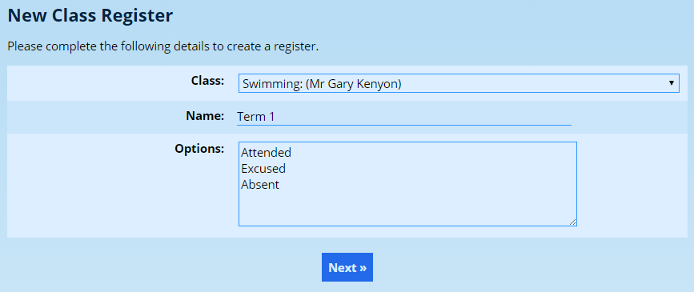
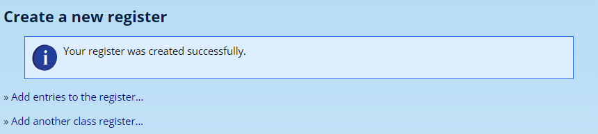
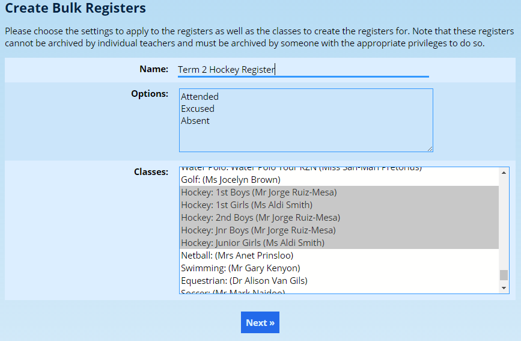
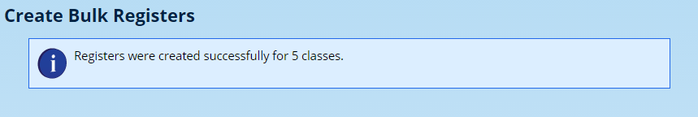
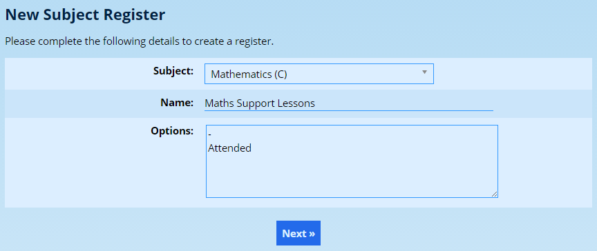
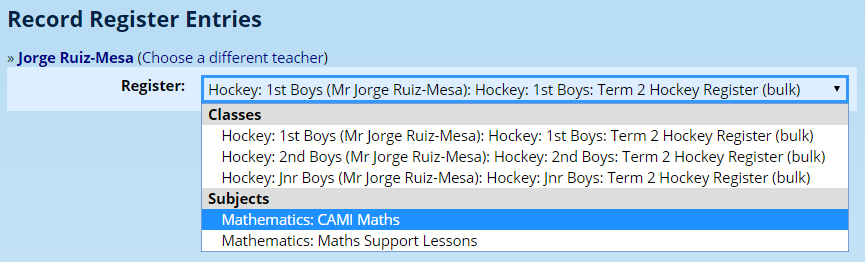
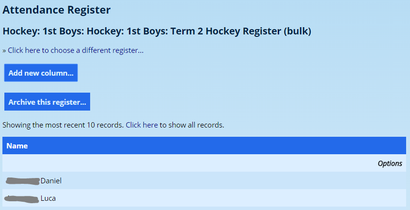
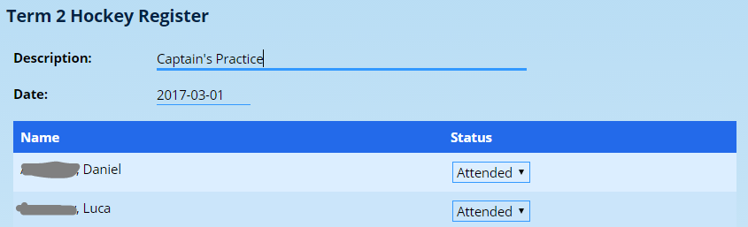
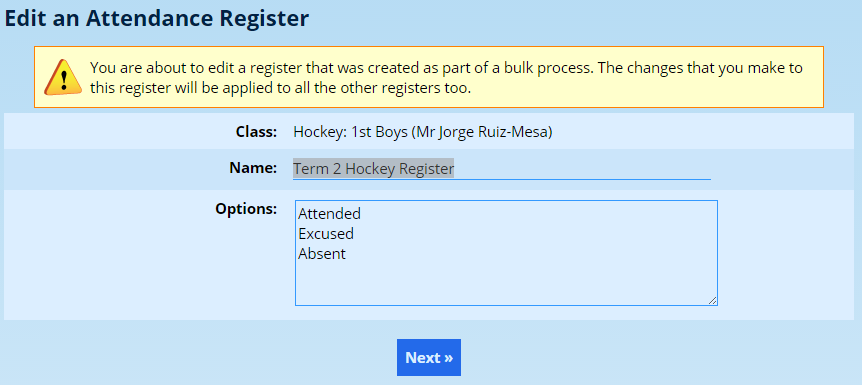
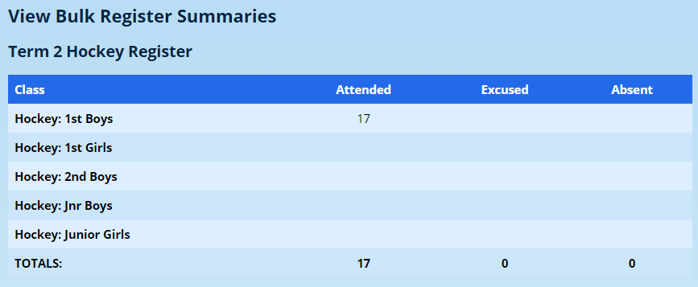

# Attendance Registers

## Deprecation Notice

!!! warning
    Kindly note that the* ***Attendance Register*** functionality has been deprecated and replaced with the* **[Roll Call function](roll-calls.md#roll-calls)**. The ability to add attendance registers will be removed at the end of 2026.

## Introduction

Attendance registers should not be confused with [Absentees](absentee-administration.md#absentee-administration). The two functions serve fundamentally different purposes. Whereas absentees is concerned with recording an official record of whether a pupil was present during the school day, attendance registers can be used to record a multitude of other things, such as whether a pupil attended play rehearsal or rugby practice.

## Creating a new attendance register

### Creating a class register

The most common type of register is one that is created to record attendance for a class. On the **Classes** tab, click on the **Add new class register** option under the **Attendance Registers** heading.

Choose the class of pupils that should be included in the register and give the register a name.

The **Options** that are present can be customised. Three default options are provided. The first option is the default option. Depending on your activity, this might be “Attended” or “Present”. However, if your activity is an optional one, such as a support lesson, you may rather choose the default option to be “No attendance” or similar.

Write each option on a new line.

!!! tip 
    The default options (shown above as “Attended, Excused, Absent”) can be changed in* *[the Site Settings](changing-site-settings.md#changing-site-settings)* *under the* ***Attendance*** *tab. If you change this, it will apply only to new registers that are created after the change is made and will have no effect on any registers that already exist.*

Once done, click on the **Next** button to create the register:

ADAM give shortcut options to either record your first register entries, or to create another register for a different class.

### Add new class registers in bulk

ADAM also provides the option of adding class registers for a range of classes.

On the **Classes** tab, click on the **Add new class registers in bulk** option under the **Attendance Registers** heading.

Instead of choosing only one class, one can now select all the classes required from the drop-down list. A register will be created for each selected class:

Click on **Next** to create the registers.

### Creating a new subject register

On occasion, it may be desirable to create a single register for an entire subject. This might be for a support lesson where any pupil who takes that subject might elect to attend a voluntary session.

On the **Classes** tab, click on the **Add new subject registers** option under the **Attendance Registers** heading.

Notice that because this register is for a voluntary activity, the options that are permissible have been changed, and the order reflects that the default value for any pupil should be a “-” to indicate that they did not attend the session.

Note that a subject register will create a single register with every pupil who does that subject. If this is a very large subject, then it will be a very long list!

## Recording Register Entries

On the **Classes** tab, click on the **Record register entries** option under the **Attendance Registers** heading.

Choose the register that you’d like to complete:

Notice how the class registers are separated from the subject registers. Also note that the registers that were created as part of a bulk operation are listed as such in the dropdown list.

Click on the **Add new column…** button to add a new entry to your register.

You have the option of naming the entry if you wish and to assign a date to the entry. ADAM will sort the columns by date if you enter them out of order - so don’t worry!

Notice also that ADAM has chosen the default option for all pupils - in this case, “attended”. The teacher should then go and change those that require it to an appropriate value.

Once completed, click on the **Save…** button at the bottom of the screen.

Once saved, an “edit” option will appear above the column. If you need to change any of the values, click on the edit link and you can make any changes you need to.

## Archiving a register

Once you have finished with your register, you can archive it. ADAM will keep the records, but no longer allow any further changes to the register.

Open the register as you would to record a new attendance column, but click on the **Archive this register…** button.

## Editing a register

If you wish to change the name or options of a register, click on the **Edit register** option under the **Attendance Registers** heading on the **Classes** tab.

Make any changes required and click on the **Next** button to save those changes.

Note that if you change a register that was created as part of a bulk operation, ADAM will automatically change all the registers that were created at the same time.

## Bulk register summaries

Registers that were created as part of a bulk operation can be summarised together using the option on the **Attendance Registers** card on the **Classes** tab.

Choosing a bulk register will reveal the statistics for the registers:

