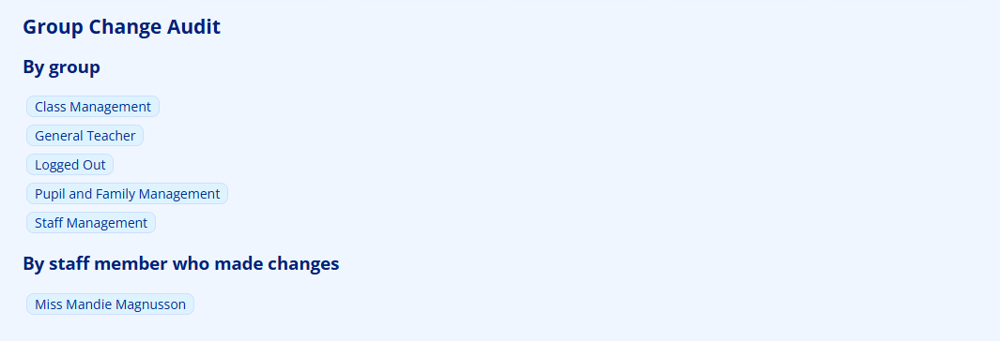
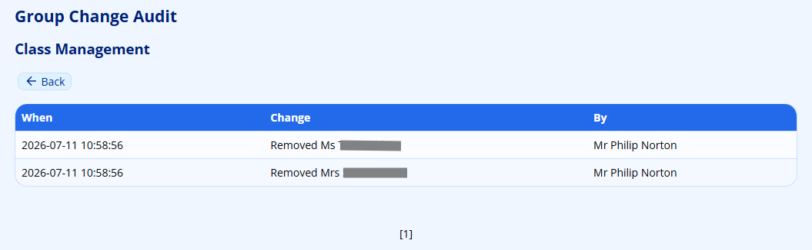
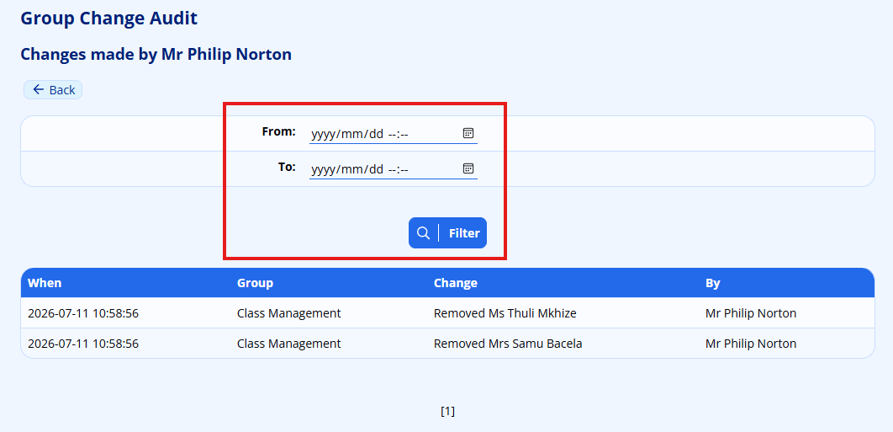
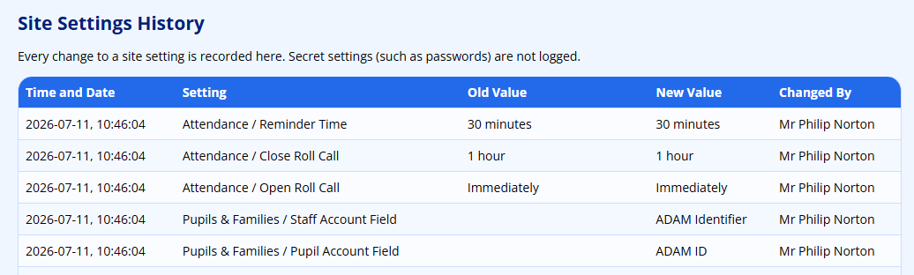

# Change History Reports

ADAM keeps an audit trail of several areas that were previously hard to review after the fact: changes to your **staff security groups**, changes to your **site settings**, and changes to **assessment marks and comments**. Each area has its own history report, described below.

These reports only show what has happened – they are read-only. They do not let you undo a change, but they do let you see exactly who did what, and when.

## Group Change Audit

Whenever a staff security group is created, renamed, disabled, locked, or has its members or permissions changed, ADAM records the change. The Group Change Audit report lets you review this history.

To open the report, navigate to **Administration → Change Log → Group changes (audit)**.

The opening page is split into two lists:

- **By group** – a list of every staff group. Click a group to see its full change history.
- **By staff member who made changes** – a list of every staff member who has made a group change. Click a name to see everything that person changed.

### Viewing a single group's history

Choosing a group from the **By group** list shows that group's changes in date order.

The table has three columns:

| Column | Meaning |
| ------ | ------- |
| **When** | The date and time of the change. |
| **Change** | A plain-language description – for example, a member being added or removed, a permission being granted or revoked, the group being renamed, disabled, or locked. |
| **By** | The staff member who made the change. Automatic changes made by ADAM itself are shown as **System**. |

!!! tip
    You can also reach a group's history directly from the group list. Navigate to **Administration → Staff Groups → Manage staff groups** and click the **history** (clock) icon next to a group. When you open the history this way, the **Back** button returns you to the group list rather than to the audit report.

### Viewing changes by a staff member

Choosing a name from the **By staff member who made changes** list shows every group change made by that person.

This view adds a **Group** column so you can see which group each change affected. Because a single person may have made a great many changes, this view also offers a date filter. Enter a **From** and **To** date and time and click **Filter** to narrow the list to a particular period.

!!! note
    The Group Change Audit is available to staff who hold the **Manage Staff Group Permissions** permission – the same permission that allows a user to change a group's permissions in the first place. If you cannot change group permissions, you will not see this report.

## Site Settings History

Every change to a site setting is recorded, and super administrators can review the full audit trail.

To open the report, navigate to **Administration → Change Log → Site settings history**.

The table lists every setting change, newest first:

| Column | Meaning |
| ------ | ------- |
| **Time and Date** | When the setting was changed. |
| **Setting** | The section and name of the setting that changed. |
| **Old Value** | The value before the change. |
| **New Value** | The value after the change. |
| **Changed By** | The staff member who made the change. |

!!! warning
    Secret settings – such as passwords – are never written to the history, so their values are not exposed here.

!!! note
    The Site Settings History page is visible to **super administrators** only.

Separately from this report, ADAM also e-mails a digest whenever a site setting changes, so that administrators are alerted even if they do not check the history page. See [Changing Site Settings](changing-site-settings.md) for more on the settings themselves, and [Change Log Notifications](change-log-notifications.md) for how to watch individual settings for change alerts.

## Assessment Mark Change History

ADAM records every change to a pupil’s assessment marks and comments, so you can see who entered or changed a mark, and when. Unlike the two reports above, these views live with the mark book rather than under the Change Log menu, and they are read-only.

There are two ways in:

- **For one pupil on one assessment** – open the pupil’s marks and click the **View mark change history for this pupil...** link. This shows a **When / Who / Change** table of every recorded change to that pupil’s marks and comments. It is available to management (any class) and to a subject head (their own subject only).
- **For one member of staff, across all subjects** – navigate to **Assessment → Assessment Analysis → Mark change history by staff**, choose the staff member, and ADAM lists every mark change that person made, with **When / Pupil / Change** columns. This is available to management only.

Both views are described in more detail, including the columns and the history-start-date caveat, under [Viewing Who Changed a Mark](mark-book-administration.md#viewing-who-changed-a-mark).

!!! note
    Like the other audit trails, the mark history is only recorded from the date the feature was switched on for your school. An empty list means there is no recorded change since then, not that a mark was never changed.

Seeing the mark history is **view-only** and does not grant the ability to change marks – it is deliberately separate from the mark-editing permissions, so that staff such as registrars can review changes without being able to make them.
