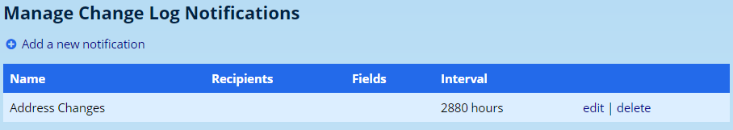
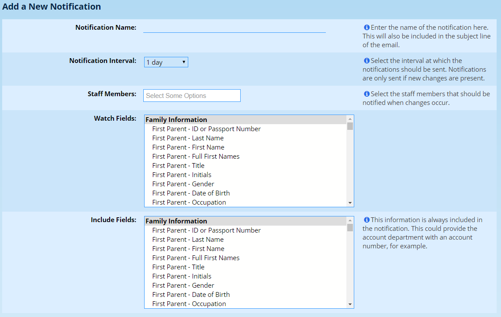
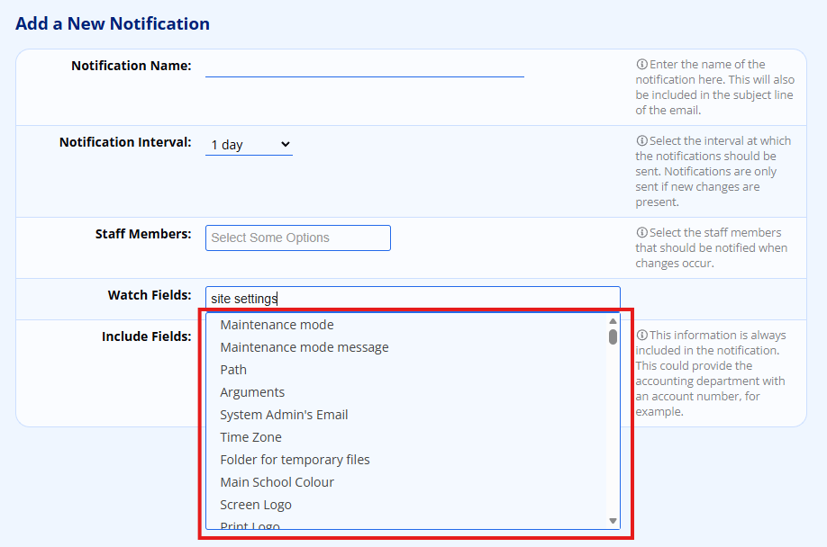

# Change Log Notifications

Change log notifications allow a staff member to be notified when specific fields in a parent, pupil or staff profile changes.

## Creating a Change Log Notification

Navigate to **Administration → Change Log → Manage Change Log notifications**. At first, your notification list might be empty.

Click on the option to **Add a new notification**.

Enter the **name** of the notification at the top. This is used to generate the email subject, so it helps if it is named sensibly.

Secondly, choose the **notification interval**. ADAM can monitor for changes at intervals from 5 minutes to 1 week. Notifications will be sent only if changes have been made in that time span.

!!! warning
    If you are testing the notifications, set the interval to 5 minutes. Once happy that the correct fields are included, you can set the interval up to one of your choosing. ADAM will only send notifications for any changes made while the alert is active. If you set an alert for every week, it will be at least a week before you get your first notification.

Choose which **staff members** should be notified in this alert.

Next, choose the fields that ADAM should **monitor for changes**.

!!! warning
    Please don’t mix field types here. Either choose all family, all pupil or all staff. Set up multiple notifications if you need to.

Finally, if you require **additional information** to be included - perhaps an account number, choose this field from the selection at the bottom. Once again, please don’t mix the fields in this alert.

Finally, click on the button at the bottom to save the notification.

## Watching Site Settings

As well as profile fields, you can watch your **site settings** for changes. In the field selection you will find a **Site Settings** group listing every setting that can be monitored.

Choose the settings you want to watch in the same way as any other field, and a notification will be sent whenever one of them changes.

!!! note
    Secret settings – such as passwords – are deliberately left out of this list, so their values are never included in an alert.

!!! warning
    Treat Site Settings as a field type of their own. Just as you shouldn’t mix family, pupil and staff fields, set up a separate notification for the site settings you want to watch rather than combining them with profile fields.

If you would rather review setting changes after the fact than be alerted to them, super administrators can see the complete audit trail on the **Site settings history** page. See [Change History Reports](change-history-reports.md) for details.
