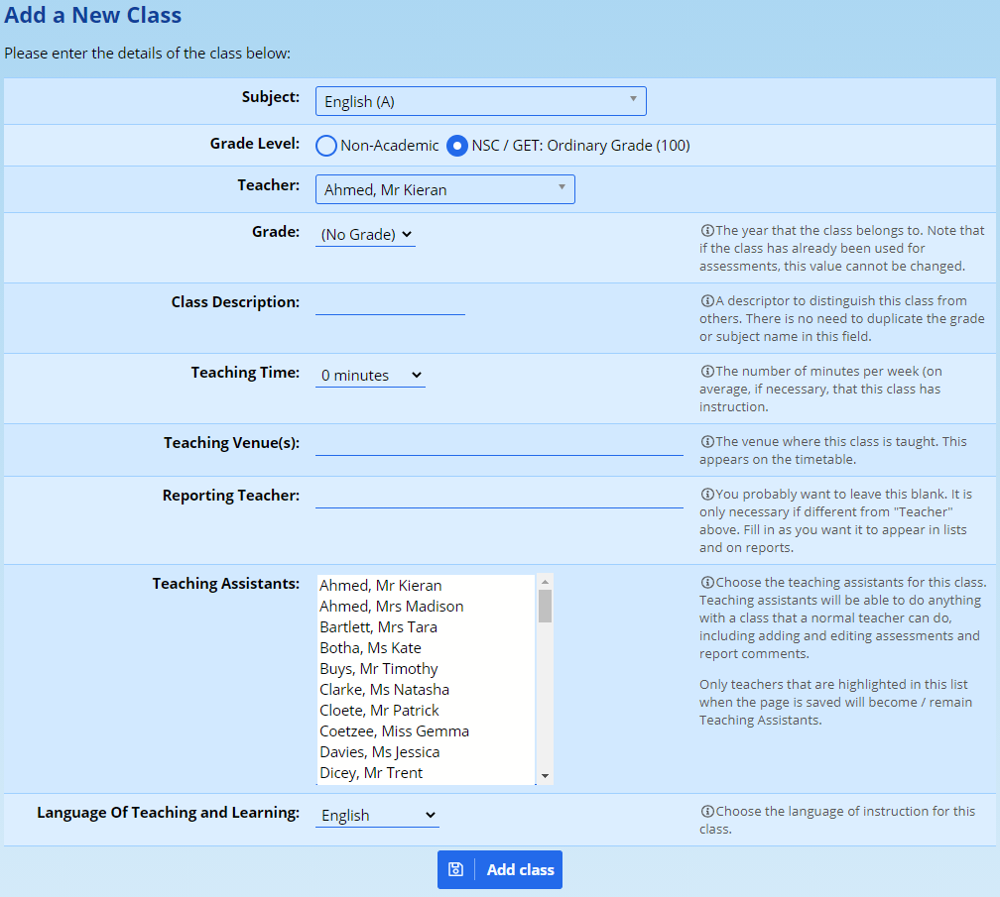
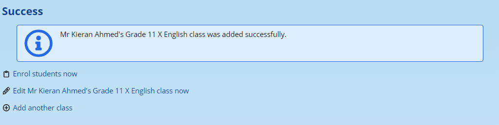

# Class Management {#h-mvzndakmkiiy}

You will need to make sure that you have created subjects in ADAM first. To read up about subjects, please [click here](subjects.md#h-3nqndbk).

A class can be considered a container. Its primary purpose is to link a teacher to pupils and link pupils to an activity, whether academic or otherwise.

## Creating a new class {#h-4i7ojhp}

To create a new class, click on the “**Add a new class**” option on the “**Classes**” tab, found under the “**Class Administration**” heading.

<iframe src="https://www.youtube.com/embed/pfIaJu2TFzA" frameborder="0" allow="accelerometer; autoplay; encrypted-media; gyroscope; picture-in-picture" allowfullscreen></iframe>

The following screen is shown:

The different headings are explained below:

-   **Subject**

-   Choose the subject or activity that this class or group belongs to.

-   **Grade Level**

-   If this is an academic subject, please make sure that you choose “NSC/GET: Ordinary Grade (100)”. If it is some other form of class, you can leave this as “Non-academic”.

-   **Teacher**

-   This is the primary teacher that is responsible for the class. One teacher must be chosen, although other teachers can be added later on in the “Teaching Assistants” section below.

-   **Grade**

-   Some classes, certainly all academic classes, will have a grade associated with them, however, not all groups and activities do. An example of one that does not is a Sports House which has membership from all grades. If you choose a grade here, you will not be able to add pupils from a different grade.

-   **Class Description**

-   This is a short code that allows you to distinguish different classes within the subject. Often this is the teacher’s initials, for example “A” would result in this class being displayed as “Form 2 A”. For non-academic subjects, a qualifier such as “Seniors” might result in a group being displayed as “Rugby: Seniors”.

-   **Teaching Time**

-   This is submitted to LURITS if it is entered. It is not compulsory and LURITS don’t seem to mind too much if it is omitted.

-   **Teaching Venue**

-   This is used by the [timetable module](timetable-module.md#h-hpdeljllmcbc) for informational purposes only. It is an optional field to fill in.

-   **Reporting Teacher**

-   Because a class has been assigned a principal teacher already, this block can be left, most of the time, empty. However, when you wish to have multiple teachers, for example, displayed, you might enter those names here. Note that ADAM will only look at the principal teacher and this block when deciding what name to show next to a class. It does *not* consider the Teaching Assistants.

-   **Teaching Assistants**

-   Teaching Assistants, in spite of the actual meaning of the phrase, allow other teachers to be linked to the class. These teachers are able to, for academics, add marks in the mark book, enter and edit report comments and produce class lists for these classes easily.

-   **Language of Teaching and Learning**

-   This field is only important if your school is a parallel medium school with different classes being taught in different languages. Select the language that this class is taught in so that ADAM uses the appropriate [subject translation](subjects.md#h-ecvd10cxvq8z) when displaying the details of this class.

Once you are happy with the options, click on the “**Add class**” button at the bottom of the page.

ADAM then shows you this confirmation screen:

This allows you to [enrol pupils in this class or group](class-registration.md#h-1ci93xb), to edit and change the settings of the class (see “[Edit an existing class](#h-2xcytpi)” below, bearing in mind that you will skip the first few steps of selecting a class) or to take you back to add a new class, as you’ve just done.

## Editing an existing class {#h-2xcytpi}

To edit an existing class, click on the “**Edit a class’s details**” option on the “**Classes**” tab under the “**Class Administration**” heading.

Select the class to edit by first selecting its subject category, then the subject and finally, the class you wish to edit.

When changing the details of the class, please take note of [the details given above about the different fields](#h-4i7ojhp).

### Re-registration of Pupils when editing a class {#h-stwgi3cbmfjn}

One important consideration is whether the changes to a class need to be backdated or whether the changes are made in order to reflect current changes moving forward.

If you wish to have changes backdated, then it is important that the option to “**Re-register Pupils**” is set to “No”.

If you wish to have the changes reflected only for future reports, then it is important that the option to “**Re-register Pupils**” is set to “Yes”.

## Deleting a class {#h-wgy67l4h3cjq}

Please follow the same instructions for “Editing an existing class”. On the editing screen, at the bottom, there will be a button to “DELETE CLASS”. Clicking on this will confirm that you are sure you want to continue. Clicking on “Yes, delete this class” will result in the class being deleted and all pupils will be un-enrolled from it.
