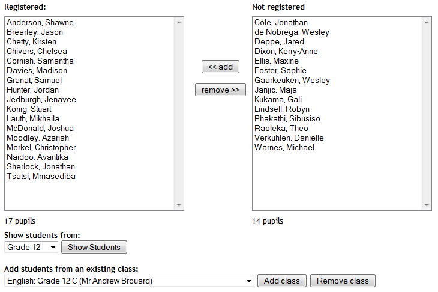
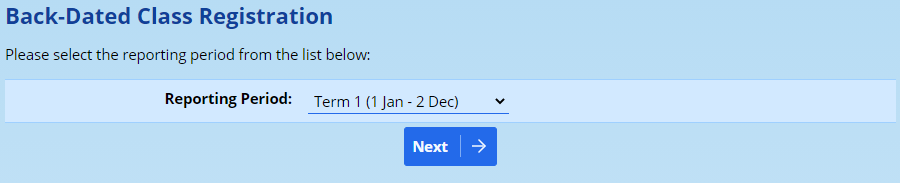
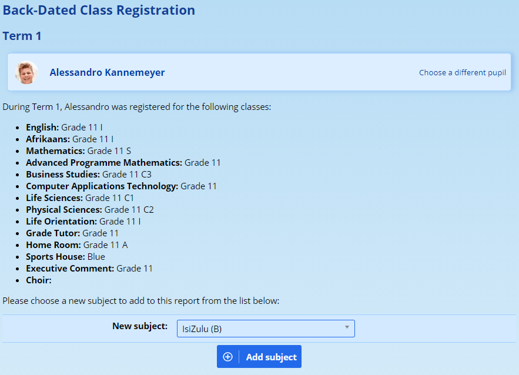
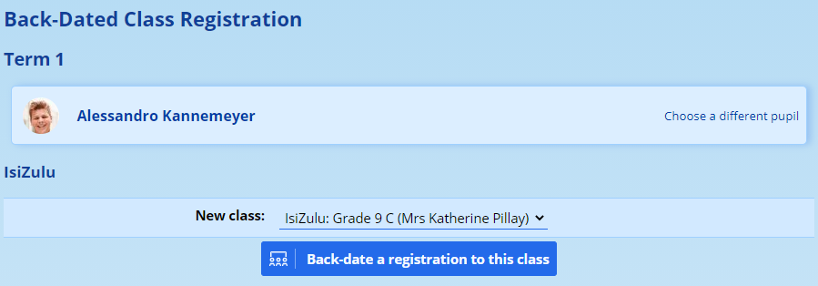
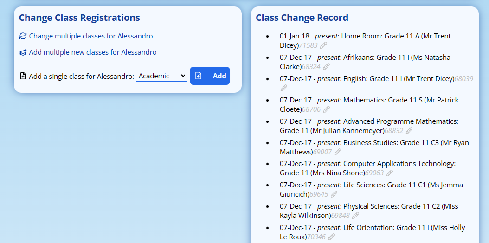
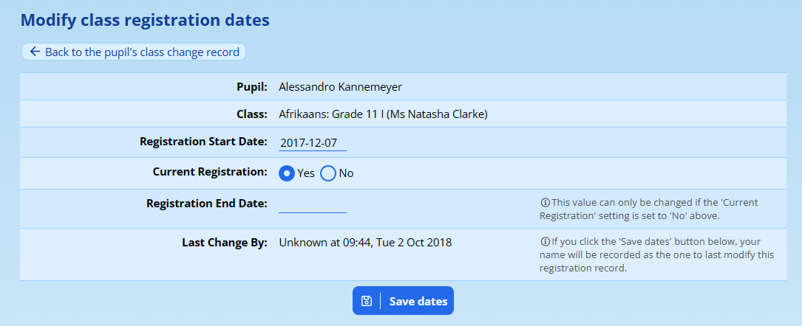
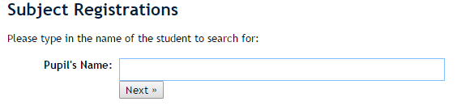
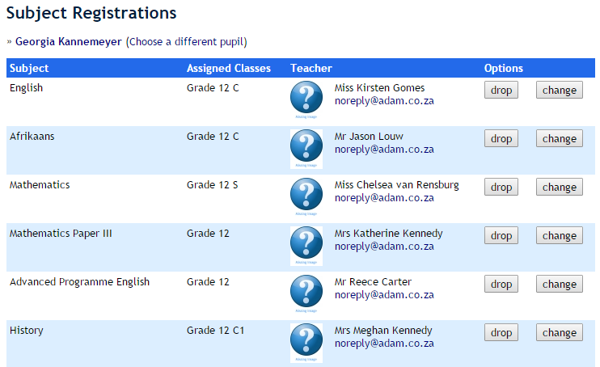
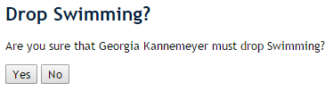
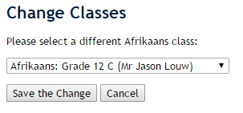

# Class Registration {#h-1ci93xb}

While the word “Class” implies an academic group of pupils, please be aware that ADAM uses a very broad definition and this covers any group of pupils that has a teacher in charge. This includes, for example, sports teams, clubs and societies as well as academic classes.

ADAM allows you to approach the registration process from one of two ways. The first, and most commonly used when the classes are all empty, is to choose a class first and then choose which pupils belong in the class.

The second is used more commonly when a pupil arrives at the school late and needs to be added to already existing classes.

*The most common support issue that we find revolves around the fact that a pupil can only be enrolled in a single class per subject. Thus a pupil cannot be in two “English” classes at the same time. The pupil must first be removed from the first class and then added to the second class.*

## Registering Pupils into a Class {#h-3whwml4}

On the **Classes** tab, under the **Registration Administration** heading, click on **Subject registrations for a class**.

*If the class does not exist, you will need to create the class first (see “**[Creating a new class](class-management.md#h-4i7ojhp)**”).*

<iframe src="https://www.youtube.com/embed/CN8B3F93-_M" frameborder="0" allow="accelerometer; autoplay; encrypted-media; gyroscope; picture-in-picture" allowfullscreen></iframe>

Once you have chosen a class, you will be presented with two lists – the left showing pupils currently in the class, and the right showing pupils who are not registered for any classes in the subject.

### To add individual pupils to the class {#h-fvlk3zka3blu}

Highlight the names on the right (you can hold down “Ctrl” and click on names in order to select more than one at a time) and then click on “**<< add**” to have those names added to the class list. Similarly, pupils can be removed from the class by selecting names on the left and clicking on “**remove >>**”.

### Show students from a different grade {#h-m8uudm1tfrnj}

By default, ADAM will show one grade at a time – typically the grade that is associated with the class. It is possible, using the “Show students from:” option to change which grade is displayed. This can be very useful for compiling sports teams and other non-academic groups that you may need.

### Add pupils from another class into this one {#h-viy9xgyrwu8r}

Many schools will use the concept of a “form class” – that is, a group of pupils which attend many classes together as a single cohort. To mimic this in ADAM, one can enrol pupils into the first subject, for example English, and then for subsequent subjects, one can use the dropdown list at the bottom of the page to copy the registrations from English into the new subject. This is a single click operation that will move all pupils across into the new class.

*Note again, that if a pupil is registered for the same subject in another class, they will not be enrolled when one chooses a form class to copy its registrations.*

### Registering a Pupil into a class for past reporting periods {#h-mfedu9mxio08}

Occasionally it happens that after a reporting period is closed and published, one realises that they are missing a subject or a mark for a subject. This often happens when pupils transfer into schools or change subjects late in the term and the teachers do not realise until too late that they require a report comment or mark captured.

ADAM uses dates to determine which pupils are members of a class at any specific time. ADAM records the dates that a pupil joins and leaves each class and if, on the ending date for the reporting period, that pupil is a member of the class, then ADAM will allow a report comment and mark to be captured for that subject.

Navigate to **Classes → Registration Administration → Enter back-dated registration**.

Choose the reporting period that you would like to register the pupil for:

Now select the name of the pupil to register:

ADAM will then show a list of classes that the pupil was registered for when the selected reporting period ended. Choose a new subject from the list at the bottom and click on **Add Subject**.

Finally, choose the class that the pupil should be added to and click on the button:

The pupil is now registered in that class for that reporting period.

### Changing the Registration Dates for a Pupil {#h-3mdtgu7s6ipl}

It may be necessary to change the start and end dates for a pupil’s registration into a class - this can be useful if the back-dated registrations (above) doesn’t solve the problem. This can also be used to remove pupils from a class retroactively.

Call up the pupil’s profile and visit their **classes** section. Scroll down to view the **Class Change Record**.

Next to each entry is a light-grey pencil icon. You can click on the icon to edit the record.

Modify the start date to reflect the required date.

If you wish to specify a **Registration End Date**, ensure that the **Current Registration** setting is set to “No”, otherwise ADAM will discard any date that you enter.

Once done, click on **Save dates**.

*Please note that this method is only intended to be used within a single academic year and that changing a pupil’s registration from one year to another may have deleterious effects! This is particularly true when the classes are associated with a specific grade.*

## Registering Classes for a Pupil {#h-2bn6wsx}

If you wish to register classes for an **individual pupil**, which you might wish to do if there is a new pupil who is joining existing classes with existing enrolments.

On the “**Classes**” tab, click on “**Subject registrations for a pupil**” under the “**Registration Administration**” heading.

Search for the pupil you wish to enrol and click on the **Next >** button.

At list of current classes is shown for the pupil:

Next to each subject is an option to **drop** the subject altogether or to **change** classes within the same subject. The distinction is important here. Dropping will remove any marks from open Reporting Periods whereas changing will transfer marks from one class to another.

At the bottom of the page are options to change multiple classes or enroll the pupil in multiple classes. This will show all the academic subjects available and classes in that grade.

One can also add a single new class if required.

Clicking on **drop** will produce this confirmation page in ADAM:

Confirm by clicking on **Yes**.

If you change a class, ADAM will show other available classes in the same grade as the pupil to choose from:

Once the correct class has been chosen, click on **Save the Change** to confirm.
