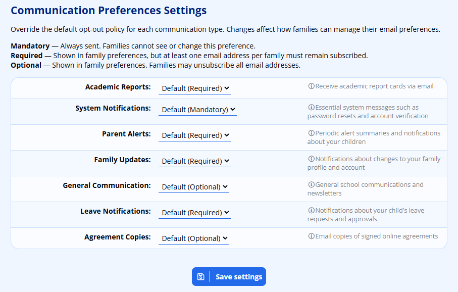

# Communication Policies

ADAM allows parents to be quite specific about what each of their email addresses receives from ADAM. However, to allow schools some control, ADAM allows for a policy override so that schools can be sure that parents will receive necessary emails form the school.

Navigating to **Administration → Messaging Administration → Communication preference settings**, ADAM will list the different communication modules and their policies:

To begin with, all modules are listed as “Default”. However, the defaults will align to one of three options:

-   **Mandatory:** The parent may not opt out of these messages. All email addresses must receive this communication. This is only useful for very urgent and important emails and, by default only includes System Notifications. This is typically communication such as Password resets that is initiated by an action taken by the parent.
-   **Required:** This option means that parents are required to receive the communication, however, they can opt out one or more email addresses. ADAM will enforce that at least one email address (across the parents!) is set to receive that information. Note that this may have unintended consequences in the case of divorced parents where one parent is absent. They will typically exist as two single parent families, each of which will be “required” to receive that communication.
-   **Optional:** Any address can opt to receive the email or not.

This policy override page allows you to change the default policy that ADAM applies to each of these communication types. Note that making an item **mandatory** often sounds like a sensible thing to do, but would then go against the provisions in the Electronic Communications and Transactions Act (2005).
