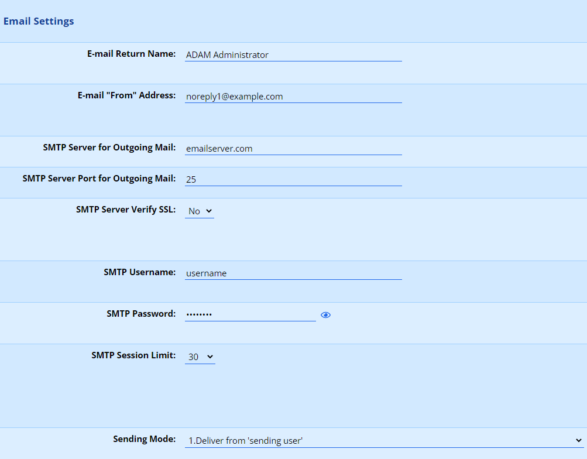
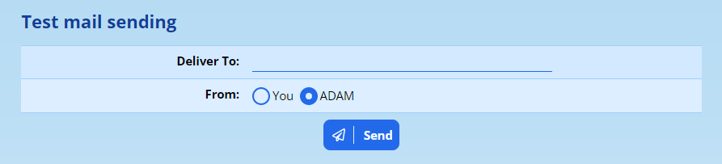
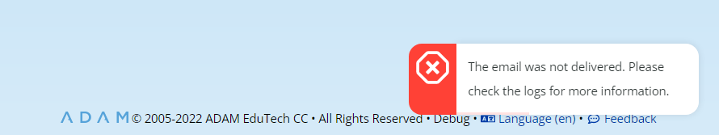
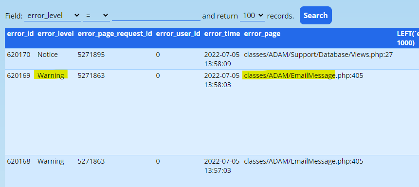
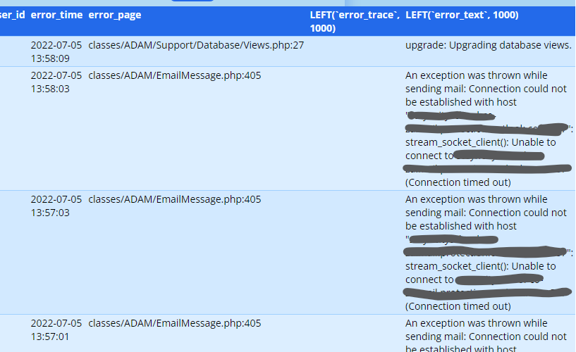
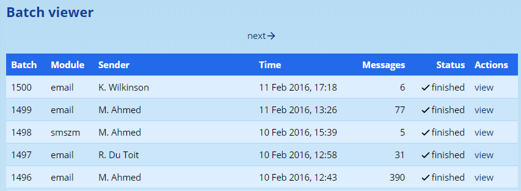
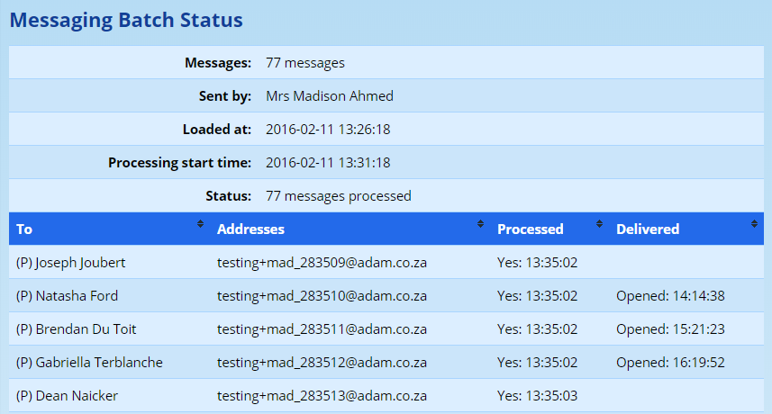

# Communication Settings in ADAM {#h-i4b0jd1w7v0v}

## Introduction {#h-1zgntnvtitn6}

In order to send emails from ADAM’s [Messaging Centre](messaging-centre.md#h-o6jbiu0gh9e), and to receive automated notifications from ADAM, it will be necessary to link ADAM up to an SMTP service provider through which it can send emails.

Navigate to **Administration → Site Administration → Edit Site Settings**. On the **Communications** tab, scroll down to the **Email Settings** section.

The **Email Return Name** and **Email “From” Address** fields are used only when ADAM sends an automated notification email - in other words, an email that wasn’t sent by a person.

*Where a user sends a message from the Messaging Centre, ADAM will use their name as the “Return Name” and their email address and the “From Address”. This ensures that any replies to that person’s email are directed to them and not to another person who may not understand the reason for the reply.*

The **SMTP Server for Outgoing Mail** and the **SMTP Server Port for Outgoing Mail** need to be specified and your network support personnel are best positioned to tell you what details go here. This includes whether the connection is **SSL** protected, and the **SMTP Username**  and **SMTP Password**.

The **SMTP Session Limit** tells ADAM how many emails its allowed to send once it has logged on to the server. Some servers have low limits, and others have higher limits. Again, your network support personnel are the best people to ask. If in doubt, leave this at **50**. It can always be changed later.

The **Sending Mode** is important. The ideal scenario is to **Deliver from “sending user”**. However, this requires that the **SMTP Username** is permitted to send email on behalf of other users. This isn’t always allowed by email service providers.

A good option as a second choice, but one which is not permitted by many email servers is option 2: deliver from “sending user” with the return path as the “from” address.

Depending on how your email server is configured, if it doesn’t allow the SMTP Username to deliver on behalf of other users, you may have to rely on a “reply-to” address for the sending user. The safest option is likely “5”, but this looks least professional on the receiving end.

If you’re in doubt, experiment with these in order from 1 to 5 to see which works for your network.

## Testing Mail Sending {#h-h14d71ypqf7z}

To test these sending settings, you can navigate to **Administration → Messaging Administration → Send test emails**.

Enter your own email address in the **Deliver To** field and click on the **Send** button. Note that changing the “From” option allows you to test the difference between an automated email (from ADAM) vs a message sent by a person from the Messaging Centre (“from You”).

When you click on the Send button, ADAM will immediately send you an email. Check your email inbox.

If you get an error message reported, you may need to check the error logs to see what problem ADAM encountered.

### Checking the Error Logs {#h-r809bp2r4ldn}

Navigate to **Administration → Debugging and Error Logging → View error log**.

In the log, within the first few rows, you may see one or more “Warnings” that are associated with the page “classes/ADAM/EmailMessage”:

On the right-hand side (you may need to scroll across, horizontally to see it), you should see an error message (in the diagram below, we’ve covered up some confidential information!):

Be sure to pass this error message on to your network support personnel for them to assist in resolving the issue.

### Understanding What Else Could Go Wrong {#h-rokvzpps2z6m}

If you sent the message and received a success notification, it means that ADAM successfully handed the email over to the SMTP server. In this instance, you won’t see any error messages in the error log. However, lots can still go wrong. The problem is that none of this is in ADAM’s hands any more. Like a letter in the mail, we can ensure the address is correct and that we have the correct stamps in place, but from the moment you put it in a postbox, you no longer have any control over its delivery.

If you don’t receive the email from ADAM, you can check your junk mail or spam folder to see if it’s there. If not, you’ll have to get further help from your network support personnel who can investigate further.

Have a look at our section on the [Messaging Centre and Spam mail](messaging-centre.md#h-gv5eyps3xomu).

## Sending email from ADAM if you use Google Workspace {#h-hfkgae9k44s6}

If you are a “Google School” that makes use of Google’s email offering, then the preferred method of mail delivery, to reduce the possibility that emails sent from your ADAM server will be interpreted by the recipients as spam mail.

### Configure Google Workspace {#h-8wr08et4phui}

Follow [the official instructions](https://www.google.com/url?q=https://support.google.com/a/answer/2956491?hl%3Den&sa=D&source=editors&ust=1778246675879794&usg=AOvVaw1jhMftTtbiDngxGPJPZ2v6) to configure the SMTP relay service in Google Workspace’s Admin Console.

However, please take note of the following points:

-   Allow **Only addresses in my domains**. This means that any of your users who can send mail in ADAM will have their mail processed through Google.

### Configure ADAM {#h-l0f7d7ojroj}

Instructions are provided here to configure popular mail servers to communicate through Google’s SMTP relay services, but configuring ADAM is reasonably straightforward.

Navigate to the ADAM Site Settings: **Administrator → Site Administration → Edit site settings**.

On the **Communications** tab, scroll down to **Email Settings**. Update the following settings as indicated:

-   **SMTP Server for Outgoing Mail:** smtp-relay.gmail.com
-   **SMTP Server Port for Outgoing Mail:** 587
-   **SMTP Server Requires SSL:** Yes
-   **SMTP Username:** The email address of the user account you wish to authenticate with, if you chose to authenticate with a user when setting up the relay. *If you are using IP address authentication, you can ignore this. Note that while it is possible to use IP authentication when you host on our cloud service, the IP address may change without notice.*
-   **SMTP Password:** The password as set for that user. *Leave blank if using IP authentication.*
-   **SMTP Session Limit:** 50

*If you see that any of these settings are “Set in the configuration file” and your ADAM server is hosted on our cloud platform, please contact* *[ADAM Support](mailto:help@adam.co.za)* *so that we can assist you in changing these settings! If you host your own ADAM server, please see elsewhere in this documentation for assistance* *[editing the configuration file](server-setup-and-configuration.md#h-x27qf2tjfh9)**.*

Once finished, save the settings. Navigate to **Administration → Messaging Administration → Send test emails**. From here, send yourself an email and check that:

1.  ADAM reports a success; and
2.  the email arrives in your inbox.

If you can tick off both of those, then your mail is set up correctly.

## Sending email from ADAM if you use Microsoft’s O365 {#h-s6gtnhj0yv4s}

*Firstly, a disclaimer: we have noticed that mail delivery via O365 is not perfect and Microsoft itself can block your server from delivering messages to it if it considers those messages to be spam-like. ADAM has no control over the email that you send (i.e. its content, frequency and user-friendliness) and has no control over how Microsoft chooses to interpret that email. Your experience may vary!*

### Configuring O365 {#h-81whw3364cwf}

Follow the [instructions on Office 365’s official help site](https://www.google.com/url?q=https://learn.microsoft.com/en-us/Exchange/mail-flow-best-practices/how-to-set-up-a-multifunction-device-or-application-to-send-email-using-microsoft-365-or-office-365%23smtp-relay-configure-a-connector-to-relay-email-from-your-device-or-application-through-microsoft-365-or-office-365&sa=D&source=editors&ust=1778246675883289&usg=AOvVaw19iry8kxl3h8GnP_9Eep2S) for details on how to “Configure a connector to relay SMTP email”.

You will need to know the IP address of your ADAM server. If you make use of a hosted ADAM server, please inform us so that we can give you the IP address of the server.

### Configuring ADAM {#h-q64m03i9ihfc}

Navigate to the ADAM Site Settings: **Administrator → Site Administration → Edit site settings**.

On the **Communications** tab, scroll down to **Email Settings**. Update the following settings as indicated:

-   **SMTP Server for Outgoing Mail:** The “POINTS TO” address
-   **SMTP Server Port for Outgoing Mail:** 25
-   **SMTP Server Requires SSL:** Yes
-   **SMTP Username:** leave blank
-   **SMTP Password:** leave blank
-   **SMTP Session Limit:** 50

## Alternative Configuration for Microsoft’s O365 {#h-6l98ffjicclj}

*Kindly note that these are theoretical settings that have not been tested. They may be more reliable than the method discussed above, but have much more stringent controls with regards to the volume of messages that can be sent.* ***Try this at your own risk and make sure to*** ***[monitor the messaging centre batches](#h-tybzjeoasyig)*** ***for failure notifications.***

This method makes use of a single address to send email from ADAM. We recommend creating a single user in your O365 control panel for this purpose. The user should be sufficiently generic (e.g. “Example School’s ADAM”. The user should have a strong password associated with it.

### Configuring Office 365 - Alternative Method {#h-jm47q7thqium}

Follow the [instructions on Office 365’s official help site](https://www.google.com/url?q=https://docs.microsoft.com/en-us/exchange/mail-flow-best-practices/how-to-set-up-a-multifunction-device-or-application-to-send-email-using-office-3&sa=D&source=editors&ust=1778246675885464&usg=AOvVaw2-LxuVdmMS3Gnz8eBdmATH) for **Option 1**.

### Configuring ADAM - O365 Alternative Method {#h-tj5ef9o7pyzk}

Navigate to the ADAM Site Settings: **Administrator → Site Administration → Edit site settings**.

On the **Communications** tab, scroll down to **Email Settings**. Update the following settings as indicated:

-   **Email From Name:** give the name of the user chosen above. A good example of this would be “*Example School’s* ADAM”
-   **Email From Address:** give the address of the user chosen above.
-   **SMTP Server for Outgoing Mail:** smtp.office365.com
-   **SMTP Server Port for Outgoing Mail:** 587
-   **SMTP Server Requires SSL:** Yes
-   **SMTP Username:** give the address of the user chosen above.
-   **SMTP Password:** give the password of the user chosen above.
-   **SMTP Session Limit:** 50
-   **Sending Mode:** 5. Deliver from ‘SMTP username’ with ‘reply-to’ as sending user.

## Troubleshooting Email Delivery Issues in ADAM {#h-tybzjeoasyig}

Have a look at our section on the [Messaging Centre and Spam mail](messaging-centre.md#h-gv5eyps3xomu).

ADAM does not deliver mail directly to the recipients. It requires an intermediate server to take over the delivery of the mail. This is done for a number of reasons:

1.  ADAM delivers emails one at a time, in the order that the emails were loaded.
2.  ADAM is designed to “fail easily” when sending messages.
3.  There are many complexities with sending email that are better left to specialist software.

ADAM processes email in a queu**Enabling The Portal, The Final Settings**

e, and sends messages one at a time. This means that delivery is slow. By using an intermediate server, the messages can be handed off to that server quickly since it has only one computer to talk to (which is normally on the same LAN or even same computer as ADAM). This software can then deliver email more efficiently to recipients by delivering mail in parallel and retrying the delivery of messages that couldn’t be sent on their first attempt.

### Step 1: Did ADAM send the message? {#h-l0isot5piadr}

The first thing for a site administrator to do is to check the messaging batch records. These can be found **Administration → Messaging Administration → View Messaging Centre Batches**.

Click on the **view** link to view the details of a batch.

Here, ADAM records whether an email was sent and, depending on the email program that the recipient is using, when the message was opened.

ADAM will list the time that the email message was processed if it was successful, or list the fact that there was an error at that time. If ADAM shows an Error, then the message was not sent.

If ADAM did not send the messages (there is an “Error” listed under “Processed”), then you will need to investigate:

1.  Which server is ADAM talking to (set in the **Site Settings** under the **Communications** tab, look for **SMTP Server**)?
2.  Is ADAM using the right authentication credentials to talk to the SMTP server?
3.  Is the SMTP server on and configured to listen to ADAM?

Advanced network administrators will want to check the logs of their SMTP server to see if there are clues there are to why the emails from ADAM are not being accepted for delivery.

Further information as to *why* ADAM didn’t succeed in delivery are shown in the ADAM Error Logs.

### Step 2: Check your mail server for issues {#h-i68xgest2fi3}

From this point on, you will want to engage the services of an email server expert to determine why your email isn’t being delivered. Unfortunately, after the email is passed to the upstream SMTP server, the delivery of those emails are out of our control. To use an apt analogy: once you drop the letter into a postbox for delivery by the post office, you no longer have control over its delivery.

### Step 3: One mail or an entire batch? {#h-whgr5d9z17sh}

If you recieve a bounce notification for a single email - or perhaps each time a batch is sent, a familiar set of bounce notifications return, then you will need to check that those email addresses are captured correctly. It may be that an email address no longer exists, that the mailbox is full or a host of other reasons. These are all out of our (and your!) control.

Very often, a telephone call to the recipient is best to determine whether there is an alternative email address that you can use instead.
