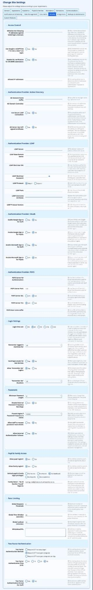
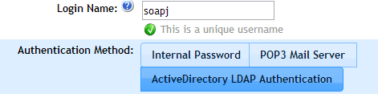
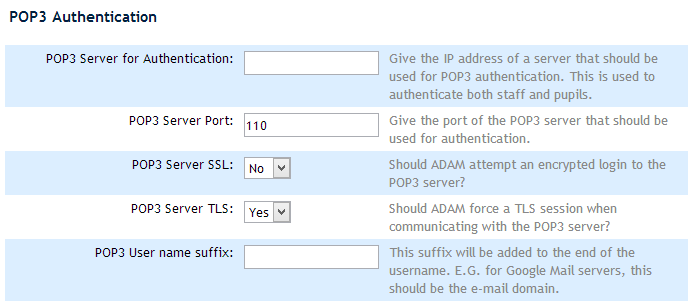
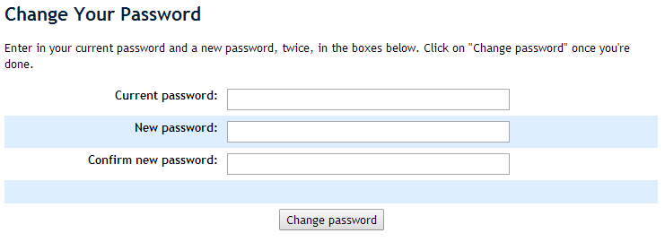
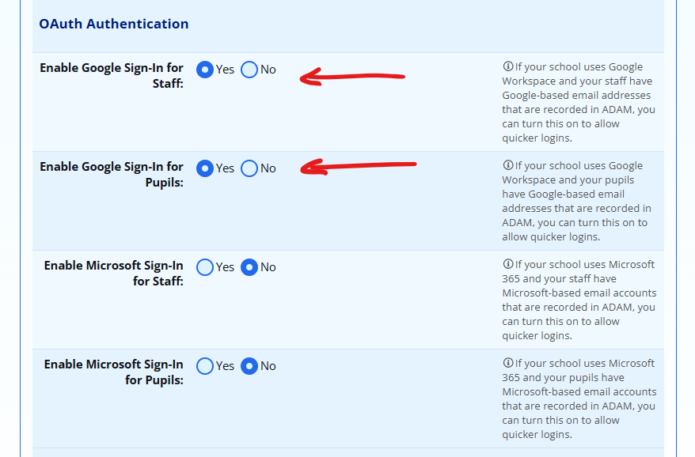
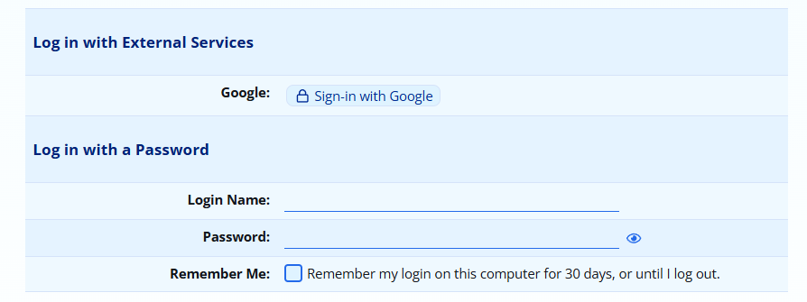
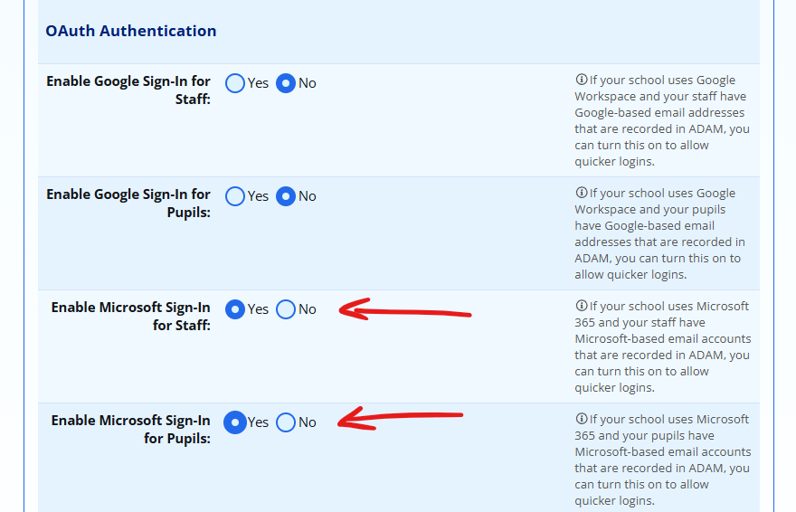
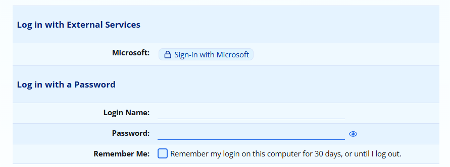
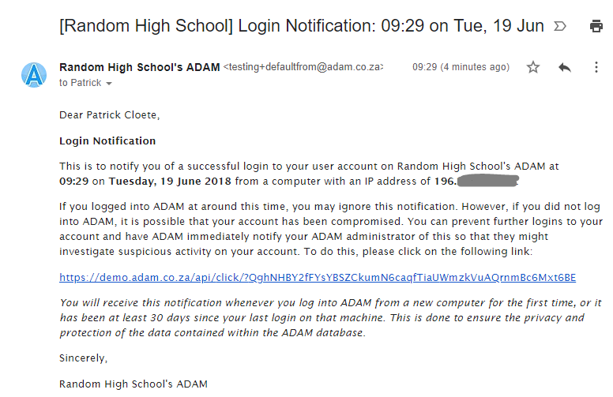

# Configuring Logins {#h-qsh70q}

All login configurations take place in the Site Settings. These can be accessed from the “Administration” tab, under the “Site Administration” heading, by clicking on the “Edit site settings” option. Once in the site settings, click on the “Security” section.

## Login Security {#h-3as4poj}

The login security settings, found on the **Administration** tab, under **Site Settings**, are shown in the screenshot below.

The general settings are shown at the top. These control what happens to users who repeatedly get their passwords wrong. The “Failed login limit” is the number of times a user can get their password wrong before the lock-out time is imposed on their computer’s IP address.

During the “Lockout time”, they are unable to attempt any further logins.

The “Login time out” is the number of minutes that ADAM will keep a user logged in without them performing any functions on ADAM in that time. Note that as soon as they close their web browser, they will also be logged out.

Other settings, discussed later, are shown also.

## Staff Logins {#h-1pxezwc}

The staff login option is always available from the main login screen. Staff will enter their usernames and passwords here. ADAM will then consider how that staff member is to be authenticated and pass the login credentials to the authentication mechanism.

ADAM can either authenticate staff using its local database and a locally stored password, by sending the login details to an Active Directory LDAP server or to a POP3 mail server.

An internal password asks ADAM to manage a password for the teacher concerned. The other two options, “POP3 Mail Server” and “Active Directory LDAP Authentication” rely on other servers being available. If a staff member has one of these methods selected, then ADAM will simply use the specified server to perform a login using the details that the user provides. If the server accepts the login, then ADAM, in turn, allows the login.

This helps users by reducing the number of passwords that they need to remember. In the case of Active Directory, login policies that block users from after a number of incorrect attempts are also enforced. This increases the security of your data.

The authentication method for each staff member is set in his or her staff information page and the school can have any combination of the different authentication methods.

### Setting an authentication method {#h-49x2ik5}

Each staff member can use one of the three authentication methods. They are set individually.

*To change a staff member’s authentication method, you will need to edit the staff member’s information (Staff > Staff Administration > Edit a teacher’s personal information). At the bottom of the page is an option to choose the authentication method:*

### Configuring Active Directory LDAP Authentication {#h-2p2csry}

In order for ADAM to process Active Directory LDAP authentication, it must be pointed to an Active Directory server. This set up is done in the class\_config.php file which will be located in the ADAM install folder. The specific options to look for are:

-   ad accsuf: This is set to the domain suffix. This is normally a string starting with “@” followed by the domain name. E.g. @myschool.local
-   ad basedn: This is the base domain name. It consists of the same information as above, but given in the following format: DC=myschool,DC=local
-   ad domcon: This is an array of IP addresses of domain servers which should be consulted.

*In all cases, the files must obey strict PHP syntax and thus should be edited with care.*

In order to associate an account on ADAM with a user account in Active Directory, the user must have the same username set in ADAM as they would use in Active Directory. The following procedure is followed on login:

1.  ADAM checks that the username entered matches a staff member in the database.
2.  Then ADAM will check that the staff member in question is “current” – that is, their start date is in the past, and their end date is in the future.
3.  Then ADAM takes the username and password that were provided and attempts a login on the Active Directory LDAP server. If the Active Directory LDAP server grants access, the username and password that were supplied must be correct and ADAM will grant the login.

Access is only granted if all three steps can be followed.

### Configuring POP3 Authentication {#h-147n2zr}

In order for ADAM to process POP3 authentication, it must be given a POP3 server to use. This is done in the “**Site Settings**” page (**Administration** / **Site** **Administration** / **Edit Site Settings**) and clicking on the “**Security**” tab.

1.  Enter in the IP address of your POP3 Server into the first box.
2.  If your POP3 server requires use of a different port (it almost certainly will if SSL and TLS are implemented).
3.  Consult your POP3 server requirements to determine whether SSL and TLS should be enabled. If in doubt, try with both set to “No”.
4.  The POP3 user name suffix is useful if all your users need to authenticate to your POP3 server with their whole e-mail address.

1.  By adding in the domain portion of the email address (e.g. “@example.com”), ADAM will automatically append that to the end of the username that the users supply.
2.  Example: my POP3 server requires me to login with the full e-mail address bob@example.com. If I set “@example.com” as the domain suffix, then I can just enter the username “bob” on the front login screen, and as the staff login name, and ADAM will automatically send the login name “bob@example.com” when attempting to login to the service.

In order to associate an account on ADAM with a user account on a mail server, the user must have the same username set in ADAM as they would use to authenticate to the POP3 server. The following procedure is followed on login:

5.  ADAM checks that the username entered matches a staff member or pupil in the database.
6.  Then ADAM will check that the staff member or pupil in question is “current” – that is, their start date is in the past, and their end date is in the future.
7.  Then ADAM takes the username and password that were provided and attempts a login on the POP3 server. If the POP3 server grants access, the username and password that were supplied must be correct and ADAM will grant the login.

Access is only granted if all three steps can be followed.

### Configuring Internal Passwords {#h-3o7alnk}

Sometimes, especially for temporary staff members, it is easier to create an internal password within ADAM. This is generally NOT a good idea since by using your Active Directory authentication (see page ) and POP3 authentication (see page ), more sophisticated restrictions can apply to the passwords including lockout times if the password is guessed incorrectly after a certain amount of times. These features do not apply to internal passwords.

An internal password can be set when the staff member is created. Alternatively, a password can be set and changed using the “**Change a teacher’s password**” option on the “**Staff**” tab, under the “**Security Administration**” heading.

*Note that ADAM irreversibly encrypts the passwords that it stores according to currently recommended guidelines. To this end, we encrypt the passwords and store them as “salted hashes”. This dramatically increases the difficulty of brute-force cracking the passwords. This does mean that it is essentially impossible to tell what the password is. More information here:* *[Security Administration](security-administration-for-staff.md#h-3ls5o66)* *and here* *[https://en.wikipedia.org/wiki/Salt\_(cryptography)](https://www.google.com/url?q=https://en.wikipedia.org/wiki/Salt_\(cryptography\)&sa=D&source=editors&ust=1778246675899540&usg=AOvVaw3yLRyS_pHN0MhaTkZPV-OD)*

### Allowing staff to change their own passwords {#h-23ckvvd}

If staff use internal passwords, administrators should ensure that they belong to a privilege group that gives them the ability to change their passwords (this is not needed with other login mechanisms, since ADAM never stores those passwords and thus cannot change them). For more information on changing privileges, see the section “[Security Administration](security-administration-for-staff.md#h-3ls5o66)”.

Staff can change their passwords by clicking on the “**Staff**” tab and then looking under the “**Security Administration**” heading. An option should appear there to “**Change your own password**”

In the window that appears, the user will have to type in their existing password, and their new password *twice* for confirmation:

The password is finally changed by clicking on the “Change password” button.

## Google Sign-In for Staff and Pupils {#h-h6l0oy4tlvfa}

Schools that make use of Google’s Workspace for their email, can make use of the “Sign-In With Google” service to authenticate staff and pupils to ADAM. This is a secure login method that makes use of OAuth2 technology to provide secure, passwordless logins that are protected by Google’s security.

### Requirements {#h-e9yyyitrkizy}

8.  Your server must be authoried to conduct logins *before* you enable Google Sign-In. Google will reject all sign-in attempts if the server has not been properly authorized to log in your users. Please contact us at [help@adam.co.za](mailto:help@adam.co.za) to request authorization and wait for confirmation before continuing with the final step of enabling Google Sign-In.
9.  Your staff and pupils must have their Google Workspace addresses included as their **work or school email addresses**. This email address must match their Google Workspace account. Note that users who have email aliases stored in ADAM may not be able to sign on using Google Sign-In.
10.  Enable Google Sign-in for either Staff, Pupils or both. This is done in the Site Settings, on the **Security** tab, under the heading “**OAuth Authentication**” - don’t forget to save the settings!

Once saved, a “Sign-in with Google” link will appear on the login screen:

Click on the logo to begin the login process. If required, Google will ask you for username and passwords to get access to ADAM.

## Microsoft Sign-in for Staff and Pupils {#h-5se426hhami3}

Schools that make use of Microsoft 365 for their email, can make use of the “Sign-In With Microsoft” service to authenticate staff and pupils to ADAM. This is a secure login method that makes use of OAuth2 technology to provide secure, passwordless logins that are protected by Microsoft’s security.

### Requirements {#h-afp4g2kkgm1}

1.  Your server must be authoried to conduct logins *before* you enable Microsoft Sign-In. Microsoft will reject all sign-in attempts if the server has not been properly authorized to log in your users. Please contact us at [help@adam.co.za](mailto:help@adam.co.za) to request authorization and wait for confirmation before continuing with the final step of enabling Microsoft Sign-In.
2.  Your staff and pupils must have their Microsoft 365 addresses included as their **work or school email addresses**. This email address must match their Microsoft 365 account. Note that users who have email aliases stored in ADAM may not be able to sign on using Microsoft Sign-In.
3.  Enable Microsoft Sign-in for either Staff, Pupils or both. This is done in the Site Settings, on the **Security** tab, under the heading “**OAuth Authentication**” - don’t forget to save the settings!

Once saved, a “Sign-in with Microsoft” link will appear on the login screen:

Click on the logo to begin the login process. If required, Microsoft will ask you for username and passwords to get access to ADAM.

It is possible to enable either or both of Google and Microsoft Sign-in modules.

## Parent Logins {#h-ihv636}

If your ADAM website does not show “Parent Login” on the Login tab, then you will need to adjust the privileges assigned to the group “Logged Out”. These steps are not needed by most servers.

1.  On the “Administration” tab, under the “Staff Groups” heading, click on the option to “Manage staff groups”.
2.  Edit the privileges of the group “Logged Out” by clicking on the “privileges” option.
3.  On the “Login” tab, click on the check-box next to the “Parent Login” option.

Note that simply allowing the menu option to appear will not automatically allow parents to log in.

Parent logins can be enabled on the “Site Settings” page (Administration / Site Administration / Edit Site Settings) and clicking on the “Pupil & Family Login” section. Once there, the “Allow family logins?” option should be set to “Yes”.

The ADAM database requires three pieces of information to allow parent logins:

1.  Their ID or passport number
2.  Their cellphone number
3.  A valid email address that they can receive mail on.

The first time that a parent logs into ADAM, they will be required to enter the ID number (or passport number) and their cell numbers. If ADAM finds matching records in the database, it will send the parents an email with a link to reset their passwords.

Subsequent logins will require their ID number and their recently set password.

*We have compiled a separate document with* *[instructions for parents](https://www.google.com/url?q=https://docs.google.com/document/d/1vHiaDoheupdosNEEv32az8MjiVfSFUNmRiAk3TBZuuo/edit&sa=D&source=editors&ust=1778246675906859&usg=AOvVaw0qlTp4GtFz-H6EtTbxOtpn)* *that you can modify for your needs.*

Privileges for parents are determined by [pupil login groups](security-administration-for-families-and-pupils.md#h-mg1sc7iv8w2n).

## Pupil Logins {#h-32hioqz}

If your ADAM website does not show “Pupil Login” on the Login tab, then you will need to adjust the privileges assigned to the group “Logged Out”. These steps are not needed by most servers.

1.  On the “**Administration**” tab, under the “**Staff Groups**” heading, click on the option to “**Manage staff groups**”.
2.  Edit the privileges of the group “Logged Out” by clicking on the “privileges” option.
3.  On the “Login” tab, click on the check-box next to the “Pupil Login” option.

Note that simply allowing the menu option to appear will not automatically allow pupils to log in.

Pupil logins can be enabled and their authentication method set on the “Site Settings” page (Administration / Site Administration / Edit Site Settings) and clicking on the “Pupil & Family Login” section. Once there, the “Allow pupil logins?” option should be set to “Yes”.

*The authentication method used for pupils is a global setting and cannot be controlled individually. They can either make use of the Active Directory LDAP Authentication or the POP3 Authentication as used and described in the Staff Logins section.*

Privileges for pupils are determined by [pupil login groups](security-administration-for-families-and-pupils.md#h-mg1sc7iv8w2n).

## Login Notifications {#h-h06zgp4i6g3l}

ADAM can send a login notification to any user (staff, pupil or parent) to notify them of their login to the system. To prevent ADAM from notifying them of every login, ADAM can be configured to send notifications only when they log into a new computer.

To allow this to happen, ADAM stores a cookie on the computer with an expiry date set long into the future. At each login, the cookie is sent with the login request. ADAM can thus tell whether the user has logged onto that machine before or not.

ADAM sends a notification under the following circumstances:

1.  Login notifications must be turned on in the **Site Settings**; and
2.  The user has a valid email address configured; and
3.  Either:

1.  The user logs onto a computer that they have not logged into before; or
2.  It has been a set number of days (configured in **Site Settings**) since the user first logged into that computer.

*Note that if a user clears all their browser cookies, ADAM will interpret this as the user logging on to a new computer. The only affect that this will have is that a notification will be sent warning them.*

### Changing Login Notification Settings {#h-vx8odxd96hcj}

In the **Site Settings**, navigate to the **Security** tab and scroll down to the section **Login Settings**. Search for the setting **Remember logged-in machines for** and change the setting to any value other than **disabled** to enable the notifications.

### Login Notification Emails {#h-sbeyhsg8rb35}

The login notification email appears as follows:

In the email, a link is presented that will allow the user to block their ADAM user. This will have the effect of logging out all currently logged in instances of their user account (throwing a possible intruder out of the system) as well as preventing any future logins.

*An ADAM Administrator will be required to allow access for the user again. When a user account is blocked in this fashion, their* ***Authentication Method*** *in their profile is set to* ***Disabled****. It would thus need to be changed to reflect their actual authentication method (normally either Internal Password or Active Directory).*
