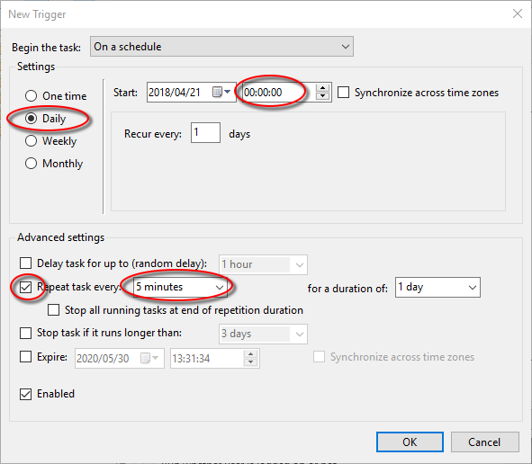
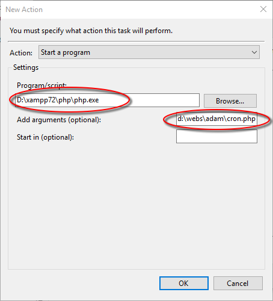
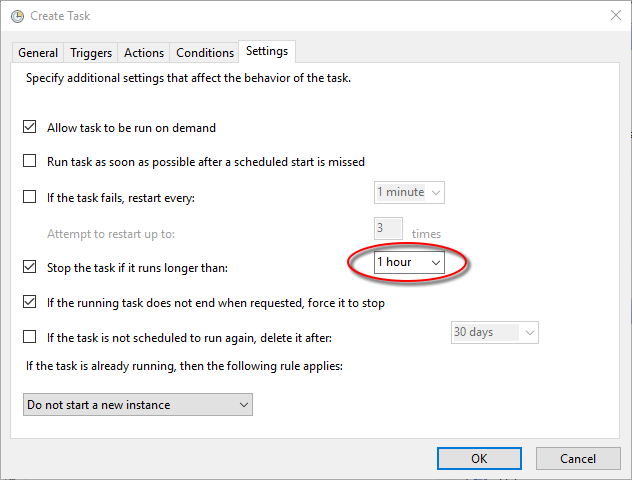
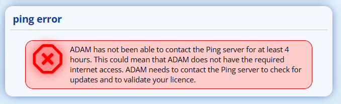
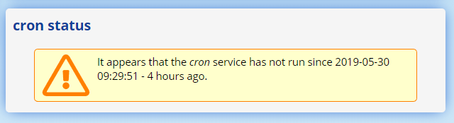

# Cron Service {#h-ti26q7thzwr1}

The Cron service runs every 5 minutes to ensure that background process happen in ADAM. Such processes include:

1.  Regular database snapshots
2.  Processing the messaging queue
3.  Recalculating of changed marks

It is important that the cron service runs regularly. ADAM will notify system administrators by way of an error message on the login page if the cron process has not run for at least 10 minutes:

## Setting up the Cron Service {#h-gx2zbn5fx8ep}

### Linux Servers {#h-ngc17gq8hxj0}

The following commands should be run to set up the crontab server by an authorised sudo user:

sudo crontab -l -u www-data > ~/tempcron

sudo sed -i "/adam\\/cron\\.php/d" ~/tempcron

echo "\* \* \* \* \* php /var/www/adam/cron.php > /dev/null" >> ~/tempcron

sudo crontab -u www-data ~/tempcron

rm ~/tempcron

In order, these commands will:

1.  Get a list of all existing crontab services for the user www-data, stored in a temporary file called “tempcron”.
2.  Remove any lines with “adam/cron.php” in them.
3.  Add in the command to run ADAM’s cron task evert 5 minutes. Note that this command assumes that there is only a single school running on the server who’s configuration is located in the “config.ini” file. If this is not the case, please contact us for more information!
4.  Load the modified cron services.
5.  Remove the temporary file.

### Windows Servers {#h-dp7kpjtybajb}

You will need to set up a Scheduled Task to run every 5 minutes. This can be done as follows:

1.  Click on “Start” and type “Task Scheduler” to search for the Windows Task Scheduler.
2.  Create a new task by clicking on “Action” and then “Create Task…”.
3.  Name the task “ADAM Cron”
4.  Click on the “Change User or Group” button. In the bottom text box, type in “SYSTEM” and click on “OK”.
5.  Move to the “Triggers” tag and click on the “New...” button to add a new trigger.
6.  Change the “Settings” option to “Daily”.
7.  Change the start time to midnight (“00:00:00”).
8.  Click on the checkbox “Repeat task every” and in the dropdown list, type “1 minute”.

9.  Leave all other settings as default and click on the “OK” button.
10.  Click on the “Actions” tag and click on the “New…” button to add a new action.
11.  The program/script should point to the “php.exe” executable on your computer. Search for it in Windows Explorer if required.
12.  In the “Add arguments” box, enter the path to the “cron.php” file within the ADAM source code.

13.  Click on the “OK” button. NOTE THAT YOUR VALUES WILL ALMOST CERTAINLY DIFFER FROM THE IMAGE ABOVE!
14.  Click on the “Settings” tab. Change the setting to “Stop the task if it runs longer than” to 1 hour.

15.  Click on “OK”.

## Ping Process {#h-n2rwjer6d4gf}

One of the background tasks that cron keeps running is the Ping process. Every so often, ADAM contacts our Ping server to report certain statistics, to check for updates and to validate the current server’s licence to operate.

Mostly, there is nothing to do - the Ping process does not normally require any human intervention!

However, if you see any errors on the login landing page relating to the ping service, administrator intervention may be necessary.

This error will show if ADAM is not able to contact the Ping server for at least 4 hours.

### Things that can go wrong with the ping process {#h-on5qxnh4bhnr}

#### The ADAM server has no internet access {#h-odl0h67b99d5}

If the ADAM server is not able to connect to the internet, it cannot contact the Ping server and thus cannot validate the operating licence.

ADAM cannot validate the licence at least once in the preceding 7 day window, ADAM will assume that the licence has expired and block access to the server.

#### The Cron Process is not running {#h-5llknvuuwoxh}

If the cron process is not running, then the Ping process cannot run. Check for any “cron status” errors on the login landing page.

#### The ADAM Server is not able to query DNS {#h-rmklh0px1ak9}

If the ADAM server cannot lookup the IP address of the Ping server, it won’t be able to contact the server. If this is the case, ADAM will often be unable to send email. Check that mail can be sent from the ADAM Messaging Centre.

#### The Ping Server may be down {#h-bu1udfhlgv3e}

You can check on the status of the Ping server here: [https://status.adam.co.za/780189792](https://www.google.com/url?q=https://status.adam.co.za/780189792&sa=D&source=editors&ust=1778246675918851&usg=AOvVaw05K7eTGIkb5HfDDmdkQlWr)
