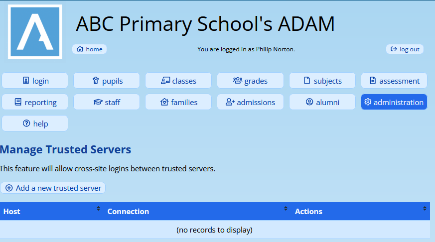
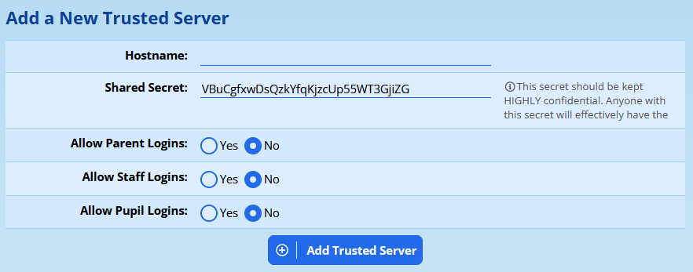
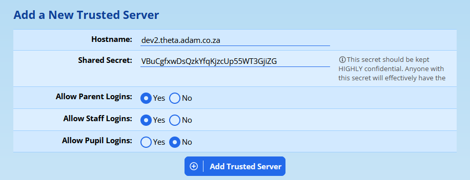
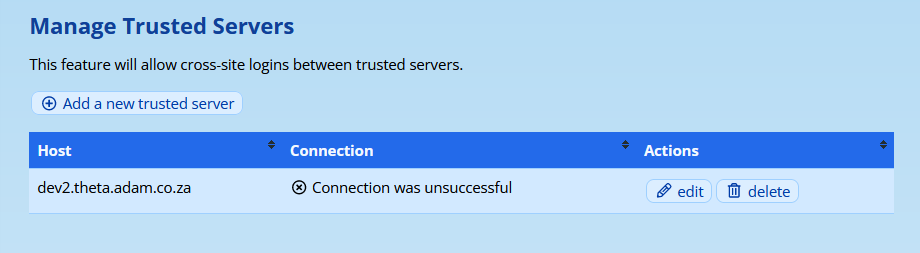
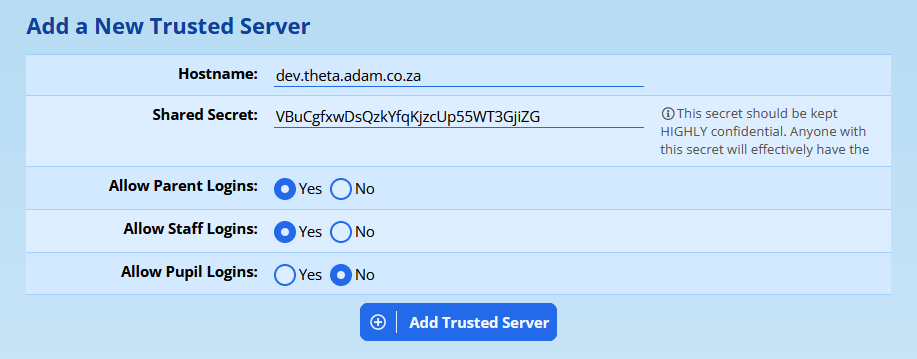
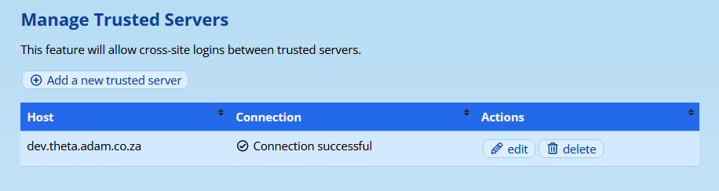
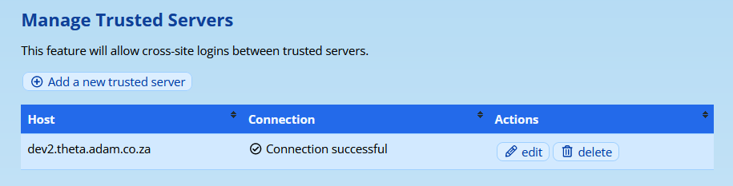
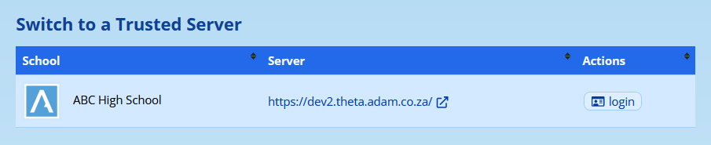

# Cross-Site Logins and Trusted Servers

ADAM allows administrators to set up a trust relationship between two or more servers to allow users a once-click login to facilitate access to other servers.

## Setting up a pair of Trusted Servers

Navigate to **Administration → Security administration → Manage cross-site login trusted servers**.

To begin the process of setting up a new trusted server, click on the “**Add a new trusted server**” link:

The following screen appears:

The **hostname** is the host name of the remote server which this server should trust. This is the part of the URL that follows the https:// portion. For example, adam.example.com.

The **shared secret** is a random series of characters. You are strongly encouraged to keep this set of characters rather than type in something more memorable or easier to type in! The shared secret needs to be the same for both this servers in the trust relationship. Note, however, that if you are to trust more than one server, the shared secret can (and should!) be different for each relationship.

This secret should be kept highly confidential. You should not send it by email or via any other form of unencrypted communication. Any person with this key would be able to log in as any user on your server.

Ideally, you would set up the trust relationship for both servers from the same computer and so you could just copy and paste this value without it having to send it to any other person.

Finally, you can select which of **Parents**, **Staff** or **Pupils** you would like to be able to log in to the trusted servers. This can be changed later. Note that these values should be set to the same values on both servers. Otherwise, ADAM may assume that a certain type of logins are allowed on the trusted server only to have the logins rejected.

Click on **Add Trusted Server** to save.

After adding your first of the two servers, you will see a “connection was unsuccessful” error.

This is entirely expected because we have yet to set up the trusted relationship on the second server.

Repeat these steps on the second server. You will, for the **hostname**, however, enter that of the first server that you were just working on. Also remember that you will now need to replace the **Shared Secret** with the same secret that was set for your first server:

Again, please check that your allowed logins match! Once you save this second server, you should see a successful connection: your second server can now talk to your first server:

Go back to your first server and refresh the page to ensure that the connection is successful also:

You have now created a successful Trusted Server relationship.

## Adding a Third (or Fourth) Server

While the process for adding a third or subsequent server is no different to that described above, note that Trusted Servers are created in pairs. Thus, your third server would need to have a trust relationship set up with your first server and your second server.

The more servers you have, the more complex this can be!

Remember, though, that each pair of trusted servers should have their own unique shared secret. If a shared secret is leaked, for example, then only that shared secret would need to be changed.

## Cross-Site Logins

### Prerequisites

In order for ADAM to allow cross-site logins, the following must be in place for all those who are going to perform cross-site logins:

-   Staff:

-   Staff members **must** have an **Admin Number** set on their profiles. ADAM will not allow staff members with a blank Admin Number to perform a cross-site login.
-   Their **Admin Number** field must be the same on both servers. If not, ADAM will not find the corresponding user and will not let them in.
-   Note that if the Admin Numbers are not standardised, then ADAM may log a user into another user’s profile.

-   Families:

-   The ID / passport number of the family member must be on both servers.
-   Like a normal login, if a family member has a duplicated ID number in the database, ADAM will not allow them to log in.

-   Pupils:

-   Pupils **must** have an **Admin Number** set on their profiles. ADAM will not allow pupils with a blank Admin Nuimber to perform a cross-site login.
-   Their **Admin Number** must be the same on both servers. If they are not, ADAM will not be able to find the corresponding user and log them in.
-   Note that if the Admin Numbers are not standardised, then ADAM may log a user into another user’s profile.

### Performing Cross-Site Logins

Once ADAM has been configured with at least once trusted server relationship that allows logins for the appropriate type of user, the following icon will appear on their navigation bar:

Note that users must first have the appropriate privilege to allow them to see this option.

When  they click on that option, a list of Trusted Servers will appear:

The user should click on the “login” option next to the server. ADAM will request a login from the trusted server and, if the trusted server grants the request, the user is then logged on to the trusted server.

## Technical Details

Trust relationships are technically complicated and it is important to understand the request cycle here. Most communication is initiated by a user, but then happens directly between the two servers, meaning that the user cannot modify the requests for login and cannot spoof a result.

The process is outlined here:

1.  The User is logged in to Server A requests to log into Server B. They do this by clicking on the “login” link. The user now waits for a response from Server A.
2.  Server A checks that Server B is a trusted server and that they have a shared secret.
3.  Server A sends Server B a login request including the user’s identifying credentials and, of course, the shared secret.
4.  Server B verifies that Server A sent the correct shared secret and finds the correct user.
5.  Server B also verifies that that user type is able to log in according to their trust relationship.
6.  If Server B is satisfied that the login is allowed and it has a matching target user account, it generates a secret token. This token is valid for a short time and is valid for one use only. Server B sends the secret token to Server A.
7.  Server A then responds to the User who has been waiting since Step 1. Server A responds with an HTTP redirect which redirects the User to Server B. This redirection includes the secret token that Server A got from Server B.
8.  Server B now sees an incoming request to cross-login from the User. It looks at the token that is provided with the request and verifies it against the ones that it has recently sent out. The tokens it has are already associated with users in its database and so if one matches, it knows who is requesting the login. Since the login has been pre-approved, the User is now logged in on Server B.

Because the communication between Server A and Server B happens behind the scenes, there is no way for the User to intercept and forge a response. Servers A and B trust each other and all the target server needs to know is that the token it gave Server A is now being presented for authentication, thereby knowing who is asking for a login.

## Troubleshooting Cross-Site Logins

A good number of things can go wrong when two automated systems are involved. Here are some more common issues to check if Cross-Site Logins are being denied.

### Do their credentials match?

Check that both users on both systems have matching credentials. Check that no other users have the same credentials. ADAM uses the **Admin Number** field for both Staff and Pupil logins, and the parents’ ID number / passport field.

### DNS Issues

DNS is a core service which allows two servers to communicate with each other. DNS is the “phone book” of the internet and without it, one server won’t be able to look up the IP address of the other and thus won’t be able to initiate communication with them.

### The Target Server is Down

If the server is unavailable, then the systems won’t be able to communicate with each other. Are you able to access the target server? Check the Manage Trusted Servers page to see if ADAM is able to establish a connection with the other servers.

### Has the Shared Secret Changed?

While perhaps the most unlikely, please check the Manage Trusted Servers page to see if ADAM is able to establish a connection with the other servers. Verify that the secrets are the same on both servers.
