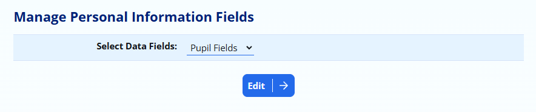
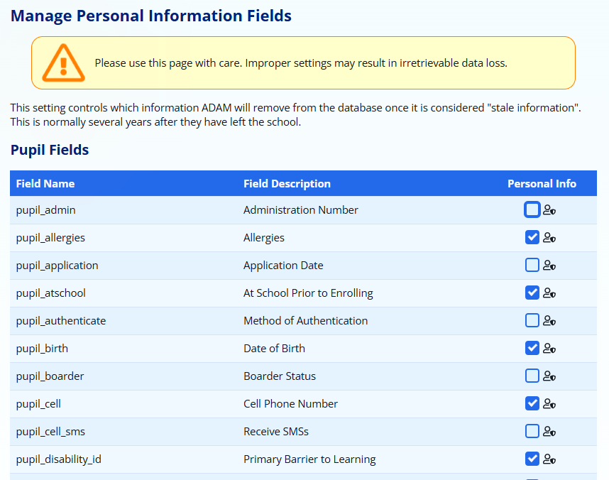
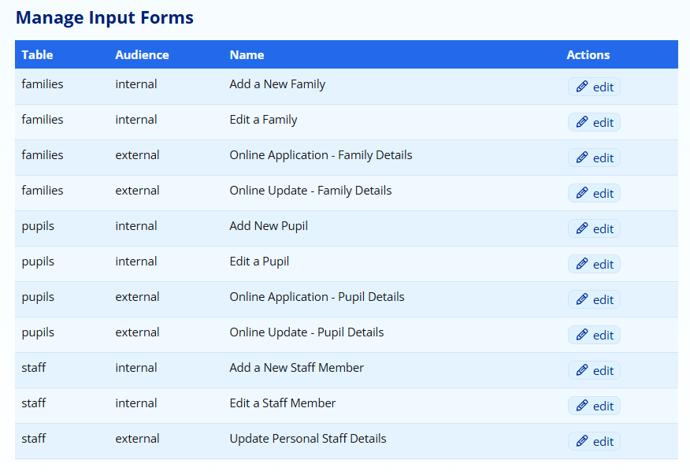
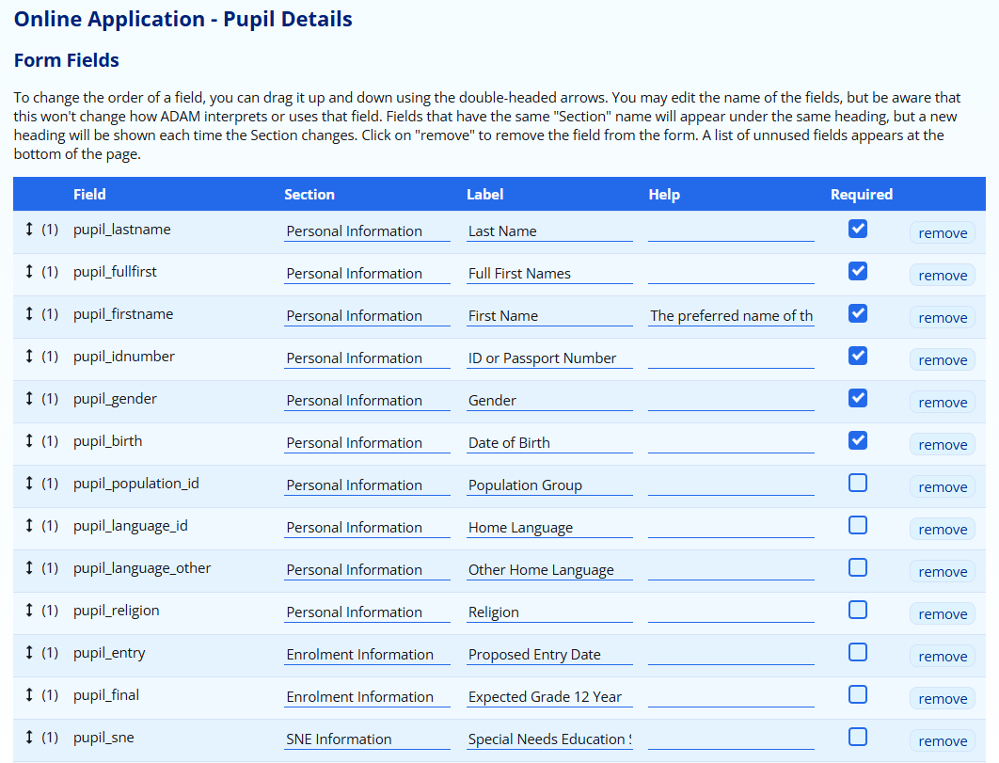
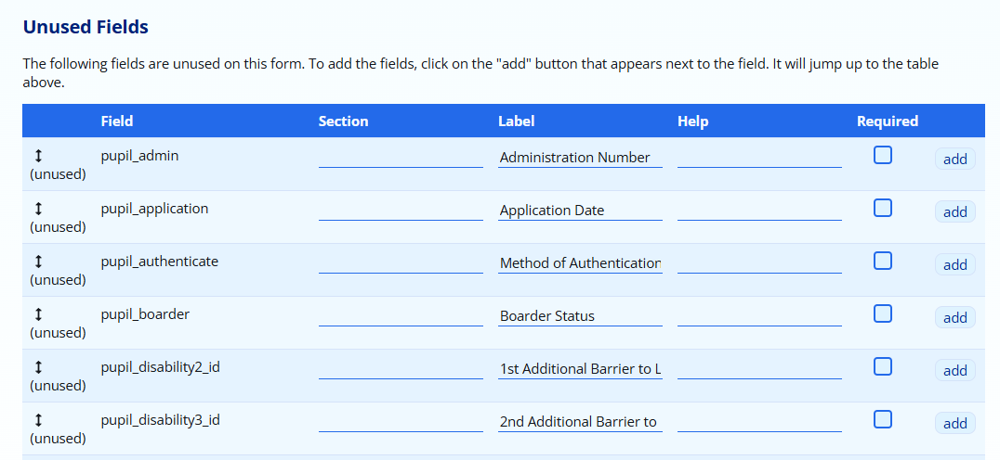
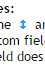

# Database Field Management

While the fields in ADAM are reasonably standard, there might be reason for a school to want to edit the headings and order of the fields. Some schools may choose not to use certain fields and would like to streamline the interface so that only the necessary fields appear.

## Sensitive Information

With the arrival of the Protection of Personal Information (POPI) Act in the near future, schools must be able to take responsible care of the data that they are entrusted with.

To manage sensitive information fields, please visit **Administration → Database Administration → Manage personal information fields**.

You can manage personal information for Pupils, Staff and Families. Note carefully that this setting is used to ensure that these fields are erased when the information is no longer relevant. This should include, as examples, medical information and contact information. However, you should **not** set fields such as Names here since they will be erased and you will have unidentifiable information stored in your database. This is problematic from an archival perspective since if you are requested for historical educational records, you won’t have a way to access it.

Tick the fields that you consider to be sensitive and then click on the **Save** button at the bottom of the screen.

## Managing Custom Database Fields

It is possible to store any other information you wish in ADAM which is not catered for by the core database fields. You can create custom fields for each of the pupils, staff and family data types.

Before you create a new custom field, please speak to the development team to see if it would be best served if that field was a part of the core data!

The options for managing the custom database fields are found on the **Administration** tab under the **Database Administration** heading. Click on **Manage custom data fields** to begin.

### Adding a new custom field

At the top of the table of fields is an option to **Add a new custom field…**. Click on this link to begin the process.

-   Table: Choose which database table the information belongs with. If you wish to have it with more than one table, you will have to add a custom field for each table.
-   Field Category: This is the heading under which the field will appear. If the category matches one of the core database fields’ categories (see above), then the custom field will appear at the end of that category in data capture screens.
-   Field Name: Type in the name that should appear next the field on data capture screens.
-   Field Type: Choose what sort of information is to be stored in this field. The different options are explained:

-   Text box: This is a straightforward text entry box. Nothing fancy happens!
-   Text box with recall: This textbox will suggest options based on previously entered options.
-   Long text box: This text box will provide a number of lines for text entry. This is useful for longer notes or paragraphs of text.
-   Date: this field will store a date. A date-picker will automatically be shown for this field.
-   Single Option: A user will choose one out of several possible options that are shown.
-   Multiple Option: A user will choose many out of several possible options that are shown.

-   Field Parameters: This is only used for the “Single Option” and “Multiple Option” field types. List the options that you wish to have available to the users. Do not leave any blank lines since this will make a blank option available. Any duplicates will be ignored.
-   Default Value: What value should ADAM assume for any fields that have not yet been updated with an actual value? If you are working with a “Single Option” or “Multiple Option” field, the default value must be one of the options provided.
-   Sort order: This determines the order in which the custom fields are sorted. Lower numbers mean earlier in the list. If two fields have the same number, they are sorted by their field names.
-   Show for Scratch List: Should this field be made available on the scratch list options?
-   Sensitive Information: Should the contents of this field be made available to staff who do not have the privileges to see sensitive information?
-   Show on the Detail Update Form: Should this field appear on a detail update form?

Note that custom fields are always available on “Add” and “Edit” operations.

**Save** the field once you are finished.

You will need to [add your custom data field to one or more input forms](#managing-data-input-forms) for it to be useful.

### Editing custom fields

You can edit any custom field by clicking on the **edit** link next to its entry. A description of the fields is [provided above](#adding-a-new-custom-field).

### Deleting custom fields

It is possible to delete the custom field. Note that the table shows the number of times the field has been used. If you delete a custom field, you will lose ***all*** the information that it contained.

## Managing Data Input Forms

ADAM has a number of core and custom fields that can be customised. To manage the fields that are present, including adding fields, removing fields and determining which fields are mandatory, navigate to **Administration → Database Administration → Manage input forms**.

A list of customisable input forms will be displayed:

Each form has an audience (internal vs external) which tells you whether the action is going to be performed by a staff member (which would be considered *internal*) or a parent (which would be considered *external*).

Click on the **edit** button next to the form you would like to customise.

For each field, ADAM shows the internal field name, a Section header, a Label, Help and whether the field is required or not. You can also drag the  icon in order to change the ordering of the fields, and click on the **remove** button to remove the field from the form.

-   The **Section** is the header that the fields appear under. All the fields in a single section should be ordered together here. You can use any section names that you’d like.

-   ADAM will display fields in the order shown here, regardless of the Section that you put them in. ADAM puts in a new Section heading on the form whenever it sees the Section change. It does not keep track of what sections are already shown and so if you mix the fields up, you may end up with the same heading being repeated in the form.

-   The **Label** is the heading that would appear on the left of the form.

-   While you can change the wording to anything you’d like, please note that changing the name of the field does ***not*** change its function and, especially, will not change how ADAM treats the field. If you want a field that isn’t present in the list of fields, you will need to add a new field first.

-   The **Help** text appears in grey writing on the right-hand side of the form and provides guidance to the user about completing the field.

-   Again, this text can be customised to contain any information you want, but once more it is important to realise that this will not change how ADAM treats and interprets the field.

-   The **Required** tick box will tell ADAM whether the value must be entered or not. The user will not be able to submit the form if they have not captured any data.
-   ADAM allows for fields to be removed from the form by clicking on the **remove** button next to the field.

-   Please be careful about removing fields that ADAM requires. Removing important fields can have deleterious consequences. Please reach out to the ADAM support for guidance if you are not sure.

At the bottom of the page is a list of fields that can be added to the form.

Click on the **add** button and drag the field into the correct position on the form.

Click on **Save form information** when done.

## Managing Scratch List Fields

The options for managing the scratch list fields are found on the **Administration** tab under the **Database Administration** heading. Click on **Manage scratch list fields** to begin.

Choose which type of scratch list fields you want to manage and click on the **edit** button.

-   Ordering the fields: If you wish to change the order that the fields are displayed in, you can do so by dragging the  icon up and down.
-   Field description: If you wish to change the field name that is displayed, you can do so. If the field name is removed entirely, ADAM will restore the default field name.
-   Category: ADAM will group the fields under different headings as specified.
-   Each field has three options:

-   Enabled: this setting determines whether the field is available or not to all users.
-   Sensitive: this setting determines whether the field is available to users with or without the sensitive information privilege. Note that if a field is not set as sensitive here, but is based on a sensitive field as defined in the core database fields, ADAM will allow the field to be selected, but it will not show any information.
-   Hidden: In an attempt to simplify the scratch list options, some options can appear hidden at first. If there are any hidden fields, ADAM will show an option to toggle the hidden fields on and off.

Once you’re done editing these options, click on the **Save** button at the bottom of the screen.
