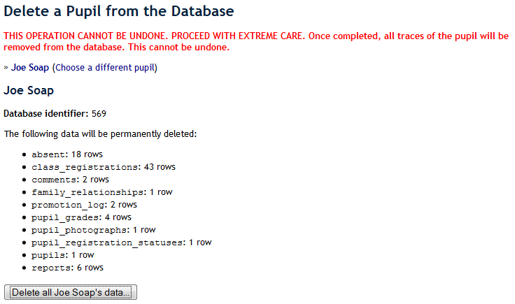
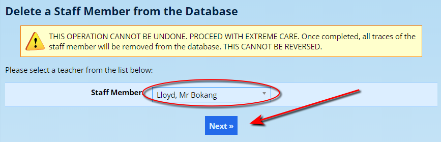
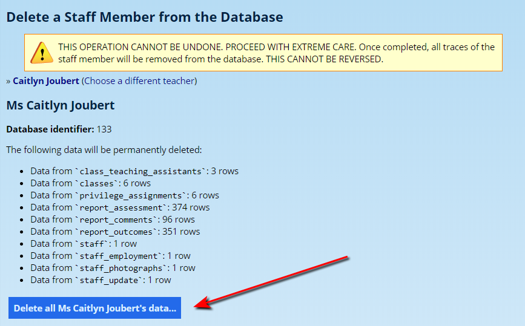
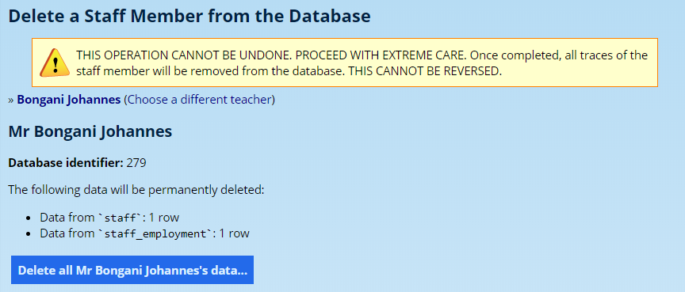

# Deleting Information {#h-2u6wntf}

**Deleting information is a dangerous thing.** Once information is deleted it generally cannot be recovered, without significant work to extract that data from backups that exist. If there are no backups, then deleted information is generally unrecoverable.

There are some exceptions to this rule. In most places, where ADAM says “delete”, it really means “hide”. However, the following are very important exceptions to this rule.

## Deleting Pupils {#h-19c6y18}

On occasion, duplicate pupils are entered into the database. It is important to work out which pupils should be kept and which should be deleted. Some considerations to make here are:

-   Has either of them been linked to a family?
-   Has either of the pupils had any enrolment operations performed on them?
-   Has either of the pupils had marks, reports, records or points assigned to them?

Once you have ascertained which the correct pupil is and which pupil should be deleted, you should proceed.

Often it is difficult to work out which of the duplicate pupils is which. It will help, therefore, if you take note of ADAM’s internal database identifier for the pupil. Each pupil is assigned a unique number which ADAM uses internally. This is separate to the Admin number that a pupil might be assigned.

### Deleting a pupil {#h-28h4qwu}

To delete a pupil, on the **Pupils** tab, under the **Pupil Administration** heading, click on the **Delete a pupil** option.

Search for the pupil’s name and click on **Next**.

At this point, ADAM will search through the entire database to find references to the pupils that you searched for. ADAM shows a list that might look as follows:

***Do you see the dire warning at the top? ADAM isn’t joking!***

If you look below the pupil’s name, you will see that ADAM will display the unique identifier for the pupil. This will enable you to determine exactly which pupil you are about to delete.

In the list of data that will be deleted, ADAM searches each table in the database to find data that is related to this pupil. Note that the list shown for this pupil indicates a significant amount of activity and it is a sure sign that it would be a mistake deleting this pupil.

A minimal amount of information and activity would be indicated by a single row in the pupils table and perhaps 1 or 2 rows in the pupil\_registration\_statuses table. If a family has been linked to the pupil, then there might also be a row in the family\_relationships table.

### Undoing a Deletion {#h-pw3clmfn455h}

ADAM does make a *backup* of the deleted data. However, this backup cannot be applied by an end user and technical support must be requested to restore these backups.

### Some additional warnings {#h-p83ahpakha19}

-   There should be nearly no staff members who have permission to delete information of any kind from the database. Please consider carefully who has access to this permission.

## Deleting Families {#h-nmf14n}

***Please see the warnings associated with*** ***[deleting other information](#h-2u6wntf)*** ***in ADAM. Chances are you DO NOT want to delete a family since you will lose all record of the family.***

When a family has been duplicated or added in error, you will need to delete the family. Deleting a family can be done by navigating to **Families → Family Administration → Delete a family**.

### Undoing a Deletion {#h-8l4t7bdmp0co}

The restoration of a deleted family cannot be done from within the ADAM interface since it requires restoring backups and extracting the family’s information from the backup.

*Most SLAs do not cover data rescue as an included service meaning that if we are required to rescue such deleted data, additional charges will be incurred.*

### Some additional warnings {#h-fz6ofjwnjryb}

There are very few staff members who will need the ability to delete families. Administrators should take care to give this privilege only to those who need it and who have been trained in its usage and implications.

## Deleting Staff {#h-37m2jsg}

***It’s  a safe bet that you will almost never need to delete a staff member from the database. If you are hoping to delete a staff member that has left the school, STOP HERE. Deleting a staff member who has left is incorrect!***

If a staff member leaves your school, you must [terminate their employment](staff-information.md#h-qbtyoq).

As with [deleting other information](#h-2u6wntf) in ADAM, removing a staff member will not only remove all traces of their information, but also any information that is linked to them will also be lost. Removing a staff member will remove any report comments that they have written, any assessments that they have added to ADAM and any marks that they have assigned to pupils.

You may want  to delete a staff member only if they have been added to your database in error. For example, a new staff member might have been added twice to the database. In this instance, one of the records should be deleted.

### To Delete a Staff Member {#h-hha7715mxa5}

*Before you continue, please note that recovering a staff member deleted in error is not possible by the users and ADAM technical support must be involved. Please also note that this particular service, data recovery, will be invoiced over and above your SLA costs.*

From the **Staff** tab, under the **Staff Administration** heading, click on **Delete a staff member**.

Please read the warning carefully. ADAM isn’t joking.

Choose the staff member to remove and click on the **Next** button.

ADAM will then scour the database to see what impact this operation will have.

Notice in this particular screen shot, amongst other things, there are 96 rows of “report comments” that will be removed. This is almost surely a mistake! **STOP!**

For staff members that have been added and have NO information in the database, we would expect to see something more along these lines:

In this case, there is minimal linked information that will be lost and so it is *probably* safe to continue.

Click on the button to **Delete all <staff member>’s data…** and ADAM will begin the process of deleting the staff member.

### Undoing a Deletion {#h-seejp9c69lwd}

ADAM does make a *backup* of the deleted data. However, this backup cannot be applied by an end user and technical support must be requested to restore these backups.

### Some additional warnings {#h-9nb46g8p07mw}

-   If you delete your own account, you will instantly be locked out of ADAM with no way of getting back in. Please don’t do this.
-   There should be nearly no staff members who have permission to delete information of any kind from the database. Please consider carefully who has access to this permission.
