# Document Repository {#h-3l18frh}

<iframe src="https://www.youtube.com/embed/v-7J2HtRrQY" frameborder="0" allow="accelerometer; autoplay; encrypted-media; gyroscope; picture-in-picture" allowfullscreen></iframe>

The Document Repository is an online file storage utility that can store files against pupil, staff or family profiles. This makes finding information easier.

## Document Repository Location {#h-206ipza}

To begin with, ADAM needs a location in which to save files on the actual server. A folder needs to be created on the server and configured in the site settings (see page ).

*Please ensure that this folder is not a sub-folder of the web-root. If it is, then files can be accessed without necessarily following the correct privileges.*

## Categories {#h-4k668n3}

ADAM allows you to create multiple categories in which to save your documents.

To edit the categories, click on the “**Administration**” tab, and under the “**Document Repository**” heading, click on “**Edit Document Repository Categories**”.

### Adding a New Category {#h-exo5dokeqmje}

To add a new category, click on the “Add new document category” at the top of the screen.

Simply enter the name of the category, a description and then the parent category. The parent category (staff, pupils or families) cannot be changed later, although the category can be moved around within those three areas.

### Editing a Category {#h-ug1z84fmsup5}

ADAM allows you to edit any custom categories and not the built in ones. Some of these categories are required. Editing a category allows you to change its name and its parent (within its existing group of staff, pupils or family).

### Deleting a Category {#h-mof3uy6samvj}

The “delete” option next to the custom categories allows you to delete a category. However, it will not delete the files. When you delete a category, ADAM will move all the files within that category to a category that you specify when you delete it.

## Pupil and Family Privileges {#h-z0pmr3athvkh}

If you allow parent and pupil access to the Document Repository through the Parent and Pupil Portals, then you can control which categories they can see. Note that parents are not able to upload information into the repository or delete anything from it – only access information, and only from the categories that you give access to.

[Allowing parents to upload documents](#h-erpi5roz7byn) to the document repository is handled separately to this and parents do not need specific permissions granted here in order to upload a document.

Even if you do give access to categories, parents still won’t get access to the Document Repository until they are given the permission to actually [see the Document Repository in the portal](security-administration-for-families-and-pupils.md#h-mg1sc7iv8w2n).

To edit the permissions, click on the “**Administration**” tab, and under the “**Document Repository**” heading, click on “**Edit pupil and family privileges**”.

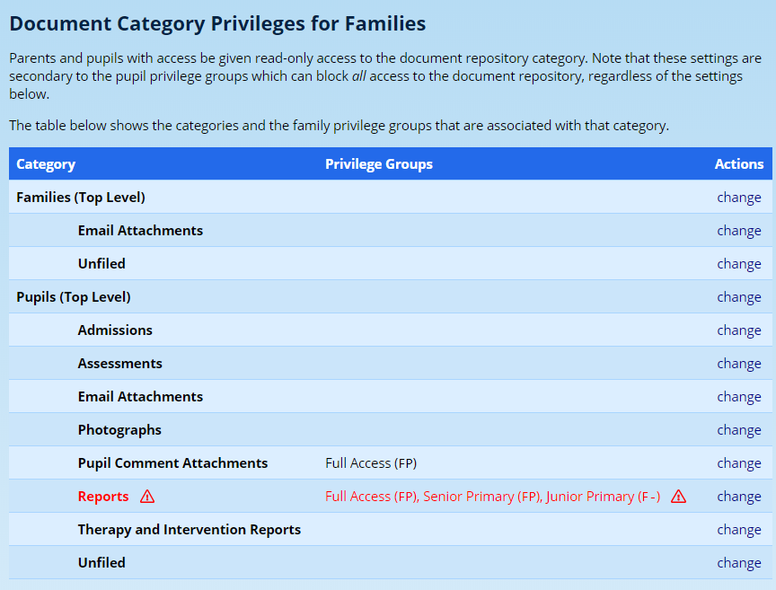

Note, carefully, the warning messages that ADAM shows for certain categories (such as the “Reports” category in the image above). Some categories are used internally by ADAM and can store temporary documents. In the case of reports, for example, each time a report is generated, a copy is stored in the archive. This copy is continually updated until the report is published. If you allow parent access to this category, they will be able to see draft copies of the reports *before* the reports are published.

Click on the “change” option to adjust the privileges for that group:

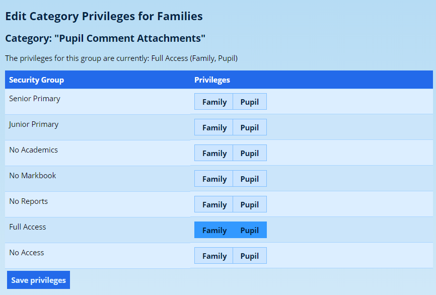

When done, click on the **Save privileges** button.

Note that if you change the privileges for a restricted group, ADAM will show the following warning:

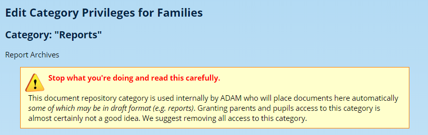

Unlike the [staff privileges](security-administration-for-staff.md#h-3ls5o66), we now are simply controlling whether the groups can be seen by families or pupils. Parents and pupils can only ever get read-only access from this screen.

## Parent Uploads into the Document Repository {#h-erpi5roz7byn}

ADAM can allow parents, and potentially pupils, to upload documents to ADAM for potential inclusion into the Document Repository. All files that are uploaded by parents or pupils are not directly loaded into the document repository and must first be approved by either the site administrator or a staff member with appropriate permissions to do so before the document is available.

### Creating Upload Spaces {#h-9ns6ldupcuff}

ADAM allows you to create a number of different upload spaces and, within each of these, specify a number of files, with descriptions, for parents to upload. All uploads are optional and cannot be forced.

Navigate to **Administration → Document Repository → Manage parent and pupil uploads to the document repository**.

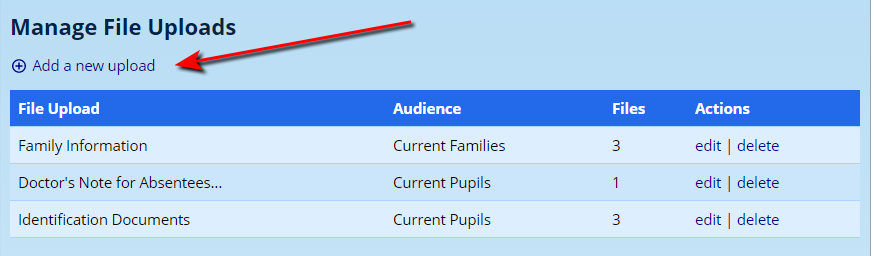

Click on “**add a new upload**” to begin. Consider the example here where a file upload slot is being created to gather documents for a “Sports Tour to Zimbabwe”. You might want to create an upload space for “Admissions Documents”. Note that we are not specifying yet which documents need to be uploaded. This comes next.

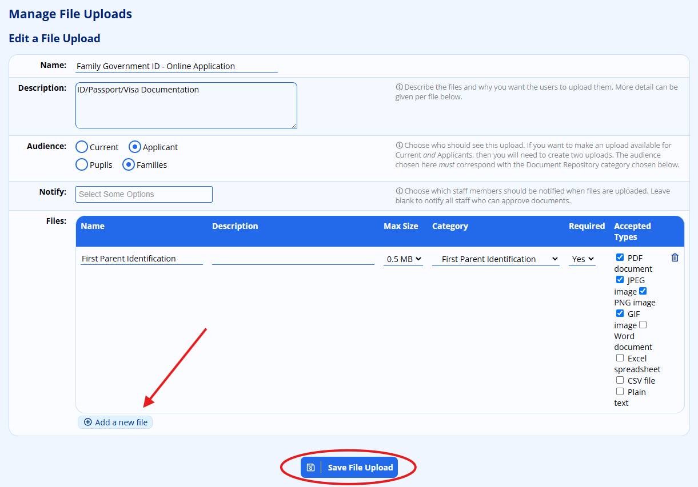

Please take note: The “audience” allows us to focus these upload forms to families or pupils who are either applicants to the school or are current pupils.

Note also, that the audience choice (pupils vs families) will dictate which of the [document repository categories](#h-4k668n3) you can choose from. Choosing a “Family” audience” and a “Pupil” category will result in the documents being uploaded to the “Unfiled” category in the “Family” section of the document repository. The same is true if a “Pupil” audience is selected, but a family category is chosen.

The person listed under the **Notify** option will be notified when new documents have been uploaded to ADAM for approval. They will *not* appear in the document repository until they have been approved.

You can add more upload slots by clicking on the “**add a new file**” at the bottom. You can remove existing slots by clicking on the “**bin**” next to the row.

The “Max Size” column specifies how large the file may be in megabytes. The size here may vary depending on what sort of documents you are asking parents to upload.

Once you are done, click on the **Save File Upload** button.

Look carefully at the example above. Within the one file upload section, we are asking for three documents. This allows parents to see the different upload sections and easily differentiate between them. These details, with some others already existing on the system, may look like this on the parent portal:

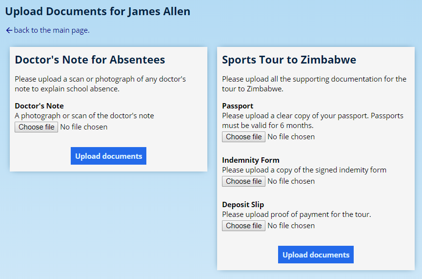

### Instructions for Parents {#h-vs9rzpxgpt52}

Depending on the privileges assigned to the parents and pupils, the options to upload documents will appear as follows in the portal:

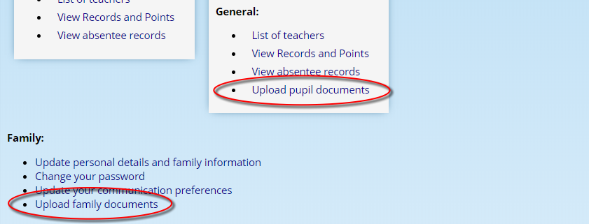

ADAM will list the documents that can be uploaded:

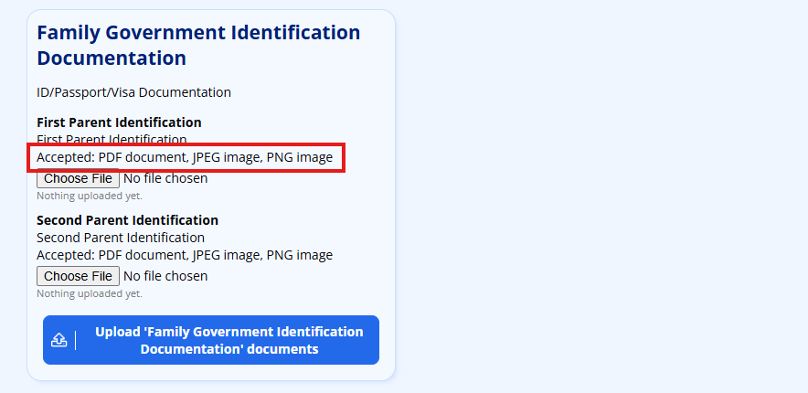

Parents should click on the **Choose file** button and select the file they wish to upload. They may choose one or more files. Once they have selected all the files they wish to upload, they should click on the **Upload documents** button below the files they have chosen.

Note that if they choose a file that is larger than the maximum size allowed, they will receive the following error message:

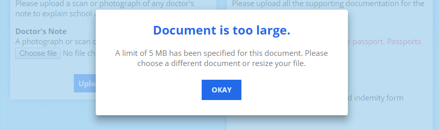

Once they click on **Okay**, the offending file is shown in red and the button at the bottom is disabled until they correct the issue:

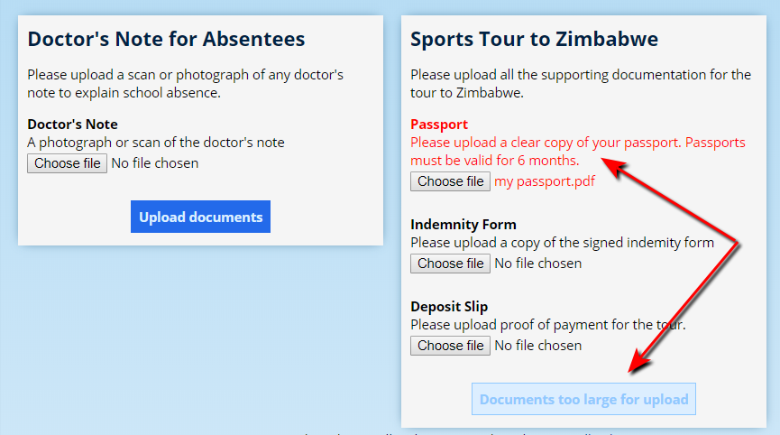

To clear the file, click on **Choose file** and then either choose another file or click on the **Cancel** button in the file selection window to clear the file:

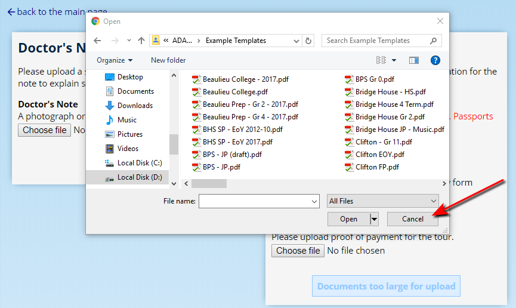

### Approving Documents {#h-1xc0j219yh0b}

ADAM will notify the selected staff member when new documents have been uploaded to ADAM and which require approval.

To begin the approval process, navigate to **Administration → Document Repository → Approve parent and pupil uploads**.

You may be asked to choose a particular section, particularly if there have been files from multiple sections being uploaded.

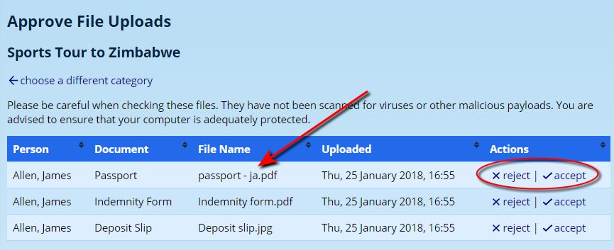

Click on a **File Name** to download it and view it.

Once you have made a decision, you can then click on the **reject** or **accept** option next to the file. If you accept it, the document will automatically appear in the appropriate category within the document repository.

If you choose to reject the upload, be aware that it will be deleted with no way of recovering it.

!!! warning
    Note that ADAM makes no attempt to scan any uploaded files for viruses and provides no warranty that the uploaded files will be safe to open. Please ensure that staff who are responsible for approving document uploads are well-versed in the appropriate computer security protocols to follow, and that their computers are equipped with up-to-date antivirus scanners.

## Staff Permissions {#h-a6043un8am4k}

You can customise the access to the Document Repository based on the staff security groups.

To edit the permissions, click on the “**Administration**” tab, and under the “**Document Repository**” heading, click on “**Edit staff privileges**”.

The different groups are listed and, next to them, are the current privileges that have been assigned to them. The Staff Groups are shown with one or more of three letters shown:

-   R – the group has permission to read and view the files.
-   A – the group has permission to add files to that category.
-   D – the group has permission to delete files from that category.

Next to each category is a “change” option. Click on this option to change the privileges for that group.

Next to each option, click on “Read”, “Add” or “Delete” to assign that group the associated privileges.

Click on the “Save privileges” button at the bottom to save these changes. The privilege category table should now reflect these new privileges.

## Uploading Documents in Bulk {#h-9vy1c3hcdfza}

Pupil and staff documents can be uploaded in bulk to the document repository.

### Naming of Documents {#h-mn1nlyr49roy}

In order to be uploaded in bulk, the documents must be named so that ADAM can match them to the pupils or staff members. Documents can be named in any of four ways:

1.  First-Name Last-Name: e.g. John Smith.pdf
2.  Last-Name First-Name: e.g. Smith John.pdf
3.  AdminNumber: e.g. AB01234.pdf
4.  Username: e.g. 53johns.pdf

The document names are not case sensitive and so a document named john smith.pdf would be matched to John Smith.

You can also mix methods in a single upload. So ADAM will check all possible versions of each file to match it.

### Uploading the Documents {#h-aufsxus4k6ts}

Navigate to **Pupils → Document Repository → Upload documents in bulk** or to **Staff → Document Repository → Upload documents in bulk**. Both options take you to the same screen with the same set of options.

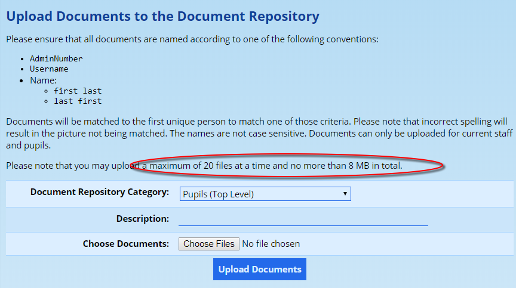

Take special note of the limitations with regards to uploading files. These are server specific and so yours may well be different to the limits shown in the diagram above.

-   Choose the appropriate **document repository category** to upload the documents into. It is important that you choose an appropriate category for the document uploads. If you choose a pupil category, only pupil names will be checked when trying to match documents. Similarly, if you choose a staff category, only staff names will be checked.
-   Add in a **description** for the documents. This description is important because all your documents are currently named to identify which pupil they belong to and so it will not be apparent what their content is.
-   Finally, use the **Choose Documents** button to select the files that you wish to upload. You can select multiple files, subject to the limits set on your server.

Once you have provided the information, please click on the **Upload Documents** button to begin the document upload process.

Any documents that are not matched to a person are noted with an “X” next to their name in the confirmation screen:

### Troubleshooting Failed Matches {#h-79vvpxv1ey5s}

Sometimes ADAM fails to match documents. This can happen for a number of reasons. Most commonly are:

-   You chose the wrong category. If you are uploading staff documents, you must choose a staff category, and if you are uploading pupil documents, you must choose a pupil category. ADAM will specifically look at the category to decide which people to check the documents against.
-   The document name has a spelling mistake.
-   The document uses a nickname or other variation of the name. ADAM uses the first name field to match documents against.
-   There is more than one person with the same name. If ADAM finds two (or more) possible matches for a document, it will not be uploaded to either. In this case you will need to either rename the document using an Admin number or username. Alternatively, you may have to upload these documents manually.
-   The pupil is not a currently registered pupil or the staff member is not an active member of staff. ADAM won’t allow bulk uploading for people who are not currently enrolled or engaed in the school.

## Removing Documents {#h-ul9s2c8q3l3s}

Documents can either be removed individually or in bulk. To remove an individual document, navigate to the Document Repository of the person concerned and click on the **delete** option next to the file that you would like removed:

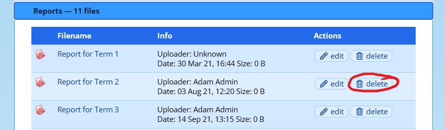

### Removing Documents in Bulk {#h-xe5xiebk2asg}

To remove many documents at once, ADAM provides a tool to do this. Navigate to **Administration → Document Repository → Delete documents from the Document Repository**.

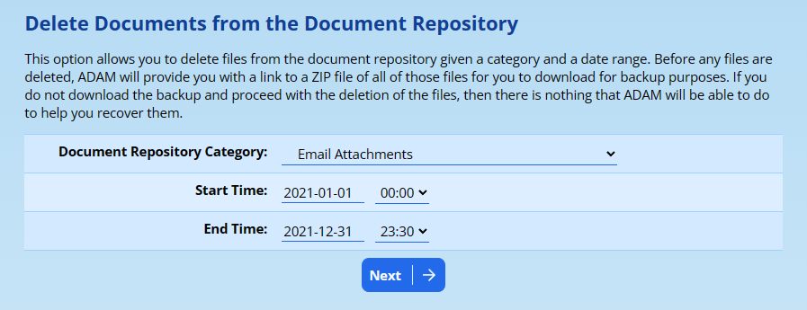

Choose the category to delete documents from (in the example above, we are deleting documents from the “Email Attachments” category - a category that ADAM uses to store files that are sent via the Messaging Centre).

Choose a “Start” and “End” time - only documents that were uploaded or created during this time window will be deleted.

Click on the **Next** button to continue.

ADAM will now create a ZIP backup of these files which you can download for backup purposes.

!!! warning
    Note that if you do not download this ZIP file and continue with the deletion, you will not be able to access these files since ADAM will delete them permanently from its storage.

ADAM will also show a list of the files that will be deleted. Scroll to the bottom of the page and click on **Delete these files permanently…**

!!! warning
    If ADAM is unable to generate the ZIP backup - perhaps because there are too many files or the files are too big - then you will need to select a smaller date range to delete.

Once the files are deleted, ADAM will confirm the number of files that were removed.

### Deleting Unlinked Files {#h-acd4n0gxdbnd}

ADAM links every file in the document repository to either a pupil, a family or a staff member. Occasionally, if one of these data entries is deleted, it can result in there being “orphaned” files in the Document Repository. Navigate to **Administration → Document Repository → Delete unlinked documents for the Document Repository**.

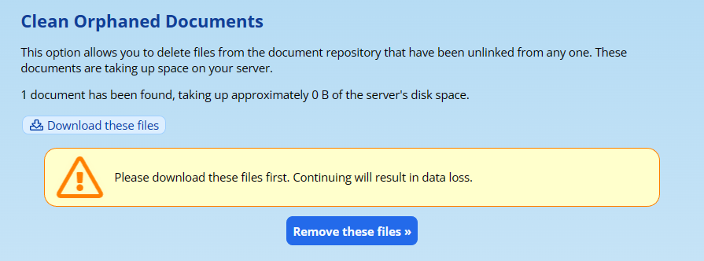

ADAM will show you a list of these documents and invite you to download a ZIP copy of them for backup purposes. If you do not download them here, ADAM will delete them permanently and they will not be recoverable.

Click on the **Remove these files** to delete them.

## Site Document Repository {#h-1jqikprtzgyq}

Some files are needed for sharing across the site. These can include graphics that are used for reporting templates. To upload a document to the Site Repository, navigate to **Administration → Document Repository → View the Site Document Repository**.

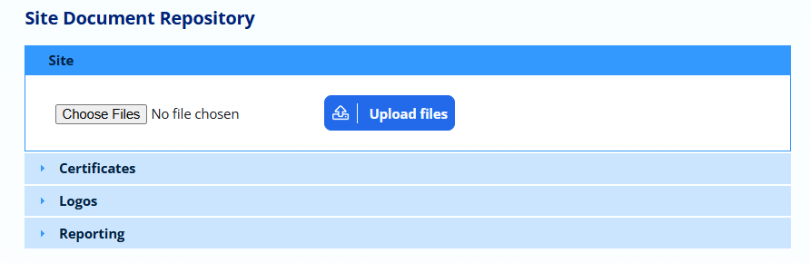

The category is important here:

-   The **Site** category is not used, currently, and will only act as a store for site-related information. *You are encouraged not to use this category*.
-   The **Certificates** category is used for PDF certificate templates for electronically generated certificates. Note that these PDFs must be saved in PDF Version 1.5 or earlier for ADAM to understand them.
-   The **Logos** category is used for specifying logos that ADAM should use for display and printing. It also can store email banners and imagery. For more information about school logos, please see the [specific documentation](school-logos.md#h-2mn7vak).
-   The **Reporting** category is used for miscellaneous files that ADAM might need for report templates. Note that this may include logos, but those will probably catered for in the **Logos** category above. You will be given specific instructions regarding your report templates.
