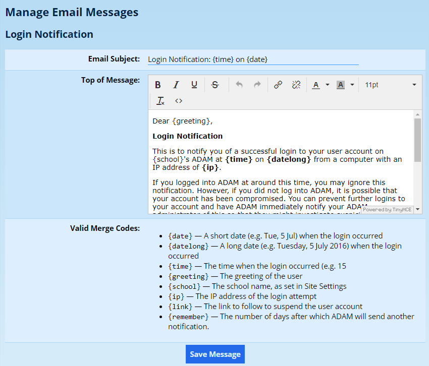
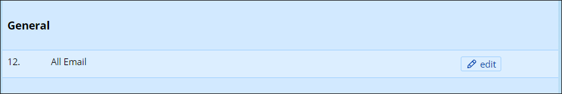
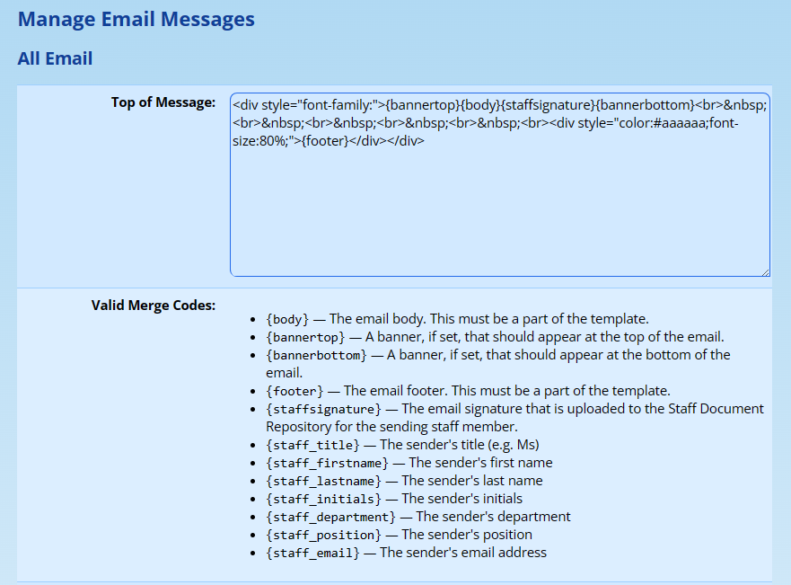

# Email Message Templates

Many of the automated emails sent to parents and staff can be customised to meet your language requirements. To find the templates, navigate to **Administration → Site Administration → Manage Email Messages**.

Click on **edit** next to the template you wish to edit.



Depending on the template you are editing, you may see one or more of the following sections:

-   **Email Subject:** This appears in the email subject line when the message is sent.
-   **Top of Message:** This is where the body is displayed. In emails that include automated report content, this message will appear above the report content.
-   **Bottom of Message:** This section is often omitted for emails that do not include automated report content. Where it is present, it will appear below the emailed report.
-   **Valid Merge Codes:** Each email template provides different merge codes. These merge codes can be used in any of the sections. They must appear exactly as shown with the braces `{}`.

Click on **Save Message** when done.

## The Email Templates

The table below lists the email templates that ADAM provides, grouped by the headings under which they appear on the **Manage Email Messages** screen. Every template is always listed, regardless of which modules your school uses, but a template is only ever sent when the feature it belongs to is in use. The detailed workflow behind each email is covered on the documentation page for the relevant module.

| Section | Template | When it is sent |
|---------|----------|-----------------|
| Applications | New Application | Sent to a parent to invite them to begin an [online application](online-applications.md#online-applications), containing the link to the application form. |
| Applications | Notify Parent of Application Submission | Confirms to the parent that their application has been received. |
| Applications | Notify Parent of Application Approval | Tells the parent their application was successful and explains the next steps. |
| Applications | Notify Parent of Application Rejection | Tells the parent that their application was unsuccessful. |
| Applications | Notify School of Completed Application | Alerts the school that a parent has completed an online application. |
| Applications | Reminder: Application Not Started | Reminds a parent who has been invited to apply but has not yet begun. |
| Applications | Reminder: Application Incomplete | Reminds a parent who has started an application but not yet submitted it. |
| Attendance Alerts | Attendance Register Alert | Notifies staff that an attendance register has not been completed as expected. |
| Families | Detail Update - Family Request | Sent to a family inviting them to review and update their details online. See [Family Detail Updates](family-detail-updates.md#family-detail-updates). |
| Families | Detail Update - School Notifications | Notifies the school when a family submits changes to their details. |
| Families | Password Creation Email | Sent to a parent so they can create a password for the [parent portal](configuring-logins.md#configuring-logins). |
| Families | Password Reset Email | Sent to a parent who has requested a password reset. |
| Families | Send Class and Teacher Details to Parents | Sends a pupil's class and teacher allocation to their parents. |
| Family Alerts | Parent Alert | The scheduled [family alert](family-alerts.md#family-alerts) digest sent to parents. |
| Family Alerts | Pupil Alert | The scheduled family alert digest sent to pupils. |
| General | All Email | The master HTML wrapper applied to **every** email ADAM sends. See [Editing the Default Template](#editing-the-default-template) below. |
| General | All Messaging Centre Email | The default message body used for emails composed in the [Messaging Centre](messaging-centre.md#messaging-centre) when no other template is chosen. |
| Leaves | Approval Notification to Parents | Tells a parent that a pupil's [leave](leave-module.md#leave-module) request has been approved. |
| Leaves | Denial Notification to Parents | Tells a parent that a pupil's leave request has been denied. |
| Leaves | Cancellation Notification to Parents | Tells a parent that a pupil's leave has been cancelled. |
| Leaves | Pending Leave Approval Notification - Families | Reminds the relevant approver that family leave requests are awaiting approval. |
| Login | Login Notification | Notifies a user that their account has been logged into. See [Login Messages](login-messages.md#login-messages). |
| Medical | Medical Exams - Notify Staff | Notifies staff of an upcoming or recorded medical examination. See the [Medical Module](medical-module.md#medical-module). |
| Online Agreements | Online Agreement - Copy of Response | Sends a respondent a copy of the [online agreement](online-agreements.md#online-agreements) they have completed. |
| Pupils | Notification of New Pupil Comment | Notifies staff that a new [pupil comment](pupil-comments.md#pupil-comments) has been recorded. |
| Pupils | Notification of New Pupil Comment - to Parents | Notifies parents that a new pupil comment has been recorded. |
| Pupils | Notification of Password Change | Confirms to a pupil that their ADAM password has been changed. |
| Pupils | Send Class and Teacher Details to Pupils | Sends a pupil their own class and teacher allocation. |
| Records and Points | Pupil Notification of New Record | Notifies a pupil that a new [records and points](records-and-points-administration.md#records-and-points-administration) entry has been recorded against them. |
| Reports | Report Email | Delivers a pupil's academic report to parents. See [Publishing Reports](publishing-reports.md#publishing-reports). |
| Roll Call | Roll Call Absence Alert | Alerts staff that a pupil was marked absent in a [roll call](roll-calls.md#roll-calls). |
| Roll Call | Roll Call Reminder | Reminds the responsible staff member to complete a roll call. |
| Signup Module | Signup Notification (to Staff) | Notifies staff that a pupil has signed up for an appointment. See the [Sign-up Module](sign-up-module.md#sign-up-module). |
| Signup Module | Signup Notification (to Families) | Reminds families of an appointment a pupil has signed up for. |
| Signup Module | Signup Notification (to Pupils) | Reminds a pupil of an appointment they have signed up for. |
| Signup Module | Approval Notification (to Staff) | Notifies staff that an appointment signup requires approval. |
| Signup Module | Signup Notification of Cancellation (to Staff) | Notifies staff that an appointment signup has been cancelled. |
| Signup Module | Signup Notification of Staff Cancellation (to Pupils) | Notifies a pupil that a staff member has cancelled their appointment. |
| SMS Zoom | SMS Reply Message | Forwards a parent's reply to an SMS batch to the school by email. See [SMS Services](sms-services.md#sms-services). |
| Staff | Detail Update - Staff Request | Invites a staff member to review and update their own details online. |
| Staff | Detail Update - Reviewer Notification | Notifies the nominated reviewer when a staff member submits detail changes. |
| Staff | Password Change Notification | Confirms to a staff member that their ADAM password has been changed. |
| Staff | Password Reset Notification | Sent to a staff member who has requested a password reset. |
| Staff | Pending Leave Approval Notification - Staff | Reminds the relevant approver that staff leave requests are awaiting approval. |
| Staff Alerts | Absentee Alert | The daily [absentee](absentee-administration.md#absentee-administration) digest sent to staff. |
| Staff Alerts | Absentee Reminder | Reminds a teacher to record absentees for a class. |
| Staff Alerts | Absentee Recording Report | Reports back on absentees recorded by email reply. |
| Staff Alerts | Birthday Alerts | The scheduled digest of upcoming pupil and staff birthdays. |
| Staff Alerts | Off-sport Alert | The scheduled digest of pupils currently excused from sport. |

!!! tip
    The wording of most of these emails can be tailored to your school in exactly the way described above — click **edit** next to the template, change the **Email Subject** and message sections, then click **Save Message**. The **Valid Merge Codes** shown on each template tell you which `{codes}` that particular email understands.

## Editing the Default Template

Where schools have demanding CI requirements, ADAM allows for the customisation and modification of the default email template.

!!! warning
    Kindly note that we do not provide any support for the modification or formatting of email messages. This feature is provided for your use entirely at your risk. In the event that your email template is changed in any way, our only offer of support is to replace this with the default message template.

Navigate to **Administration → Site Administration → Manage Email Messages**. Click on **edit** next to the **All Email** template, listed under the **General** heading.



Unlike other message templates, this one does not provide a “rich” text editor and, instead, provides the raw HTML that is used to format every message - including the other templates that ADAM lists.



Note carefully the four merge codes. Importantly, the `{body}` and `{footer}` merge codes MUST be included in the template.

!!! warning 
    Please be aware that while this allows you to enter and CSS and HTML code you wish, not all CSS styling and HTML is honoured by the email client that will show the email to the final recipient. Additionally, there is no standard as to which email clients honour which CSS directives, meaning that to get an email to display consistently across all email viewers is, in short, impossible. A simple Google search on “email css styling” will reveal as much. You are thus advised to keep your styling general and also to test it across as many email clients as possible to ensure that emails are displayed correctly and are legible in their final destinations. ***ADAM will not attempt to make any suggestions or corrections and will assume that you know what you’re doing!***

Alternatively, there are a number of HTML template generators available who will ensure that your emails look as consistent as they can across different email clients. However, these are normally not free and should be used at your own risk.

Finally, if your school employs a graphic designer, they might be able to assist you with the creation of an HTML template.

### Using banner images

There are two merge codes for banner images: `{bannertop}` and `{bannerbottom}`. These banners should be uploaded in the same place as the [school logos](school-logos.md#school-logos).

!!! warning
    Be aware that these banners are not automatically resized by ADAM. While the banner images can be resized in the CSS of the email (perhaps with a surrounding div tag with fixed dimensions), again be aware that no all email clients will support such modifications and you are advised to upload appropriately sized images that will display correctly for a large number of users without and styling intervention. ***Again, we emphasise the need to test your emails on a wide variety of email clients and platforms!***

### Staff Sender Details and Signatures

When an email is sent by a particular staff member — for example, a message composed in the [Messaging Centre](messaging-centre.md#messaging-centre) — ADAM can personalise the **All Email** template with that sender’s own details. This allows every message to close with the name, position and contact details of the person who sent it, rather than a generic, school-wide signature.

There are two ways to include sender details: a set of text merge codes for the sender’s details, and an image merge code for an uploaded signature graphic. The two can be used together or independently.

#### Sender detail merge codes

In addition to the structural merge codes (`{body}`, `{footer}`, `{bannertop}` and `{bannerbottom}`), the **All Email** template recognises the following codes. Each is replaced with the corresponding detail of the staff member who is sending the message:

-   `{staff_title}` — The sender’s title (e.g. Ms)
-   `{staff_firstname}` — The sender’s first name
-   `{staff_lastname}` — The sender’s last name
-   `{staff_initials}` — The sender’s initials
-   `{staff_department}` — The sender’s department
-   `{staff_position}` — The sender’s position
-   `{staff_email}` — The sender’s email address

These are the same codes that are listed under **Valid Merge Codes** when you edit the **All Email** template. You can combine them with ordinary HTML to build a signature block, for example:

```html
<p>Kind regards,<br>
{staff_title} {staff_firstname} {staff_lastname}<br>
{staff_position}, {staff_department}<br>
{staff_email}</p>
```

!!! warning
    These codes are only filled in when an email has an identifiable staff sender, such as a message sent from the Messaging Centre. Many of ADAM’s automated emails — system notifications, report deliveries and the like — are sent on behalf of the school as a whole and have no individual sender. In those cases the sender detail codes are replaced with nothing, so be sure to design your template so that it still reads correctly when these details are absent.

#### Signature images

It is also possible, using the `{staffsignature}` code, to have ADAM insert an image signature for the sending staff member. ADAM uses the most recently uploaded file in that staff member’s **Email Signatures** document repository category, so to update a signature all you need to do is upload a new one.

To upload signatures in bulk, please look at the [Document Repository documentation for instructions](document-repository.md#uploading-documents-in-bulk).

You will need to ensure that your images are a suitable width, or that your template contains the necessary HTML to ensure that any over-sized images render correctly on narrower screens.

Note that if a staff member does not have a signature, ADAM will not put a “default” signature in its place, and instead, no image will be displayed.
