# Enrolment Process {#h-1egqt2p}

ADAM has a customisable admissions feature which allows schools to create an admissions process that maps to their current workflow.

Broadly speaking there are three stages to which a pupil can be assigned at any one time. These are:

1.  Admissions
2.  Current
3.  Alumnus

Any amount of customisable Registration Statuses can be created within each of these. By default, the following stages exist:

1.  Admissions

1.  Applicant
2.  Withdrawn Applicant

2.  Current

1.  Current Enrolment
2.  Withdrawal Notice Received
3.  Transferred
4.  Excluded
5.  Deceased
6.  Dropped Out

3.  Alumnus

1.  Active Alumnus
2.  Inactive Alumnus
3.  Deceased

Each of these stages can either be classified as “active” or “inactive”. For example, “current enrolment” and “withdrawal notice received” are *active* statuses, whereas “transferred”, “excluded”, “deceased” and “dropped out” are all *inactive* statuses.

Each of the three main categories has a default stage. When a pupil is first assigned to one of the main categories, they are automatically assigned to the default registration stage within that category. The default options are:

-   Admissions: Current Applicant
-   Current: Current Enrolment
-   Alumnus: Active Alumnus

The stages work in sequence, as follows:

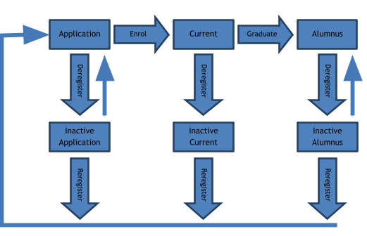

Notice, that on re-registration, all pupils become applicants once again.

It is possible, in the case of Applicants and Alumni to move between active and inactive statuses using feature provided on the “**Admissions**” tab under the “**Enrolment Administration**” heading: “**Manage admissions**”. On this page are two options: one is to manage the registration statuses of admissions pupils and the other is to manage the registration statuses of alumni. It is possible, here, to simply change the statuses as one chooses.

*Current pupils cannot simply change from an inactive to an active status and must be re-registered and enrolled as normal. Please see “Re-registering a Pupil” on page .*

## A Simple Example Workflow {#h-3ygebqi}

This process is followed by a number of schools which allows a simple enough flow of pupils through their system.

The school has three statuses for admissions:

1.  Current applicant
2.  Confirmed applicant
3.  Withdrawn applicant

Because the first and last are already provided, schools will need to add in the confirmed applicant.

When a space becomes available in the school, the list of “Current applicants” is searched to find a suitable pupil (based on the school’s admissions criteria) to fill that place. The parents are then contacted to follow up. One of three outcomes is possible:

-   The parents wish to accept the place: the registration status is changed to “confirmed admissions” status.
-   The parents do not wish to accept the place, but wish to remain on the waiting list, but perhaps for consideration in the following year: then the date of entry is changed for the pupil.
-   The parents do not wish to accept the place and wish to be removed from the waiting list: the pupil is deregistered.

This process can be illustrated as follows:

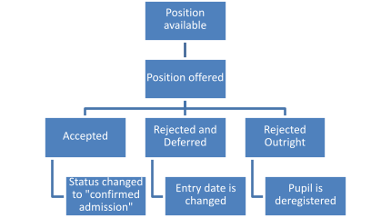

When the new term starts, all pupils who are in the “confirmed admissions” category can be enrolled into the school.

All pupils who were waitlisted and to whom places were not offered can then either be deferred or deregistered, depending on the admissions policy of the school.

## Managing the Registration Statuses {#h-2dlolyb}

To manage the Registration Statuses, click on the “**Admissions**” tab, then under the “**Enrolment Administration**” click on “**Edit the registration statuses**”.

The following screen shows the default registration statuses:

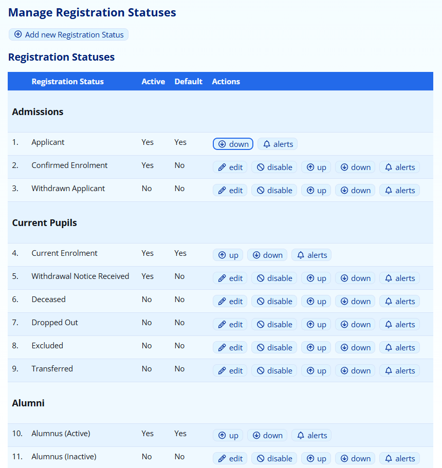

Next to each option you will see listed whether that stage is active or inactive and whether it is the default option or not. Notice that it is not possible to edit the default actions.

### Adding a new Registration Status {#h-sqyw64}

At the top of the “Manage Registration Statuses” screen (see the previous section on how to find this screen), click on the option for “**Add new Registration Status**”:

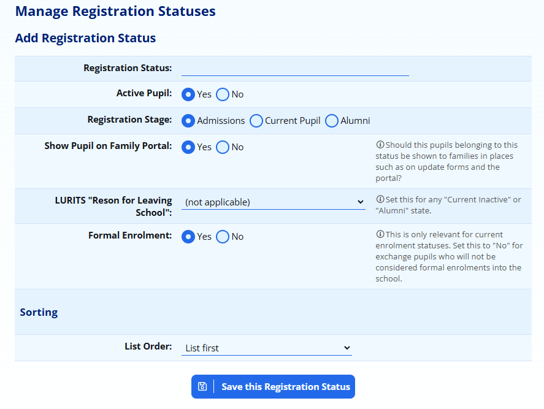

-   Enter the name of the **registration status**. This name should be unique since you don’t want to confuse yourself with other statuses.
-   Indicate whether pupils that are assigned to this status are **active** on your system (e.g. waiting for admissions, are currently enrolled, etc.).
-   Indicate which **registration stage** this status applies to.
-   It is possible to **hide pupils** who belong to this registration status from families on the family portal. This is particularly useful for statuses which might indicate a deceased pupil, for example
-   If the status is a “CURRENT” or  “INACTIVE” status, you must specify a corresponding **LURITS reason** for the status. Failing to do so will result in future LURITS submissions being potentially rejected.
-   The “**Formal Enrolment**” setting should only be set to “No” for current enrolments such as exchange students who are not officially a part of the school’s enrolment and should not be submitted to LURITS or SA-SAMS.
-   The **list order** allows you to specify where in the list you’d like the new status to appear.

### Disabling a Registration Status {#h-3cqmetx}

Next to each option in the “[Manage Registration Statuses](#h-2dlolyb)” page (except for the default statuses), it is possible to disable the registration statuses. This will not delete them or have any effect on people who are currently assigned to that status, but no further pupils will be able to be assigned to that status.

### Managing Registration Status Alerts {#h-ir2py95xyuyp}

Next to each registration status in the list provided on the “[Manage Registration Statuses](#h-2dlolyb)” page, there is an **alerts** option.

Clicking on this option allows you to select specific staff members who will be notified by ADAM whenever a pupil is added to this registration status.

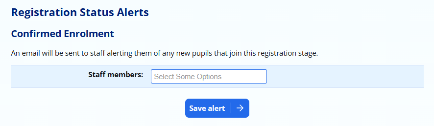

The registration status alerts are sent daily at set times. These can be configured in the [Site Settings](changing-site-settings.md#h-3j2qqm3) on the **cron** tab, under the heading **Registration Status Alerts**.

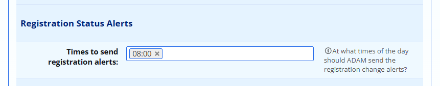

## Moving Pupils from one Admissions Status to Another {#h-1rvwp1q}

When you first add a pupil to the ADAM database, they are assigned to the default admissions status (Admissions: Applicant). It is possible to move them to different statuses as the need arises. For example, after a first round of notifying parents, some may respond and wish to progress to the next round of admissions at which point you will need to change their admissions status.

### Changing pupils’ admissions statuses – a single pupil at a time {#h-4bvk7pj}

1.  It is possible to change just a single pupil’s admissions status by finding that pupil’s information profile (Pupils >> Pupil Administration >> Pupil Info) and clicking on the “Admissions Records” section of the profile:

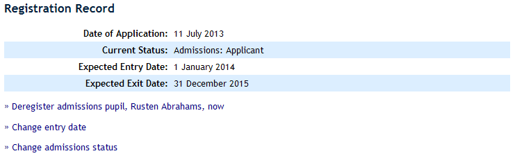

2.  Click on the “Change admissions status” option:

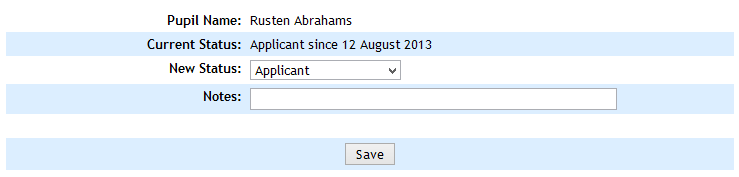

3.  Choose the new status from the list and provide a note on why the status change has happened.

 *You will only be able to choose the same type of registration status. For example, if the pupil is currently an active admission, you will only be able to choose other “active admission” statuses. To change the pupil to an inactive status, you must “Deregister” the pupil. See later in this section for deregistering pupils.*

*Once a pupil has been deregistered they can only choose from other inactive statuses using this method. To change this to an active status, the pupil must be “Re-registered”. See later in this section for re-registering pupils.*

### Changing pupils’ admissions statuses – many pupils at a time {#h-2r0uhxc}

There is a short-cut to managing the registration statuses of many pupils at once. This includes simplifying the transition between active and inactive statuses – specifically when dealing with admissions and alumni statuses.

 *Because of the significantly more complex operations required when an active enrolment is deregistered, these options are not available for any “Current” statuses.*

1.  On the “Admissions” tab, under the “Enrolment Administration” heading, click on the “Manage Admissions” option.
2.  Click on “Edit the registration records of admissions pupils”
3.  Choose their year of entry (admissions). This year is captured when the pupil is first added to ADAM.
4.  Choose the current status of the pupils.
5.  A list of all the matching pupils will appear. Choose the new admissions status for the pupil and add in a reason.
6.  If pupils’ statuses remain the same and no note is entered, no adjustments are made on their admissions record.
7.  Once the changes are made, click on the “Save Statuses” button at the bottom of the page.

## Changing an Admissions Date {#h-1664s55}

Occasionally it is necessary to change a pupil’s date of entry. This can be done using the option on the “**Admissions**” tab under the “**Enrolment Administration**” heading: “**Change a pupil’s entry date**”.

1.  Search for the pupil concerned.
2.  Choose a new date of entry and provide a note for the change of date.
3.  Click on the “Next” button.

 *When pupils enter a school at the start of the year, their entry date should be captured as 1 January of the year of entry. This is because when the year end procedure happens, ADAM will automatically advance the date to 1 January of the following year. This allows administrators to work on ADAM as if it is the New Year. However, if pupils have an entry date for later on in January, they will not show up as current pupils at that point.*

## Rolling-over Waitlisted Pupils {#h-52179ay4tuir}

It is possible to change the proposed date of entry for any pupils who are not offered places at your school and so keep them on the waitlist for the following year.

Navigate to **Admissions → Enrolment Administration → Manage admissions**. On this page, select the option to **Roll over entry years**.

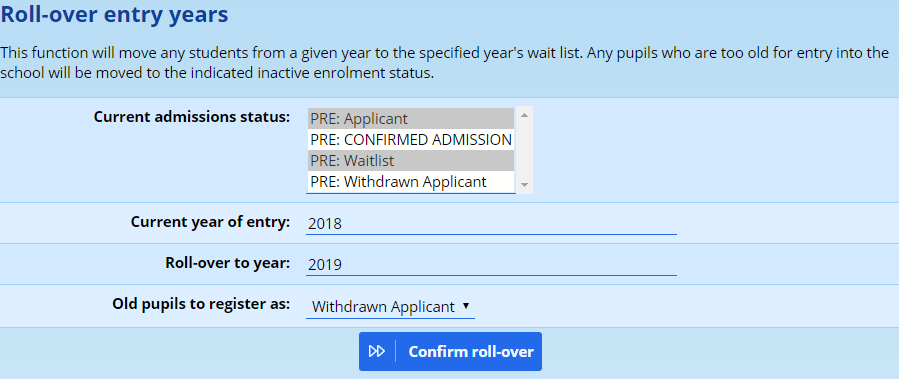

Select the admissions statuses that need to be rolled over.

*Note carefully that one should specifically avoid chosing a status which has pupils waiting to enter the school in the current year. In the example above, the* ***Confirmed Admissions*** *has been excluded. This is particularly relevant when the selected current year of entry is the same as the current calendar year.*

The **Current year of entry** is the year that the pupils currently have set as their entry year.

The **Roll-over to year** is the year that they should be changed to. Note that their dates of entry will be changed to January 1st of that year. This is typically set as the current year or next calendar year.

**Old pupils to register as** indicates how ADAM should treat pupils who are too old to be registered in your school. For example, if a pupil is waitlisted and in Grade 12, they would be finished school in the following calendar year and thus it makes no sense to keep them on the waitlist. Such pupils are moved into the selected status - in this case, a **Withdrawn applicant**.

When you’re ready to proceed, click on the button.

ADAM will then show a list of pupils who will be affected by this change and ask you to confirm the change.

*Please check this list carefully before proceeding. It is not possible to undo this change automatically.*

## Processing Enrolments of Pupils {#h-3q5sasy}

At the end of the admission process, it is necessary to register those pupils as current pupils. This is normally done prior to the start of the academic year in order to assign those pupil to new classes. This procedure moves pupils from the “Admissions” stage to the “Current Pupils” stage and automatically assigns them to the default Current Pupil registration status.

 *When processing enrolments for new pupils entering the school in the lowest grade, this should be done AFTER the year end procedure.*

1.  On the “**Admissions**” tab, under the “**Pupil Administration**” heading, click on the “**Process admissions and enrolments**” option.
2.  If there is more than one active admissions registration status, you will be asked to choose which one you wish to process enrolments from. If there is only one, you will automatically advance to the next step.
3.  All pupils who have an entry date for the current year will be displayed. If any of them have entry dates that are in the past, they will automatically be selected to “Enrol pupil now”. Others will have the option to “Do not enrol pupil now” selected. Adjust these options as necessary.
4.  Click on the “**Enrol pupils**” button at the bottom.

Those pupils are now enrolled.

 *If any pupil had a future date and was selected to enrol, their enrolment date will automatically be changed to the current date.*

## Deregistering a Pupil {#h-25b2l0r}

Deregistering a pupil moves them from an active to an inactive state on the system. While they will still appear in searches for them, they are not available for selection anywhere else on the system. The deregistration process does a number of other behind-the-scenes operations, including the removal of a pupil from all their classes and a number of other tidying operations.

### Deregistering an individual pupil {#h-6y0fcwkei0c7}

Pupils can be deregistered either from their information page, on the **admissions record** tab.

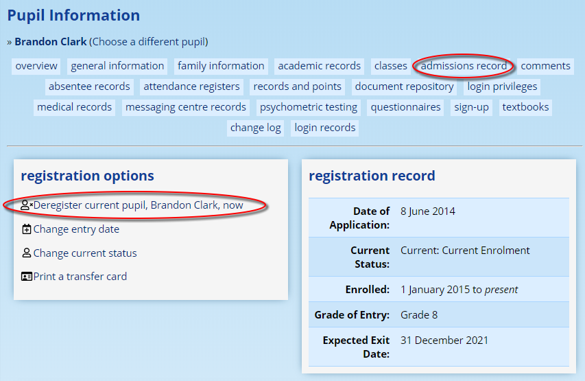

Once selected, you will be given an opportunity to choose the reason for the deregistration, give a date and make any notes that you may require.

The same effect can be achieved by navigating to **Admissions → Enrolment Administration → Deregister a pupil**. You will be asked to first search for a pupil. In the subsequent screen, provide the new registration status, the date of exit and any notes surrounding the change in registration.

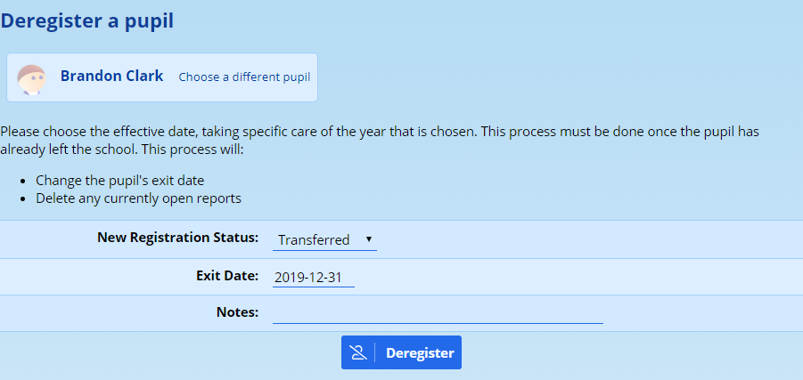

### Deregistering pupils in bulk {#h-b8rj3jsv46ba}

Navigate to **Admissions → Enrolment Administration → Deregister pupils in bulk**.

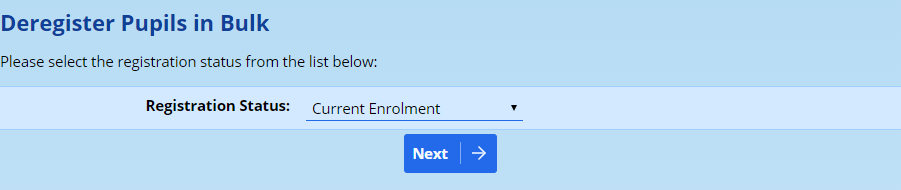

At the top of the screen you can set a deregistration date and add a note. These details will apply to all pupils you select below.

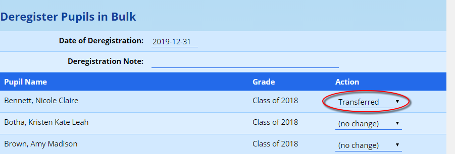

Next to the pupils you’d like to deregister, change their status to an appropriate one. Those that are not to be deregistered should be set to “(no change)”. At the bottom of the page, click on the button to **Deregister Selected Pupils**.

## Re-registering a Pupil {#h-kgcv8k}

If a pupil has been deregistered, there are a few options to re-register them.

### Re-registering pupils individually (Admissions, Current and Alumni) {#h-34g0dwd}

All pupils can be re-registered individually. To do this:

1.  On the “**Pupils**” tab, under the “**Pupil Administration**” heading, click on “**Pupil Information**”.
2.  Search for the pupil concerned.
3.  Click on “**Admissions Record**” in the headings at the top.
4.  Click on the option to “**Re-register**” the pupil.
5.  Enter a new date of entry and a reason relating to the re-registration.

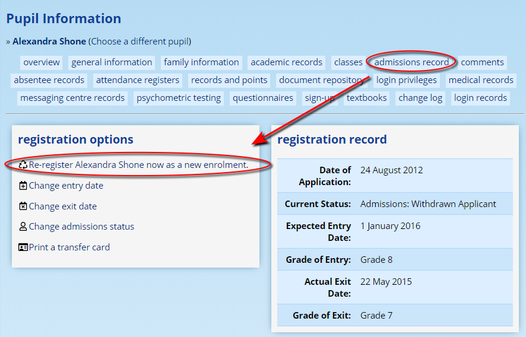

The pupil will now appear in the **admissions lists as a new applicant** to the school and should be enrolled the same as any other new applicant.

### Re-registering pupils in bulk (Admissions and Alumni only) {#h-1jlao46}

This method does not work for current pupils who must follow a more rigorous process.

1.  On the “**Admissions**” tab, under the “**Enrolment Administration**” heading, click on the “**Manage Admissions**” option.
2.  Choose whether you’d like to change admissions or alumni statuses.
3.  Choose the year of entry for admissions, or year of exit for alumni.
4.  Choose the current status of the pupils in question.
5.  Adjust the pupils to reflect a new status (even an active one). Enter a note to explain the change.
6.  Click on the “**Save**” button at the bottom.

These pupils will now appear in the **admissions lists as new applicants** and should be enrolled the same and any other new pupils.

## Editing the Registration Log {#h-626bkbi9babv}

 *In the normal running of ADAM, it should not be necessary to edit the registration log. Please be aware that registering or deregistering pupils solely by editing their registration log will bypass a number of operations and may result in unpredictable behaviour!*

At the bottom of the Admissions Records within the Pupil Information is a registration log. This can be edited by users with the necessary permissions. This is allowed to correct comments or statuses.

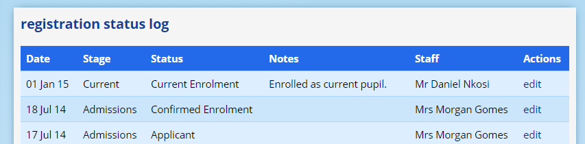

The privilege to edit the admissions log should not be given out lightly and can have unintended consequences.

## Deregistration During A Reporting Period {#h-jz51f2khzxix}

If a pupil is deregistered while any reporting is open, ADAM will behave slightly differently.

Normally, when a pupil is deregistered after a reporting period has closed, their membership of any classes is no longer important or relevant since there are no further reports for them to receive. ADAM will change their registration status to indicate that they have been deregistered, and additionally remove them from all their classes. This can be seen in the class registration log which will show the date of deregistration as the date that their membership of the classes was terminated.

However, when a pupil is deregistered when a reporting period is still open, ADAM must keep in mind the possibility that the pupil will still require a report at the end of the Reporting Period. ADAM cannot remove them from their classes in case there are academic results from those classes that need to be carried over onto the reports. As such, ADAM will set the date of termination to the *day after* the reporting period closes. This future dated deregistration can cause some anomalies which it is useful to be aware of.

### “Deregistered pupils still show up on my class list!” {#h-woh5umlg3euy}

Because ADAM has future-dated the deregistration, whenever teachers produce lists to do with the academics, these pupils will still appear on those lists. They will still be in the markbook and will still appear on the reporting screen.

All of these issues should resolve once the reporting period’s date passes.

### “A reregistered pupil no longer shows up on my class list!” {#h-s4uk2xndoncd}

Occasionally, it can happen that a pupil is deregistered during the course of a reporting period. From above, remember that this will future-date their removal from their classes. However, it can happen that the decision to deregister the pupil is changed and the pupil re-joins the school.

Initially, there doesn’t appear to be any problems and things carry on as normal. Then, suddenly, one day, the pupil disappears from all their classes! This is because the future-date deregistration takes effect. It is important to take into account that a re-registration does *not* adjust any class registrations and so the future-dated deregistrations are not undone simply because the pupil is re-registered into the school.

In this instance, manual intervention is required. The pupil will need to be [added back to his or her classes](class-registration.md#h-2bn6wsx). Advanced users may decide to [edit the class registration records](class-registration.md#h-3mdtgu7s6ipl) to adjust the records to reflect that the registration records are still current.
