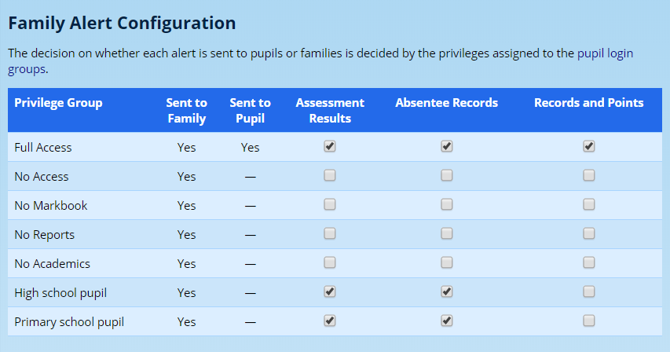
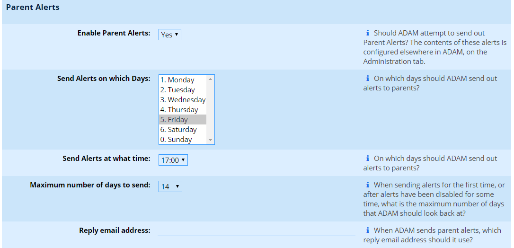

# Family Alerts

Family Alerts can be sent to parents and or pupils at regular intervals to send them information that they might otherwise miss if they don’t log into the Parent Portal. This information includes (optionally):

-   Daily absentee records
-   Records and Points
-   Assessment results

To configure the Family Alerts, one must first choose which [pupil login privilege groups](security-administration-for-families-and-pupils.md#login-group-principles) will get what information. In so doing, it is possible for parents to to receive differentiated information based on the privilege group that their child belongs to.

!!! warning
    If no alerts are generated for a child in a particular time frame, no email is sent.

## Enabling Family Alerts for Privilege Groups

It is possible to choose which privilege groups are sent alerts. For example, you may wish for some groups to have Family Alerts sent only to parents and some groups sent also to pupils. This is done in the [Pupil Login Privileges](security-administration-for-families-and-pupils.md#managing-login-groups) section. You will want to enable to **Family Alerts** privilege for pupils and/or parents.

## Setting Alerts for Login Groups

Navigate to **Families → Security → Edit family privileges for Family Alerts**.

Next to each privilege group, place a checkbox in the appropriate columns of the alerts that you’d like them to receive.

Note that if there is a “hyphen” in the **Sent to…** column, you will need to [change the privileges for that group](#enabling-family-alerts-for-privilege-groups) before alerts will be sent.

The Family Alerts delivery can be changed lower down on this page. These settings are the same ones that you might find in the site settings (**Administration → Site Administration → Site Settings**), under the **Communications** tab below the heading **Family Alerts**. However, this allows someone to edit these particular settings without having to give them access to the entire site’s settings.

The Family Alerts can be **enabled** or disabled altogether here. If this setting is set to “No”, then

One can choose **which days to send** the alerts, as well as the **time of the day** to send the alerts. ADAM defaults to once a week on Fridays. However, this could be daily.  When determining which alerts to send, ADAM will only include alerts that have arisen since the last time an alert was sent.

If alerts have not been sent before, or have been turned off for a long time, ADAM will only look back a **maximum number of days** as defined here. This prevents the first Family Alert from containing information from years back.

!!! warning
    Note that if the “maximum number of days” is less that the interval between alerts (e.g. you set a maximum number of days to 1, but alerts are sent out on Fridays - every 7 days), then there is an excellent chance that information will be missing from your alerts.

If a **reply address is provided**, then any parent replies to their alert will be directed to that person. If left blank, the default “from” address will be used. For a number of schools, this is a generic “noreply” address which may be problematic.

Use the **Save…** button at the bottom to save any changes to this screen.

## Customising Alert Content

Currently the assessments and absentee alerts do not provide for any customisation in content.

Records and points, however, will follow the same settings which define whether the records and points categories are shown on the parent portal. More can be found in the information regarding [adding and editing Records and Points](records-and-points-administration.md#adding-a-new-records-and-points-category) later in this manual.

## Customising the Covering Email

You will need to customise the **Family Alerts** template in the [email templates](email-message-templates.md#email-message-templates).
