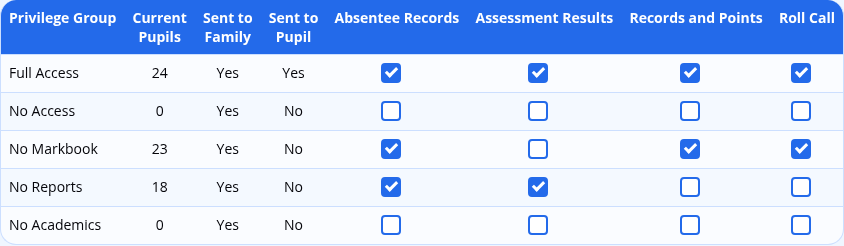
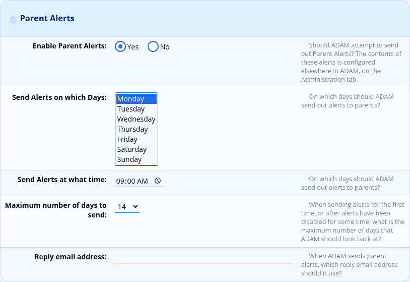
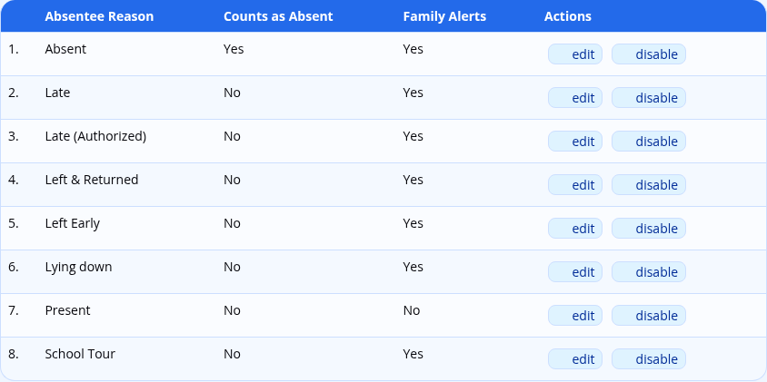
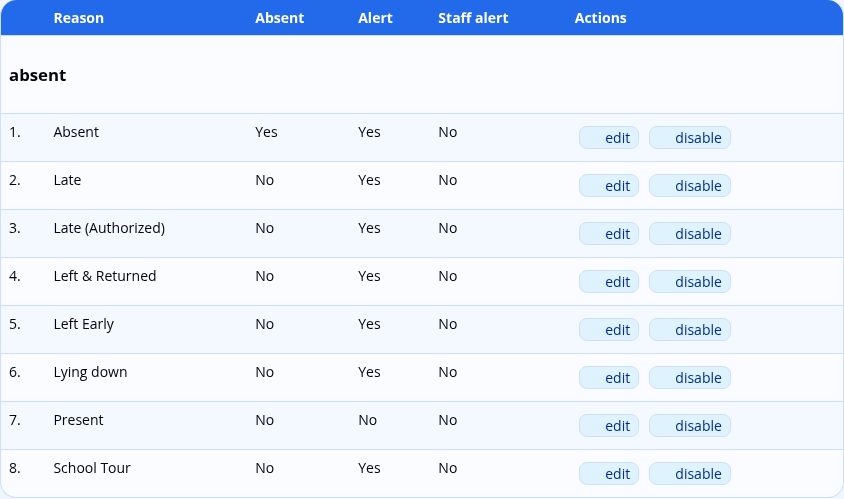
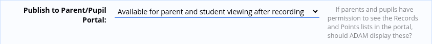
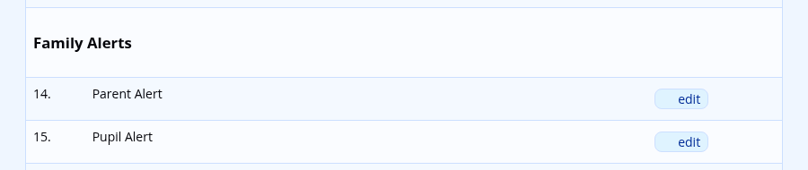

# Family Alerts

Family Alerts can be sent to parents and or pupils at regular intervals to send them information that they might otherwise miss if they don’t log into the Parent Portal. This information includes (optionally):

-   Absentee records
-   Assessment results
-   Records and Points
-   Roll call attendance

To configure the Family Alerts, one must first choose which [pupil login permission groups](security-administration-for-families-and-pupils.md#login-group-principles) will get what information. In so doing, it is possible for parents to receive differentiated information based on the permission group that their child belongs to.

!!! tip
    Many combined prep and high schools take advantage of this so that high school pupils can get assessment notifications, for example, but pupils in the prep school will not. This requires that high school and prep school pupils belong to [different permission groups](security-administration-for-families-and-pupils.md#login-group-principles).

!!! note
    If no records have been generated for a child in a particular time frame, no email is sent.

## What Goes Into an Alert

A Family Alert is a single email per child. Inside it, the entries are grouped under a heading for each kind of alert, and each entry is a one-line summary: a heading, the detail, any note that was recorded, and — where ADAM knows it — the name of the staff member who made the record, as a link that the parent can reply to.

The four kinds of alert, and where their content is controlled, are:

| Alert | What it reports | Where the content is decided |
|-------|-----------------|------------------------------|
| Absentee Records | Whole-day absentee records | The **Include in Family Alerts** setting on each [absentee reason](#absentee-records) |
| Roll Call | Individual roll call marks | The **Include in alert** setting on each [roll call reason](#roll-call) |
| Records and Points | Records and points awarded to the pupil | The **Publish to Parent/Pupil Portal** setting on each [category](#records-and-points), and whether its group is marked **Sensitive** |
| Assessment Results | Marks that have been released to parents | The [**Results Release Time**](#assessment-results) on each assessment, and its **Permanently Hide from Parents and Pupils** setting |

Absentee Records and Records and Points are only offered as alerts if those modules are switched on for your school.

## Enabling Family Alerts for Permission Groups

It is possible to choose which permission groups are sent alerts. For example, you may wish for some groups to have Family Alerts sent only to parents and some groups sent also to pupils. This is done in the [Pupil Login Permissions](security-administration-for-families-and-pupils.md#managing-login-groups) section. Under the **Pupil and Family Logins** heading, in the **General** category, you will want to enable the **Receive Family Alerts** permission for pupils and/or parents.

## Setting Alerts for Login Groups

Navigate to **Families → Security → Manage Family Alerts**.

Next to each permission group, place a tick in the appropriate columns of the alerts that you’d like them to receive.

The first four columns are there to tell you what will happen; they are not editable on this screen:

-   **Privilege Group:** the pupil login permission group.
-   **Current Pupils:** how many currently enrolled pupils are in that group. A group with no pupils in it will never generate an alert, however many boxes you tick.
-   **Sent to Family:** whether parents in this group hold the **Receive Family Alerts** permission.
-   **Sent to Pupil:** whether pupils in this group hold it.

!!! note
    If both the **Sent to…** columns say “No”, nothing will be sent to that group. You will need to [change the permissions for that group](#enabling-family-alerts-for-permission-groups) first.

The Family Alerts delivery options can be changed lower down on this page. These settings are the same ones that you might find in the site settings (**Administration → Site Administration → Edit site settings**), under the **Notifications & Scheduling** tab below the heading **Parent Alerts**. However, this allows someone to edit these particular settings without having to give them access to the entire site’s settings.

The Family Alerts can be **enabled** or disabled altogether here. If this setting is set to “No”, then no alerts are sent to anybody, whatever is ticked in the table above. ADAM shows a warning just below the table to remind you of this.

One can choose **which days to send** the alerts, as well as the **time of the day** to send the alerts. ADAM defaults to once a week on Fridays. However, this could be daily. When determining which alerts to send, ADAM will only include alerts that have arisen since the last time it looked at that child — which is the last time alerts ran, whether or not that particular child had anything to report.

If alerts have not been sent before, or have been turned off for a long time, ADAM will only look back a **maximum number of days** as defined here. This prevents the first Family Alert from containing information from years back.

!!! warning
    Note that if the “maximum number of days” is less that the interval between alerts (e.g. you set a maximum number of days to 1, but alerts are sent out on Fridays - every 7 days), then information generated from Saturday to Wednesday will be missing from your alerts.

If a **reply address is provided**, then any parent replies to their alert will be directed to that person. If left blank, the default “from” address will be used. For a number of schools, this is a generic “noreply” address which may be problematic.

Use the **Save** button at the bottom to save any changes to this screen.

## Customising Alert Content

The alert is assembled from records that already exist elsewhere in ADAM, so its content is customised where those records are set up rather than on the Family Alerts screen itself. Ticking a box on the configuration table above says *that this kind of alert may be sent*; the settings below decide *which individual records qualify*.

### Absentee Records

Only absentee reasons that are marked for alerting are ever reported to parents. Navigate to **Administration → Absentee Administration → Edit the absentee reasons**. The **Family Alerts** column shows, at a glance, which reasons currently qualify.

Click **edit** next to a reason and set **Include in Family Alerts** to “Yes” or “No”.

This is how a school stops routine records — a reason such as “Present”, or an authorised absence the parent arranged themselves — from filling up the alert. The absentee record’s note, if the office recorded one, is included with the entry.

### Roll Call

Roll call marks are filtered by the same setting, because roll call and daily absentees share one list of reasons. Navigate to **Administration → Roll Call → Manage reasons** and set **Include in alert** to “Yes” for each reason that parents should hear about.

!!! warning
    Changing a reason here changes it for daily absentees too, and the other way around — they are the same reasons. The screen warns you of this when you open it.

Two things about roll call are worth knowing:

-   **Alert** and **Staff alert** are different settings. **Alert** (**Include in alert**) puts the mark into the family digest described on this page. **Staff alert** (**Alert staff when marked**) sends an immediate email to nominated staff, and is described under [Roll Call Absence Alerts](roll-calls.md#roll-call-absence-alerts).
-   Marks that ADAM created by itself when the roll call was opened — a pupil already recorded as on [leave](leave-module.md#leave-module), for example — are never included. Only a mark that a person actually made is reported.

### Records and Points

Records and points follow the same settings that decide whether a category is shown on the Parent Portal. Navigate to **Administration → Pastoral Administration → Edit the Records and Points categories**, click **edit** next to a category, and look at **Publish to Parent/Pupil Portal**.

There are three options, and each behaves differently in the alert:

-   **Available for parent and student viewing after recording:** the record is reported in the next alert after it is recorded.
-   **Available for parent and student viewing after attendance:** the record is held back until the pupil has been marked as having attended, and is reported in the next alert after *that*. This option only appears for categories that have an attendance register. It is the right choice for something like a detention, where the parent should hear that it was served rather than only that it was set.
-   **Hidden from parent and student viewing:** the record never appears in an alert.

Two further settings shape what the parent sees:

-   Categories in a group marked **Sensitive** are never included in an alert, whatever their publishing setting. Groups are managed under **Administration → Pastoral Administration → Edit the Records and Points Category Groups**. See [Managing Records and Points Category Groups](records-and-points-administration.md#managing-records-and-points-category-groups).
-   For a points category, the entry is prefixed with the number of points awarded, so a parent sees “3 x Merit” rather than just “Merit”.

More can be found in the information regarding [adding and editing Records and Points](records-and-points-administration.md#adding-a-new-records-and-points-category) later in this manual.

### Assessment Results

Assessment results are not filtered by a setting of their own — an assessment appears in the alert once it has been released to parents, and is left out otherwise. In practice that means:

-   The **Results Release Time** on the assessment governs when the mark is reported. A mark captured today but set to release next Monday will appear in the first alert after next Monday, not tonight. A site-wide mark book embargo pushes that time out in the same way.
-   An assessment set to **Permanently Hide from Parents and Pupils** — an advanced setting on the assessment itself — never appears.
-   Pupils marked absent for an assessment produce no entry.
-   Marks are shown out of the assessment total with a percentage. Where an assessment is recorded by level rather than by mark, the levels are listed instead. The teacher’s comment, if there is one, is included.

!!! tip
    If parents are seeing marks earlier than you would like, the **Results Release Time** on the assessment is almost always the setting to change — not the Family Alerts configuration.

### What Cannot Be Changed

The layout of the alert itself is fixed. The order of the sections, the wording of each entry, and the fact that the staff member’s name appears as a link are all built into ADAM and cannot be configured per school. What you can change is the covering email around them, described next.

## Customising the Covering Email

The text above and below the list of records comes from an email template. There are two of them, and they are edited separately, so a school can address parents and pupils differently. Navigate to **Administration → Site Administration → Manage email messages** and look under the **Family Alerts** heading.

-   **Parent Alert** — the email sent to parents.
-   **Pupil Alert** — the email sent to pupils.

Both understand the same merge codes:

| Merge code | What it becomes |
|------------|-----------------|
| `{pupil}` | The pupil’s first and last names |
| `{pupilfirst}` | The pupil’s first name |
| `{greeting}` | The parents’ names in the Parent Alert; the pupil’s first name in the Pupil Alert |
| `{lastalert}` | The date ADAM last looked, for example “Tuesday, 5 July” |
| `{school}` | The school’s name as defined in Site Settings |

The list of records is inserted between the **Top of Message** and the **Bottom of Message** sections, so write the top as an introduction and the bottom as a sign-off. Full instructions on editing a template are on the [email templates](email-message-templates.md#email-message-templates) page.

!!! note
    Family Alerts are treated as a required school communication, so a parent cannot switch them off from their own communication preferences. Control them from the configuration table instead.

## When an Alert is Not Sent

If a parent tells you they have received nothing, work down this list:

1.  **Enable Parent Alerts** is set to “No” — nothing at all is sent.
2.  Today is not one of the configured **Send Alerts on which Days**, or the configured time has not yet passed.
3.  The child is not in a pupil login permission group at all. ADAM skips these pupils and records the fact in the cron log. Assign the pupil a group as described under [Assigning pupils to login groups](security-administration-for-families-and-pupils.md#assigning-pupils-to-login-groups).
4.  The child’s permission group has no alert types ticked, or neither **Sent to Family** nor **Sent to Pupil** is “Yes” for it.
5.  Nothing qualified in the period — every absentee or roll call reason involved is excluded, the records and points categories are unpublished or sensitive, and no assessment was released. ADAM sends no email rather than an empty one.
6.  For a **Pupil Alert** specifically, the pupil has no valid email address recorded.
