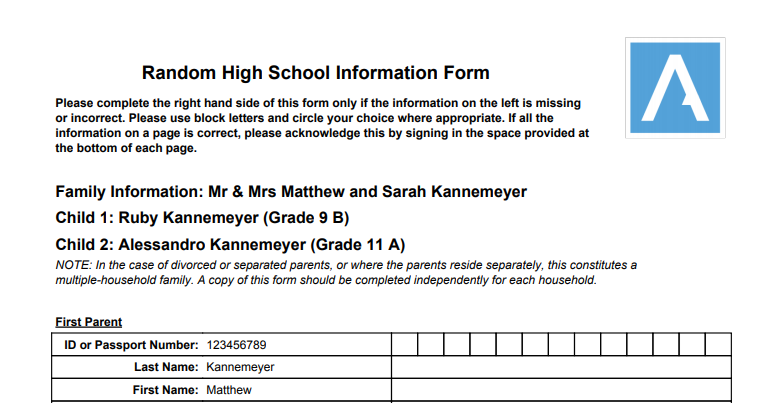
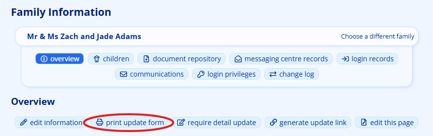
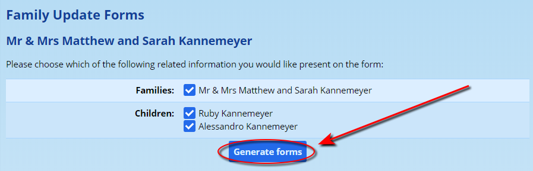
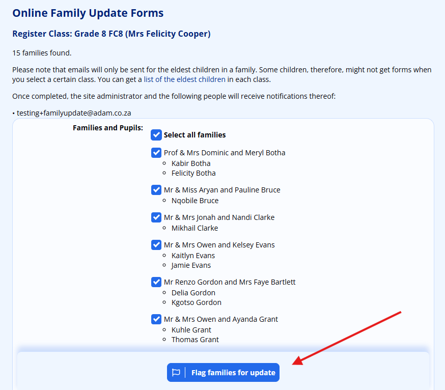
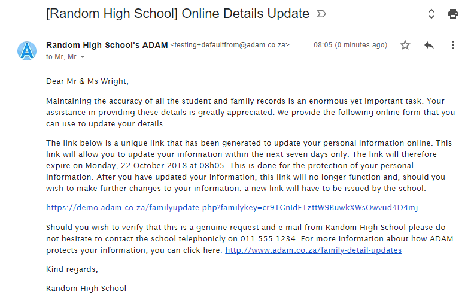
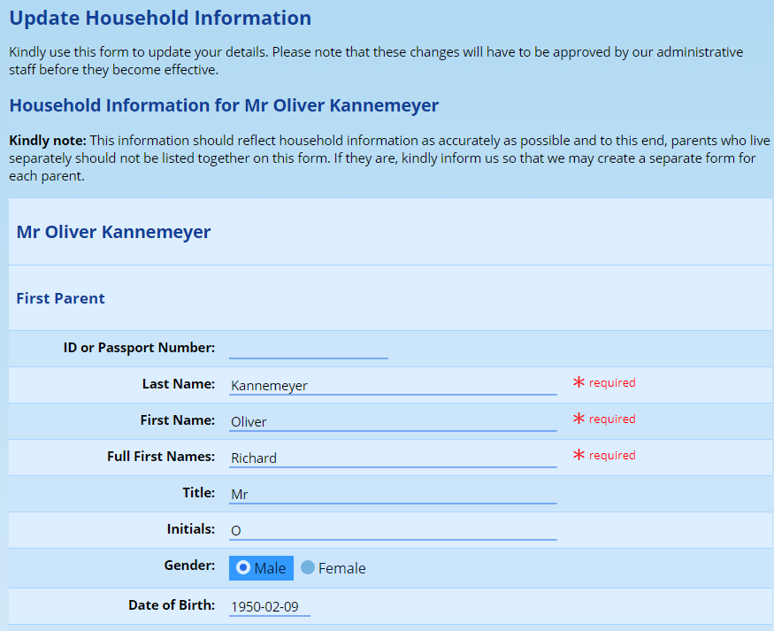
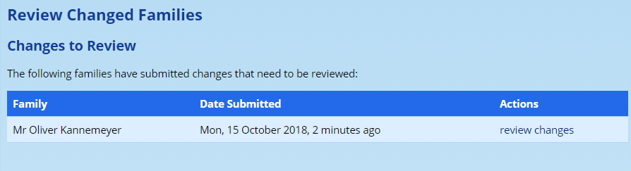
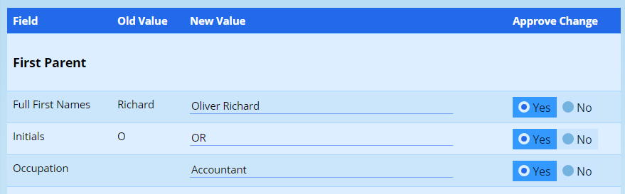

# Family Detail Updates {#h-mohd29it4udo}

There are two main mechanisms to update family information. The first involves sending a hardcopy of a detail update form to the family. This form is then returned to the school and will be captured manually into ADAM. The second is an online form that parents complete and the information is captured in the database, ready for approval.

## Customising the Online Detail Update Forms {#h-lik3d25jsz3j}

Very often schools will have confidential information or, at the very least, information that is not within a parent’s purview to change. This might be the pupil’s sport house, or grade, for example. An example is often the “General Notes” field in a pupil’s profile which schools use to record confidential information. Such information should not be presented to parents for them to view and update.

ADAM can allow certain fields to be shown and/or hidden on detail update forms. More information can be found in the sections discussing the management of [core database fields](database-field-management.md) and [custom database fields](database-field-management.md#h-1hmsyys).

Only the fields that are allowed to show on an update form will show. This affects both the [hardcopy](#h-dw2rkqlntt5d) and [online](#h-kcsulkk6x2rk) detail update forms. Field restrictions configured here apply to every flow described on this page, including the forced-update interrupt — there is no need to re-audit your update profiles when adopting forced updates.

## Hardcopy Detail Update Forms {#h-dw2rkqlntt5d}

These forms can be printed out and distributed to parents.

The form is produced showing all existing information regarding the family on the left hand side and a space on the right for any corrections that need to be made:

Note that the [schools can choose which fields appear on the form](database-field-management.md), and that such customisations will carry to both this printed form and the online detail update form discussed below.

### Producing a Detail Form for a Single Family {#h-4msqnwjw8hm1}

Navigate to **Families → Family Administration → Family Info**, then select **Print detail update form** for the printed version, or **Email detail update form link** to flag the family for an online update (and optionally send them a magic-link email at the same time).

Alternatively, use **Families → Detail Update Forms → Detail update forms** to search by family name and select specific children for the hardcopy.

When forms are returned, the changes on them must be manually captured by the school. This has obvious implications for already busy staff.

### Producing Detail Update Forms for a Class of Pupils {#h-9jighsh5g0rz}

Instead of printing forms one-by-one, they can be produced for a class of pupils. Navigate to **Families → Detail Update Forms → Details update forms by class**.

Here you will choose a class of pupils to produce the forms for. It often makes sense to use a grade-wide class to save repeating the steps too many times.

Note that ADAM will only produce an update form for the youngest/eldest children in a family (this can be customised in the [Site Settings](changing-site-settings.md#h-3j2qqm3)). This means that when printing detail forms for a class, not every child in the class will receive a form.

## Online Detail Update Forms {#h-kcsulkk6x2rk}

Online detail update forms are presented to parents inside the family portal. When a family is flagged for an update, the portal blocks access to all other features at the parent's next login until the requested forms have been completed. See the [Forced detail updates](#h-yxpb85w43z44) section below for a full description of the new flow.

For families who do not use the portal, ADAM can additionally send a "courtesy" email containing a magic link valid for 7 days (configurable in [Site Settings](changing-site-settings.md#h-3j2qqm3)). The courtesy email is opt-in per distribution and is most useful for families who have never logged in. Parents who follow the link are taken straight into the same form sequence without needing to sign in.

### Distribution {#h-6643pjcf4z7t}

Navigate to **Families → Detail Update Forms → Distribute online detail update forms**.

Select a class and tick the families to include. The submit button (**Flag families for update**) creates an update request against each selected family that will interrupt the parent at their next portal login. A **Courtesy email** drop-down lets you optionally also send a magic-link email at the same time — either to all selected families, only to those who have never logged in to the portal, or only to those who have not logged in within the profile's cadence.

Once you have chosen the class, click on **Send e-mails with links**:

You will note that ADAM lists an email address that will be notified of the submitted information. This address can be customised in the [Site Settings](changing-site-settings.md#h-3j2qqm3). More than 1 address can be chosen.

Parents will then receive an email similar to this:

Towards the middle of the email is the link that parents should click on to update their information:

Parents will then complete this information and click on the **“Save information”** button at the bottom of the form.

Once they have done this, a notification is automatically sent to the email addresses that were listed on the first screen.

The information is *not* stored directly in the database. Instead, it is saved temporarily, waiting manual approval. Only once it has been approved by the school will the updated records show.

### Reviewing Detail Update Forms {#h-7xe69ksoii7f}

Navigate to **Families → Detail Update Forms → Review Submitted Changes**. Any changes that require approval will be listed here:

Click on the option to **review changes**.

ADAM will display only the fields that had changes made to them. These can be edited or refused altogether by setting the “Approve Change” value to “No”:

At the bottom of the screen, click on the **“Save Changes”** button.

A banner in the family portal automatically lets the parent know when their submission is awaiting review and again when it has been reviewed.

### Reviewing the Detail Update Report {#h-33iy6q879jan}

Use **Families → Detail Update Forms → View online detail update report** to track the status of update requests across three categories: *pending updates* (families that have been flagged but have not yet submitted), *expired links* (families whose courtesy email link has lapsed without being used), and *submissions awaiting approval*. The expire, renew and resend actions on each row continue to apply to the courtesy-email link.

## Forced detail updates {#h-yxpb85w43z44}

The school can now require parents to review and update their family details the next time they log in to the family portal. When a family is flagged, the portal blocks access to all other features until each requested update form has been completed. This replaces the older "email a magic link and hope they click it" approach and supersedes most of the workflow on this page.

A request to update is called a trigger. Each trigger points at one update profile. A family can have several open triggers at once (for example one each for contact details and medical information); the parent works through them one form at a time, and the portal is unlocked once the queue is empty.

### Configuring an update profile {#h-w6l7g3vky0yl}

Three settings on each update profile control the new behaviour. Manage them from **Families → Detail Update Forms → Manage Detail Update profiles** (also available from **Administration → Database Administration → Manage Detail Update profiles**).

-   Audience. Pick which group the profile applies to. Existing profiles have been set to External — Update, which is the audience used by every flow described on this page.
-   Default profile. Exactly one profile per audience can be marked as the default. The default is what self-service updates and unattended cron runs use when no specific profile is named.
-   Cadence (months). Set a number of months to have ADAM re-flag every family on this profile automatically once the cadence elapses since the last completed submission. Leave blank to disable automatic re-flagging.

### Manually flagging families {#h-d7oqpz1zywou}

The page that used to email magic links to parents now writes a flag on each selected family instead. Open **Families → Detail Update Forms → Distribute online detail update forms** and pick a class as before. The submit button is now labelled Flag families for update. On submission, ADAM:

-   creates an open trigger against each selected family for the chosen update profile;
-   silently absorbs duplicates if a family already has an open trigger for that profile (it just refreshes the request timestamp); and
-   warns staff about any family in the selection that already has changes awaiting review — the flag is still applied, but the staff member should be aware before continuing.

A new **Courtesy email** drop-down chooses whether ADAM should also send an old-style magic-link email at the same time, and to whom:

-   None — rely entirely on the next portal login.
-   Only families that have never logged in — recommended; keeps the email backstop alive for parents who do not use the portal at all.
-   Only families that have not logged in within the cadence — useful for catching families that have drifted away from the portal.
-   All selected families — equivalent to the old behaviour.

The single-family equivalents on a parent's profile page (Email detail update form link) and on a pupil's profile page work the same way: they flag the family and optionally issue a magic-link backstop in one step.

### Scheduled updates {#h-h7zq87fdk8a0}

If an update profile has a cadence set, ADAM's overnight cron flags every currently-registered family whose last completed submission for that profile is older than the cadence. Families that already have an open trigger, or that have unreviewed staged changes, are skipped on that pass and reconsidered the next night. No staff action is required.

### Self-service from the portal {#h-vdwe7xw1puwa}

When a default External — Update profile is configured, a new menu entry appears in the family portal at Family → Update personal details and family information. Selecting it raises a trigger against the family using the default profile and takes the parent straight into the update flow — no email round-trip required. If no default profile is configured for the school the menu entry is hidden.

### The parent experience {#h-vk219gpezhq4}

The first time a flagged family logs in, the dashboard intercepts the session and redirects to the update form. The flow is:

1.  The parent signs in normally.
2.  If the session is older than ten minutes, ADAM presents a short re-authentication page (see below) before showing any data.
3.  The first outstanding update form is displayed, pre-populated with the family's current information.
4.  On submission, the next outstanding form (if any) is displayed, already showing the values the parent just entered for any field that appears on both forms.
5.  Once the queue is empty the parent is released to the portal and a banner confirms that the submission is awaiting school approval.

Submitted changes still land in the staging area and still require staff approval before they reach live records — the existing review process at **Families → Detail Update Forms → Review submitted changes** is unchanged.

### Re-authentication gate {#h-lc8ixvr2x8mx}

Because the update form discloses the family's existing personal information before they edit it, ADAM requires that the session is "fresh" — less than ten minutes since the last password or passkey challenge. A parent who has just signed in passes this automatically. A parent who left a tab open for several hours is shown a short page asking them to re-enter their password (or use a registered passkey) before the form appears. This gate sits in front of the update form only; the rest of the portal is unaffected.

### Banners {#h-hwkmhbeods3q}

The family portal now shows a dismissable banner above every page when:

-   the family has a submission awaiting school review; or
-   a previous submission has just been reviewed by staff.

Each banner is tied to the specific submission, so dismissing one will not suppress a later one.

### The magic-link backstop {#h-otk5a7ep0uh}

Email magic links continue to work for families who do not log in to the portal. The link is now tied to the trigger row rather than to the family record, but the parent's experience is the same: clicking the link takes them to the update form sequence without requiring a login. If the link has expired the parent is sent to the family login page; once they sign in, the forced-update interrupt picks up the same outstanding triggers and walks them through the forms.

### Reporting {#h-lbomqkace0pl}

The status overview at **Families → Detail Update Forms → View online detail update report** now reports on triggers rather than on pending magic links. It shows pending updates (open triggers), expired backstop links, and submissions awaiting approval, with the same expire/renew/resend actions per family.
