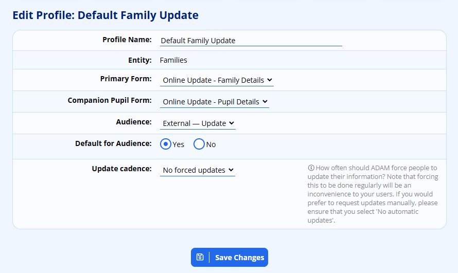
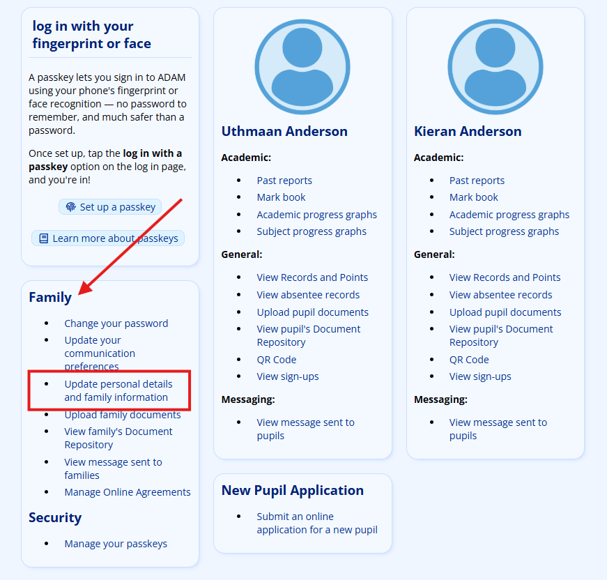
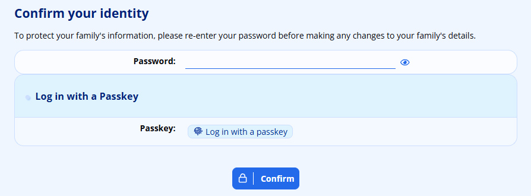
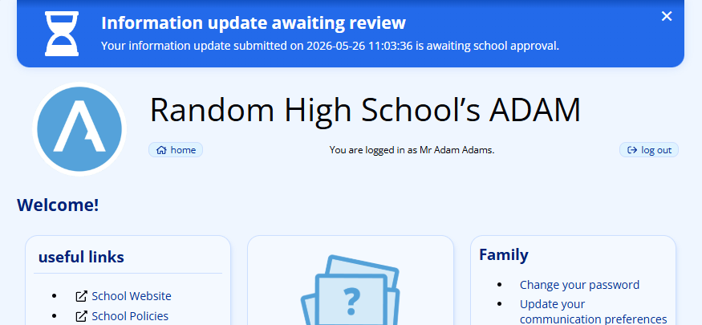
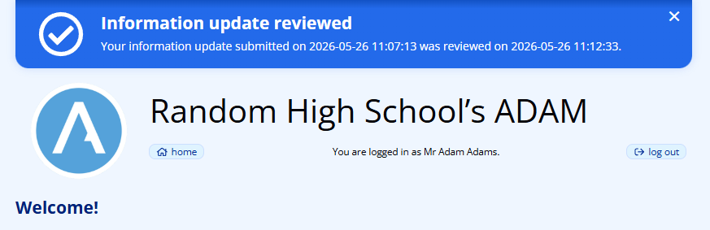

# Family Detail Updates

ADAM offers two ways to keep family contact and personal information current. A **hardcopy** form can be printed, given to the parent and re-entered into ADAM by staff once it is returned. **Online detail updates** ask the parent to do the typing: the parent's next visit to the family portal is interrupted by a form sequence, and the submitted values are staged for a member of staff to approve before they reach the live records. The online flow can also fall back to a magic-link email for families who do not use the portal.

## Customising the detail update forms

Schools usually do not want to expose every field in a parent's view. A pupil's sport house, grade or general-notes field are typical examples of information that staff manage internally and that should not appear on an update form.

ADAM lets each field be flagged as visible or hidden on update forms. The settings are described in the documentation on [core database fields](database-field-management.md) and [custom database fields](database-field-management.md#managing-custom-database-fields). The same visibility rules govern both the [hardcopy](#hardcopy-detail-update-forms) and the [online](#online-detail-updates) forms, so there is no need to re-audit the field configuration when you start using online updates.

## Hardcopy detail update forms

A hardcopy form prints the family's current details on the left of each row and leaves an empty box on the right for corrections:

When forms come back, staff must re-key any corrections — an obvious overhead. Most schools therefore reserve the hardcopy form for parents who cannot complete an online update, and use the online flow for everyone else.

### Producing a form for a single family

Navigate to **Families → Family Administration → Family Info** and open the **General Information** tab for the family. The action row offers a **print update form** link:

The same row also offers **require detail update** and **generate update link**. Both of these belong to the online flow and are covered in [Flagging families for an update](#flagging-families-for-an-update).

Alternatively, use **Families → Detail Updates → Details update forms** to search for a family by name and select the children to include on the printed form:

### Producing forms for a whole class

To print a stack of forms in one pass, use **Families → Detail Updates → Details update forms by class** and pick the class. A grade-wide class usually saves the most time.

ADAM only produces an update form for the youngest (or, if you prefer, eldest) child in each family. This is configurable from the [Site Settings](changing-site-settings.md#changing-site-settings) — when printing for a class, some pupils will therefore not receive a sheet.

## Online detail updates

Online detail updates revolve around a single idea: when a parent next signs in to the family portal, ADAM intercepts the session and walks them through any outstanding update forms before releasing them to the rest of the portal. A request to update is called a **trigger**. Each trigger points at one **update profile**, and a family can carry several open triggers at once — for example one for contact details and another for medical information. The parent works through the queue one form at a time, and the portal unlocks once it is empty.

Triggers can be created in four ways:

- by staff selecting a class or a single family and flagging them manually;
- by the parent themselves from the family portal (self-service);
- automatically by an overnight job when an update profile has a cadence configured; or
- implicitly via the magic-link backstop email, for families that may not visit the portal often.

Submitted values are staged — never written straight to live records — and a member of staff approves or refuses each change before it goes through.

### Configuring an update profile

An update profile decides which forms a flagged family is asked to complete. Profiles are managed at **Families → Detail Update Forms → Manage Detail Update profiles** (also reachable from **Administration → Database Administration → Manage Detail Update profiles**).

Three settings control how a profile takes part in the forced-update flow:

- **Audience** — pick which group the profile applies to. The audience used by every flow described on this page is *External — Update*; existing profiles have been migrated to this audience.
- **Default for Audience** — exactly one profile per audience can be marked as the default. The default is what self-service updates and unattended cron runs use when no specific profile is named.
- **Update cadence** — pick how often ADAM should re-flag every family on this profile (the choices range from *Every 2 months* to *Every 24 months*). Select *No forced updates* to disable automatic re-flagging and rely on manual or self-service triggers only.

### Flagging families for an update

#### From the class distribution screen

Navigate to **Families → Detail Updates → Online detail updates**, pick a subject and then a class. ADAM lists the families with at least one child in that class:

The page now exposes two additional controls above the submit button:

- **Update Profile** — only shown when more than one active profile exists for families. Pick the profile that the trigger should point at.
- **Courtesy email** — chooses whether ADAM should also queue an old-style magic-link email at the same time, and to whom:
    - *No courtesy email* — rely entirely on the next portal login.
    - *Email families who have never logged in* — recommended; keeps the email backstop alive for parents who do not use the portal at all.
    - *Email families who have not logged in in the last N months* — only appears when the chosen profile has a cadence configured; the *N* and *month / months* in the label are filled in from the profile's own cadence. When more than one profile is offered and at least one has a cadence, the label degrades to *"Email families who have not logged in within the selected profile's cadence period."* Useful for catching families that have drifted away from the portal.
    - *Email all selected families* — equivalent to the pre-2026 behaviour.

ADAM also lists the email address(es) that will be notified when a submission arrives for review. The address list is configurable from the [Site Settings](changing-site-settings.md#changing-site-settings) and may contain more than one recipient.

Tick the families to include and click **Flag families for update**. On submission, ADAM:

- creates an open trigger against each selected family for the chosen profile;
- silently absorbs duplicates if a family already has an open trigger for that profile (the request timestamp is refreshed instead);
- warns staff if any family in the selection already has changes waiting to be reviewed — the flag is still applied, but the warning gives the staff member a chance to deal with the prior submission first; and
- queues a courtesy magic-link email for each family that matches the chosen courtesy-email rule.

A summary line confirms how many families were newly flagged, how many were re-requested, and how many courtesy emails were queued.

#### From a family profile

On the **Family Info → General Information** page (illustrated above) the single-family equivalents are:

- **require detail update** — opens *Send a Single Online Update Link*. This flags the family for the chosen update profile and optionally queues a courtesy email, exactly like the class-level flow but for one family. The submit button reads **Flag family for update**.
- **generate update link** — opens *Generate a Single Online Update Link*. Instead of flagging the family, this issues a fresh magic-link URL that you can copy or hand to the parent through some other channel. Generating a new link invalidates any link previously sent to the same family.

#### From a pupil profile

On the **Pupil Profile** action row, the **email detail update form link** entry runs the same single-family flow as **require detail update**: it identifies the pupil's family (or families, for blended households) and flags each of them with the chosen profile.

#### Automatically via cadence

If a profile has a **Cadence (months)** value set, ADAM's overnight job re-flags every currently-registered family whose last completed submission for that profile is older than the cadence. Families that already have an open trigger, or that have submitted but unreviewed changes, are skipped on that pass and re-considered the next night. No staff action is required and no courtesy email is sent — the assumption is that the family is an active portal user.

#### From the family portal (self-service)

When a default *External — Update* profile is configured, a new entry appears on the family portal menu at **Family → Update personal details and family information**. Selecting it raises a trigger for the family using the default profile and takes the parent straight into the update flow. The entry is hidden when no default profile exists for the school.

### The parent experience

The first time a flagged family logs in to the portal, the dashboard intercepts the session and redirects the parent into the update form. The flow is:

1. The parent signs in normally.
2. If the session is older than ten minutes since the last password or passkey challenge, ADAM presents a short re-authentication page (described below) before showing any data.
3. The first outstanding update form is displayed, pre-populated with the family's current information:

    

4. On submission, the next outstanding form (if any) is displayed, already showing the values the parent just entered for any field that appears on both forms.
5. Once the queue is empty the parent is released to the portal and a banner confirms that the submission is awaiting school approval.

The page heading is **Update Household Information** and the intro reads *"Kindly use this form to update your details. Please note that these changes will have to be approved by our administrative staff before they become effective."*

#### Re-authentication gate

Because the update form discloses the family's existing personal information before they edit it, ADAM requires that the session is "fresh" — less than ten minutes since the last password or passkey challenge. A parent who has just signed in passes this automatically. A parent who left a tab open for several hours sees this page first:

The page is titled **Confirm your identity** and prompts: *"To protect your family's information, please re-enter your password before making any changes to your family's details."* If the logged-in parent has a registered passkey, the page additionally offers a passkey sign-in. Pressing **Confirm** with the correct password (or completing the passkey challenge) marks the session fresh and forwards the browser to the update form. Failed attempts are rate-limited and recorded against the same pool as ordinary login failures.

The gate only sits in front of the update form. The rest of the portal — viewing reports, marks, messaging — is unaffected.

#### Banners

The family portal shows a dismissable banner above every page when:

- the family has a submission awaiting school review (heading: *Information update awaiting review*), or
- a previous submission has just been reviewed by staff (heading: *Information update reviewed*).

Each banner is tied to the specific submission, so dismissing one will not suppress a later one.

#### The magic-link backstop

The courtesy magic-link email continues to work for families who do not log in to the portal. Parents receive an email similar to this:

Clicking the link in the email takes the parent straight into the update form sequence without requiring a portal login. The link is now tied to the specific trigger row rather than to the family record, and is valid for seven days by default (configurable in the [Site Settings](changing-site-settings.md#changing-site-settings)). If the link has expired the parent is sent to the family login page; once they sign in, the forced-update interrupt picks up the same outstanding triggers and walks them through the forms.

### Reviewing submitted changes

Submitted values are staged and held for staff approval. Navigate to **Families → Detail Updates → Review submitted changes**. The page lists every family with unreviewed submissions:

Click **review changes** to open a side-by-side comparison of the old and new values. Each row carries an **Approve Change** Yes/No toggle, and the *New Value* field can be edited inline before approval — useful for normalising spelling or formatting:

The *Field* column names each changed field, prefixed with the section it belongs to — for example *First Parent: First Name* or *Second Parent: Cell Number*. Because the two parents (and the various groupings on a child's own details) often share identical field names, this prefix makes clear at a glance which parent or section a change applies to. Where a field belongs to no named section, the field name is shown on its own.

!!! note
    The same section prefix appears on the equivalent staff detail-review screen, reached from **Staff → Staff Administration → Review submitted changes**.

Click **Save Changes** at the bottom to commit the approvals. The family's portal banner updates to *Information update reviewed* the next time they sign in.

### Tracking outstanding updates

Use **Families → Detail Updates → View online detail update report** to monitor the state of the trigger queue. The report has three sections:

- **Still to update** — families with an open trigger that has not yet been submitted. Each row offers **expire**, **renew** and **resend** actions plus an **expire all** link.
- **Expired links** — families whose courtesy-email link has lapsed without being used. Each row offers **clear**, **renew** and **resend**, and the section as a whole offers **clear all**, **resend all** and **print**.
- **Waiting for approval** — families whose submission is sitting in the review queue. Each row links to the review form and offers **resend** if the parent claims they did not get a confirmation email.

The actions in the Active section operate on the magic-link side of a trigger only; the trigger itself remains open until the parent submits the form (or staff explicitly **clear** it).
