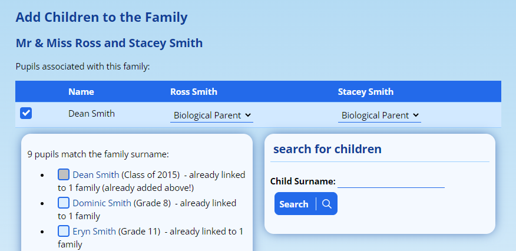
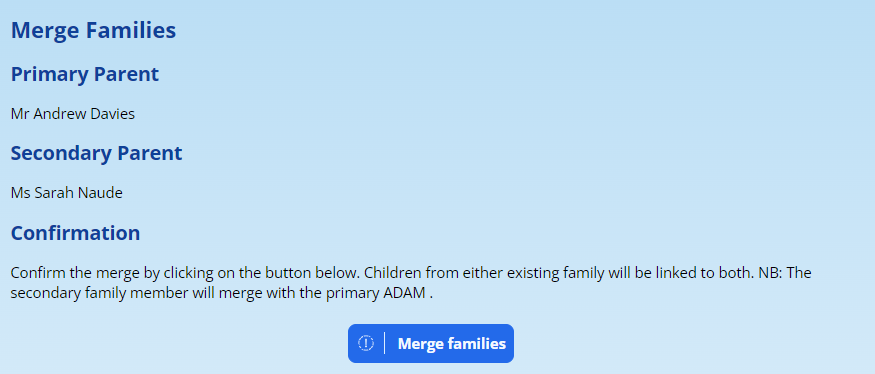
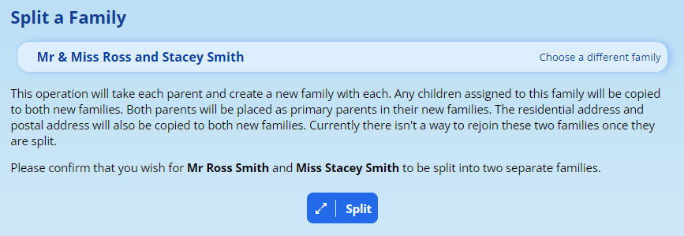
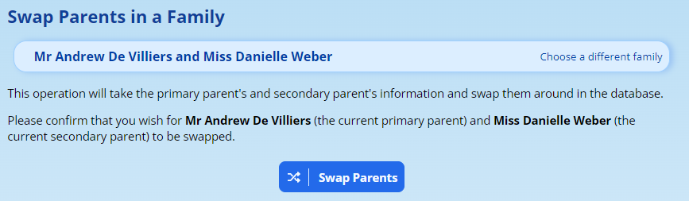

# Family Management {#h-4ptpws1wy3mz}

## Editing a Family’s Details {#h-64kotkp6hdbj}

To edit or update a family’s details, navigate to **Families → Family Administration → Edit a family**. Here, type in part of either the primary or secondary parent’s names and choose the family that you’d like to edit from the list.

After making the necessary changes to the family information, please remember to save your changes using the button at the bottom.

## Linking Children to a Family {#h-cyoxgqrh96xf}

If you are adding a new pupil to the database, once you’ve saved the pupil, ADAM will provide a short-cut link at the end of that process to add a new family or link the pupil to an existing family. However, it is not always convenient to add a family at that point. It can always be done later in the following manner.

To link existing pupils to a family, navigate to **Families → Family Administration → Link Children to a Family**.

Type in the name of the family that the pupil is to be linked to and click on the **Next** button.

ADAM will allow you to make changes to the family structure (which we describe how to do below). After each change, it is a good idea to click on the **Update the list above** button to see the changes. Note that the changes are not made immediately and you will need to click on the **Confirm changes** button before they will be saved.

A list of currently linked pupils is shown at the top. You can untick any pupil to have them removed.

On the lower left side, a list of pupils that share the same last name as either of the parents will be shown. Simply tick any pupil to have them added to your list.

On the lower right side, you will see a search box. Here you can search for any pupil. This is useful if the child does not share the same last name as the family member (this can often be the case when one is adding an *au pair*, guardian or other contact for the pupil. Click on the **Search** button to show any pupils that match the surname you specified.

Once you’ve clicked on the **Confirm changes** button, ADAM will show a summary of the options it is about to perform on the family. It will confirm pupils that are being added and being removed from the family. You can then click on the **Save Changes** button to save these to the database.

## Merging Two Families into One {#h-jr0jospm42xy}

On occasion, two families might need to merge into a single family. This might be to correct a data capturing error, or to reflect two parents that are now living together.

Navigate to **Families → Family Administration → Merge two families into one**.

ADAM will ask you for two families.

It is important to note that the **primary** parent in each family will be used to make the merged family. If there is a secondary parent, they will be split off into a separate family. If you need to move the **secondary** parent into the new merged family, you can either first [swap the parents](#h-700ujut50jnw) so that the secondary parent becomes the primary parent in the original family, or, which makes more sense, [split the family into two](#h-stp2y7foxuff) first.

The primary parent of the family that you search for first will become the primary parent in the merged family. The primary parent of the family that you search for second will become the secondary parent in the merged family. If you get these the wrong way around, you can always [switch the primary and secondary parents](#h-700ujut50jnw) after you’ve merged.

If there are secondary parents in either of the families that you choose to merge, they will automatically be [split off into their own families](#h-stp2y7foxuff) before the merge takes place. Please check the important notes about splitting a family in that section.

Click on the **Merge families** button to merge the families.

## Splitting a Family in Two {#h-stp2y7foxuff}

From time to time, it may be necessary to separate the parents of a family, each into their own families. This might be necessary after a divorce, for example.

Navigate to **Families → Family Administration → Split a family in two**.

Type in the name of the family that needs to be split.

To confirm the operation, click on the **Split** button at the bottom of the screen.

!!! warning
    Note that when first split, each family will have a copy of the same household information. It will be necessary to update this manually.

The children that were linked to the family will automatically be linked to both families.

!!! warning
    Note that the secondary parent’s family will contain no history - no record of communication, logins, etc. This is because in this process, ADAM has created a brand new family.

## Swapping Parents in a Family {#h-700ujut50jnw}

Occasionally, perhaps because of how information was first captured in ADAM, it may be necessary or, at the least, desirable, to swap the primary and secondary parents. It may also be necessary to swap them prior to a [merge of families](#h-jr0jospm42xy).

Two swap the parents in a family, navigate to **Families → Family Administration → Swap parents in a family**.

Type in the name of the family and click on the **Next** button. ADAM will show the following confirmation screen:

Click on the **Swap parents** button to make the changes in the database.

## Non-Conventional Family Setups {#h-hi9ef6hcufy3}

Some “common” non-conventional family setups include situations, for example, where two children have different mothers, but the same father. The same could be said for two children that have the same mother, but different fathers.

In situations such as these, communication about the children is best directed to their biological parents, however, ADAM only allows two parents in a household and the family as a whole is linked to a pupil.

When situations like this arise, it is often most useful to separate out the three parents into individual households so that there are three families, each with a single parent in them. In this way, the pupils can then be connected to the parents that are linked to them. The father, in our example, could be connected to both his children and the mothers could each be connected to their children.

You can use the [Split a Family in Two](#h-stp2y7foxuff) function, described above, to separate any joined parents into two separate families.

Be careful to check that each parent ends up with a single profile once you’re done. Often this scenario arises when one of the parents has been put as a family member into two households. This causes problems because ADAM won’t then allow that parent to log in because ADAM can’t tell which profile they should be using. As such, this complaint normally presents to the school as the parent not being able to log in.
