# Goal Setting

ADAM includes the ability for pupils to set their own academic goals for each reporting period. The pupils can decide on a goal and enter in their strategy for achieving these goals. Their teachers can comment and advise them on their goals. Their goals are visible in the pupil portal to them and, potentially, their parents. Teachers see the goals when capturing results for pupils and on many of the academic printouts. This allows the teachers to be informed participants in the pupils’ journey to academic success.

The pupils are actively involved in the setting of goals.

## Privileges required for Goal Setting

### Pupil and Family Privileges

Individual [pupil login groups](security-administration-for-families-and-pupils.md#managing-login-groups) can be set up to be allowed access to goal setting. In many schools, you may only want your senior pupils to engage in goal setting. You are thus advised to set up different privilege groups for these sections of your school to give you better control over their usage of the system.

We won’t discuss exactly *how* to set up the privileges for the pupil login groups here ([this information is provided elsewhere in this guide](security-administration-for-families-and-pupils.md#managing-login-groups)). However, the following privileges are relevant:

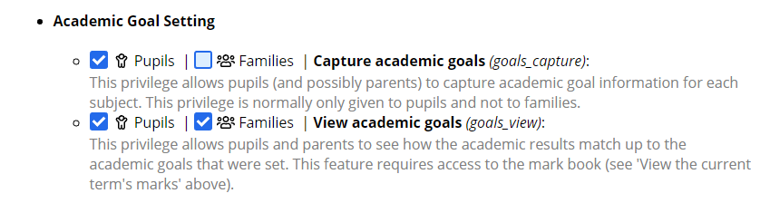

There are two privileges that apply: the ability to capture academic goals and the ability to view them once captured.

It is not advised to give families the ability to capture academic goals - this will allow them to override and change their children’s goals which, we believe, should always be done in discussion with the child concerned and not unilaterally.

The privilege to view the goals should be given to both pupils and families to allow for proactive monitoring of their achievement towards their goals. Note that viewing academic goals should be done in conjunction with viewing markbooks online. Without this information, the goals will lack context and pupils won’t know how they are progressing towards their goals.

The interface that pupils will see and interact with is discussed later in this section.

Note that the ability to set goals alone is not sufficient and more action is required from the school’s side! Please see the section below on [setting up a time frame for goal setting](#setting-up-a-reporting-period-for-goal-setting).

### Staff Privileges

Staff members have the ability to see, comment and amend pupils goals. There are a number of privilege for each of these and care should be taken to ensure that each staff member gets the correct privileges, particularly when it comes to the setting and changing of a pupil’s goals.

We won’t discuss the mechanics of setting up staff privileges ([those are done elsewhere in this guide](security-administration-for-staff.md#managing-security-groups)) but the relevant privileges are found under the **Academic Admin** section of the privileges, under the subheading **Goal Setting**:

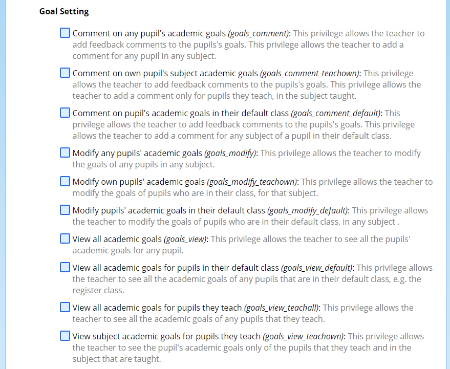

There are a number of privileges here and many share similarities. We will discuss the three broad actions that a teacher can have (“comment”, “modify” and “view”) and the different options within these.

Not every school will use every option - some are provided to account for the different scenarios that different schools use around goal setting. For some schools, goal setting is driven by a single staff member, for others, it will be a teacher in a pastoral role (such as a homeroom teacher or housemaster), and for others it will be the academic subject teachers themselves.

### Commenting on Pupils’ Academic Goals

These first three privileges in the list allow teachers to comment on pupils’ goals. They can add two comments to each goal: one is for pupil use and another is for internal use. The pupils will never see the internal comment, although the internal comment is visible to other staff members who have [permissions to view the pupils’ goals](#viewing-a-pupils-academic-goals).

The differences between these three options are as follows:

1.  Comment on any pupil’s academic goals: This privilege would like to be given to a senior staff member, such as a head of academics. There is no restriction regarding which pupil a teacher can comment on their goals.
2.  Comment on own pupil’s subject academic goals: This privilege allows teachers to comment on pupils’ goals for an pupil in their classes and only for the subject taught. They cannot comment on other goals. E.g. This would allow an English teacher to comment on the English goals of pupils that they teach. They cannot comment on the Mathematics goals of those same pupils.
3.  Comment on pupil’s academic goals in their default class: This privilege would allow a teacher to comment on any subject’s academic goals for all the pupils that are registered in their “default subject” class. This would allow a register class teacher to comment on the academic goals of any subject for any of the pupils in their register class. A teacher would not be able to edit the academic goals of a person who is not in their register class. E.g. This privilege allows a register class teacher to comment on any of the academic goals of any of the pupils in their register class.

The privileges above can be combined if required. This might allow for subject teachers to begin the goal setting process and for register teachers to complete it. The possibilities of how the process might work would be dictated by the school.

### Modifying a Pupils’ Academic Goals

The next three privileges control which teachers are allowed to modify the actual goals set by pupils. Again, the privileges that are necessary here will heavily depend on how the school wishes to approach the goal setting exercise.

In an identical fashion to [above](#commenting-on-pupils-academic-goals), the three options here allow for a global privilege, a privilege for pupils that are taught by a teacher, and a privilege for a default teacher (register or homeroom teacher, for example) to modify the goals.

The three privileges that allow teachers to do this are:

1.  Modify any pupil’s academic goals: Allows for the modification of any pupil’s goals.
2.  Modify own pupils’ academic goals: Allows for the modification of subject specific goals for pupils taught by the staff member. E.g. This would allow an English teacher to modify a pupil’s English goal, but not their Mathematics goal.
3.  Modify pupil’s academic goals in their default class: Allows for the modification of any subject goal for pupils in their default class. E.g. This would allow a register class teacher to modify the Mathematics goal of one of their register class pupils. They could not modify the goals of pupils who are not in their register class.

From a management perspective, it might be sensible to allow a teacher the ability to override a pupil’s goals in the event that they are not captured in time or need to be changed after the deadlines have been set.

The privileges all allow for the editing of the actual goal and the strategies required to achieve that goal.

### Viewing a Pupils’ Academic Goals

This privilege allows a teacher to view a pupil’s academic goals and strategies, as well as the teacher’s comments and internal notes on those goals.

While similar to the privileges described above for [commenting](#commenting-on-pupils-academic-goals) and [modifying](#modifying-a-pupils-academic-goals) pupils’ goals, there are a number of different levels for viewing pupils’ goals; but with an additional option.

1.  View all academic goals: This allows a teacher to view every academic goal for any pupil in the school. This might be given to the academic head of the school.
2.  View all academic goals for pupils in their default class: This allows a teacher to view all the academic goals for any pupils that are in their default class (e.g. register class).
3.  View all academic goals for pupils they teach: This privilege is one that is not mirrored above. It allows any teacher of a pupil to see all the other academic goals of a pupil provided that they teach the pupil in an academic capacity (i.e. only academic subjects are considered here). This means that a Mathematics teacher could see the English goals of any of the pupils that are in the class. The could not see the academic goals of any other pupil in the school.
4.  View subject academic goals for pupils they teach: This allows teachers to see the academic goals only of pupils that they teach and for the subjects taught. This would allow the Mathematics teacher to see the Mathematics goals, but not the Geography goals for the pupils they teach.

## Setting up a Reporting Period for Goal Setting

### Choosing Which Grades Should Set Goals

In the reporting period settings, **Reporting → Reporting Period Administration → Edit reporting period**, each grade has a new setting at the bottom determining which grades should set their goals or not:

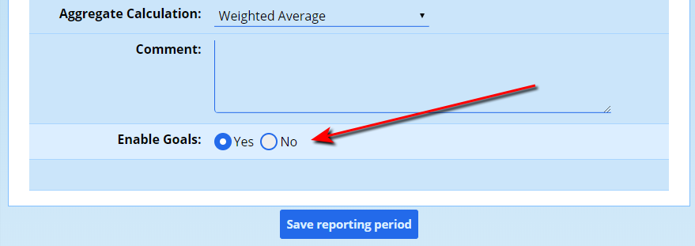

!!! warning
    *This setting should be set properly before the time frames, discussed below, are opened. Note that if this setting is changed* **after** *a pupil sets their goals, ADAM will continue to show those goals as it normally would. Most of the logic surrounding whether to display goal information in ADAM depends on whether the goals exist or not. Once added, they cannot be removed for that reporting period.*

### Creating a Time Frame

Once pupils have the correct privileges to capture their Goals, they will need a reporting timeframe opened that gives them a window of time in which to do this. The reporting timeframe, like all others, can be set via **Reporting → Reporting Period Administration → Edit reporting period timeframes**.

At the bottom of the list of time frames available is **Capture Goals (for pupils)**:

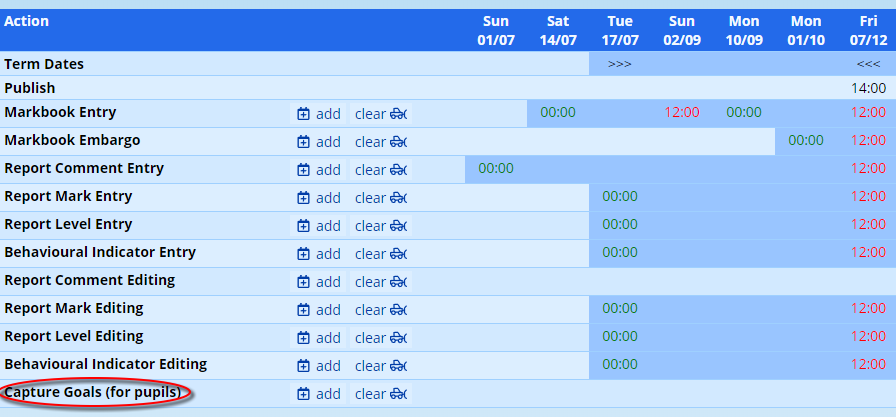

Use the options at the bottom of this screen to add a new timeframe. More details on [adding timeframes can be found elsewhere in this document](reporting-period-administration.md#reporting-period-time-frames).

Pupils will only be able to set their goals while the window is open. Once the window has closed, they will only be able to see their goals.

## Capturing Goals: Instructions for Pupils

Pupils with the [necessary privileges to view or capture goals](#pupil-and-family-privileges) will see the following option appear in their ADAM login page:

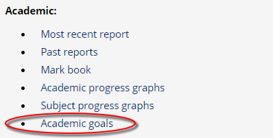

Clicking on this option will show them any existing timeframes and goals that are set up. If this is the first time that they are clicking on it while a reporting period time frame is open, ADAM will automatically generate some goals for them based on past results. These initial goals are to be taken lightly: ADAM looks at their last five assessments and adds on 1 standard deviation to this mean, and then rounds to the nearest 5%. An automated note saying that the goal was created by ADAM is also shown:

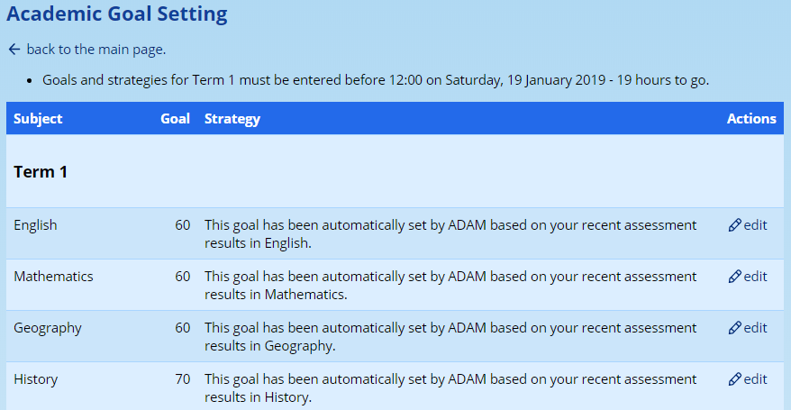

While the time frame for goal setting is open (ADAM reports the closing time at the top of the table: in the diagram above, there were 19 hours left to set their goals), each subject will show an “edit” option along side. Clicking on these takes the pupil to a page where they can see all their subjects, and their goals for this reporting period. They have the opportunity to make any changes they need to:

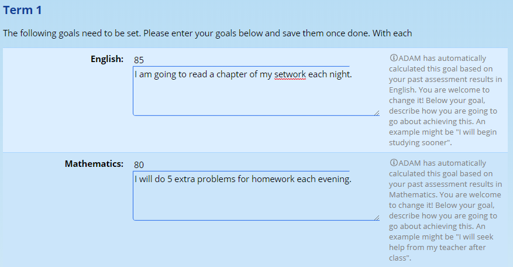

Each subject should get a mark and a strategy. It is in this process that pupils will need guidance. The best goal setting exercises need to be realistic and need to have a strategy in place. More to the point, these strategies need to be transparent and known. For this reason, once the goals are set, ADAM displays them prominently for pupils, parents (if they have the privileges to see them) and staff.

## Advising on Goals

Staff have the opportunity to comment on the pupil’s strategies and to provide some motivation, perhaps. Additionally, staff can make internal comments which are only accessible to them.

Staff can review and comment on goals by visiting **Pupils → Goal Setting → Add teacher comments to goals**.

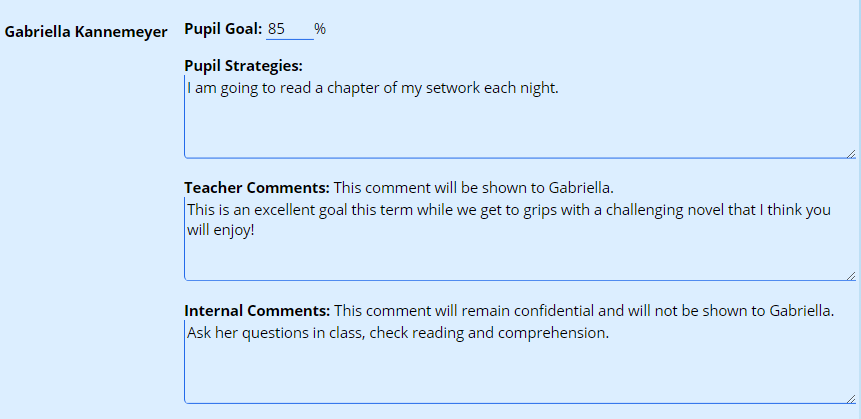

Teachers can add in comments for each pupil. There are two comments available: “Teacher Comments” are visible to the pupil and their parents, while “Internal Comments” are only available to the teacher and any other [staff members who have privileges](#staff-privileges) to see those goals.

## What pupils and parents see

When pupils and parents view the markbook, they will see the goals and the strategies listed:

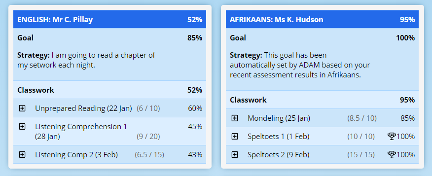

If the teacher has commented, they will also see the teacher’s comment.

Next to each assessment (see Afrikaans in the picture above) where the goal has been met, a small trophy icon is shown to draw attention to the pupil’s successes.

## What staff see

Like pupils and parents, staff will see the goals listed in the pupil’s details markbook breakdown, available on the **academics** section of their Pupil Info page.

However, staff will be made aware of goals when capturing assessment results:

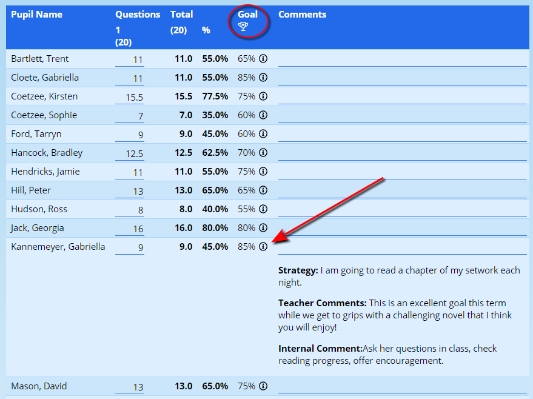

Clicking on the “(i)” information icon next to each goal will remind the teacher of the strategies that the pupil put into place, their comments and their internal notes. This can allow the teacher to provide more meaningful feedback in the assessment comment.

Additionally, the goals - but not the strategies - are shown in the assessment summary page:

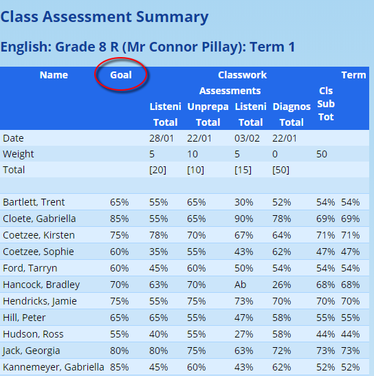

Finally, the teacher will be reminded of the goals that have been set when reporting.

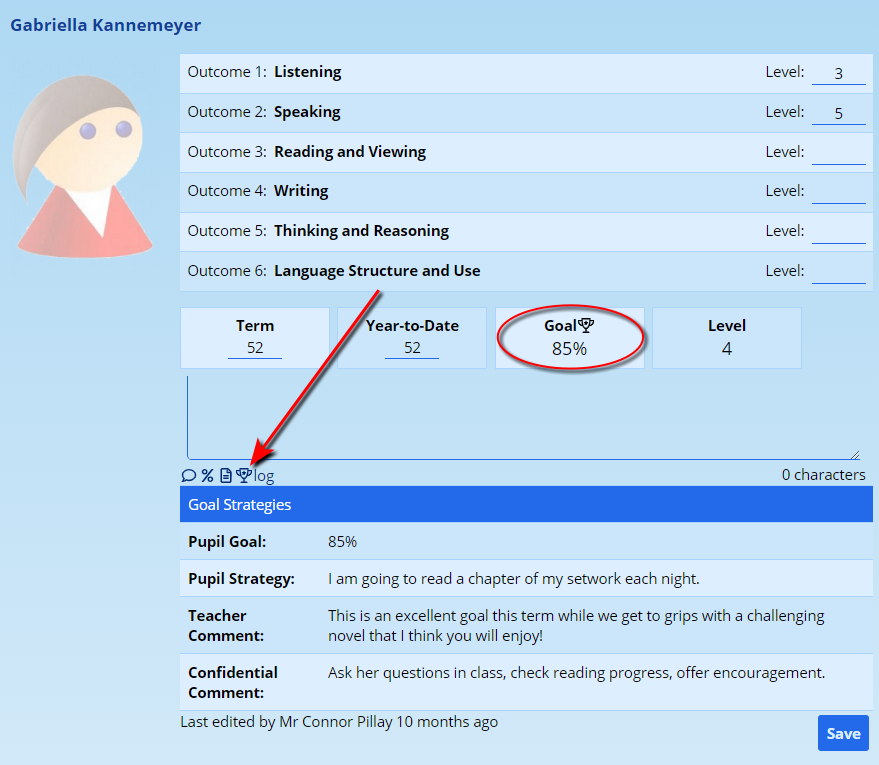

Where a goal has been captured, it is shown next to the reporting results. Clicking on the trophy icon below the comment box will slide out the pupil’s strategies, the teachers comment and internal notes. Again, the goal is to provide the teacher with information to write more meaningful comments and summaries of the pupil’s performance over the term.
