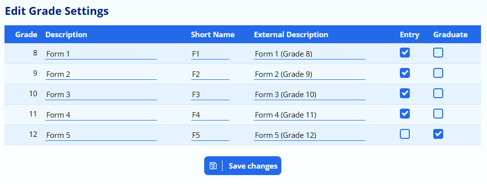

# Grade Settings {#h-2iq8gzs}

ADAM is capable of showing different names for grades depending on your school’s requirements. Internally, ADAM represents the grades as a number from -3 to 12.

It is rare that schools will refer to Grades 00 (RR) as “Grade -1”. Thus this is used in the pre-primary grades where Grade R is sometimes referred to as “Grade 0” and so on. Additionally, some older high schools make use of traditional grade names such as “Forms” or “Blocks”. ADAM can take these names into account.

By default, if ADAM hasn’t been configured otherwise, ADAM will use the grade descriptor “Grade” and adds a number afterwards: such as “Grade 8”.

## Customising the Grade Settings {#h-xvir7l}

Navigate to **Administration → Academic Administration → Edit grade settings**.

ADAM will show you the grades that your school offers and allows you to type in a description for each grade. If a **description** is provided here, ADAM will use that description exactly as it appears here.

Some examples include:

-   Form 1
-   Upper 5th
-   E Block
-   Grade 000

The **Short Name** is used when ADAM needs to reference a grade name for abbreviated display.

The **External Description** field is used on the Application form. Where schools make use of non-standard grade names (such as Forms, for example), this can help parents who are applying to the school to make the correct choice.

The application form will also only allow parents to make applications for specific grades. The **Entry** field determines which grades are shown to applicants on the application form. In the screen shot above, for example, the school has chosen not to allow applications for Grade 12 (Form 5 as shown). Some schools have additional grades that are used for registration of academic programmes that are run parallel to the school and do not wish for these to be visible on the application form.

Finally, if your school is structured in such a way that there is more than one point of graduation, you can select which grades are **graduating grades**.

*Note that when the* *[year-end roll-over](year-end-functions.md#h-2gb3jie)* *is done,* ***all people in this grade*** *will be graduated to become alumni. Thus this should only be set if the majority of students leave the school at that point. Mostly, this is for use in situations such as schools who offer a post matric that most of their matric students do not progress to, for example*.

Once you have entered the grade names, click on the **Save changes** button.
