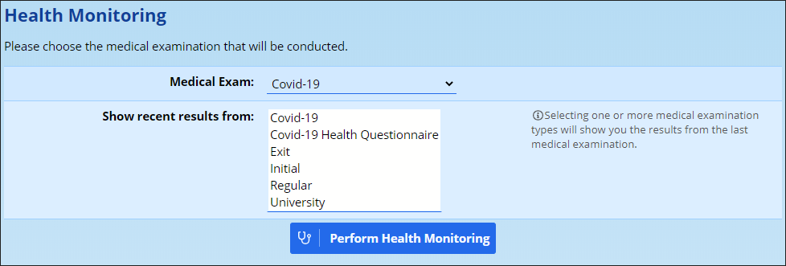
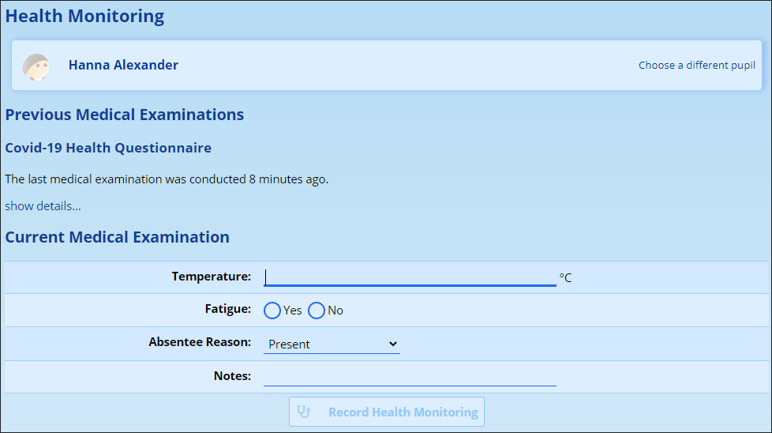
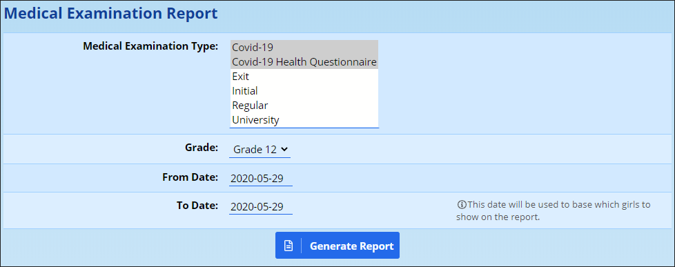

# Health Monitoring {#h-jlxqeqdranfb}

With the reopening of schools amidst the Covid-19 pandemic, schools are required to do daily monitoring of pupils’ temperatures. ADAM brings together features of the Medical and Absentee modules to allow schools to quickly record this information in their system as well as mark the pupils as present at school, or sent home.

## Using the Health Monitoring feature {#h-xt3n1lftz6le}

Navigate to **Pupils → Medical Records → Health Monitoring**.

Choose a [Medical Examination](medical-module.md#h-ubj8044sigk4) that will be conducted. For the Covid-19 pandemic, a simple examination which records a temperature reading has been added to all servers. You can add your own medical exams to this list which can include a number of other readings if required.

ADAM also gives the option to **show the most recent results** from the various types of examinations. This will allow the user conducting the health monitoring to see if any prerequisite examinations have been conducted and when they were conducted.

You will be given the opportunity to search for a pupil. You can either type in a few characters of their name or click on the option to scan a QR code. [Student cards](student-cards.md#h-nab95ncdjhby) with QR codes can be printed and laminated for each student. Alternatively, any pupil with access to ADAM’s pupil portal will be able to get an electronic version of their QR code for their phone.

*It might be worth students taking a screenshot of their QR Code to have it easily available without them having to log in to ADAM each time.*

The QR Code scanning can be done on any device with a web camera and a modern web browser.

*A specific note on iPhones and iPads: At the time of writing, there is a limitation on iPhones which only allows the Safari web browser to scan barcodes. Other browsers, such as Chrome and Opera, are not given access to the iOS devices’ cameras.*

Once a pupil has been identified, complete the necessary health information and determine whether the pupil is permitted to stay at school or not.

If you selected to have the most recent results of another medical examination shown, ADAM shows a message displaying when that medical examination was conducted. An option to **show details** is provided below and allows only users with the permission to see medical exam results to see the results. The idea here, specifically for the Covid-19 pandemic, is to ensure that pupils have submitted a health declaration prior to their temperature being scanned.

The medical examination then begins asking its necessary questions. In the example above, these are “Temperature” and “Fatigue”.

You may wish to add in a separate **[absentee reason](absentee-administration.md#h-i74ma3ruchb0)** to indicate that the pupil was sent home because of a failed health check. The user will select an appropriate absentee record.

The **Notes** field is copied in to the [Medical Examination](medical-module.md#h-ubj8044sigk4) record *and* the absentee record. These might indicate mitigating circumstances regarding the medical examination.

For more information on following-up on pupils who have not been recorded as present, please see the [absentee reports](absentee-administration.md#h-eks8qfjv0wac).

## Medical Examinations Report {#h-pa5jrcoheofo}

A medical examinations report can be printed off for each grade by navigating to **Pupils → Medical Records → Medical Examinations Report**.

Click on **Generate Report** to be able to see this report.

## Privileges Required for Health Monitoring {#h-c7usgksltvi0}

For users who are recording the results of Health Monitoring, there is only one privilege that needs to be [assigned to staff](security-administration-for-staff.md#h-2rrrqc1): **Pupil Admin → Medical Records → Perform Health Monitoring** ***(medical\_healthcheck)***.

For staff that are viewing the medical examination report, they should be given the privilege **Pupil Admin → Medical Administration → View Medical Examinations Report** ***(medical\_exam\_report)****.*

*Kindly note that this privilege allows the staff member to see* all *medical exam information, not just that related to Covid-19 or the health monitoring. Thus this privilege should be given to appropriately authorised staff members only.*
