# Importing and Exporting Data {#h-3hv69ve}

ADAM can import and export data directly from a number of tables in the database using CSV (Comma Separated Variable) files. These files are easily edited and manipulated in Excel which can then be imported into ADAM.

## CSV Export {#h-1x0gk37}

The CSV Export is a straightforward process to empty the contents of the table into a file that can be edited locally. To export the contents, find the export feature under **Administration → Database Administration → Export Data to CSV**.

In the page that follows, choose from the tables that are available to you:

-   Pupils
-   Staff
-   Families

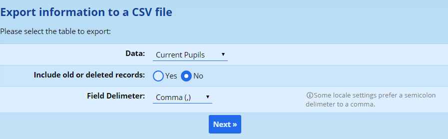

You can also tick the box which includes old (deleted) records for editing. In the case of pupils or staff, for example, ticking this box would include alumni or past staff members in the export. Otherwise, ADAM exports only current pupils and staff members.

!!! warning
    It is important to realise that using the export and import features has the potential to corrupt your data very easily. Please ensure that you have a backup first to restore your data if something goes wrong.

## CSV Import {#h-4h042r0}

Importing data from CSV can be a great time saver is there is lots of information that needs to be changed. ADAM can import into any of the tables that are mentioned above. To import data, navigate to **Administration → Database Administration → Import Data from CSV**.

!!! warning
    *Please pay careful attention to the formatting of numbers and dates in Excel before saving and importing the CSV file. Excel will do things such as reformat ID numbers, drop the leading 0s from phone numbers and so on.* ***It is strongly suggested that, once you have downloaded your export, that you make a copy of this file before starting to edit the contents.*** *In this way, you can always revert changes by importing the file you exported.*

### Performing the Import {#h-xjof3vm82ou6}

!!! warning
    *Please take special note of the sections below with regards to* *[structing your import file](#h-dnacho65etbk)* *and ensuring that your file* *[contains only the information that is strictly needed](#h-gzgfmt46lz8a)**.*

Navigage to **Administration → Database Administration → Import Data from CSV**.

Click on the **Choose file** button and select your CSV file from the file selection window. You must tell ADAM what sort of **Data** you are going to import. ADAM will use this information to double check that your CSV file is properly structures, so it is very important that you get this right.

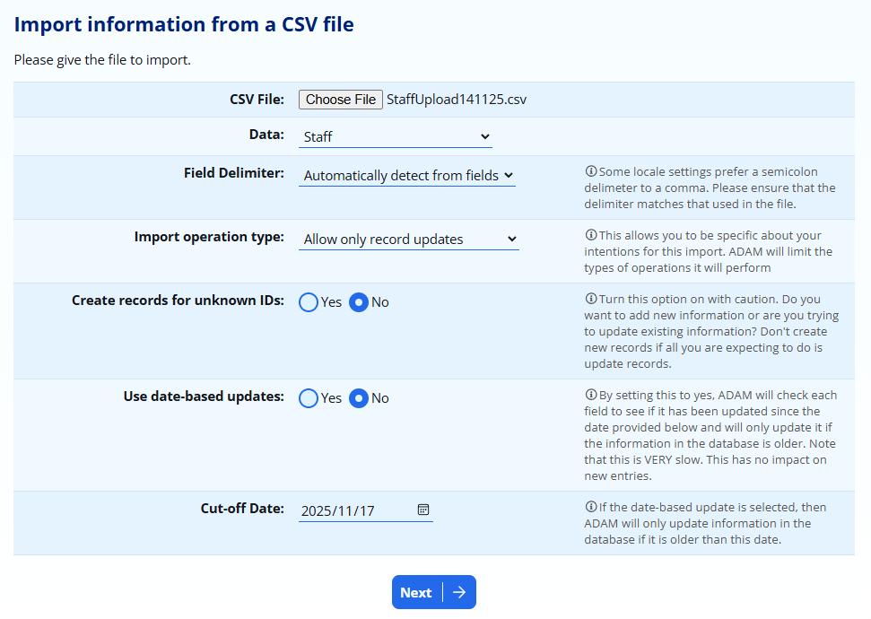

ADAM also allows you to manually specify a **Field Delimiter** if you wish, but it is mostly safe to allow ADAM to detect this by looking at the first row in your file which will contain the field names.

ADAM also asks for the **import operation type**. This tells ADAM what sort of data operations you are expecting to perform. If you are only updating records, then ADAM won’t create any new ones when you do the import. To tell this to ADAM, choose **Allow only record updates**. If you are expecting ADAM to create new records, then you can choose the option to **Allow only record creation**. If your file is a mixture of new and old records (*which is not recommended!*), then you can choose **Allow both updates and creation**.

The option to **Create records for unknown IDs** tells ADAM that you may wish to have records created with specific identifiers. If not, ADAM will assume that a record with an unknown ID should be ignored - this setting is only looked at if you have chosen one of the options above to **create** records as part of your import.

ADAM can perform **Date-based updates**. Here, ADAM looks at the records “modified by” date - which is generally set automatically - and will not update any records that have been modified since a certain time which is specified in the **Cut-off Date**. This functionality is very specific and will probably not need to be used ever.

When you are ready,  click on the **Next** button for ADAM to perform the import. ADAM will confirm the number of records that have been updated and/or imported into the database.

### Structuring your import file {#h-dnacho65etbk}

A CSV import file is very quite easy to structure. There two features that every import file must have.

The first row of the import file must contain field names so that ADAM knows which fields are being updated in the file.

The first column of the import file must contain an “id” field so that ADAM knows which record you are updating. For example, if you are updating a pupil record, the first column will be pupil\_id.

More information [about the fields can be found below](#h-3vac5uf). It is often a good idea to start with an [export of the records](#h-1x0gk37) that you want to update. The export will allow you to start with the correct structure and the correct field names.

### Import only what you need {#h-gzgfmt46lz8a}

One important consideration is that you only need to import the information that you wish to change. This is a good practice to avoid possible corruption of other columns that might have been changed without you knowing. Further information of what might change is [discussed in the section below](#h-mqkb5v1rvdx5).

The golden rule is: The less information you import, the less can go wrong!

When looking at your import file, the only column that ADAM needs is the very first column which will likely end with “\_id”. This allows ADAM to identify who belongs to which row. Apart from that, you only need to keep the columns with the changed data. If you are not updating email addresses, for example, remove that column from your import file - it doesn’t need to be there!

If you filter your rows in order to only update certain of them (for example, adding new email addresses for the Grade 8s), you can happily delete all the other rows that refer to people in different grades. If there is no information changing for those pupils, then don’t include them.

You can sort your file and move columns around - ADAM will use the column headers and ID numbers to work out what has moved where.

### An Important Note About Working With CSV Files in Microsoft Excel and other Spreadsheets {#h-mqkb5v1rvdx5}

“CSV” means “Comma Separated Variable”. These files are structured as very simple files that have each value separated by a comma (sometimes a semi-colon). In fact, a CSV file can be opened and edited in a simple text editor, such as Notepad. These files are purposefully simple to allow for maximum compatibility between different editors.

#### The problem: {#h-2jgsxs8jugwl}

If you open a CSV file, your computer will probably use Microsoft Excel to open it. Because of the simple nature of the file, Excel will make several assumptions about your data. Because Excel operates mostly on numbers, where it sees things that look like numbers, it will interpret them as such. This includes ID numbers and phone numbers.

This becomes a problem because we expect a phone number to begin with a “0”. Excel, because it thinks this is a normal number, will drop the zero, because it knows that a leading 0 in front of a number doesn’t actually affect the number. But because this is not a number that we might use in a calculation, we would rather keep the zero.

When Excel goes on to save the CSV file, you run the very real possibility that you will corrupt some of the data.

#### The solution: {#h-srgjrljh8dlr}

Thankfully, you do not need to import a full set of fields. ADAM uses the field names at the top to determine which information is present in the file and will only update those fields. If any fields are missing, then ADAM won’t change the information in those columns.

The only field that ADAM requires is the identifier column which will almost alway be the first column and will almost certainly end in “\_id”.

You may safely remove any fields that do not contain changes you wish ADAM to know about. Save the CSV file and then upload it to ADAM.

The safest way to work with CSV files is not to double-click and open directly, but rather, from within Excel, to use the “Import Data” function. Here, you can explain to Excel how it should treat each field. Most other spreadsheet programs will have a similar function.

On the Data ribbon, click on “From Text” which appears in the “Get External Data” section:

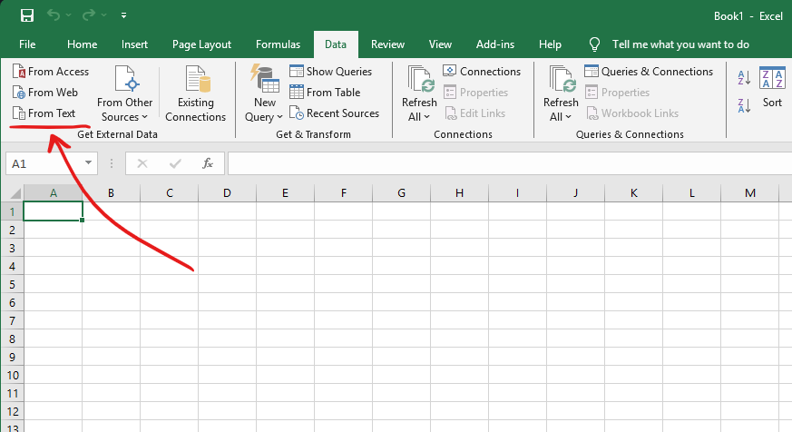

Tell Excel that your information is Delimited (this is normally selected by default) and that “My data has headers”.

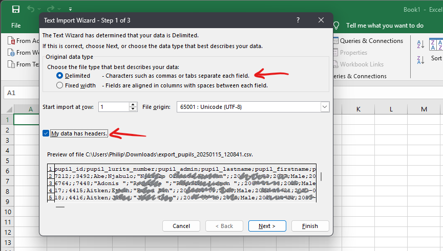

Now specify the delimeters are either semicolons or commas (you can select both options, just in case):

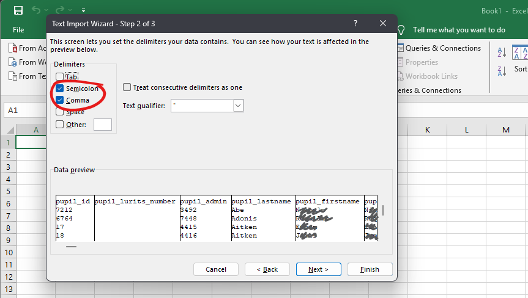

Find fields, such as ID Number and phone number fields, click on the header to highlight the field, and then change the “Column data format” to “Text”. This will prevent Excel from changing these to numbers and dropping any leading zeros.

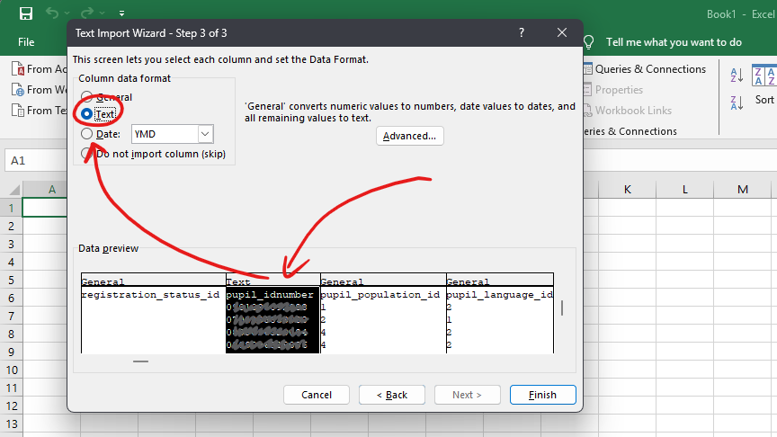

Once done, you can click on “Finish” to import the data.

When you save the file, use the “Save As” option and change the type to “CSV”:

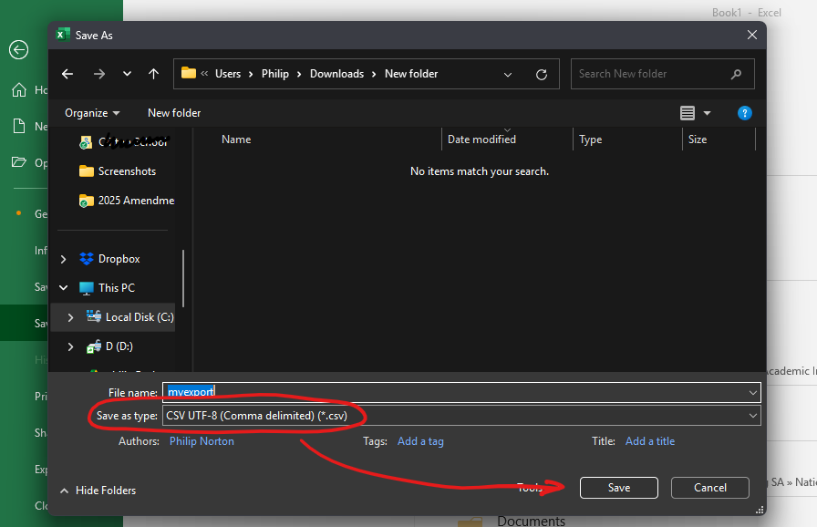

### Updating vs Adding vs Deleting: Learning about the identifier column {#h-2w5ecyt}

ADAM uses this first column to determine whether it should update an existing record (with the matching internal identifier) or create a new one.

These identifiers **must not** be changed. Changing a value inthe first column may result in loss of information. The internal identifier cannot be changed, regardless of whether it is a pupil, parent or staff member.

If the identifier column is left blank, ADAM will assume that the record is a new on and will add the new record to the database. For this reason, import files that contain new information should only ever be imported **once**. To make further changes to the data after an import, you will need to do an export first which will contain the new identifiers for the records you’ve just added.

!!! danger
    Do not attempt an import of the same file more than once if it contains new records – you will end up with duplicated data!

With the exception of the first field which must always be included in every import, all columns can be safely deleted from the import file. If you do not plan on making changes to the data in a specific column, it is advisable to delete it before you import the data. If you are updating email addresses, for example, you should remove all columns except for the first column and the appropriate email column.

Omitting a column will not remove any data. By omitting the column from your import you are ensuring that ADAM makes no changes to any values in that column.

You can also savely leave out any rows that you don’t want to change. If you only need to update information about the Grade 8s, for example, you can filter and delete all other pupils from the CSV import file.

It is advisable to remove any columns (except the first “id” column) that you are not making changes to in order to minimise the amount of damage that can be caused by an import. For more information on this, see [Excel and CSV Imports](#h-8413um3c24p8) to learn how Excel can “damage” your data in its quest to be “clever”.

## Excel and CSV Imports {#h-8413um3c24p8}

Please be aware that Excel attempts to automatically assign appropriate data formatting to the CSV file if you open it normally. This is problematic!

Specifically, please take special note of any telephone numbers which will be interpreted as being numeric values and thus will have any leading zeros and “+” modifiers stripped from them. ID numbers, because of their length, are represented in floating point notation (“7.911E12”) and various other problems. The dates will also be represented using your system date format. If this is American (MM/DD/YYYY), then you will certainly run into errors on the import as the dates will not be properly undersood by ADAM.

Mostly, we advise users to delete these columns from the import file and avoid the problems they might cause that way. However, from time to time, it is necessary to modify these columns. Luckily Excel does have feature that allows us to specify how it should treat the data.

*The following instructions and screenshots use Excel 2013, but the general principals still hold for newer versions of Excel. In fact, the internal workings haven’t changed visibly in the last 15 years.*

-   Open Excel from the Start menu. Do not double click on the export file to open it!
-   Open a new blank workbook if necessary.
-   On the DATA tab of the ribbon, look for the “Get External Data” section and click on the “From Text”:

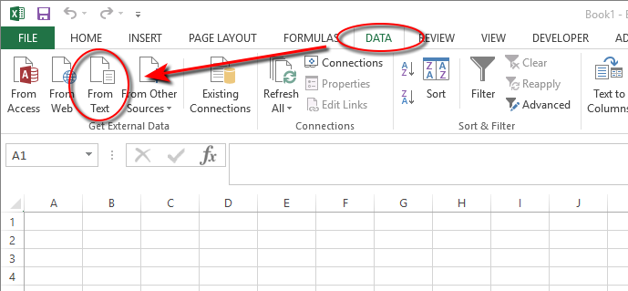

-    Browse to find ADAM’s export file and click “Open”.
-   Excel will now run you through the “Text Import Wizard”. Firstly, ensure that the “Delimited” option is chosen and that the “My data has headers” option is ticked.

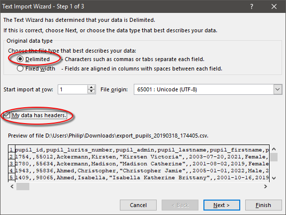

-   Click on “Next”.
-   Choose the appropriate delimeter. It will most likely be “Comma”, but could also be “Semicolon”, depending on the settings you chose when you exported the data:

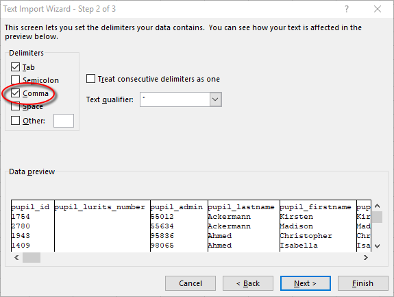

-   Notice that the data now appears in columns below. Click on “Next” to continue.
-   Now, click on each column in term, using the horizontal scroller below the data to scroll right if required, and for each data, choose the most appropriate data format at the top. For telephone numbers, ID numbers and so on, it is very important that you chose “Text”. Most other columns are generally ok to remain on “General”. Any date, phone and ID number fields should be changed as a priority.

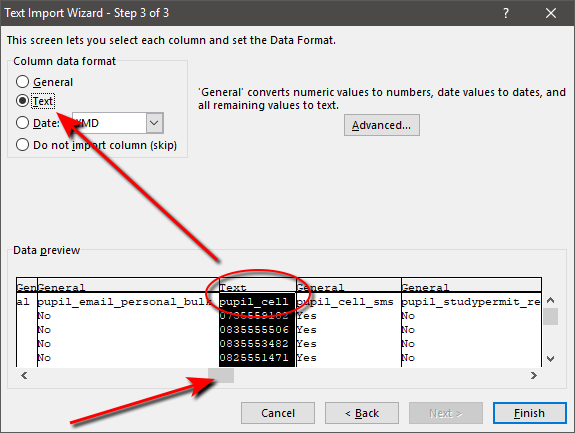

-   Once you’ve applied this formatting to all the columns, click on “Finish”. ADAM will ask you where you’d like to add the data. Excel should offer to add it in at “A1” in the current worksheet. You can click on “A1” if Excel suggests elsewhere. Click on “OK”.

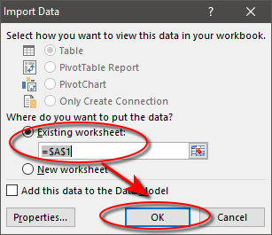

At this point, Excel will add the data to the spreadsheet for your manipulation.

Note that Excel will reformat all dates to appear in your computer’s configured date format. When importing back to ADAM, it is always safest to have your dates formatted in the ISO standard format: YYYY-MM-DD.

To do this in Excel, click on the column header that contains the dates, then right-click on the selected column and choose “Format Cells”:

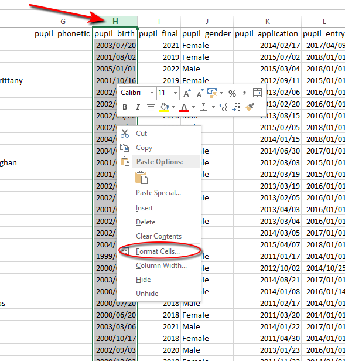

In the options that appear, click on “Date” and then find the “YYYY-MM-DD” option in the list:

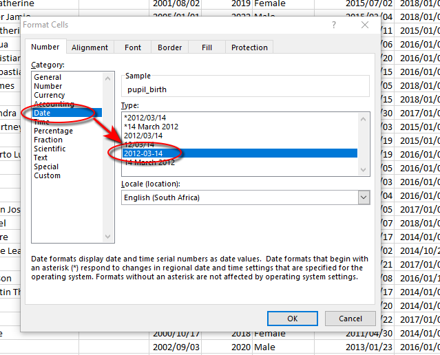

Finally, click on “OK”. The dates should now show the new formatting:

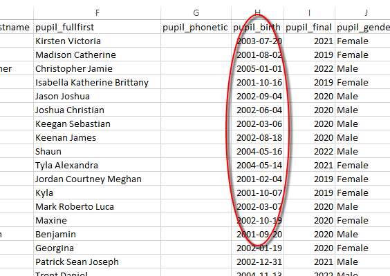

## Notes on Pupil Dates ← VERY IMPORTANT! {#h-fdv7yxivobdj}

One of the most confusing thing when importing data into the database, particularly when adding new pupils, are three very important dates:

-   **p****upil\_entry** - the date that a pupil arrived or plans to arrive at the school. This is normally set to January 1st of the year that they arrived or intend to arrive. For future applicants, using the 1st of January does have many benefits.
-   **p****upil\_exit** - only needs to be set if the pupil has LEFT the school. This is normally set to December 31st of the year that they left.
-   **p****upil\_final** \- this field needs to contain the year that the pupil was in Grade 12 or will be in Grade 12. If your school only offers up to Grade 7, for example, this still needs to be set to their Grade 12 year. It is the *pupil’s* final school year, not simply the last year that they were at your school.

If any of these fields are omitted or pose problems to the enrolment procedure, ADAM will make the following assumptions, in the following order (since some omissions will have run-on implications!)

1.  If a **pupil\_entry** date is omitted, ADAM will assume that the pupils will start on January 1 of the next calendar year. Note that if the server is in roll-over mode when the import is done, it assumes that the year is already the next year and thus the pupils will be assumed to arrive in the year following that one.
2.  If a pupil’s matric year (**pupil\_final**) is omitted, ADAM will calculate a matric year based on the assumption that they are entering the school in the lowest grade that the school offers.
3.  If a **pupil\_exit** date is omitted *and* the pupil’s current grade indicates that they are no longer eligible to be in the school, ADAM will calculate the exit date to be on 31 December of the year that they were in the school’s highest offered grade.
4.  Finally, a check is done to ensure that the pupil **does not enrol into the school into a grade that is not offered** by the school (e.g. the pupil is currently in Grade 1, has an entry date for next year (into Grade 2), but the school only starts from Grade 8). In this case, the enrolment date is adjusted to reflect the date that the pupil would be in Grade 8.

Without fully understanding these implications, ADAM’s import procedure may seem unpredictable and erratic!

## Field Information {#h-3vac5uf}

Covered here are the three most important tables that require imported data, and an explanation of each of their fields. Some of these fields require “codes” to be entered in instead of actual values. Where appropriate, these codes are provided later in this document in The Appendices.

In each case, we indicate which fields are required and which are optional. These are for NEW entries and to ensure data consistency in the database.

### Pupil Information {#h-2afmg28}

-   pupil\_id: This is the internal identifier. This column must be present in any pupil-related import, but you must not change any existing number and any new pupils that are to be added must have blank numbers. A sheet filled with only new pupils must still have this column.
-   pupil\_admin: This is the school’s administration number that is assigned to the pupil and can be filled in here. The same rules apply for numbers if this is a numeric code that requires leading 0s. This field is optional.
-   pupil\_lastname: This field contains the pupil’s last name. This field is required.
-   pupil\_firstname: This field should contain the pupil’s preferred name. This field is required.
-   pupil\_fullfirst: This field contains all the pupil’s first names. Having said that, it can only store 50 characters of information. This field is required.
-   pupil\_birth: This is the date that the pupil was born on. It should ideally be entered using the standard ISO formatting: “yyyy-mm-dd”. This field is required.
-   pupil\_final: This field stores the estimated Grade 12 year of the pupil and this field is used to calculate their current grade based on the current year. Thus, if a pupil’s final year is 2023 and the current year is 2015, then they are 8 years away from completing school and would be in Grade 4. This field is required.
-   pupil\_gender: This field stores the pupil’s gender and must be one of “Male” or “Female”. If you omit the value, gender will default to “Male”. This field is required.
-   pupil\_entry: This is the proposed / actual date of entry. This field is required.
-   pupil\_exit: This field is only completed once the pupil has left the school. **In general updates, this field should be removed from the import**. Even if values are entered here for current students, they will be ignored until such time as the pupil moves through a process to deregister them from the school.
-   pupil\_registration\_status\_id: This field is an internal field which is used to keep track of the pupil’s most recent – and hence current – registration status. This field should also NOT form part of the update, and if it is present, its values should not be changed. This field is NOT required for new pupils who will have this assigned automatically after the import. Delete the field from the import!
-   pupil\_idnumber: This is the pupil’s South African ID number. If the pupil is foreign, it is acceptable to put the pupil’s passport number here. This field is optional.
-   pupil\_population\_id: This field stores the pupil’s racial classification. This field is required only for submission and completion of DBE-related surveys. Each group is assigned a specific code which can be found [in the appendix](appendix-a-import-and-export-codes.md#h-n5rssn).
-   pupil\_language\_id: This field stores the pupil’s home language. Note that there is a related field later on if the home language is not an official South African Language. The codes for this field are provided [in the appendix](appendix-a-import-and-export-codes.md#h-375fbgg).
-   pupil\_language\_other: This field may not appear in this order and might be found much later on in the import. Still, it is relevant to be spoken about here. If the code for “pupil\_language\_id” was for “Other”, then please fill in the language spoken by the child here. This field is not required.
-   pupil\_disability\_id, pupil\_disability2\_id, pupil\_disability3\_id, pupil\_disability4\_id, pupil\_disability5\_id: These fields store any disabilities that the pupil might have. In most cases, only the first field is consulted, but it is possible to store multiple disabilities if necessary. The codes for this field are provided [in the appendix](appendix-a-import-and-export-codes.md#h-1maplo9).
-   pupil\_medical\_notes: This is a text field and can contain any relevant medical notes for the pupil. Note that there is a second field further on specifically for allergies, and so this can contain specific information about how to deal with emergencies or situations that might arise with a pupil, for example. This field is optional.
-   pupil\_family\_notes: This field is used to note any particular arrangements with the family set up. Importantly, any custody information should be captured here. This will be displayed prominently on the family information section of the pupil’s profile. This field is optional.
-   pupil\_fees\_family\_id, pupil\_residence\_family\_id: These two fields contain the unique identifiers of the families that pay their school fees and which they live with. These fields are difficult to populate without those identifiers and are often best left out. This field is required, but is better set within the ADAM interface.
-   pupil\_fees\_account: This is the account number used for this particular pupil. Note that if there are siblings at the school, the pupils should share the same account number. No checks are done on this, however. This feature may change in the near future. This field is optional.
-   pupil\_general\_notes: This field can store other notes about a pupil that might not be readily stored in the other note fields. This field is optional.
-   pupil\_email: If the pupil has a specific e-mail address that they wish to be contacted on, this should be entered here. This field is optional.
-   pupil\_cell: This field stores the pupil’s cellular telephone number. This field is optional.
-   pupil\_cell\_sms: If there is a cell number entered for the pupil, this field indicates whether or not the pupil should receive SMSs. Acceptable values are “Yes” and “No”. If omitted, it will default to “Yes”. This field is optional.
-   pupil\_studypermit\_required: This field requires a “Yes” or “No” value. It defaults to “No” if omitted and is an optional field.
-   pupil\_studypermit\_issue: This field contains the date when the study permit was issued. This field is optional.
-   pupil\_studypermit\_expire: This field contains the date when the current study permit is set to expire. This field is optional.
-   pupil\_prepschool: This field contains either the prep school or, in some cases, the pupil’s previous school. It is a free text field and is optional.
-   pupil\_nationality: This field contains the country in which their nationality is held, as opposed to the actual nationality (i.e. “South Africa” as opposed to “South African”). A list of countries can be found [in the appendix](appendix-a-import-and-export-codes.md#h-46ad4c2). Note that country names must be copied exactly, including any punctuation, for ADAM to recognise them later. This field is optional.
-   pupil\_allergies: This field contains any allergies that the pupil has. This field is optional. This should be taken into account with the medical notes field that appeared earlier.
-   pupil\_religion: This field contains the religion of the pupils. This field uses a “dynamic lookup” within ADAM and so using standard conventions will help keep data consistent. This field is optional.
-   pupil\_medaid\_name: This field contains the name of the medical aid that the pupil falls under. This field is optional.
-   pupil\_medaid\_number: This field contains the relevant medical aid account number under which the pupil is listed as a beneficiary. This field is optional.
-   pupil\_medaid\_principal: This field lists the name of the principal member of the medical aid. This may or may not be a family member. This field is optional.
-   pupil\_medaid\_principal\_id: This field lists the ID number of the principal member. This field is optional.
-   pupil\_doctor: This field lists the name of the doctor that should be contacted in case of an emergency. This field is optional.
-   pupil\_doctor\_phone: This field lists the telephone number of the doctor that should be contacted in an emergency. This field is optional.
-   pupil\_orphan\_status: This field lists contains a code relating to which biological parents are living. This field is completely separated in function from existing families and the value here has no bearing on the linking of families to pupils. The codes for this field can be found [in the appendix](appendix-a-import-and-export-codes.md#h-2lfnejv).
-   pupil\_atschool: This “Yes” or “No” field indicates whether the pupil was enrolled in formal schooling prior to enrolment at this school. This field is optional and defaults to “Yes” for new pupils if omitted.
-   pupil\_prevschool\_province: This field requires a province code for the province of the previous school. The province codes can be found [in the appendix](appendix-a-import-and-export-codes.md#h-10kxoro). This field is optional.
-   pupil\_prevschool\_country: If the province code chosen above is “Other Country”, then the country should be completed here. The list of countries can be found [in the appendix](appendix-a-import-and-export-codes.md#h-46ad4c2). This field is optional.
-   pupil\_prevschool\_firstprovince: This “Yes” or “No” field indicates whether this is the first time that a pupil has been registered for formal education in this province. This field is optional.
-   pupil\_prevschool\_formalgrr: This “Yes” or “No” field indicates whether the pupil was enrolled in a formal Grade R year. The field is optional and defaults to “Yes” if omitted.
-   pupil\_boarder: This field requires a code indicating the boarding status of the pupil. The list of codes can be found on page . This field is optional and defaults to “No” if omitted.
-   pupil\_socialgrant\_register: This “Yes” or “No” field indicates whether the pupil is currently registered to receive a social grant. This field is optional and defaults to “No” if omitted.
-   pupil\_socialgrant\_receive: This “Yes” or “No” field indicates whether the pupil currently receives a social grant – in spite of their registration status. This field is optional and defaults to “No” if omitted.
-   pupil\_nutrition: This “Yes” or “No” field indicates whether the pupil was part of a state funded nutrition scheme in Grade R. This field is optional and defaults to “No” if omitted.
-   pupil\_teaching\_language\_id: This field indicates the language of teaching and learning. In most schools this will normally be consistent across the school, except, of course, in parallel medium schools. The language codes to be used can be found [in the appendix](appendix-a-import-and-export-codes.md#h-375fbgg). This field is optional.
-   pupil\_preferred\_language\_id: This field indicates the preferred language of the pupil. Normally this is the same as the home language, but could differ for whatever reason. This is used for statistical purposes only. The language codes to be used can be found [in the appendix](appendix-a-import-and-export-codes.md#h-375fbgg). This field is optional.
-   pupil\_preferred\_language\_other: If the language code used in the field above was used to represent “other”, then this field should contain the language. This field is optional.
-   pupil\_sne: This field is present in the export and import files, but is ignored by ADAM.

## Absentees {#h-9rvvu4lc3h2x}

Absentee data can be imported via CSV. The following fields must be provided in the import file:

-   One of pupil\_id or pupil\_admin. If ADAM is unable to identify a unique pupil record from the pupil\_admin field, the record will be ignored.
-   date: the date of the pupil’s absence. This should be given in ISO format: “YYYY-MM-DD”
-   reason\_id: the reason identifier. See the note below on finding the reason\_id values as they exist in ADAM.
-   absent\_notes: This is an optional field and is not required. It is used to provide further context for the absence.

The following is an example of a file used for import:

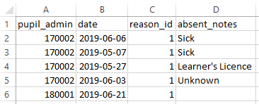

### Finding the reason\_id values {#h-l87m0ufgf5vj}

Navigate to **Administration → Absentee Administration → Edit the absentee reasons**. Click on the **edit** option next to each and notice the address bar end with the text &id=.... The digits that are shown there represent the id number of the reason. This is illustrated below, where the reason\_id value is set to 1.

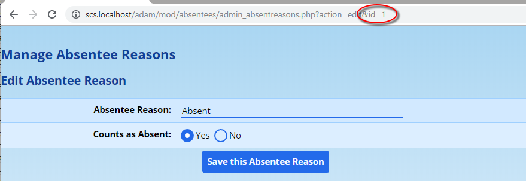
