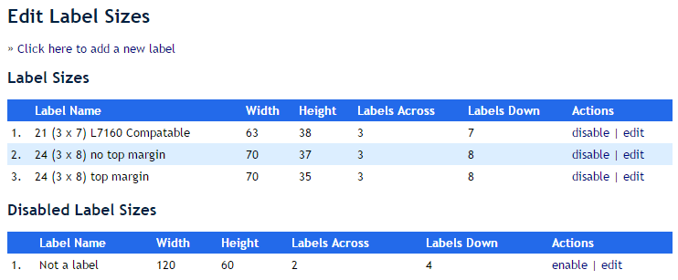
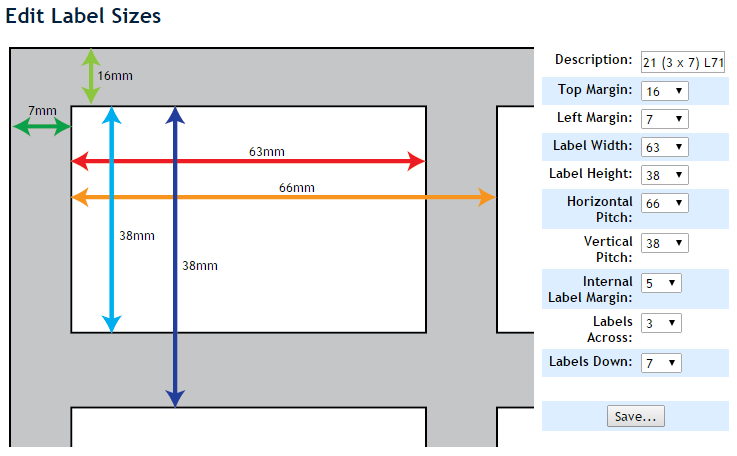
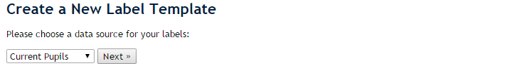
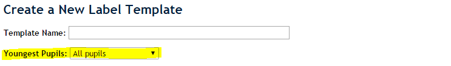
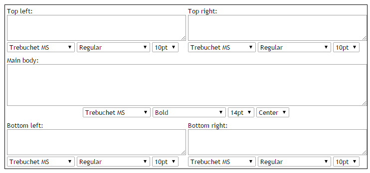

# Labels {#h-sfy96rfuv2mq}

## Creating a Custom Size Label {#h-sr4w83twoy83}

*[https://www.youtube.com/watch?v=dHhNC3wXCNI](https://www.google.com/url?q=https://www.youtube.com/watch?v%3DdHhNC3wXCNI&sa=D&source=editors&ust=1778246676111785&usg=AOvVaw3oEVmyCWL_fDPWl7517rk4)* *(1 minute)*

On the “Administration” tab, click on the “Manage Label Sizes” option which appears under the “Site Administration” heading.

You can either edit existing labels by clicking on the “edit” option next to each one, or you can click on the disable option to remove a label from consideration for printing.

Note that existing labels that have been programmed with the label size in mind will still be available and will still print on that size.

Editing or adding a new label will take you to this interface:

As you change the measurements on the left of the diagram, so the measurements on the diagram will update themselves. Note that the diagram itself won’t change, so be aware of that!

When you are done, click on the “Save…” button at the bottom. The new label should now appear in your list of labels.

## Managing Label Templates {#h-lojhvdhppyf}

*[https://www.youtube.com/watch?v=8qWuXgfWTFA](https://www.google.com/url?q=https://www.youtube.com/watch?v%3D8qWuXgfWTFA&sa=D&source=editors&ust=1778246676113537&usg=AOvVaw3zyNZJxFi69k8vY-DD49se)* *(3 minutes)*

We create label templates that ADAM will use to fill in the appropriate data when we want to create labels. To create a new label template, look at the “Administration” tab and, under the “Site Settings” heading, click on the “Edit Labels” option.

You have the option to add a new label template or to edit an existing one. To add a new template, click on the link at the top of the page. To edit a template, click on the appropriate edit link next to the label template that you want to edit.

### Adding a New Label {#h-xbpocuz1zk5m}

When creating a new label, you will be asked to say where it gets its data from. You cannot change this later and so if you choose the wrong source, you will have to start again with a new label. You can disable any labels that you no longer wish to use.

The data source will affect which tab you need to click on to produce these labels. Family labels are only available from within the Family tab, and so on.

On the following screen, if you chose to create labels for pupils, you will also be given the option of adjusting whether the label should apply to all pupils or just the Youngest/Eldest pupils (which option you see here depends on your Site Settings). Again, this setting cannot be changed later. If you do get it wrong, you can always start again.

The diagram above shows the option.

If you do not choose a pupil label, you will not see this option.

The rest of the instructions for creating the label are the same as the instructions below for editing an existing label.

### Editing an Existing Label {#h-af7akbt5d1v7}

The label is divided into 5 areas:

The top left and top right appear as such on the label, as to the bottom left and bottom right. The main body will appear vertically centred in the label, but the horizontal alignment can be specified.

Depending on the size of your physical labels, using all of these blocks may result in overlapping text. You will need to experiment to see what works on your labels.

In addition, you can change the font, font style and font size for each of the areas. You are not able to, however, have multiple fonts within a single block.

You can start by typing text into these blocks, but it is more useful to use the codes provided at the bottom of the screen. These will be substituted out for actual data when you produce the labels.

The codes must be entered with the curly braces around them and should not have any spaced between the braces and the numbers. If you do, they will not be recognised as merge codes and will be printed as they appear. If you have any custom fields which you would like to appear on the label, please take special note that the word “custom” that appears in the code must be written in lowercase.

When in doubt, simply copy and paste the merge code into the appropriate text block.

Don’t worry if you don’t get the label right the first time: you can always come back and edit.

### A note about sources and family information {#h-rgoxk0i6t5ap}

When printing pupil labels, it makes sense to have pupil fields. Likewise, when printing family information, it makes sense to use the family fields. However, there can be situations where it is useful to mix these up.

For example, when you print labels for reports, ideally you want these to contain family information, but you want to generate one label for each pupil. In this case, you would choose the source as “current pupils”, but then use the family address fields. Many schools will include the pupil’s name code in one of the footer fields so that it is apparent which label belongs to which pupil.
