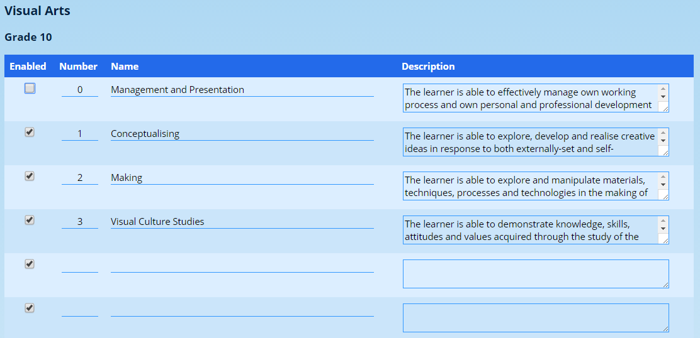
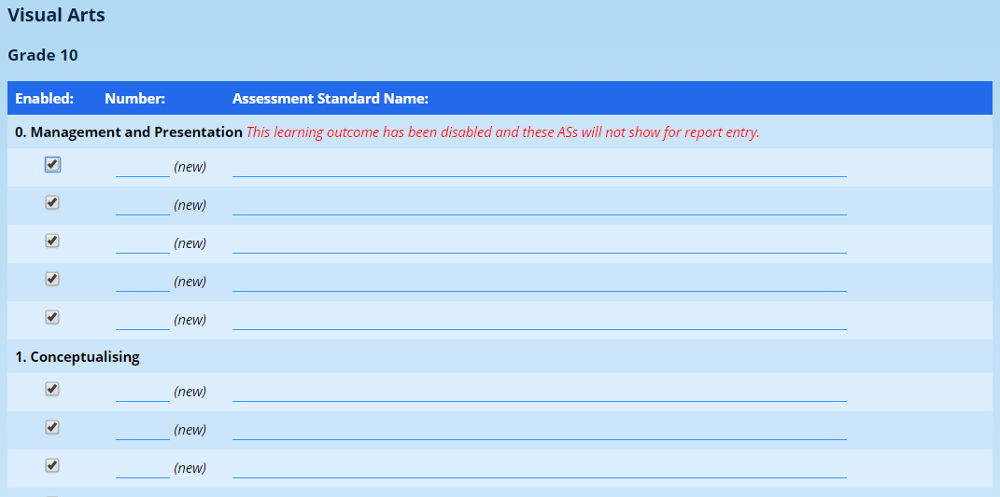

# Learning Outcomes and Assessment Standards {#h-eerhiyndsatf}

In the Outcomes Based Education policy of the National Senior Certificate, introduced into South African schools shortly after 2007, subject content was broken down into several Learning Outcomes. These LOs were further broken down into Assessment Standards which described the criteria for achieving each Learning Outcomes.

While the OBE approach has been abandoned with the introduction of CAPS in 2012, the notion of LOs and ASs can be used by schools in order to provide a more granular approach to their reporting.

Foundation Phase grades (Grades R - 3) make use of ASs to report on the pupils’ progress. From the Intermediate Phase and up (Grades 4 to 12), most assessment is mark-based. ADAM allows for mark-based assessment to feed directly into the calculation of Learning Outcomes. Note that ASs cannot be automatically generated from marks.

One final point is that LOs and ASs should be considered as objective measures of academic performance. Recording of behavioural and attitudinal measures, the subjective measures, should rather be done by means of Behavioural Indicators.

<iframe src="https://www.youtube.com/embed/sqvVM-0Fa04" frameborder="0" allow="accelerometer; autoplay; encrypted-media; gyroscope; picture-in-picture" allowfullscreen></iframe>

## Managing Learning Outcomes {#h-deo5jvne1x4g}

The option to manage Learning Outcomes can be found on the **Subjects** tab, under the heading **LO and AS administration**.

Click on the option **Edit or add a learning outcome (LO)**.

Learning Outcomes are specific to grades in a specific subject. The LOs for Grade 8 English are entirely separate from Grade 9 English, for example.

To begin, choose a subject

In the LO entry screen, any existing LOs should appear at the top. A series of blank entries should appear below. You can add any new LOs at the bottom. If you run out of blank LOs, simply click on the **Edit Learning Outcomes** button at the bottom of the screen.

The information required:

-   **Enabled**: This field determines whether or not the LO is available to subjects to enter against on the reporting screen. Note that a disabled LO will also prevent any of the ASs that are associated with it from displaying. Instead of deleting an LO, rather disable it. This will still keep it available for any past reports that might depend on that LO. If you change the LO to meet new requirements, you may well be misrepresenting outcomes on previously captured reports.
-   **Number**: Normally this number won’t display. However, it is required for ordering of the Learning Outcomes. If you want to change an LO’s position in the list, simply update the numbers. When you save the LOs, they will be put into the correct order when you next see them - either by editing this page, or on your report. Every LO must have a number, even if it is an arbitrary one.
-   **Name**: The name of the LO is the text that is most commonly displayed on a report. Every LO must have a name.
-   **Description**: The description of an LO is an optional field which some report templates display if it is present. Most, however, do not. You do not have to enter a description if you don’t want to.

Once you save the Learning Outcomes, you can continue editing the LOs for that grade and subject, choose a new grade, or even choose a new subject.

ADAM will also give you the opportunity to edit the assessment standards for that Learning Outcome. This is a shortcut into the next section.

## Managing Assessment Standards {#h-kncddgaz3yer}

The option to manage Assessment Standards can be found on the **Subjects** tab, under the heading **LO and AS administration**.

Click on the option **Edit or add an assessment standard (AS)**.

ADAM will ask you to choose a subject and then a grade.

Each of the Learning Outcomes is listed with any associated Assessment Standards. ADAM will always provide five blank spaces for new ASs. If you require more, save the ASs first and revisit this page: five more blank spaces will be added for you.

In the screenshot above, take special note that the first LO (“Management and Presentation”) has a red warning next to it. This Learning Outcome has been disabled in the LO section (see the screenshot on the previous page where we [discussed Learning Outcomes](#h-deo5jvne1x4g)). You will see that the first LO is not enabled. That means that none of these ASs, whether enabled or not, will be available for reporting. This might well be intentional. However, it can cause some anxiety if ASs aren’t showing - checking in Learning Outcomes is not immediately obvious and hence we display this warning here.

For each assessment standard, you will need to enter the following:

-   **Enabled:** This allows certain criteria to be displayed or hidden for reporting entry.
-   **Number:** Every AS must have a number associated with it. This does not necessarily display on reporting templates (very few display this number) but it is used for sorting the ASs into the appropriate order.
-   **Assessment Standard Name:** Every AS must have a name. This is shown on the report.
