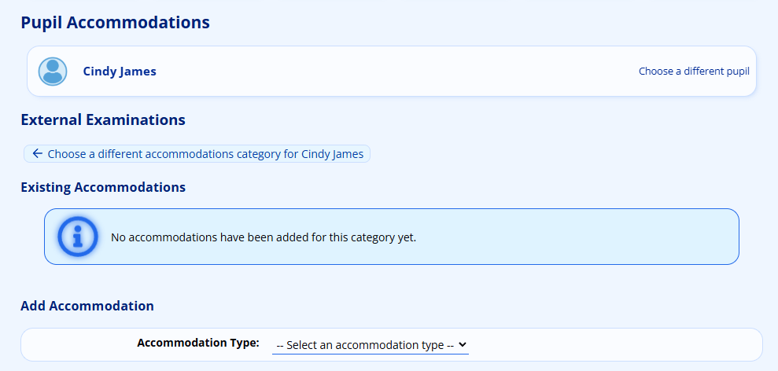
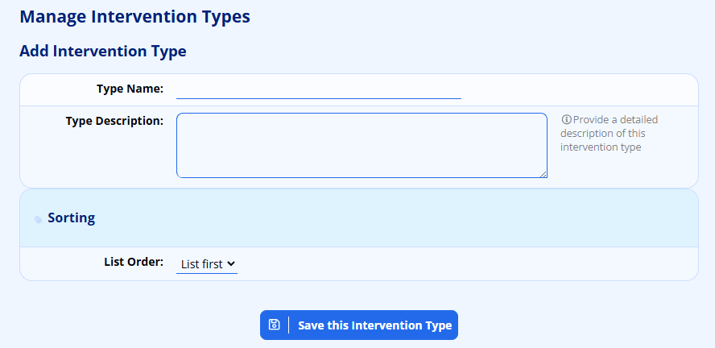
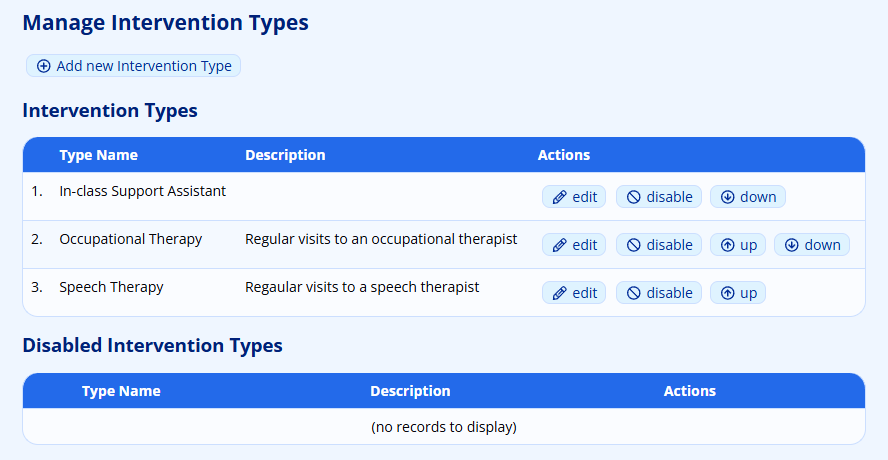
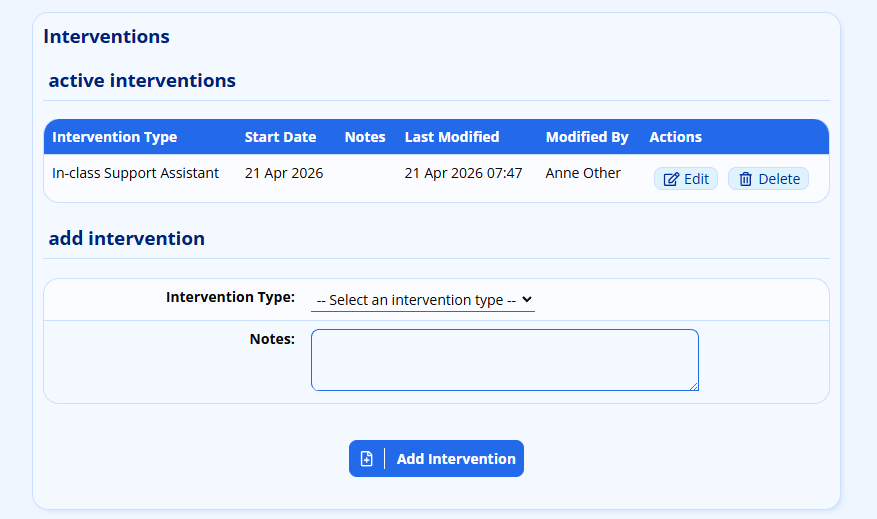
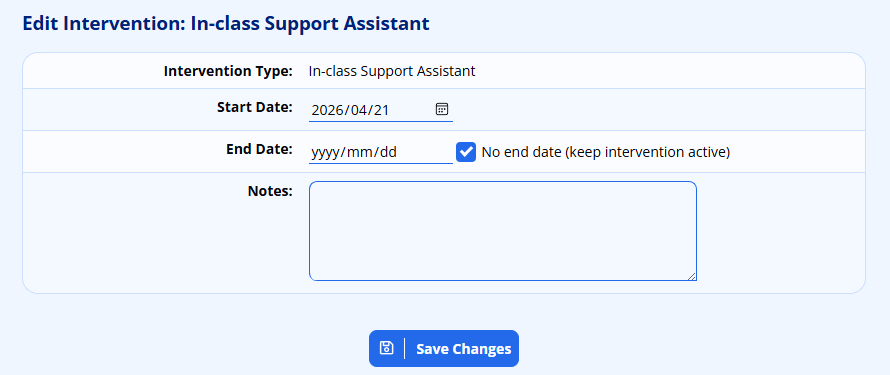
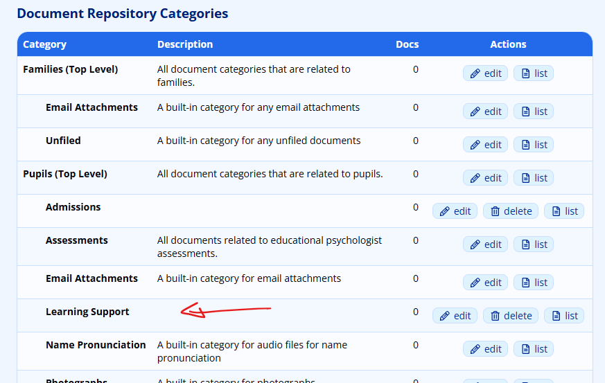
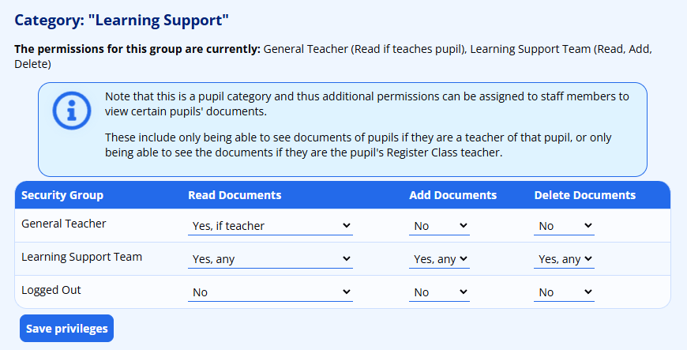
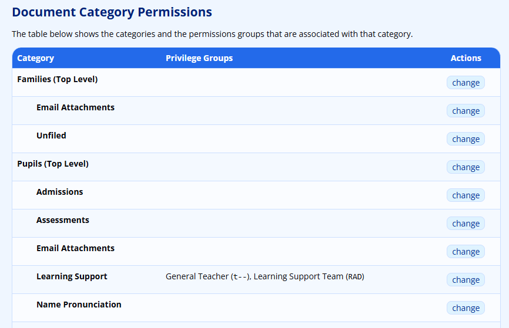
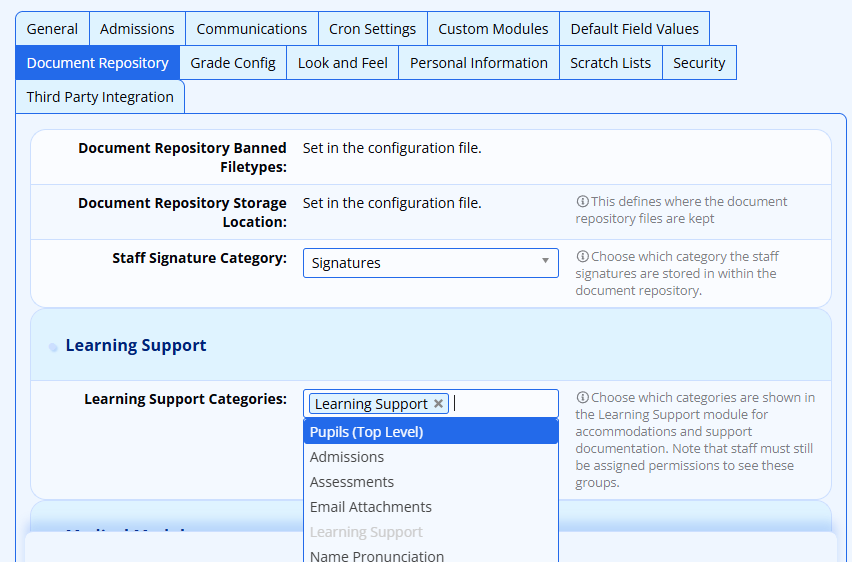

# Learning Support and Accommodations Module

## Overview

The Learning Support and Accommodations module helps schools track and manage three key areas of student support:

1.  **Learning Support** - Tracking of students with special academic needs by category (e.g., Monitor, Mild BTL, Moderate BTL)
2.  **Accommodations** - Access arrangements granted to learners for tests and examinations (e.g., extra time, separate venue, use of a scribe)
3.  **Interventions** \- A history of applied interventions and support remedies.

This module provides tools for adding and editing pupil records, generating reports for teachers and administrators, and integrating support information into pupil profiles.

## Getting Started

### Accessing the Module

The Learning Support features appear in several locations depending on your permissions:

-   Pupils tab → "Learning Support and Accommodations" section
-   Classes tab → "Lists and Labels" section
-   Grades tab → "Lists and Labels" section
-   Subjects tab → "Lists and Reports" section

## Managing Learning Support Records

Learning Support records track a pupil's support category and related notes. Only one record can be active at a time - adding a new record automatically deactivates the previous one, preserving a full history.

### Default Support Categories

The system comes pre-configured with these categories (in order of intensity):

1.  Monitor
2.  Newly identified
3.  Mild BTL (Barriers to Learning)
4.  Moderate BTL
5.  Moderate to Severe BTL
6.  Significant BTL

### Adding a Learning Support Record to a Pupil’s Profile

1.  Navigate to **Pupils → Learner Support and Acommodations → Add or edit a pupil's learning support records**
2.  Search for and select the **pupil**
3.  Click on **learning support** to view the pupil's current status and historical records
4.  Select a **support category** from the dropdown
5.  Enter **notes** about the pupil's needs and support requirements
6.  Optionally **upload supporting documents** (intervention plans, progress notes)
7.  Click Save to set this as the active record

The previous active record (if any) will be automatically marked as historical but remains visible for audit purposes.

### Viewing Support History

All past learning support records are displayed below the current record, showing:

-   Category assigned
-   Notes entered
-   Date of the record
-   Staff member who made the entry

## Managing Pupil Accommodations

Accommodations are access arrangements that allow learners to demonstrate their abilities fairly in assessments. They are organised into categories (typically "Internal Examinations" and "External Examinations").

### Adding Accommodations to a Pupil

1.  Navigate to **Pupils → Learning Support and Accommodations → Add or edit a pupil's accommodations**
2.  Search for and select the **pupil**.
3.  Click on the **learning support** section.
4.  Select the **accommodation category** (e.g., "External Examinations" or "Internal Examinations")
5.  You will see any existing accommodations for this category

6.  Select the accommodation type from the dropdown (e.g., "Extra time - 10 min per hour")
7.  Optionally upload supporting documents (medical reports, psychometric assessments). *Note that you will need a Document Repository category configured to receive these documents. See* *[instructions below for setting this up](#managing-document-repository-categories)**.*
8.  Click **Add Accommodation** to save

### Removing Accommodations

1.  Navigate to the pupil's accommodation page for the relevant category (see navigation process for [adding, above](#adding-accommodations-to-a-pupil))
2.  Click the **Remove** button next to the accommodation you wish to delete
3.  Confirm the deletion

## Managing Interventions

Interventions keep a record of the interventions that have been put into place to help and support a pupil.

### Managing Intervention Types

Navigate to **Administration → Academic Administration → Manage intervention types**. From here, click on **Add new Intervention Type**  to add a new Intervention Type:

Click on **Save this Intervention Type** to save the information.

Once added, the Intervention Types will appear in a list. Interventions can be disabled and re-ordered using the options on the right. Take careful note when editing an intervention: this will affect all pupils who have been assigned to the intervention.

### Assigning Interventions to Pupils

In the **Pupil Profile**, under **Learning Support**, navigate to the **Interventions** section and choose an intervention type from the list and click on **Add Intervention**.

Any specific notes regarding the intervention can be recorded - these might include the therapist’s name, and other parameters regarding the intervention. *Be careful of including sensitive information in the notes, since this record might be visible by other teachers.*

Existing interventions can be **edited** and **deleted**.

When **editing** an intervention, one can optionally choose an end-date. This will allow historical interventions to be kept on record. Note that the “No end date” check box must be unticked in order to put an end date.

If today’s date is chosen as the end date, the record will still appear in the “Active Interventions” section, but will automatically move to the “Historical Interventions” section.

**Deleting** an intervention will remove all trace of it and so this option should NOT be used if you want to maintain a history that includes this intervention.

## Generating Reports

Reports help teachers and administrators view accommodation and learning support information across classes, grades, or subjects.

### Accommodations Reports

Available report types:

-   By Class - View accommodations for pupils in selected classes
-   By Grade - View accommodations for pupils in selected grades
-   By Subject - View accommodations for pupils taking a specific subject

To generate a report:

1.  Navigate to the appropriate report (e.g., **Classes → Lists and Labels → Accommodations lists by class**)
2.  Select the classes, grades, or subjects to include
3.  Filter by **accommodation category** (Internal/External) if needed
4.  Filter by specific **accommodation types** if needed
5.  Choose output format:

-   View - Display on screen
-   CSV - Download as spreadsheet
-   Excel - Download as Excel file

6.  Click **Generate Report**

### Learning Support Reports

Available report types:

-   By Class - View learning support records for pupils in selected classes
-   By Grade - View learning support records for pupils in selected grades
-   By Subject - View learning support records for pupils taking a specific subject

To generate a report:

1.  Navigate to the appropriate report
2.  Select the classes, grades, or subjects to include
3.  Filter by support category if needed
4.  Toggle Show Notes to include or exclude support notes
5.  Choose output format (View/CSV/Excel)
6.  Click Generate Report

### Teachers with Limited Access

If you only have the "view own" privilege, you will only see classes you teach. The system automatically filters the available options based on your teaching assignments.

## Pupil Profile Integration

Learning Support information is integrated into the pupil profile system.

### Pupil Overview Widget

The pupil overview displays a summary card showing:

-   Current learning support category and notes (truncated, hover for full text)
-   Active accommodations grouped by category (Internal/External)

### Pupil Profile Sections

Dedicated sections in the pupil profile show:

-   Learning Support: Current status, historical records, and linked documents
-   Accommodations: Organised in tabs by category (Internal/External)

### Pupil Info Page

A comprehensive learning support page is accessible from the pupil profile showing all information in one place:

-   Current learning support status and notes
-   Full history of all support records
-   All active accommodations by category
-   All linked documents with download links

## Scratch List Fields

Four learning support fields are available for inclusion in pupil scratch lists:

**Field**

**Description**

Learning Support Status

Current support category name

Learning Support Notes

Notes from the current active record

Accommodations (Internal)

List of internal exam accommodations

Accommodations (External)

List of external exam accommodations

To add these to a scratch list, select them from the available fields when configuring your scratch list.

## Administration

### Managing Learning Support Categories

1.  Navigate to **Administration → Academic Administration → Manage learning support categories**
2.  Add, edit, or disable categories
3.  Set the sort order to control how categories appear in dropdowns

### Managing Accommodation Categories

Custom accommodations categories can be added.

1.  Navigate to Academic Administration → Manage accommodation categories
2.  Add, edit, or disable categories
3.  Each category has a type: "Internal" or "External"

### Managing Accommodation Types

1.  Navigate to **Administration → Academic Administration → Manage accommodation types**
2.  Add, edit, or disable accommodation types
3.  Each type is assigned to a category
4.  Include a description to help users understand what the accommodation provides

Pre-configured accommodation types include:

-   Extra time (5, 10, 15 min per hour)
-   Rest breaks (5, 10 mins per hour)
-   Separate venue
-   Reader
-   Scribe
-   Typing (computer use)
-   Prompter
-   Practical assistant
-   Spelling/Handwriting assistance

### Managing Document Repository Categories

Before you can upload documents with Learning Support or Accommodations records, specific categories need to be created and specific privileges assigned to those groups. It is necessary that ensure that the groups who are allowed to add accommodations and learner support information have the ability to add documents to the category or categories that you create for this.

More information on creating [Document Repository Categories](document-repository.md#categories) and setting [Document Repository Staff Permissions](document-repository.md#staff-permissions) can be found elsewhere in this documentation (follow those links!).

An example of a Learning Support category created in the Pupils section is shown below:

Here, we show privileges being set for an abbreviated set of privilege groups for the **Learning Support** category.

Once saved, this should appear as follows:

*Note the “t--” is the code that represents “read if teacher”, and “RAD” represents “Read, Add and Delete”.*

*It is often useful to give General Teachers (or your equivalent group) permission to read these documents “Only if they teach the pupil”. Again, see the section on* *[Staff Permissions](document-repository.md#staff-permissions)* *for more.*

Finally, you will need to tell ADAM which categories may be chosen to upload these support documents to. The settings are found in the [Site Settings](changing-site-settings.md#changing-site-settings) in the **Document Repository** section.

## Frequently Asked Questions

-   **Can a pupil have multiple accommodations?**

-   Yes. A pupil can have multiple accommodation types across different categories. For example, they might have "Extra time - 10 min per hour" and "Separate venue" for external examinations.

-   **Can a pupil have multiple active learning support records?**

-   No. Only one learning support record can be active at a time. Adding a new record automatically deactivates the previous one, but historical records are preserved.

-   **What happens to documents when I remove an accommodation?**

-   Documents remain in the Document Repository but are no longer linked to the accommodation.

-   **Who can see a pupil's learning support information?**

-   This depends on permissions. Teachers with "view own" privileges see information for pupils in their classes. Users with full "view" privileges can see information for any pupil. The pupil overview widget only shows information to users with appropriate permissions.
