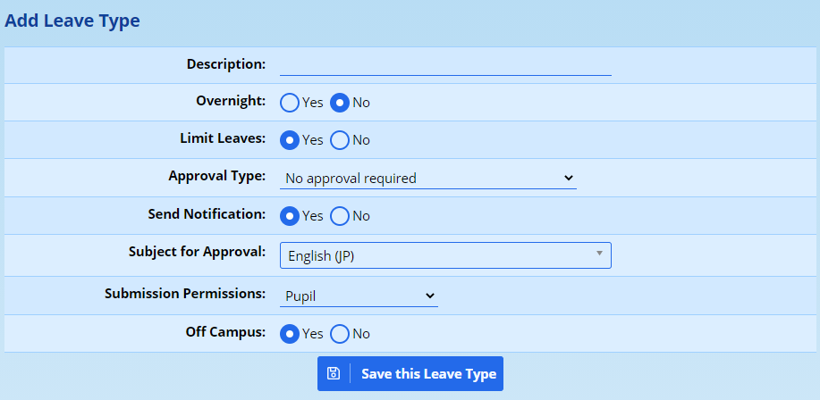
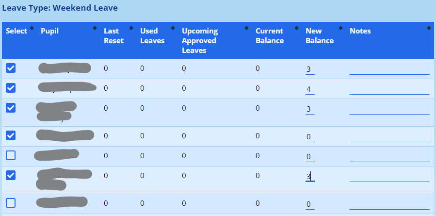
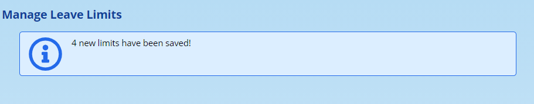

# Leave Module {#h-2sm8kcz8fhlr}

A leave module allows schools, particularly those with boarders, to keep track of pupils and their leaves.

## Initial Setup {#h-9kljpgv2kwj9}

Before parents, staff or students can request leaves the following steps must be performed first by a user with the relevant permissions:

1.  **Define Leave Types** \- at least one leave type must be added before users can request leaves. See [Manage Leave Types](#h-elzaofkudzmu) below.
2.  **Reset Leave Limits** \- for any leave type that limits the number of leaves, leave limits need to be set or users will not be able to apply for these types of leaves. See [Manage Leave Limits](#h-mgqjghnk5oks) below.

## Managing Leave Types {#h-elzaofkudzmu}

Before any leaves can be issued on ADAM, the leave types need to be defined. This can be done via **Administration → Pastoral Administration → Manage Leave Types**.

A list of existing leave types will be shown.

### Adding a new Leave Type {#h-hz2xaoo8rvzc}

Click on the button **Add new Leave Type**.

The fields are defined as follows:

-   **Description** is a description of the leave type that will be used whenever this leave type needs to be shown. Keep the description short, clear and unique from the other Leave Types.
-   **Overnight** indicates to ADAM whether this leave type results in a pupil being away from school overnight.
-   **Limit Leaves** is a setting which will allow ADAM to prevent the issuing of leaves to pupils once their allocations have been depleted. Note that the limits can be set per leave type per pupil and are set [elsewhere](#h-mgqjghnk5oks) in ADAM.
-   **Approval Type** indicates to ADAM what approvals are required and in what order the approvals should be requested. Options are:

-   No approval required: ADAM will allow the leave with no other approval.
-   Approval by subject teacher: ADAM will seek approval for this leave from the pupil’s teacher of a specified subject (see below for **Subject for Approval**). In most instances, this would be set to a subject that is linked to pastoral care: an example would be “housemaster” or “boarding house admin”. *If a pupil does not belong to any such class, their leave can only be approved by a person with global approval rights.*
-   Approval by parents: The parents must approve this leave type - this can be done via the parent portal.
-   Approval by parents, then subject teacher: The parents will be asked for approval first, and, if they approve, the subject teacher will be asked for approval.
-   Approval by subject teacher, then parents: The subject teacher will be asked for approval first, and, if they approve, the parents will be asked for their approval.

-   **Send Notification** - this enables ADAM to send out leave approval notifications via email. If this setting is set to “Yes” then ADAM will send an email notification to any staff or parent that needs to approve a leave of this type. The days and times when these notifications are to be sent can be configured in the [Site Settings](changing-site-settings.md#h-3j2qqm3).
-   **Subject for Approval** defines which subject ADAM should look at to find which teachers are allowed to approve leaves for a pupil. The teachers and Teaching Assistants of a class in this subject, will be able to approve leaves for all pupils in those classes. They will not be able to approve leaves for pupils in other classes that they are not teachers of. If notification emails are turned on then the teachers of pupils in the subject here specified will be notified of their required approval.
-   **Submission Permissions** tells ADAM who may submit these leave requests. Options including all combinations of Pupils, Staff and Families.
-   **Off Campus** tells ADAM whether this leave counts as the pupil being away from school. For example, a pupil who has signed out of the boarding house for the evening might be in the school library - out of their boarding house, but still on campus. This impacts catering and roll-call lists.

### Editing a Leave Type {#h-5sggyimhajq6}

From the list of Leave Types, click on the **edit** option next to the leave type that you’d like to change. The editing screen will be displayed. A description of each of the fields can be [found above](#h-hz2xaoo8rvzc).

## Managing Leave Limits {#h-mgqjghnk5oks}

Some leaves can be configured to be taken only a limited number of times. These limits must be set per leave type, per pupil.

*Note that if leave limits are not set for each pupil and for each leave type this will result in parents, staff and pupils being unable to apply for leaves of types where no limit has been set. In the same way pupils who have a balance of zero leaves for a particular type will not be allowed to request leaves of that type.*

Leave limits can be changed in one of two ways:

1.  **Reset** - A hard reset of the number of leaves for a particular leave type. This can be used, for example, at the beginning of a term/semester/year to allocate an initial number of leaves to each pupil. Resetting leave limits in this way will overwrite the current leave balance for each pupil with a new predetermined value.
2.  **Change** - This is a change in  the number of leaves relative to their total allowed leaves for a particular type. For example if pupils were allocated 3 overnight leaves at the beginning of a term/semester/year and each pupil has used a different number of leaves this method can be used to increase (or decrease) the number of available leaves for all pupils by a certain amount relative to their own balance.

### Reset Leave Limits By Class {#h-rh0sajmyww21}

Navigate to **Pupils → Leave Management → Reset Leave Limits by Class**.

Choose the class and the leave type.

*The classes shown are those from the subject specified in the Site Settings as the* ***General / Default Class subject for Leaves****. This might need to be set correctly the first time if you do not see any classes listed here. This setting should be set to align to your boarding houses.*

This screen shows the pupils’ current leave counts for the selected Leave Type.

To change a pupil’s limit, make sure the **Select** box is checked, and enter a new amount in the **New Balance** column on the right and, optionally, enter a **Note**.

*Note carefully that only rows that have the* ***Select*** *box checked will be saved. This allows you to update only a single pupil in a whole class if required. The* ***Select*** *column will check automatically when the* ***New Balance*** *column or* ***Notes*** *column is typed in.*

Once done, click on the **Save Limits** button at the bottom of the screen.

ADAM will confirm how many leave limits were saved:

When setting limits, please note that any *future-dated* leaves will be deducted from the new balance.

On 1 April, a pupils has 2 leaves available and books two leaves for 21 April and 28 April. On 14 April, the pupil’s limit is reset to 3. At the end of April, the pupil will have 1 leave available. This is because the limit reset of the 14th happened prior to the two leaves being taken and thus those leaves will be deducted from that total. This has potential issues if, for example, a pupil has two leaves, books them, and has a limit then reduced to 1. Both leaves were requested and will not be revoked. Any pupil who has leaves deducted because of disciplinary or other reasons, may need this checked manually. ADAM will certainly prevent a user from having a negative leave balance where it can, but if a leave total is reset to a lower amount than the leaves already booked, the pupil will have a negative leave total and will be allowed to proceed with the leaves. This is because the negative amount was essentially created by a human rather than ADAM.

## Leave Requests {#h-k8k11ud1z2mm}

Submitting leave requests is slightly different for staff vs parents and pupils.

### Submitting a Leave Request by Staff for/on behalf of a Pupil {#h-jdxwlntq82hi}

Navigate to **Pupils → Leave Management → Submit a Leave Request for a Pupil**.
