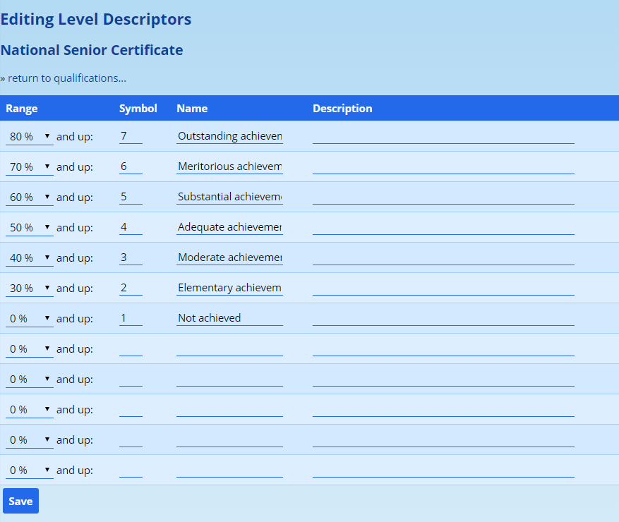
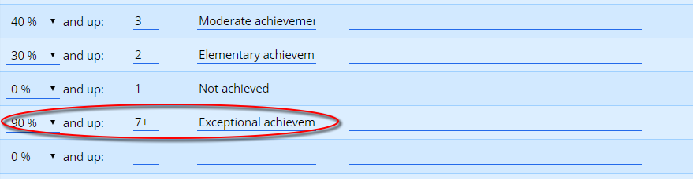
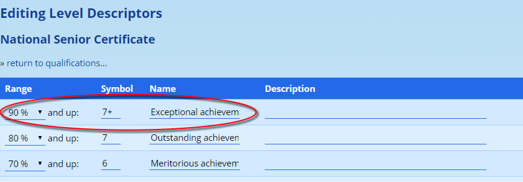

# Level Descriptors

In typical usage each grade is assigned to a specific [qualification](academic-qualifications.md#academic-qualifications) in the [reporting period settings](reporting-period-administration.md#reporting-period-administration). It is possible to [assign a pupil directly to a qualification](academic-qualifications.md#changing-an-individual-pupils-qualification) which would override the qualification that might otherwise apply via this mechanism.

Regardless of which of the two methods is used, the qualification that is assigned to a pupil determines how ADAM converts their marks, should they be captured, into appropriate symbols and level descriptors.

While in typical usage, all subjects make use of the same symbols, it is possible to configure ADAM so that individual Subject or individual Learning Outcomes within subjects use customised qualifications. See the [Qualification](academic-qualifications.md#using-customised-symbol-sets-for-a-for-a-specific-subject-or-learning-outcome) section for more information.

## Editing Level Descriptors

Navigate to the menu option **Administration → Academic Administration → Edit level descriptors**. In the first screen you will be required to choose the qualification that applies.

Choose the qualification and click on the **Edit levels…** button.

ADAM will show the existing levels and five empty level slots:

Each level has four pieces of information:

1.  **The lower bound percentage.** This is the minimum mark required for ADAM to award this level. Please see [the note below](#a-note-on-percentages-for-non-mark-based-assessment-phases) if you are working on levels for the Foundation Phase or any other non-marks-based assessment setup.
2.  **Symbol.** This is the symbol that will be awarded.
3.  **Name.** If the level descriptors have names, these can be captured here.
4.  **Description.** Where relevalt, you can capture descriptions for your levels here. In so doing, it becomes possible for any level description tables on your reports to be dynamically generated.

The levels will automatically be sorted by percentage and so, given the example of NSC symbols 1-7 above, one could add in that 90%+ was a “7+” by going to the first empty row - in the diagram above, this would be just below “1 - Not achieved” - and entering in the information as follows:

Once saved, this would automatically be sorted to the top of the list:

### A Note on Percentages for Non-mark-based Assessment Phases

It is possible to set up Level Descriptors that are not marks based and have ADAM make use of these. This happens in environments where marks are not captured and so having a percentage based score makes little sense.

ADAM allows you to capture these levels as you’ve done, but in these instances, only uses the percentage for ordering the symbols.

Simply put, your best symbol should be assigned the best percentage, the next best symbol assigned the next best percentage and so on. It won’t matter what these percentages are if you are not capturing marks since then ADAM will never have to do an automatic conversion. However, whenever they are displayed, ADAM will want to order them according to those percentages.

### A Note on Editing Levels Descriptors used in Previous Years

If level descriptors have been used in years gone by and they are changed, please be very aware that editing the descriptors may well influence the reports from those years if they are ever regenerated. This is not often the case since ADAM stores a fixed copy of the report, but in cases where the report is regenerated, if the levels are different - particularly if your report template uses the level names and descriptions to generate the descriptor table automatically - then your report will be different too.

If there is a substantial change in your levels, for example, changing the boundary percentages (especially where you have ADAM translate the percentages to levels automatically) or even the number of levels changes, then the safest option in this case is to create a new Qualification and create a new set of levels with that Qualification. To do this:

1.  Create a [new qualification](academic-qualifications.md#adding-and-editing-academic-qualifications)
2.  [Add the levels](#editing-level-descriptors) to the qualification
3.  Assign the qualification [to the grade](reporting-period-administration.md#editing-a-reporting-period) or [individual pupils](academic-qualifications.md#changing-an-individual-pupils-qualification)
4.  Check that the correct levels appear on your report
