# Logging on to ADAM: A Guide for Parents {#h-3wf37gt5yaio}

**In order to protect the privacy and security of personal information in ADAM, parents are required to set a password that will be used in conjunction with their ID number in order to log into ADAM. This document explains how to do this.**

There are several sections in this document. The following links will jump you to the appropriate section depending on what you’re trying to do:

1.  [Logging into ADAM for the first time](#h-lhdo3qnuhw2w)
2.  [Logging into ADAM on subsequent occasions](#h-dp8f3p7ftvyl)
3.  [Help! I’ve forgotten my password!](#h-29nl2v8fue2g)
4.  [Help! ADAM doesn’t recognise my information!](#h-ypjo9gg1d2c1)
5.  [Help! ADAM tells me that no information is permitted to be shown!](#h-tldxvzanj4a6)

## Logging into ADAM for the first time {#h-lhdo3qnuhw2w}

Before you begin:

1.  You must know your **South African ID number** or your **passport** number, as captured on the ADAM database.
2.  You must also have access to an **email address** that is entered against your name in the database. Part of the process will involve ADAM sending a confirmation link to your email address for verification. The process of verifying the email link must be done within two hours of starting.

*Note that some parents, who share a single email address, may have difficulty in accessing ADAM. This is because the email address is likely associated with only one parent. If you receive the error that there is no email address associated with you, please make contact with the school who can copy the address for both parents.*

Proceed to “Parent Login” on the ADAM home page:

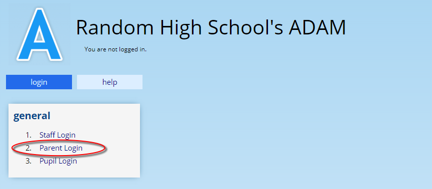

Click on the button that says “**New account? Forgotten password?**”:

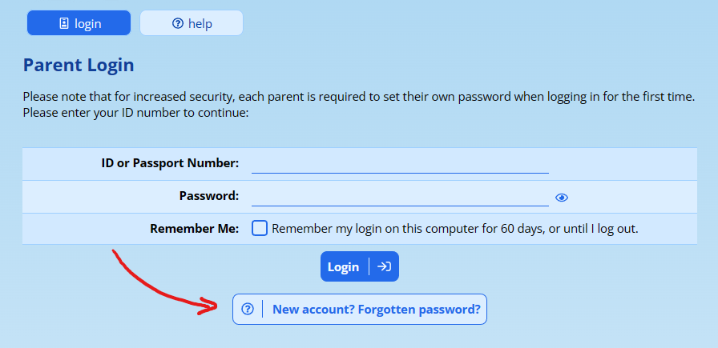

You will then be asked to enter your ID Number. Enter it here, with no spaces. Parents who are not South African citizens should enter their passport numbers here.

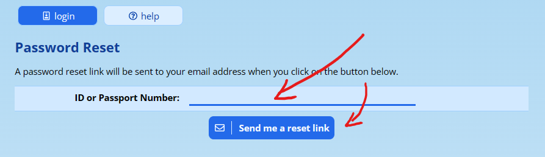

ADAM will now send the password reset link via email to all email addresses associated with your profile:

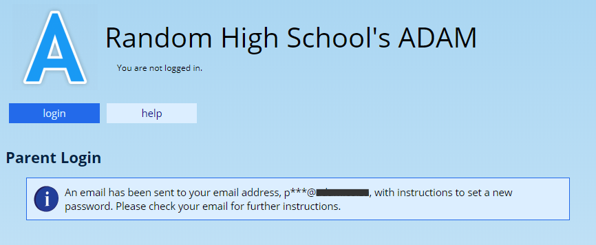

You may find that ADAM will present you with this error if you have no email address currently stored in the database. In this instance, please make contact with the school so that they can add an email address onto your profile.

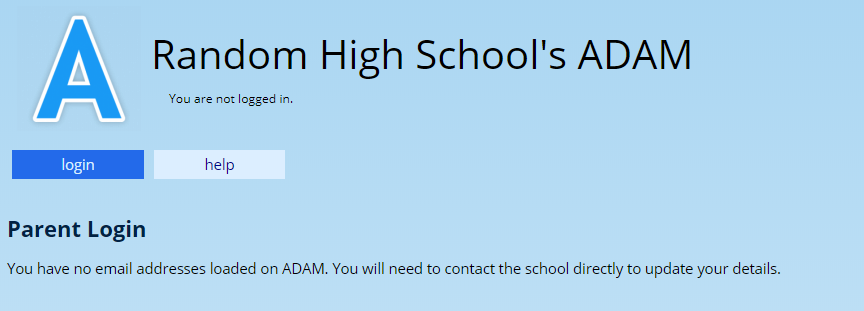

Please check your email for a mail that looks similar to the one below. Be sure to check your junk or spam folder for the email!

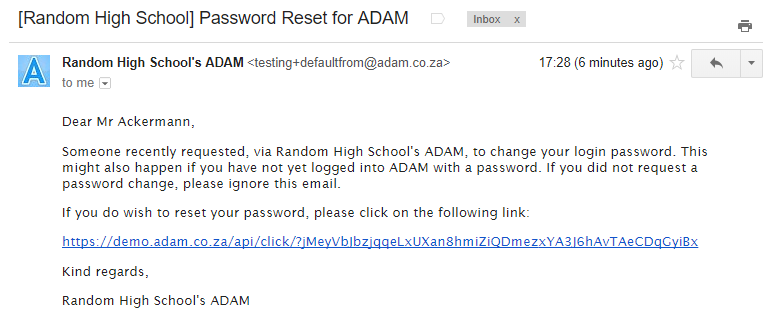

Please note that if you do not follow this step within two hours of requesting the new password, the link will expire and you will need to start again. Please also note that the password reset link is specific to an individual parent and the same link cannot be used to reset another parent’s password.

When you click on the link, you will be prompted to enter a password, twice:

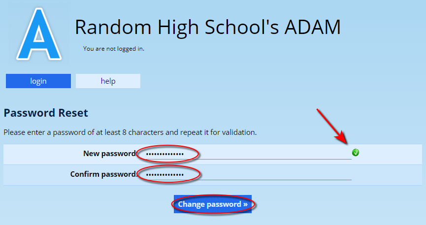

After you enter your password, ADAM will perform a security check on your password to ensure that it is of sufficient quality. ADAM will show a green check mark next to the password field if the password is satisfactory.

If the password is not secure, ADAM will show a warning, asking you to choose a more secure option:

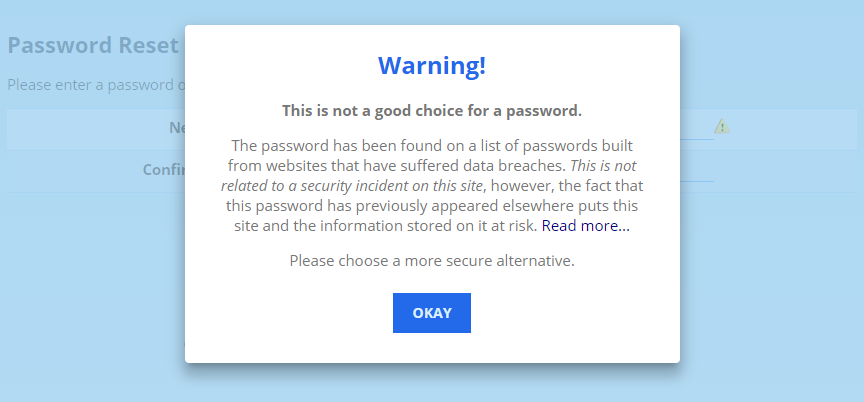

Click on the “Change your password” button and ADAM should confirm that your password has been changed.

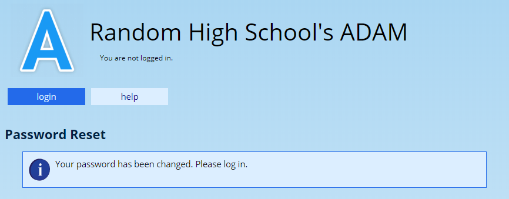

Click on the “login” tab to begin the login process again.

## Logging into ADAM on subsequent occasions {#h-dp8f3p7ftvyl}

Proceed to “Parent Login” on the ADAM home page:

You will then be asked to enter your ID Number. Enter it here, with no spaces. Parents who are not South African citizens should enter their passport numbers here.

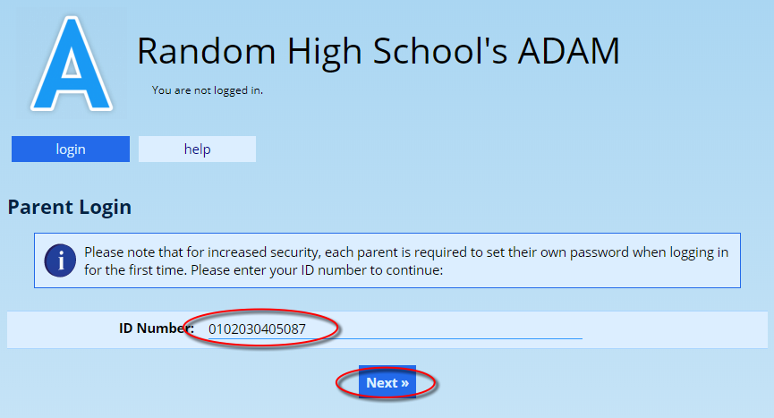

Now enter your password:

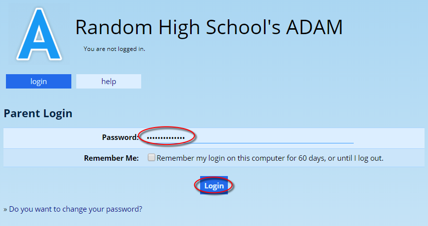

Finally, click on the “Login” button.

If you are successfully logged in, you will see a login status message at the top of the screen and a card for each of your children will be shown.

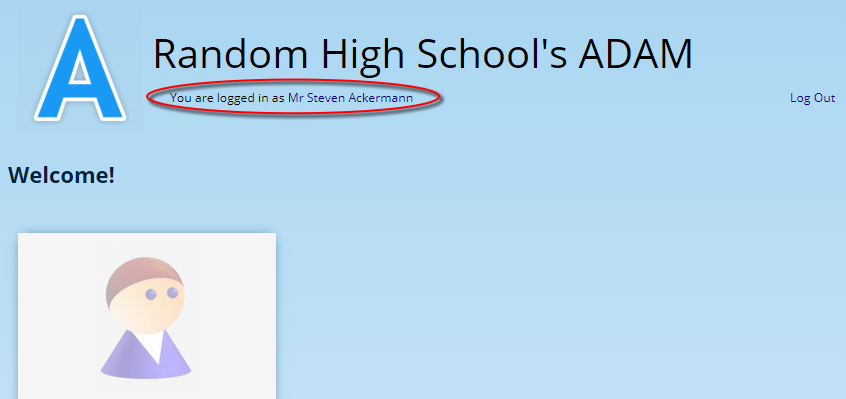

You may find that ADAM gives you a warning message that “No information is permitted to be shown”. In this instance, please see the section titled [Help! ADAM tells me that information is permitted to be shown!](#h-tldxvzanj4a6)

## Logging in with a Passkey {#h-u9ub5n59zgzk}

If your phone, tablet or laptop supports a fingerprint reader, face recognition, or a screen-lock PIN, you can choose to log in with a passkey instead of typing your ID number and password. A passkey is a small piece of information that lives on your device. To log in, you simply tap a button on the ADAM log-in page and confirm with your fingerprint or face — ADAM never sees your fingerprint or face, only the “yes, this is the right person” answer from your device.

To set up a passkey, log in with your ID number and password as usual. At the top of your portal page, ADAM will display a card titled “Log in with your fingerprint or face” with a Set up a passkey button. Click it, give the passkey a name (for example, “My phone”), and confirm with your device’s biometric or PIN.

From then on, when you visit the parent log-in page, you can click Log in with a passkey instead of entering your ID and password. The button is only shown when your browser supports passkeys; if it is not visible, just continue to log in with your ID number and password as before.

To rename or remove a passkey at any time, go to **Family Portal → Security → Manage your passkeys**. Remove a passkey if you have lost the device it was set up on, or if you no longer use that device for ADAM. See [Passkey Authentication](passkey-authentication.md#h-68qerlruak0n) for the full guide.

## Help! I’ve forgotten my password! {#h-29nl2v8fue2g}

If you have **forgotten your ADAM password**, you can get ADAM to send to a password reset link similar to the one you received when you first created your password.

Click on the “Parent Login” option on the landing screen:

Click on the “**New account? Forgotten password?**” button:

Then enter your ID number and click on the “Send me a reset link” button.

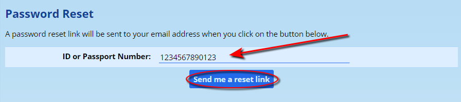

ADAM will then send you a password reset email. Please allow 5 to 10 minutes for the email to arrive. If it does not arrive, please also check your junk or spam mail folder.

In the email is a link that you can click on which will take you back to ADAM and you can then enter a new password.

## Help! ADAM doesn’t recognise my information! {#h-ypjo9gg1d2c1}

You may find that ADAM does not recognise your ID number or cell number when you first are setting your password:

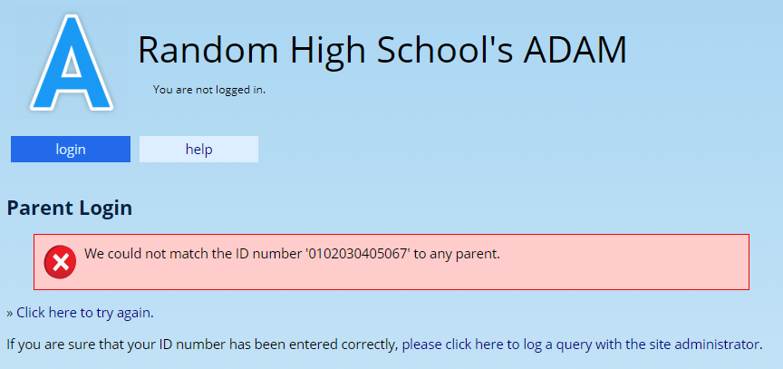

If this is the case, you will need to contact the school and ask them to double check your details on the system. The screen shown above provides a link that allows you to submit a request directly to the school’s ADAM administrator for them to investigate.

In many cases, the database will have your details with a simple typographical error.

Kindly note that the developers of ADAM cannot assist with the resolution of this issue.

## Help! ADAM tells me that no information is permitted to be shown! {#h-tldxvzanj4a6}

Parents may see this error notification from time to time:

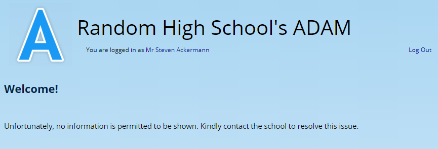

In this instance, the school has blocked access to your children’s information on ADAM. The reasons for this are varied. To resolve this issue, you must please make contact with the school.

Kindly note that the developers of ADAM cannot assist with the resolution of this issue.
