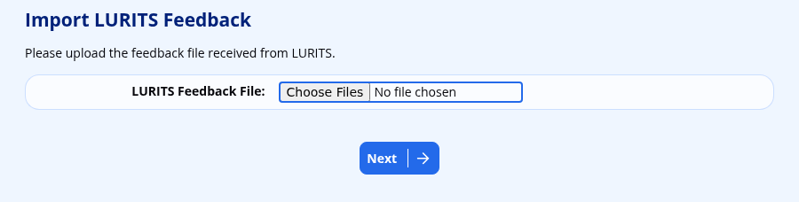

# LURITS

ADAM no longer submits data to LURITS since the District Offices took responsibility for this, using the SA-SAMS database exports. However, in order to get the LURITS numbers added to ADAM, the LURITS feedback files need to be returned from your District Office to you.

These files consist of a number of XML files, each with a different transaction number, and they usually arrive packed together in a single ZIP archive.

The export that your District Office submits on your behalf is described under [SA-SAMS Export](sa-sams-export.md).

## Who May Import the Feedback

Importing the feedback requires the **Import LURITS feedback files** permission, which appears under the **DBE Administration** heading in the permission list. Staff without it will not see the **Import LURITS feedback information** option on the menu at all. Permissions are granted to staff groups — see [Security Administration for Staff](security-administration-for-staff.md).

## Getting Feedback from LURITS

-   Once feedback has been received from the LURITS database (normally within 24 to 48 hours of submitting), you will receive a feedback file that you are required to import into ADAM. This ensures that ADAM is aware of any issues with the data and to synchronise the statuses of pupils and staff between ADAM and LURITS. For example, new pupils will receive a LURITS number. This number is imported as part of the feedback process.

-   The feedback file is normally sent by e-mail, and is normally a compressed ZIP file or RAR archive. Save it to your computer from your e-mail.

-   **If it is a ZIP file, you do not need to extract it.** Upload the ZIP file to ADAM exactly as it arrived and ADAM will unpack it for you, importing every feedback file it finds inside.

-   **If it is a RAR archive**, ADAM cannot read it, so it still has to be extracted first. Right-click on the file and “Extract” the archive, then upload the “.xml” files it produces. Specific instructions will vary depending on your computer and operating system. Please ask your Desktop Support personnel for assistance.

!!! warning
    Whichever route you take, leave the “.xml” files themselves alone. They are compressed exactly as LURITS produced them, and ADAM expects them in that state. If those individual files are opened and re-saved, or otherwise “tidied up” by another program, ADAM may no longer recognise them and will skip them without explaining why.

## Importing the Feedback File

Navigate to **Administration → DBE Administration → Import LURITS feedback information**.

ADAM shows a page headed **Import LURITS Feedback**, with the instruction “Please upload the feedback file received from LURITS.” and a reminder that “You may upload the individual XML files, or the ZIP archive they arrived in — ADAM will extract the archive for you.”

-   Use the **LURITS Feedback File (XML or ZIP)** control to browse to the feedback you saved.
-   Choose either the ZIP file itself, or the individual files ending in `.xml` if you extracted them.
-   You may select more than one file at once, and you may mix ZIP files and XML files in the same upload. It won’t hurt to select all of them, as ADAM will quietly ignore any file it can’t use — including anything inside a ZIP file that is not LURITS feedback.
-   Click on the **Next** button to begin the import.

A large pack may take a while. Please let it finish rather than reloading the page.

## Reading the Results

ADAM shows the results of the feedback on screen and also emails a copy of the same report to ADAM EduTech, with a copy going to the system administrator address configured for your site. The confirmation on screen reads “The LURITS feedback has been imported. A copy of this output has also been mailed to ADAM and the system administrator.” A copy of this email should be sufficient proof for the DBE district office that LURITS information has been submitted.

For every file that it recognises, the report shows:

-   the name of the file, as a heading. Where the file came out of a ZIP archive, the heading names the archive and then the file inside it, for example *LURITS_Feedback.zip / transaction9.xml*;
-   a **Transaction Summary**: the number of successes, the number of errors, and the total number of records that LURITS reported;
-   the **File Contents**: the transaction number and what that transaction covers, for example *Learner Registration (first time without LUR number)*, *Learner Maintenance (promotion)* or *Educator Registration*;
-   a line for each pupil or educator that LURITS could not process, together with the reason it returned — for example *Duplicate record found*, *Possible duplicate learners found*, *Learner registered in another province*, *The EMIS number does not exist* or *The schema structure did not validate*.

Records that LURITS accepted are not listed individually. Only problems are reported, so a short report is a good sign.

If LURITS rejected a whole file, the report for that file begins with **LURITS Error Reported:** followed by the message that LURITS returned.

## What ADAM Updates

-   **Learner registration files** are where new LURITS numbers arrive. ADAM matches each record to a pupil by the administration number that was submitted, saves the returned number as that pupil’s **LURITS Number**, and records the pupil as registered with LURITS in their current grade. If no pupil in ADAM carries that administration number, the record is passed over. The **LURITS Number** field is available under **Pupil Information** when building a [scratch list](scratch-lists.md), which is the easiest way to check which pupils still have no number.
-   **Educator registration files** save the educator’s LURITS number against the staff member. Staff are matched on ID number, first name, surname, date of birth, SACE number and gender together, and all six must agree with what was submitted. Where they do not, the report says *Unable to determine unique staff member for* that person and no number is stored. Correct the staff record and ask for the transaction to be resubmitted.
-   **Educator maintenance files** for staff who have left the school remove that staff member’s LURITS registration from ADAM.
-   The remaining transaction types — school maintenance, learner biographical updates, promotions and transfers out — are reported on, but change nothing in ADAM.

## When Nothing is Imported

If ADAM finds nothing that it can use in any of the files, it stops with the message “The LURITS feedback was not imported. Please check the instructions and try again.” This nearly always means that the files were not the ones LURITS produced. Check that:

-   you selected the ZIP file that LURITS sent, or the files ending in “.xml” that came out of it. A RAR archive cannot be read by ADAM and must be extracted first;
-   those files are still exactly as they came out of the archive (see the warning above);
-   they really are the feedback returned from LURITS, and not a copy of what was submitted to them.

Where a file is valid XML but is not a LURITS file, the report names the file and says *No TransactionCategoryID Tag found. Is this a valid LURITS file?*. Where the file is a LURITS file of a type ADAM has no use for, it says *I don’t know how to process this file!*.

Occasionally the import succeeds but the notification email cannot be sent, in which case ADAM reports “The LURITS feedback has been imported, but the notification email to ADAM could not be sent.” The data has still been imported; only the emailed copy of the report is missing. If you need that copy as proof for your district office, please check your [mail settings](troubleshooting-email-delivery.md) and re-import the same files.
