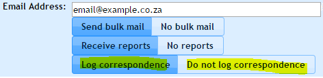

# Mail Logging {#h-8m8tndmj8fs7}

*This feature is no longer actively supported and no further development is being done in this regard. It negatively impacts the ADAM database’s performance considerably and has significant concerns in terms of privacy.*

The mail logging feature allows ADAM to monitor a “catch-all” mailbox on your Exchange server and, if it matches any of the addresses to families in ADAM, it will record those emails on their profile.

While this is useful for monitoring communication sent externally to ADAM, it can have the unintended consequence, where staff members are also parents, of logging all their email communication - very little of which will have to do with their children.

ADAM scans the mail every five minutes and processes a batch of mail. Thus most mails should be archived by ADAM within 5 to 10 minutes of being sent.

*Note that ADAM will not store attachments.*

## Enabling and Disabling Mail Logging for Families {#h-653z9pj4p22d}

Edit the family concerned and, next to each of their email addresses choose whether to enable or disable mail logging for that address.

Note that with staff, it may be preferable to disable both mother and father even if only one is an employee of the school. This is because the server may intercept personal communication from one of the parties and store it.

## Configuring Your Mail Server {#h-5hayaks6f4ms}

The goal here is to have your mail server place a duplicate copy of every mail that it sends or receives into a mailbox that can be accessed by ADAM using a POP3 connection.

The instructions are different for each mail server. You will need to enquire with your mail server’s providers on how to achieve this. Here are instructions for Microsoft Exchange 2013 to set up this process, called “[Journaling](https://www.google.com/url?q=https://technet.microsoft.com/en-us/library/aa998649\(v%3Dexchg.150\).aspx&sa=D&source=editors&ust=1778246676205321&usg=AOvVaw0-PlwtspGIr_NcGPElj_DB)”.

You do not need to worry about space issues on your mail server since ADAM will delete the mails once they are processed.

## Setting up ADAM {#h-omvlkj2ogpnh}

Once configured, confirm that you have POP3 access to the mailbox concerned. Make a note of the username and password, as well as the IP address of the server concerned (which may be different from your outgoing SMTP server, in some instances).

Navigate in ADAM to “**Administration** >> **Site Administration** >> **Edit site settings**”.

When in Site Settings, click on the “Mail Logging” tab.

-   Enter the IP address of the server
-   Enter the username for the journaling mailbox
-   Enter the password for the journaling mailbox.
-   Depending on the volume of mail to be processed, you can set the number of messages to be processed to be as high as 90.

Click on the **Save settings** button.

ADAM will now check the mailbox every 5 minutes and process mail that is waiting there. If there are more messages waiting than the maximum allows, then ADAM will process those mails on its next run.

Note that 90 mails every 5 minutes, gives ADAM the capacity to process a maximum of 25,000 emails per day. This, in practice, is what most large schools send in a month. A limit of 20 per 5 minutes reduces this to about 7000 per day which seems to be adequate even for the largest of schools.

If the cron process stops running, then the mails will be stored in the mail box on the server, waiting for ADAM to process them. In these cases, it might be necessary to increase the number of messages that can be processed at once to work through the backlog of unchecked mail. ADAM will, however, keep chipping away at the pile until there are none left. In such instances, older messages are generally processed first, so if there is a backlog, it may take some time for newly sent messages to be reflected in ADAM.

## Privileges to View Logged Mail {#h-i4frryysz8cb}

Privileges to view logged mail should be given sparingly since mail may contain sensitive information. In the privilege groups, the following privileges, found under the “**Family Admin**” tab, are relevant:

-   **View any correspondence:** This privilege allows a user to see the correspondence of any and all families. This should probably only be given to senior management of the school.
-   **View correspondence from specified subjects:** Here, the teacher will only be able to read the correspondence of a family, provided that the student is registered in a class that they teach. This should be reserved for housemasters, grade tutors or other such pastoral responsibilities. The subjects concerned are selected on the Mail Logging configuration screen on the Site Settings page.
-   **View correspondence of class pupils:** In this privilege, which is similar to the one above, they will see correspondence from that pupil if they teach any of the pupils in the family, in any class. This privilege is more wide-reaching that the one contemplated above and, as such, is rarely useful. If this were given to teachers, for example, they would be able to see correspondence between other teachers and families of any of the pupils that they taught.
-   **View sent and received correspondence:** This privilege is safe to give to all staff. It allows them to see correspondence that matches with their email address and the family. They cannot see correspondence sent by other teachers.
