# Mark Book Administration

ADAM comes complete with a powerful mark book that allows for complete control over the marks in a teacher’s mark book. The mark book is controlled nearly entirely by each teacher and so they are able to manipulate it to suit their classes’ assessment needs.

!!! warning
    Administrators will need to ensure that there is a reporting period configured to accept marks. See Editing Reporting Period Time Frames on page.

## Managing Assessments

To manage assessments for a class, navigate to **Assessments → Assessment Administration**

## Adding a New Assessment

A new assessment is added by visiting **Assessments → Assessment Administration → Add a new assessment task**.

The next screen gives teachers an opportunity to choose which class the assessment is to be added to. Choose the class and click on the **Next** button.

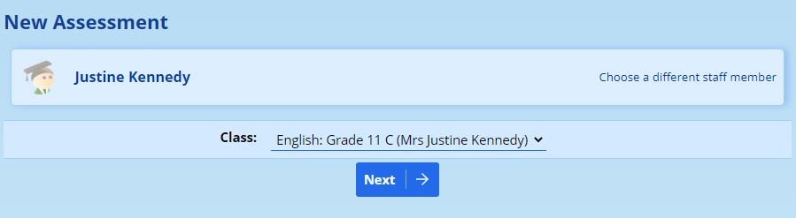

If this assessment was written by multiple classes, don’t worry – you will get a chance to select other classes to copy the assessment to shortly.

Assessments can be created in two ways. The first is to enter the details manually, but the second is to copy an assessment (without the marks) from another teacher’s markbook.

### Entering an Assessment Manually

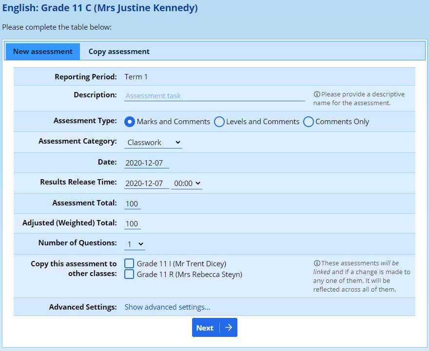

On this screen, the **New Assessment** tab should already be selected, as shown above.

-   Reporting Period: If multiple reporting periods are available for mark entry, ensure that you choose the correct reporting period. Assessments can only be part of one reporting period, so it is important that, if you have the option to choose one, that you choose the correct one.
-   Description: Type in a meaningful name! If you leave all your assessments named “Assessment Task” you will find it difficult to manage your mark book because it will be difficult to identify which assessment is which. It may be possible (depending on your school) that parents and pupils will also be able to log in and see their marks and they will see this name also.
-   Assessment Type: ADAM allows different types of assessments to be captured. Note carefully that only “Marks and Comments” can be used for the calculation of a final term result. Both “Levels and Comments” and “Comments Only” are only used for recording purposes and the results captured for these assessments cannot be used in any calculations towards a final result.
-   Assessment Category: Typically this determines which part of a pupil’s result this assessment should count towards. The default options are “classwork” and “examinations”, but your school might have other options for you.
-   Date: This is the date that the assessment was written. It will show today’s date by default, but you can change that.
-   Results Release Time: If your school allows parent and pupil logins, the results will only be shown to parents and pupils after this time. It will show today’s date and midnight (meaning that the results will be visible as soon as you enter them), but if you are marking in phases, you might wish to extend this to a time when you expect to be finished.
-   Assessment Total: This is the number of marks that the assessment was marked out of. Typically, this will reflect the total that appears at the top of your test.
-   Adjusted (Weighted) Total: This total refers to how ADAM will weight this assessment against the others. Please see [Weighting Assessments and Assessment Categories](#weighting-assessments-and-assessment-categories) for more information.
-   Number of Questions: While the word “questions” is used here, this is actually asking for the number of subtotals that you wish to enter. This allows you to record marks against different learning outcomes, sections or topics for either reporting or later analysis.
-   Copy This Assessment To Other Classes: You also have the option of copying this assessment to any other classes in the same subject and same grade. Only users who have permission to create assessments in other teachers’ markbooks will see this option.

!!! warning
    Note that these assessments will be linked and if a teacher in another class changes the settings of this assessment, it will affect all the classes that use it.

Once you are satisfied with the settings, click on the “Next” button.

In the following screen, you are given the opportunity to change the mark allocations and learning outcome allocations for each question:

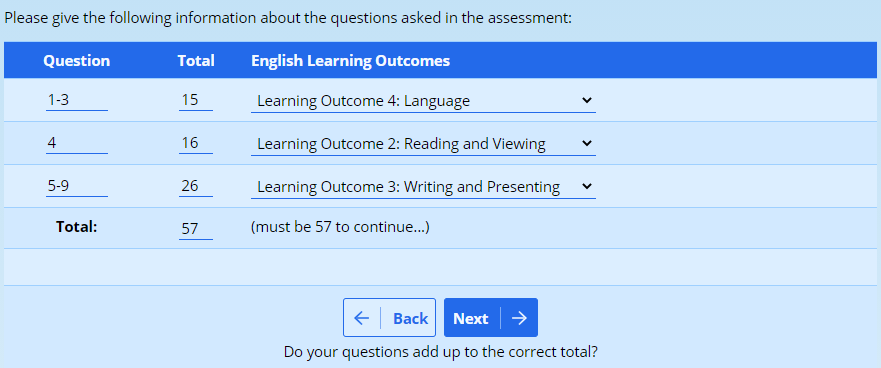

Note that ADAM will not allow you to continue until the totals for each question add up to the total set for the test in the previous screen!  In the image above, this total is set at 57 marks.

Notice that you can change the name of the questions. These are entirely for your reference when capturing marks. If you are copying this assessment for other staff to use, it is sensible to provide some form of indication which marks should be captured in which column.

Clicking on the “Next” button reveals a final confirmation screen:

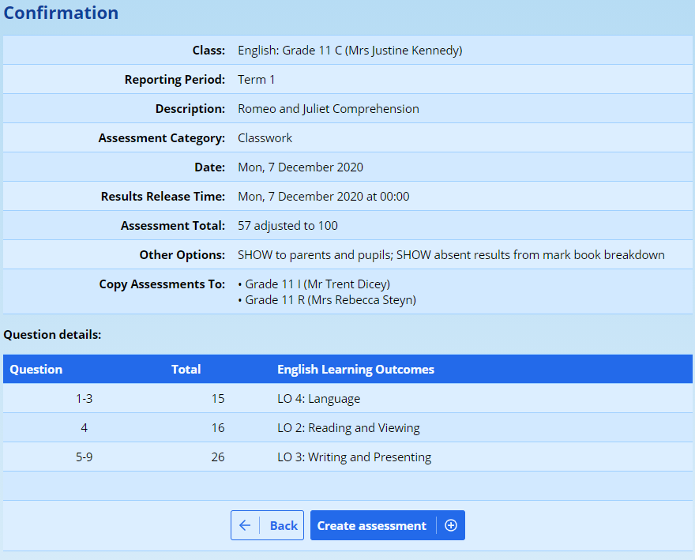

Click on the “Next” button to finally create the assessment.

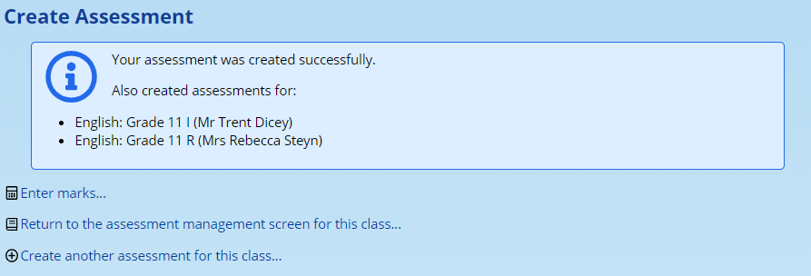

A link is then provided to enter the results of the assessment.

### Copying an Assessment

It is possible, in the first step, to choose an existing assessment in another teacher’s mark book to use as a template for your own assessment. Under normal circumstances, they should have copied the assessment into your mark book when they created it, but perhaps forgot. It is still possible to get that assessment into your mark book.

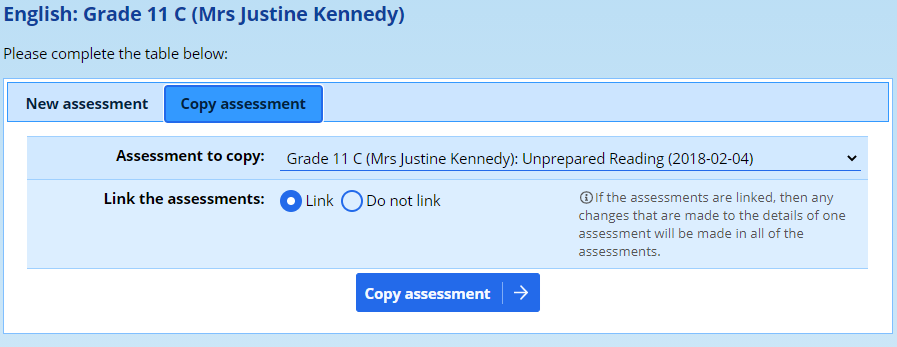

The drop-down list, “Assessment to copy,” shows all of the assessments that have been added for that grade in that subject. Simply choose one to copy into your mark book.

You are given the option to **link** this assessment to the original. If you choose to link it, any changes that are made to the assessment will affect all the classes that have it linked. If the assessment is not linked, then the settings will start out the same, but changes that are made to another class’s assessment will not be made to yours and vice-versa.

When you click on “Copy assessment”, a confirmation screen is shown giving the settings of the assessment:

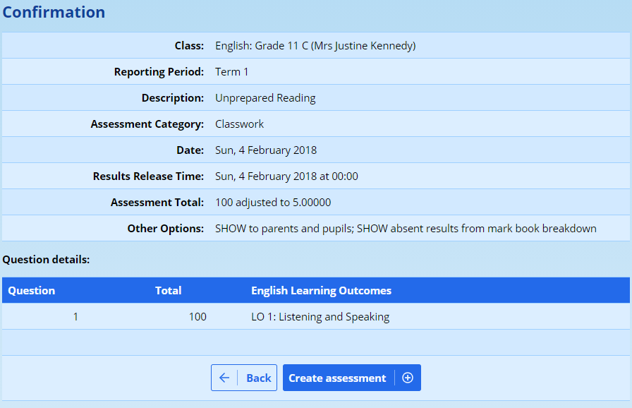

Click on “Next” to confirm the settings.

## Editing an Assessment

To edit an assessment’s details, such as it’s name, number of marks etc., navigate to **Assessment → Assessment Administration → Manage assessments and weightings**.

Choose the reporting period (note that without specific privileges one cannot change the details of an assessment in a closed reporting period) and the class for the assessment that you would like to edit.

Next to the assessment that you wish to change, click on the **edit** action:

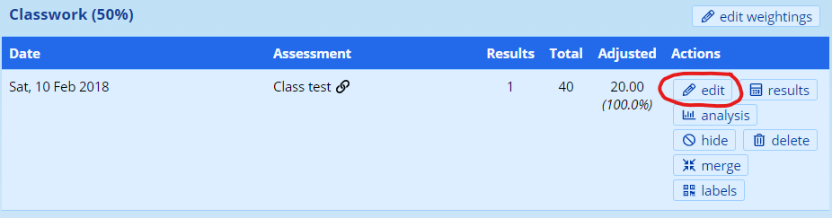

A similar screen to the one you completed when you [added an assessment](#adding-a-new-assessment) will appear:

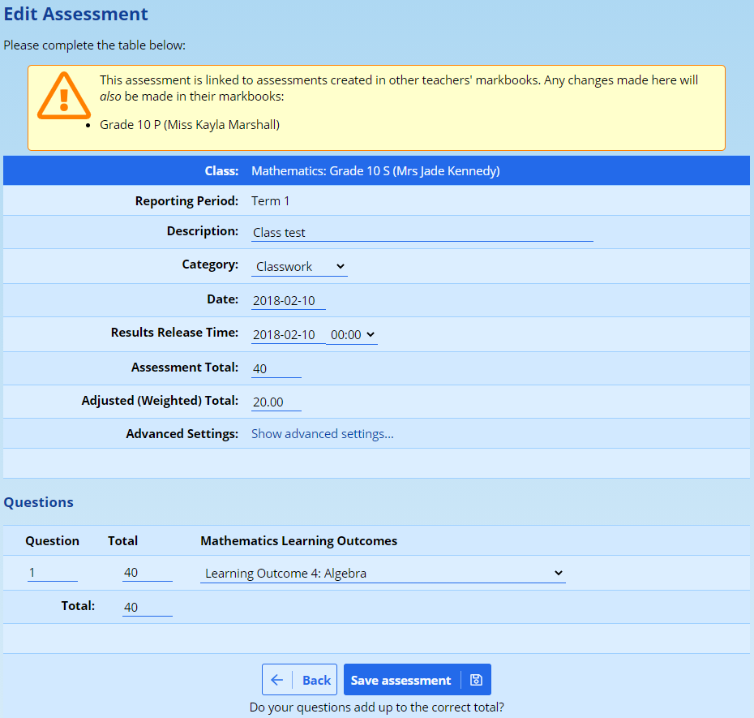

Depending on the reporting periods that are currently open, it may or may not be possible to move an assessment from one reporting period to another. If an assessment has been captured in the incorrect reporting period, it is necessary that both reporting periods are open for mark entry in order to move it. One would move it simply by changing the reporting period the assessment was associated with.

All other settings can be changed here. Note carefully that if you change the **Assessment Total**, the total listed for the number of questions must also change.

### Monitoring Changes to Assessments

When editing an assessment, a list of previous changes is shown below the assessment:

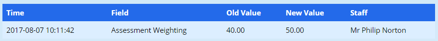

## Capturing Assessment Results

Once you’ve added an assessment, there is a link provided to capture the results immediately. However, it might not be a convenient time to capture the results at that point and so you will need to come back later to do so.

Navigate to **Assessment → Assessment Administration → Change task results**. Or, from the Assessment Management screen (**Assessment → Assessment Administration → Manage assessments and weightings**), choose the **results** action that appears next ot the assessment:

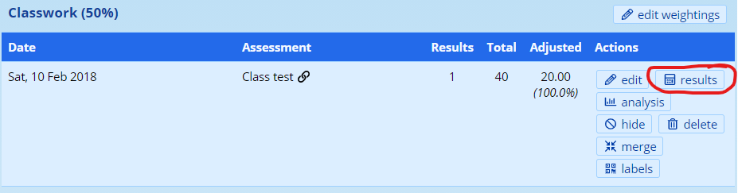

You will then see the results entry screen for that assessment:

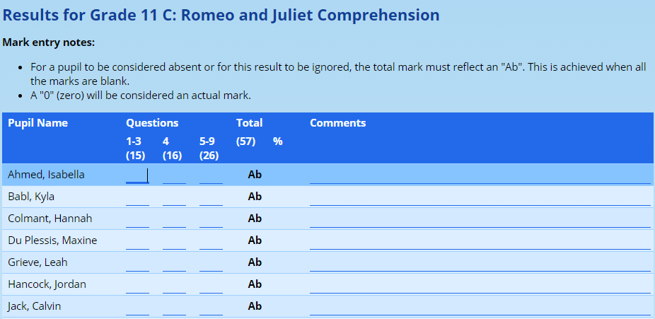

For each student, simply type in the number of marks scored for each question. The total and the pupils’ percentages will be calculated automatically.

You will notice in the illustration above that all the pupils are absent (“Ab”). If a pupil scores 0 (zero) for the test, simply enter “0” for each question and their total will display as 0.

The comment box allows a teacher to make a comment about a pupil’s performance in the assessment. However, teachers should be aware that if the mark book is open to parents and pupils, then they will be able to see the comment that has been entered here. Be polite and constructive!

Once you have finished capturing the marks, remember to click on the “Save results” button at the bottom of the screen.

ADAM will then update the pupils’ term marks based on the current weightings of the assessments.

## Weighting Assessments and Assessment Categories

After the marks are collected, it will be necessary to ensure that the weightings for the assessment is done correctly. A handy management screen is available to adjust these weightings without having to revisit each assessment.

Navigate to **Assessment → Assessment Administration → Manage Assessments and Weightings**.

Once again, close the class to edit and a list of their assessments will be shown. While it is possible to edit each assessment individually to change their Adjusted (Weighted) Total, ADAM provides an easier option to edit the weightings from this overview screen.

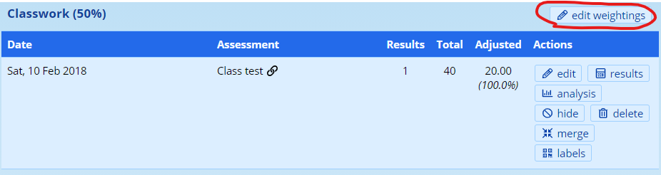

The assessments here are split up into their assessment categories – in this case “Classwork” and “Examinations”. Each assessment is weighted to contribute towards its category total and then the category totals are weighted to come up with a term result.

An example of this is illustrated below with example weightings:

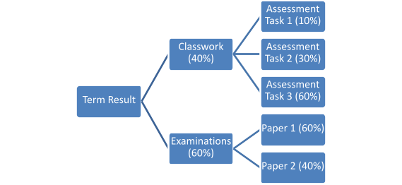

The individual assessments are weighted to come up with a category total and the categories are then weighted to determine a term result.

To change the weightings, simply click on one of the **edit weightings** buttons next to one of the assessment categories. This will make the adjusted totals editable:

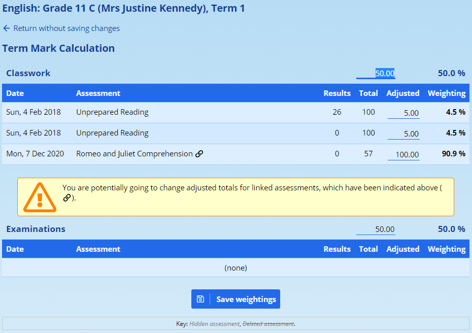

As the adjusted totals are changed for each assessment, ADAM will indicate how the other weightings will be updated.

Note that none of the totals need to add up to 100. ADAM will calculate the *proportions* correctly based on the total number of marks that it has to work with. In the very arbitrary example below, the Classwork assessments are weighted out of a total of 10 (1 + 2 + 7 = 10). Note how these are converted automatically to percentages (1 out of 10 is 10%, etc.):

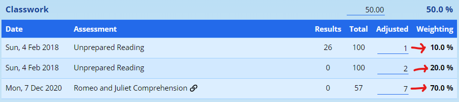

In the same example, we could have a total out of 25 (7 + 8 + 10 = 25). Note that the percentages are also automatically calculated: 7 / 25 = 28%, etc:

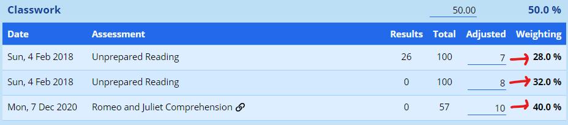

Another way of thinking about what ADAM is doing here is scaling the results of the assessments to be marks out of these adjusted totals. In this last example, the “Romeo and Juliet Comprehension” is out of 57 marks, but ADAM is scaling it to be a mark out of 10 for the purposes of working out a term mark.

### Weighting an assessment as a fraction of the term

Assessments are weighted as a fraction of the classwork result. However, many teachers prefer to think about assessments as a fraction of the *term result*.

In the list of assessments given, we might want the “Formal assessment,” which is part of the “Classwork” category, to count 20% of the term mark and the exam 65%. Let’s also assume that the remaining tests will count each count 5% towards the term.

ADAM’s weighting model does not allow for this directly, but we can still get our way!

The primary concern here is the weighting of the individual assessments. We enter those weightings as we want and then use those weightings to determine the category weighting. It sounds complicated, but it isn’t! Here is how the example described above, would look in the mark book:

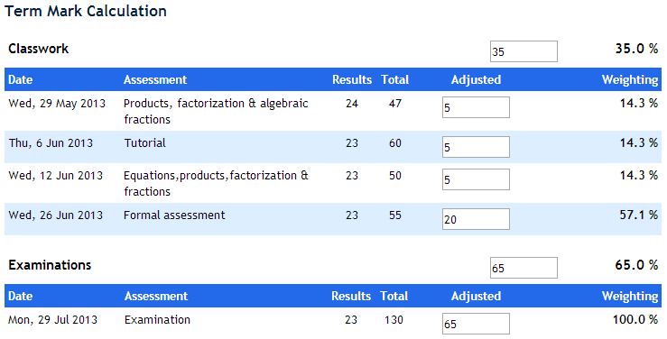

See here that each classwork category weighting is simply to total of the weightings within the category? 5 + 5 + 5 + 20 = 35.

In this case, while the weightings of the assessments within each category is technically accurate (the “Formal assessment” counts 20 out of 35 marks or 57.1% of the “Classwork” result), this is merely a mathematical side-effect of the model that ADAM uses.

## Assessment Groups

To simplify the management of large markbooks with many assessments, it is often useful to make use of “Assessment Groups”.  Assessment groups are automatically copied across into all teachers mark books of the same subject and grade. The weightings are also shared.

### Assigning the Privileges for Teachers

Note that this option is not normally enabled by default and so privileges to use “Assessment Groups” will need to be assigned. Normally it is best to assign it to the “General Teacher” role.

1.  “Administration” tab
2.  “Manage staff groups”
3.  “Privileges” for the “General Teacher” group
4.  Click on the “Assessments” tab
5.  Choose the option “Make use of Assessment Groups to categorise assessments”

### Creating Assessment Groups

Assessment groups should ideally be created before any other assessments are created.

!!! warning
    If you already have assessments, please note that each assessment will be added to the first assessment group. You are, of course, welcome to edit the assessments and move them to the appropriate group later.

On the “Manage assessments and weightings” page for a class, the option for managing assessment groups appears at the top:

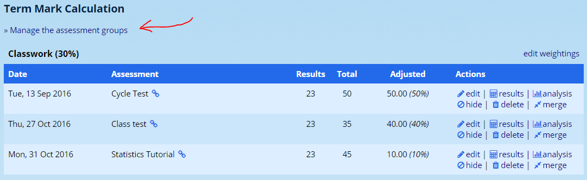

Note that if it does not appear, the [appropriate privilege](#assigning-the-privileges-for-teachers) will need to be assigned to the teachers.

Clicking on this option for the first time brings up a blank screen with room for new groups in each assessment category.

For each group, please enter:

1.  A number for the **order** in which the group should appear.
2.  A **description** for the group.
3.  The **weighting** to apply to the group.

If assessments in the “Spelling” group are to count 20% of the final term mark, then you could enter “20” for the weighting. The totals need not add up to 100. If you prefer to work out of a total of 200 or 300, that is fine. ADAM will cope with any total and work out each section as a proportion of the sum of all the groups’ totals.

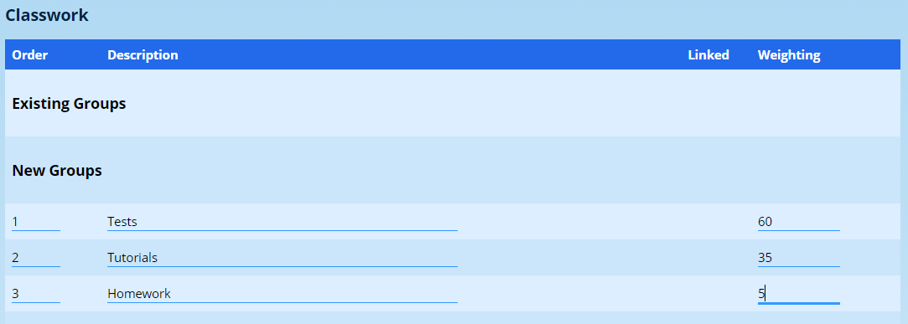

Once you have entered the details for the assessment groups, please click on the “save” button at the bottom of the screen. At this point, ADAM will assign any existing assessments to the first group and begin to recalculate the pupils’ term and year-to-date marks according to the new weightings and calculations.

You will only see the groups appear if they have one assessment. Here is the first look after the groups were created:

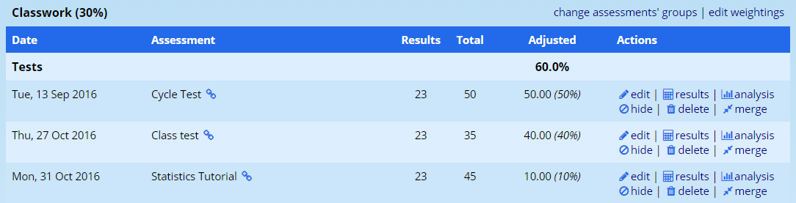

Notice, however, that the “statistics tutorial” is included in the “Tests” group? At the top of the screen is an option to “change assessments’ groups”:

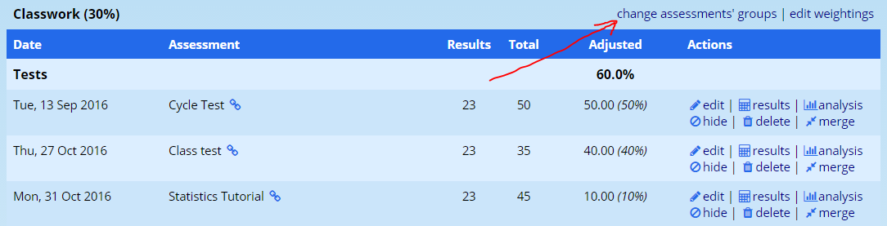

This allows you to select a new group for each assessment:

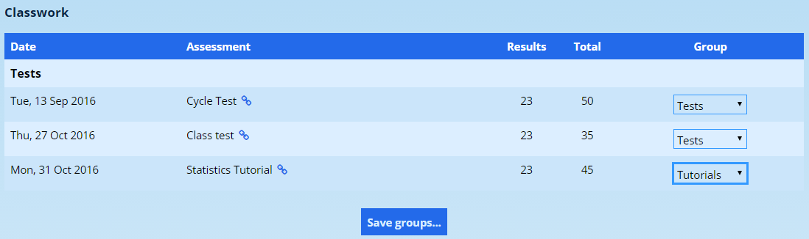

On saving this, we now have an updated markbook - and pupil results - indicating the new groups and associated weightings:

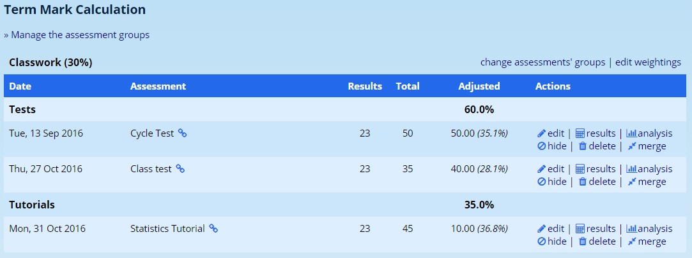

In the screenshot above, you will notice that the “Statistics Tutorial”, the only assessment in the “Tutorials” group counts 36.8% instead of 35%. This is because there is a group missing (“Homework”) which would make up the other 5%. In other words, the Statistics Tutorial is currently 35 / (60 + 35 = 95) marks = 36.8%.

If you click on the “edit weightings” option, you can change the weightings of the assessments, the groups and the assessment categories:

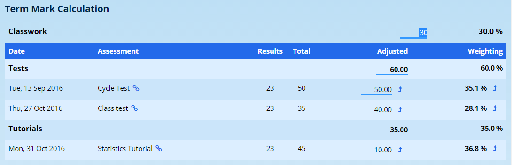

Please remember to save your changes when complete.

One last point is that once groups have been created in a markbook, ADAM will automatically ask for a group when a new assessment is created:

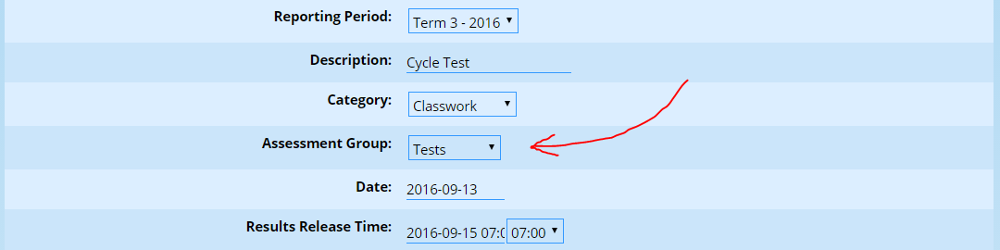

## Viewing a Mark Book Printout

On the “Assessments” tab, under the “Assessment Analysis” tab, is an option for “Summary of results”. This will allow you to display a typical mark book summary of your class:

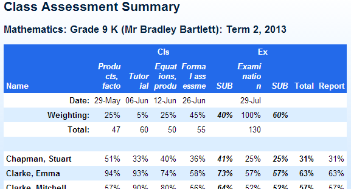

## Viewing Detailed Assessment Analysis

ADAM has a number of tools that can be used to analyse the assessments – both those written in a single class or those written by multiple classes. The latter also shows how the classes performed against each other. More options and other analysis tools can be found on the “Assessments” tab.

## Blinded Marking with QR Codes

ADAM can now assist your teachers with blinded marking by producing QR codes which can be affixed to pupils’ answer sheets and scanned by a regular webcam, facilitating quick results capture of the marked script.

Labels are printed that are specific to a pupil and the assessment being written. Each assessment will require new labels to be printed. See “[Scanning QR Code Labels](#scanning-qr-code-labels)” lower down for more information.

### Printing QR Code Labels

In the Weightings and Assessment Management screen (**Assessments → Assessment Administration → Manage assessments and weightings**), each assessment has a **labels** action shown on the right-hand side of the screen:

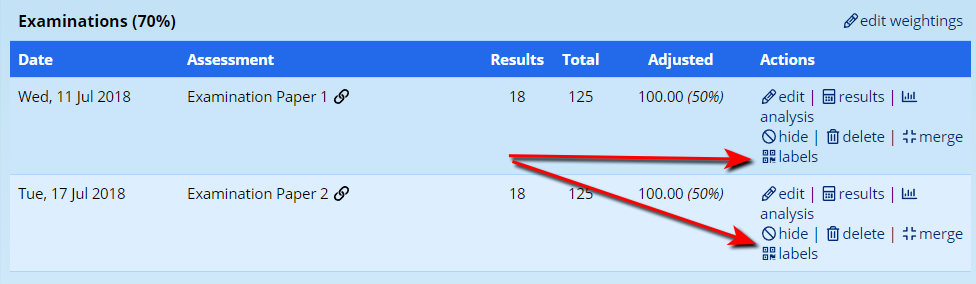

Clicking on this option will allow you to choose various options for the labels to be produced:

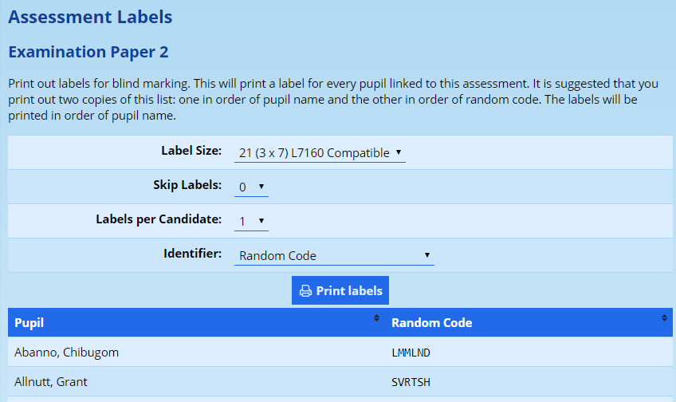

The **Label Size** should be chosen to match the labels that you are printing on. Note that it is possible to add custom label sizes by [creating a new label size](labels.md#creating-a-custom-size-label).

If you are using partially used label sheets, you can ask ADAM to **skip a number of labels**. These are counted across and then down.

You can specify the number of **labels per candidate** to be printed. This is useful if your assessment is being marked in sections and each teacher will be entering the results separately.

Finally, one can choose an **identifier** to appear on the labels. By default, ADAM uses a random code, but this could be an Admin number (for schools where children know their admin numbers) or even their date of birth. This is easy for pupils to identify that they have the correct label without giving away too much to the teacher.

If you choose the **Random Code** option, ADAM gives you a printable list of codes to double check the names against.

Click on the **Print Labels** button to generate the labels. ADAM will generate a label for each pupil that is in a class that has this - or a linked - assessment. The labels are printed in alphabetical order by pupil surname.

*We are aware that the generation of labels is currently very slow and are looking at ways to improve this.*

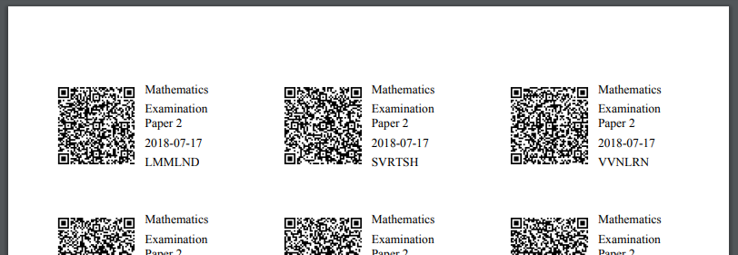

*Please take special care, when printing labels, to ensure that all “scale to page” or “scale to fit” options are turned off. ADAM measures the labels quite precisely and scaling options introduced by your computer will distort the printing, resulting in the printed content of the label spilling into the next label.*

### Scanning QR Code Labels

QR Codes can be scanned by a QR Code scanner on a mobile device or even your own webcam. You can use a special QR Code scanner on your phone or use ADAM and your computer’s webcam.

#### Using your phone

Many QR Code scanners are available on iOS and Android app stores. Install one of these scanners and follow the instructions for that app to scan the code. The QR Code will reveal a URL which will open directly in ADAM. Note that the user *must* be logged in to ADAM. The first time the user scans a code, they may be redirected to the login screen. Once they have logged in, they can scan the code again. They should not need to log in again, provided that their login session doesn’t expire from inactivity.

#### Using your webcam on your computer

In ADAM, visit **Assessment → Assessment Administration → Scan assessment barcodes**.

The first time you do this, your web browser will ask you to give permission for ADAM to use your webcam. You will need to grant permission to proceed.

No pictures captured with your webcam by ADAM are ever transmitted over the internet. All barcode scanning and recognition happens directly on your computer.

Hold the QR Code up to the webcam. The manner in which you will need to hold the barcode will vary and depend on your computer and webcam. The following are general suggestions which may help:

-   **Ensure that you are in a well lit area** and that there are no shadows over the barcode while you scan it.
-   **Hold the barcode between 5 and 10cm away** from the camera.
-   **The orientation of the barcode doesn’t matter**: you might find that you struggle to align the code with your webcam because the page is obscuring the screen. You can hold the code upside down if that makes it easier.

Once you’ve scanned the barcode, a mark entry screen will appear for one pupil. Enter their marks and click on the **Save** button.

## Mark Book Results Recalculation

Mostly, ADAM will automatically recalculate the term mark for a particular subject based on the assessment results. This is done whenever the assessment results change. However, there are some circumstances where this recalculation might not happen or do not automatically recalculate. This seems to happen erratically and we have not yet identified the circumstances under which the results are not automatically recalculated. However, it does appear to happen very infrequently.

To force ADAM to recalculate the mark book results, you can navigate to **Reporting → Promotion Results → Recalculate Marks and Symbols**.

ADAM will ask you to confirm a reporting period and a Grade, and then proceed to recalculate the results.

If a result has been [manually overridden on the reporting page](report-comments.md#my-marks-on-the-reporting-screen-are-wrong-and-wont-update), ADAM will **not** recalculate it until you [cancel the override](report-comments.md#my-marks-on-the-reporting-screen-are-wrong-and-wont-update).

## Customising the Year-to-Date Calculation

For ADAM to calculate the Year-to-Date mark for an individual pupil, it will check for a calculation to use in the following order:

1.  Does the class have its own Year-to-Date calculation specified? If not:
2.  Does the reporting period have a Year-to-Date calculation specified? If not:
3.  Use the Term result.

This means that there are two possible places to set a Year-to-Date calculation. If everyone in the grade must use the same calculation, then you should set the calculation in the [reporting period settings](reporting-period-administration.md#editing-a-reporting-period) (option 2 in the list above) and not set anything for the class.

However, where each subject has its own unique calculation, these can be set from the markbook screen.

An appropriate [aggregated result calculation](aggregated-results.md#creating-aggregated-result-calculations) needs to be created first.

### Setting the Calculation for Use

Navigate to a class’s assessment management screen by visiting: **Assessments → Assessment Administration → Manage assessments and weightings**. Choose the necessary options to find the class whose weightings you need to update.

Scroll to the bottom of the screen and you will see the following options:

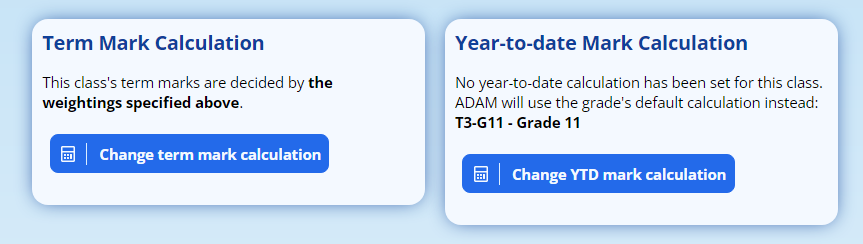

Note, here, that in the block on the right, ADAM is using the “grade’s default calculation instead”. This calculation, “T3-G11 - Grade 11” is a calculation that has already been created and has been set for use in the [reporting period settings](reporting-period-administration.md#editing-a-reporting-period).

To set a specific calculation for this class, click on the **Change YTD mark calculation** button.

In the drop-down list, please choose the calculation that you would like the class to use instead:

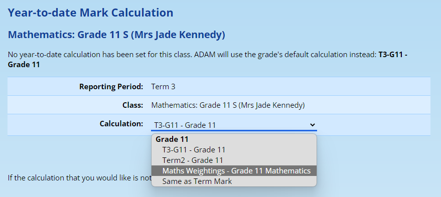

Click on the **Save Calculation** button when you’re done.

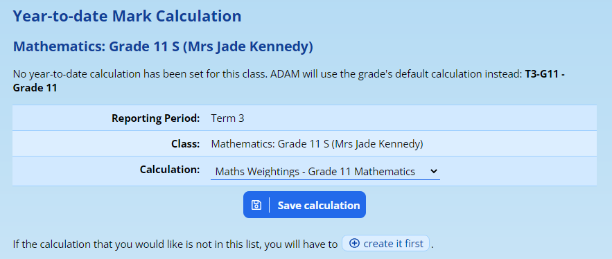

ADAM will now recalculate the class’s YTD results with your new calculation.

If the claculation you want does not show, you will have to [create it first](aggregated-results.md#creating-aggregated-result-calculations) - a link is provided at the bottom of the screen to take you to the appropriate screen to create the calculation. Documentation on [creating the calculations is found elsewhere in this manual](aggregated-results.md#creating-aggregated-result-calculations).

## Importing Assessment Results

ADAM has the ability to import assessment results from CSV. In this example, we will work through the process of importing the Independent Examinations Board results - something at the more complex end of the scale.

### Staff Privileges

Ensure that the necessary staff privileges are in place. A staff member needs to have the privilege to “import assessment results for any subject” and “import assessment results for subjects taught by the user”. These will allow a single user to import a single spreadsheet with all the exam results on it. Without these privileges, a teacher will only be able to import results for pupils in their own classes.

### Save the results as a CSV file

The spreadsheet must have, at the very least, the pupils’ names and a result. Additionally, in the case of the IEB sheet, it must also have subject names. The IEB send two sheets to schools. One, entitled “Result Matrix per subject” is a perfect candidate for this operation:

### Import the Results

Navigate to **Assessment → Assessment Administration → Import assessment results**.

Choose the appropriate reporting period for the results to be imported into and click on the “Choose file” button to find your CSV file to import. Name the assessment - if this is the IEB sheet which has multiple subject results, name this “IEB Final Result” or something similar. Choose an assessment category, an assessment date and an assessment total. In the case of the IEB results, the total should be 100.

Click on “Next” to begin the import process.

ADAM will then upload the file and start by showing you the first 15 lines of its contents. ADAM now needs to know where in the file to find the different information. This includes the first row of data (ignore any headings!), which column contains pupils’ names, which column contains the subjects (if any) and which column contains the results.

If you are importing for a single assessment in a single subject, you can choose “There is no subject column” for the subject.

When you move to the next page, ADAM will match pupils as best it can with existing pupils in the database. Where it comes across even the slighted ambiguity in names, ADAM will ask you to confirm. Similarly, with subjects - where there is ambiguity, ADAM will ask you to confirm.

Once all is correct, click the **Next** button to begin the import.

### Notes

If a pupil is not registered for a subject but ends up with a subject result, ADAM will create a new class and add that pupil to the new class in order to import the result. This can often be the case for pupils who write Mathematical Literacy as an option, for example, but who were never registered for the subject. The teacher performing the import becomes the teacher of such classes.
