# Medical Module {#h-85qhwd3jzklo}

Further documentation coming soon! If you have any questions, please ask us!

## Medical Examinations {#h-ubj8044sigk4}

A Medical Examination is conducted by a medical professional and several values are recorded. This may be data such as height and weight. ADAM allows for custom medical examinations to be created, each with their own set of measurements (metrics). ADAM records these metrics for historical reference.

### Viewing a Pupil’s Medical Examinations {#h-czu9zwr7xhf8}

To view a history of a pupil’s medical examinations, visit the pupil’s profile, click on **medical records** and in the list of tabs below, choose **Medical Exams**.

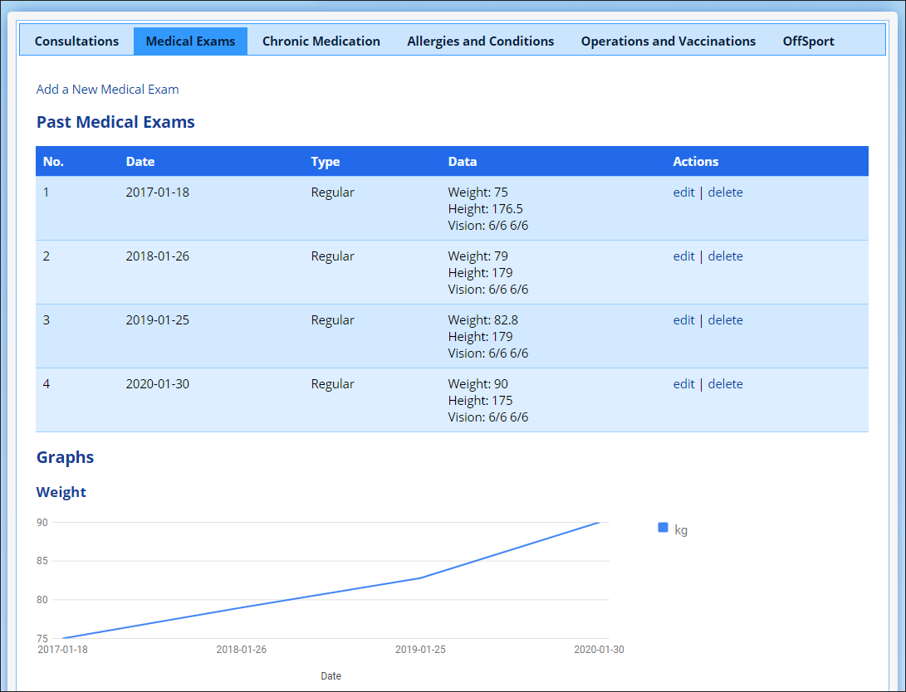

### Managing the Medical Examinations {#h-7wx59x2m6lk0}

To add, or remove Medical Examinations, navigate to **Administration → Medical Administration → Manage Medical Examination Types**.

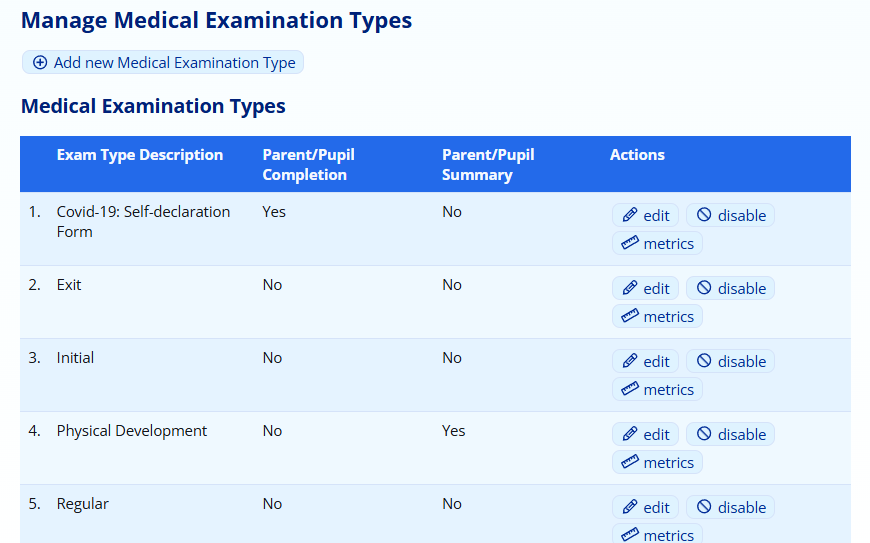

To add a new examination, click on the “**Add**” button at the top. Enter a name for the examination and save.

To change the name of an existing examination, click on the “**edit**” option next to the examination.

Examinations can also be disabled (and re-enabled) using the “**disable**” option. This will move it to the bottom table where they can be re-enabled.

Click on the “**metrics**” option to adjust the measurements that are requested in the examination.

#### Adding and Editing Medical Examination Types {#h-96sh7gr3oegx}

When adding a new Medical Examination Type or editing an existing one, ADAM will show the following screen:

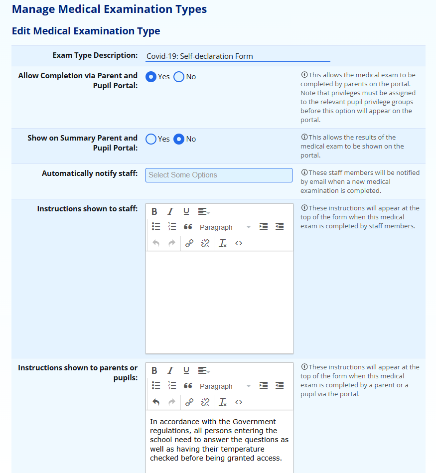

The **Exam Type Description** will be used as a heading to describe the reason for the Medical Examination.

Medical Examinations can be optionally **completed on the parents’ and pupils’ portal**. Parents and pupils have the option, [based on their privileges](security-administration-for-families-and-pupils.md#h-mg1sc7iv8w2n), to complete medical examinations. These can be used to record the results screening examinations that are required to be completed by schools during the Covid-19 pandemic. Note that these instructions appear exactly as you capture them [on the portal screen](#h-uo0o80hah4wj).

*Note that the medical examinations are completed from a pupil’s perspective and are recorded against the pupil’s profile. It is not possible to record a medical examination for a parent.*

*Note that “out of the box”, parents and pupils do* not *have privileges to complete medical examinations. You may wish to differentiate based on primary school (allow only parents to complete) or high school (allow parents and pupils to complete). It is not possible to make this differentiation per medical examinations - one setting applies to all medical examinations.*

Additionally, **medical examination summaries** can be shown on the Pupil and Parent portal by selecting “Yes” to this question.

*The* *privilege group for the pupils must also be assigned the privileges to view medical examination summaries.*

The indicated **Instructions** are shown to the staff who are completing the medical examination or to the parents/pupils in the portal. Thus differentiated instructions can be shown if required.

#### Adding and removing metrics from a test {#h-nr95c0fyp2ov}

A list of metrics in the test, and those available for use, are shown in two tables:

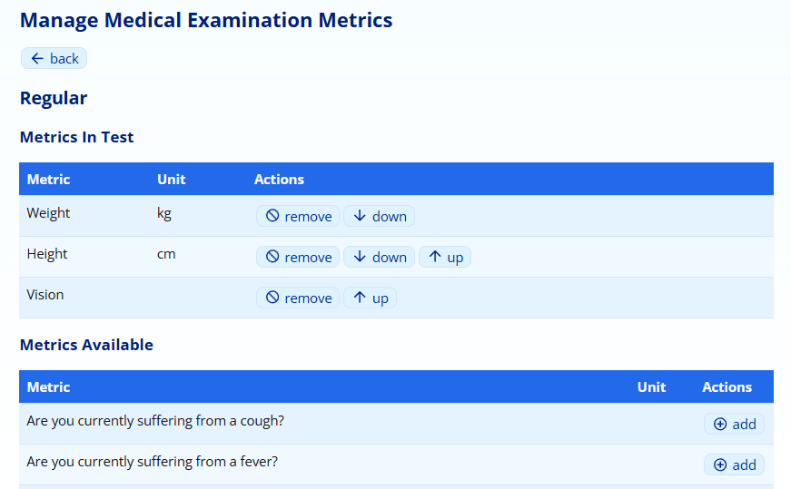

One can **add** or **remove** metrics. The order can be changed using the **up** and **down** options next to those metrics that appear in the test. This order can be adjusted for easier data capture.

The changes are saved as you make them. Changing the fields available in a test does not change previously conducted tests and no data will be lost by removing a metric from a test. This might happen if you decide not to record this any more. All data that was previously recorded will remain on the system.

To add or remove metrics, please see the [section below](#h-7gw0j37tdc77).

### Managing the Metrics {#h-7gw0j37tdc77}

Navigate to **Administration → Medical Administration → Manage Medical Examination Measurements**.

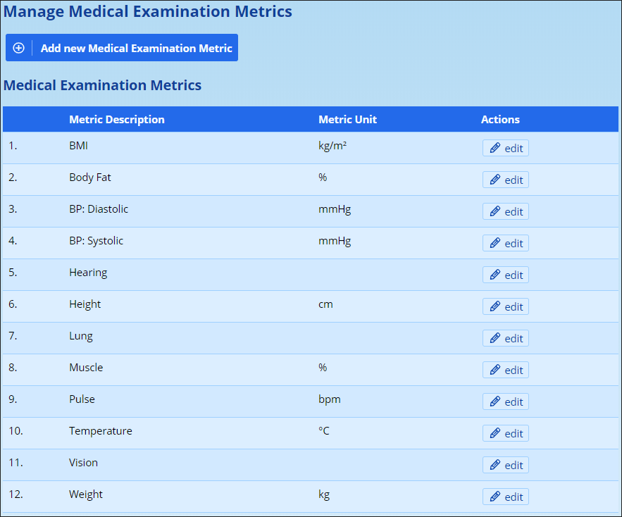

Here you can add (using the button at the top) new matrics and edit existing ones.

*Note that editing a metric will have an impact on information already recorded. For example, if you change the height to rather be measured in metres instead of centimetres, then all previously taken measurements will appear to be in metres: 162cm will then show as 162m.*

### Adding a new Metric {#h-dwyi58sax5ru}

To add a new metric, click on the **Add a new Medical Examination Metric** button  that appears at the top of the table.

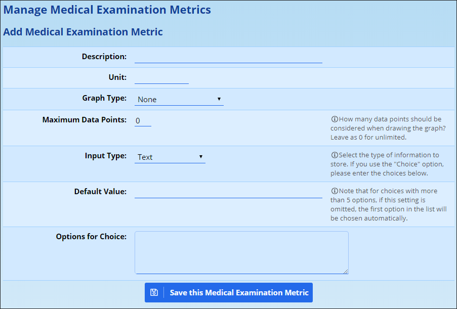

The **Description** is the name of the field and appears next to the input box. On the list of metrics that appeared above, these are listed in the left-hand column.

The **Unit** field will be displayed next to the input box. Examples of this are things like “cm”, “°C” or “mmHg”. This is to aid the data capturer in guiding them to choose the correct information.

For numerical data, you can choose to have ADAM show a **graph** of the information on the pupil’s medical information page. This should be saved for the most important information. It can be changed later. You might want to have temperature displayed while you are conducting dailing health monitoring checks but then not displayed after that. In this case, you would need to edit this metric again and change the “Graph Type” to “None”.

*While this list currently promises a “bar chart”, kindly note that all charts will currently be displayed as a line. We’ll get there!*

If you are displaying a graph, ADAM can also limit the number of data points that it shows. A reading of “0” means that ADAM will show all the data points. If you want to limit the chart to show only the last 10 readings, then enter a 10 for **Maximum Data Points**.

You can specify what **type** of information you are collecting. Options here are:

-   **Text****:** Use this for a note or a non-standard measurement like (e.g. vision “6/6” or “needs glasses”).
-   **Whole number:** Typically used for counting things or where smaller measurements are impractical. Often used for height measurements in cm, where the margin of error doesn’t make it worth measuring more accurately.
-   **Decimal number:** Used for measurements. The measurements will only be accurate to 1 decimal place. Often used for temperature measurements.
-   **Choice:** This provides the user with selectable choices. If you choose this option, enter in the choices you would like the user to choose from in the **Options for Choices** text box at the bottom of the list. Note that that depending on the number of options the user must choose from, this will either display visible “radio” options (if 5 or fewer choices) or a dropdown list (if more than 5 choices).
-   An option to “choose more than one option” is not available.

The **Default Value** of the field will be entered or selected automatically. Use this with caution since it might be easy to submit the medical exam accidentally. A person viewing these results later won’t know if the option is genuine or whether it was entered in error.

Finally, the **Options for Choices** text box allows the different options to be used in the **Choice** option above. Adding a “Yes / No” choice, for example, would require you to enter the data as shown below:

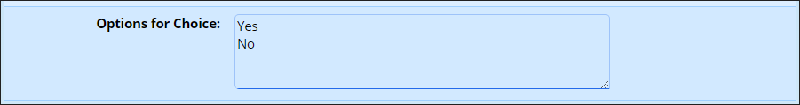

When you’re done, you can click on **Save this Medical Examination Metric**.

Once you’ve added a new metric, you may wish to have it [included in a specific medical examination](#h-7wx59x2m6lk0).

### Parents and Pupils Completing Medical Examinations {#h-uo0o80hah4wj}

For the purposes of health screening, it may be desirable to have parents or pupils complete medical examinations in ADAM. For them to be able to do so, they will need to be [assigned the correct privileges](security-administration-for-families-and-pupils.md#h-mg1sc7iv8w2n).

*Where schools would like to provide instructions for parents to complete the medical examination, the instructions below should serve as a starting point and not be relied on to provide the specific information required for the medical exam as set up by the school.*

Parents and pupils with the privilege to complete medical examinations will see a **Medical Records** heading in their portal menus:

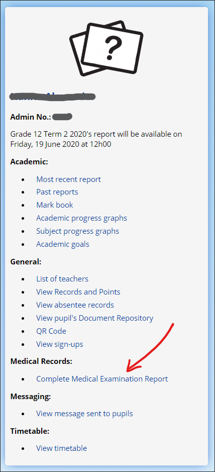

Once they select this option, one of three possible screens will appear.

If there are **no medical examinations** that have been [set to display on the portal](#h-7wx59x2m6lk0), then they will see an error message to this effect: “There are no medical examinations available for completion.”

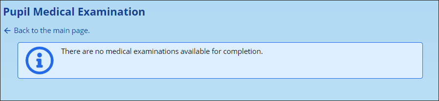

If there are **two or more medical examinations** available, they will need to select which medical examination they wish to record. They must select the appropriate examination from the drop-down list and click on the **Next** button.

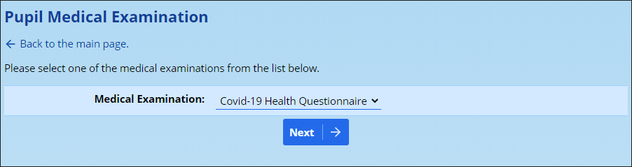

The third possibility is that there is **only one medical examination** available. In this instance, they will taken immediately to a screen to collect the results.

The following image shows an example of a medical examination that might be used for the Covid-19 pandemic information collection process. Please understand that this is provided as an illustrative example only and is not meant to reflect an actual Covid-19 pandemic screening test as might be required.

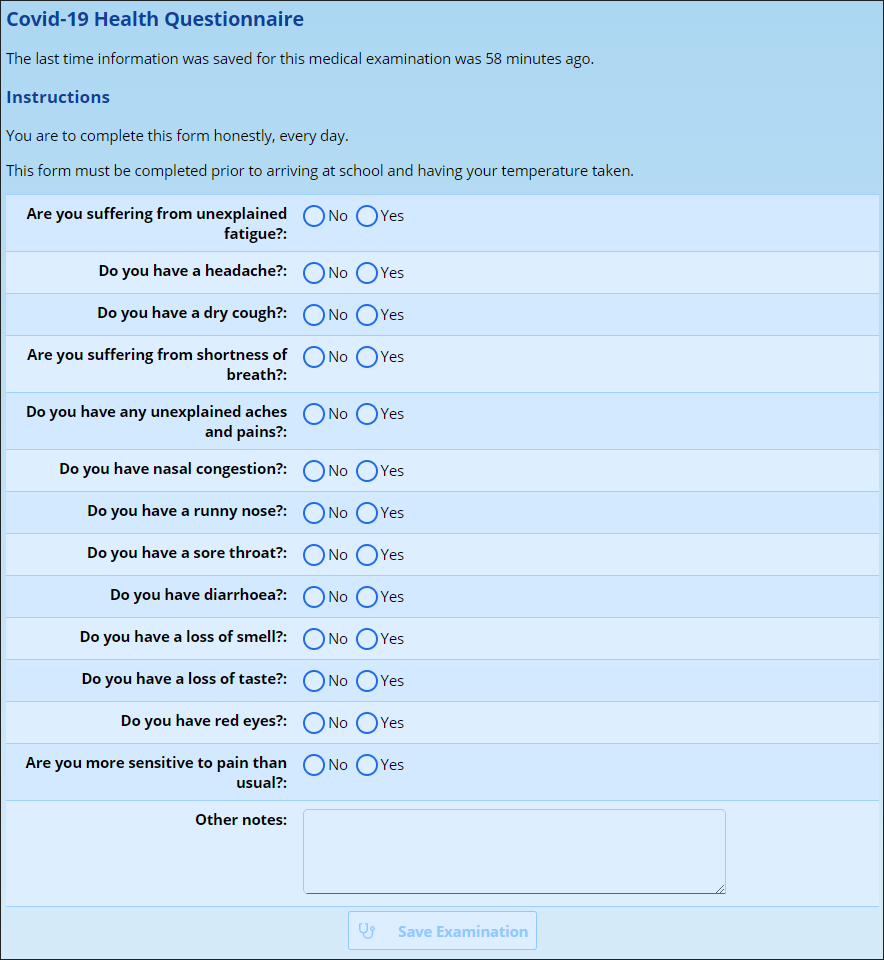

Underneath the heading for the medical examination, ADAM displays the time that the last medical examination was recorded. This will hopefully help avoid people submitting examinations twice in error.

The instructions for parents, as defined when editing the medical examination’s details are then shown. The instructions shown above are example instructions only and are the same as those reflected in the editing screenshot above.

Note that all questions, except for the **Other notes**, require a response before the user will be permitted to click on the **Save Examination** button at the bottom of the form and submit their readings.

Once submitted, ADAM will display a message confirming that the results have been saved:

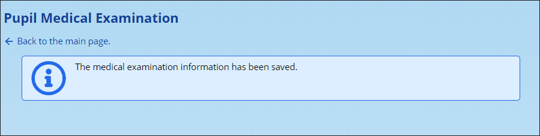

## Off Sports Alerts {#h-4gqnczo2ckk1}

@todo - the off sports alerts were built around similar code to the [absentee alerts](absentee-administration.md#h-e1rizcwckki9). Please look there for inspiration in the meantime. To add an offsports alert, head to **Administration → Medical Module → Edit Off Sports Alerts**.

The timing for the Off Sports Alerts can be set in the **Site Settings** under the **Cron** tab.
