# Medical Module

The medical module is where a school records what happens in its sick bay. It holds a medical record for every pupil — the consultations they have had, the conditions and allergies they live with, the medication they take, the operations and vaccinations on their history, and the periods they have been excused from sport. It also runs the medical examinations a school conducts, and keeps the [stock ledger](medical-stock.md#medical-stock) for the medicines that get dispensed.

Because this is some of the most sensitive information a school holds, almost every part of the module is behind its own permission. A member of staff sees only what they have been given, and the [permissions section](#permissions) at the foot of this page lists them all.

## A Pupil’s Medical Records

Navigate to **Pupils → Medical Records → Pupil Medical Records** and search for the pupil, or open any pupil’s profile and click on **medical records**.

The top of the page shows a summary, drawn from the pupil’s own record:

-   the **Medical Notes** and, in bold red, the **Allergies** captured on the pupil’s profile;
-   the pupil’s **Doctor** and telephone number;
-   the **Medical Aid Scheme**, its number, and the principal member with their ID number;
-   any **disabilities** recorded against the pupil;
-   any additional fields the school has chosen to show here — see [Settings](#settings-that-affect-the-medical-module);
-   **Allergies and Chronics** and **Chronic Medication**, gathered from the tabs below so that the whole picture is visible at a glance;
-   a link to the pupil’s [Medical Report](#the-medical-report).

> [!NOTE]
> The labels on the summary come from your school’s own [field definitions](database-field-management.md#database-field-management), so a school that has renamed **Doctor** to **General Practitioner** will see its own wording here.

Beneath the summary is a set of tabs, each holding one kind of record:

| Tab | What it holds |
| --- | --- |
| **Consultations** | Every visit to the sick bay — see [Medical Consultations](#medical-consultations). |
| **Medical Exams** | Examinations conducted on the pupil, with graphs — see [Medical Examinations](#medical-examinations). |
| **Chronic Medication** | Medication the pupil takes regularly — see [Chronic Medication](#chronic-medication). |
| **Allergies and Conditions** | Standing conditions and allergies — see [Allergies and Conditions](#allergies-and-conditions). |
| **Operations and Vaccinations** | Procedures and immunisations — see [Operations and Vaccinations](#operations-and-vaccinations). |
| **Off Sport** | Periods excused from sport — see [Off Sport](#off-sport). |
| **Documents** | Medical documents held in the [Document Repository](document-repository.md#document-repository). |

The **Documents** tab appears only once a site administrator has chosen which document repository categories belong to the medical module. Until then the tab is absent altogether. Staff must additionally hold permission for each category, so two people can see different documents on the same pupil.

Each tab is governed by its own permissions. A member of staff without **View medical information** sees a message in place of the records, and the **add**, **edit** and **delete** options appear on each tab only for staff who hold the matching permission.

## Medical Consultations

A consultation is a single visit to the sick bay. It records who was seen, when, by whom, what was wrong and what was given out — and it is the point at which medication leaves the stock ledger.

### Recording a Consultation for a Pupil

Navigate to **Pupils → Medical Records → Add a Medical Consultation for a Pupil** and search for the pupil, or click **Add a new Consultation** on the **Consultations** tab of the pupil’s medical records.

ADAM shows the pupil’s photograph and, alongside the form, a panel of their **Allergies and Chronics** and **Chronic Medication**, so that whoever is treating the pupil can see the standing conditions before deciding what to give them.

The form records:

-   **Date/Time:** defaults to the current date and time. Change it if you are capturing a visit after the fact.
-   **Medical Attendant:** who saw the pupil, chosen from the [list of attendants](#medical-attendants).
-   **Type:** by default **Normal**, **IOD-Insurance Claim**, **IOD Follow-Up** or **IOD-Not Reported**. The IOD (injury on duty) types exist so that a school can separate injuries that will be claimed for. The list is a [field definition](database-field-management.md#database-field-management) and a school can change it.
-   **Diagnosis:** chosen from the school’s [list of ailments](#managing-the-list-of-ailments).
-   **Cause:** chosen from the school’s [list of causes](#medical-causes) — how the injury or illness came about, as distinct from what it is.
-   **Notes:** free text.
-   **Medication:** the items dispensed. See below.

Click **Save information** to record the consultation.

### Dispensing Medication During a Consultation

The **Medication** field is a table you add rows to. Start typing the name of a stock item and ADAM offers matching items, annotated with the stock group and, for items under stock control, the quantity remaining. Choose the item and enter the **Quantity**.

Each row is saved as an **Issue** transaction against the [stock ledger](medical-stock.md#medical-stock), and the stock on hand is reduced as soon as the consultation is saved. Because the transaction is tied to the consultation, the stock reports can show not just what went out but what it was given for, and who should be billed.

> [!WARNING]
> An item under stock control that has run out cannot be selected, and an issue that would take the balance below zero is refused with the message “Insufficient stock of ‘*item*’ on hand. The medication has not been added to the consultation.” The consultation itself is still saved — only that one medication is left off it — so check the consultation before sending the pupil away.

Rows can be removed from the table when editing a consultation, which returns the stock.

### After Saving

ADAM confirms with “The medical consultation was added successfully.” and offers three onward links: **Add another medical consultation**, **Add *pupil* to the Off Sport list**, and **Return to *pupil*’s medical records page**. The off sport link carries the pupil across, so a pupil who has been told to sit out a week of sport can be recorded without searching for them again.

### Consultations for Staff

Navigate to **Staff → Medical Records → Add a Medical Consultation for a Staff Member**. The form is the same one, minus the allergies panel.

Staff consultations are visible on the staff member’s own profile — see [Medical Records for Staff](#medical-records-for-staff).

### Consultations for Chargeable Entities

A consultation can also be recorded against a [chargeable entity](medical-stock.md#chargeable-entities) — a visiting team, a hostel or anybody else who is neither a pupil nor a member of staff.

Navigate to **Administration → Medical Administration → Add Consultation for Chargeable Entity**. To see what has already been recorded, use **View All Consultations for Chargeable Entities** on the same menu.

### Editing and Deleting a Consultation

Staff who hold **Edit and Delete Medical Consultations** see an **edit** option next to each consultation on the **Consultations** tab. Editing a consultation lets you change any of its details and add or remove medication rows; the stock ledger is corrected to match.

### The Consultation Report

Navigate to **Pupils → Medical Records → Consultation Report**. Choose a **Start Date** and **End** — which default to the current month — together with the **Consultation Type** and **Charge Type** you want included, then click **View Report**.

The report lists every matching consultation for the period, which is how a school answers questions such as how many pupils were treated for a particular condition during a term.

Run for a single pupil — by clicking **View Consultation report** on the **Consultations** tab of their medical records — the report becomes a medical summary for that pupil, and an extra **Other Information** option lets you include or leave out any of **Consultations**, **Allergies and Conditions**, **Chronic Medication** and **Vaccinations and Operations**. All four are included unless you say otherwise.

## Allergies and Conditions

An allergy or condition is a standing fact about a pupil rather than an event: a peanut allergy, asthma, epilepsy. Recording it here puts it in front of anybody treating the pupil, on both the medical records summary and the consultation screen.

### Recording an Allergy or Condition

On the **Allergies and Conditions** tab of the pupil’s medical records, click **Add new Allergy or Condition**. Choose the **Ailment** from the school’s list, add any **Notes** — these appear next to the ailment on the summary panels, so this is the place for “carries an adrenaline pen” — and set the **Effective Date**. Click **Save new ailment**.

The tab lists each record with its **Description**, **Group**, **Category** and **Effective Date**, and offers **edit** and **delete** options to staff with those permissions.

### Managing the List of Ailments

Navigate to **Administration → Medical Administration → Manage Medical Ailments**.

Each ailment has a **Description**, a **Category** and a **Group**, and a **Report on this Ailment** setting. The category and group are how a long list stays usable — both the pupil’s ailment list and the consultation **Diagnosis** list are organised by them.

> [!NOTE]
> This same list supplies the **Diagnosis** options on the consultation form. An entry added here for use as a diagnosis will also be offered as a pupil’s standing condition, and the other way round.

## Chronic Medication

Chronic medication is medication a pupil takes regularly, recorded so that it is visible before anything else is dispensed to them.

### Recording Chronic Medication for a Pupil

On the **Chronic Medication** tab of the pupil’s medical records, click **Add new chronic medication**. Choose the **Chronic Medication** from the list — which is grouped by category — add **Notes** such as the dose and when it is taken, set the **Effective Date**, and click **Save new chronic medication record**.

The tab lists each record with its **Description**, **Category** and **Effective Date**.

### Managing the List of Chronic Medications

Navigate to **Administration → Medical Administration → Manage Chronic Medication**. Each entry has a **Description** and a **Category**. An entry can only be deleted while no pupil has been given it; after that it must be kept so that the pupils’ records still make sense.

## Operations and Vaccinations

This tab records procedures and immunisations — things that happened once, on a date, as opposed to conditions that persist.

### Recording an Operation or Vaccination

On the **Operations and Vaccinations** tab of the pupil’s medical records, click **Add new Medical Intervention**. Choose the **Intervention**, set the **Administered Date**, and optionally a **Date Due**. Click **Save new medical intervention**.

**Date Due** is what makes this useful for a course of injections: record the date the next dose falls due and it appears on the pupil’s record. Where nothing is due, the tab shows “n/a”.

### Managing the List of Operations and Vaccinations

Navigate to **Administration → Medical Administration → Manage Medical Operations and Vaccinations**.

Each entry has a **Category**, a **Description** and a **Step**. The category can be chosen from those already in use or typed into the **or new:** box to start a new one. The **Step** is for a procedure given in stages — enter the number or name of the stage, so that a three-dose vaccination appears as three entries that can be recorded and tracked separately.

## Medical Attendants

An attendant is whoever conducts a consultation or an examination: the school nurse, a visiting doctor, a physiotherapist.

Navigate to **Administration → Medical Administration → Manage Medical Attendants**. Each attendant has a **Title**, **First Name**, **Last Name** and **Phone Number**, and an **External** setting that marks somebody who is not employed by the school.

Attendants can be disabled rather than deleted, which keeps them on historical records while taking them out of the list offered on new consultations. Do this when a nurse leaves rather than removing them.

## Medical Causes

A cause records *how* something happened, as against the diagnosis, which records *what* it is: a fall in the playground, a rugby tackle, a reaction to food. Recording it separately is what lets a school notice that a particular fixture or a particular piece of equipment keeps producing injuries.

Navigate to **Administration → Medical Administration → Manage Medical Causes** to maintain the list. Causes appear in the **Cause** field on every consultation.

## Medical Examinations

A Medical Examination is conducted by a medical professional and several values are recorded. This may be data such as height and weight. ADAM allows for custom medical examinations to be created, each with their own set of measurements (metrics). ADAM records these metrics for historical reference.

### Viewing a Pupil’s Medical Examinations

To view a history of a pupil’s medical examinations, visit the pupil’s profile, click on **medical records** and in the list of tabs below, choose **Medical Exams**.

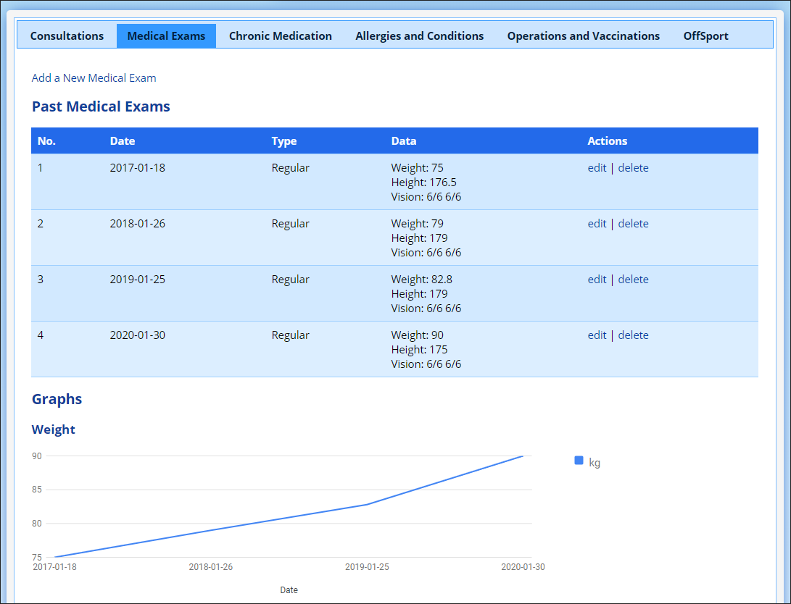

### Managing the Medical Examinations

To add, or remove Medical Examinations, navigate to **Administration → Medical Administration → Manage Medical Examination Types**.

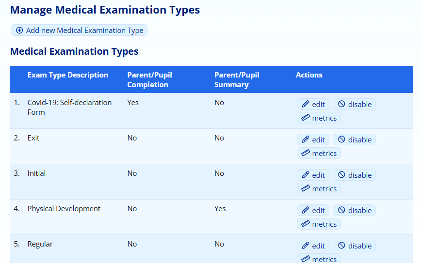

To add a new examination, click on the “**Add**” button at the top. Enter a name for the examination and save.

To change the name of an existing examination, click on the “**edit**” option next to the examination.

Examinations can also be disabled (and re-enabled) using the “**disable**” option. This will move it to the bottom table where they can be re-enabled.

Click on the “**metrics**” option to adjust the measurements that are requested in the examination.

#### Adding and Editing Medical Examination Types

When adding a new Medical Examination Type or editing an existing one, ADAM will show the following screen:

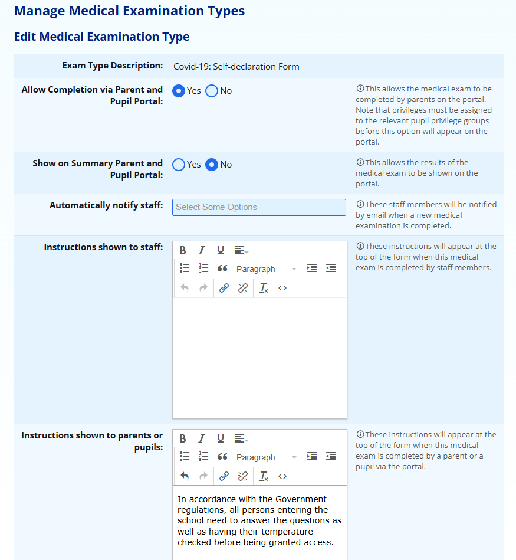

The **Exam Type Description** will be used as a heading to describe the reason for the Medical Examination.

Medical Examinations can be optionally **completed on the parents’ and pupils’ portal**. Parents and pupils have the option, [based on their permissions](security-administration-for-families-and-pupils.md#security-administration-for-families-and-pupils), to complete medical examinations. These can be used to record the results screening examinations that are required to be completed by schools during the Covid-19 pandemic. Note that these instructions appear exactly as you capture them [on the portal screen](#parents-and-pupils-completing-medical-examinations).

> [!NOTE]
> Note that the medical examinations are completed from a pupil’s perspective and are recorded against the pupil’s profile. It is not possible to record a medical examination for a parent.

> [!NOTE]
> Note that “out of the box”, parents and pupils do *not* have permissions to complete medical examinations. You may wish to differentiate based on primary school (allow only parents to complete) or high school (allow parents and pupils to complete). It is not possible to make this differentiation per medical examinations - one setting applies to all medical examinations.

Additionally, **medical examination summaries** can be shown on the Pupil and Parent portal by selecting “Yes” to this question.

> [!WARNING]
> The permission group for the pupils must also be assigned the permissions to view medical examination summaries.

The indicated **Instructions** are shown to the staff who are completing the medical examination or to the parents/pupils in the portal. Thus differentiated instructions can be shown if required.

#### Adding and removing metrics from a test

A list of metrics in the test, and those available for use, are shown in two tables:

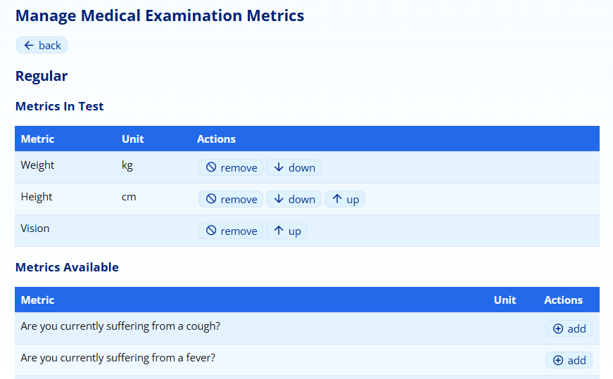

One can **add** or **remove** metrics. The order can be changed using the **up** and **down** options next to those metrics that appear in the test. This order can be adjusted for easier data capture.

The changes are saved as you make them. Changing the fields available in a test does not change previously conducted tests and no data will be lost by removing a metric from a test. This might happen if you decide not to record this any more. All data that was previously recorded will remain on the system.

To add or remove metrics, please see the [section below](#managing-the-metrics).

### Managing the Metrics

Navigate to **Administration → Medical Administration → Manage Medical Examination Measurements**.

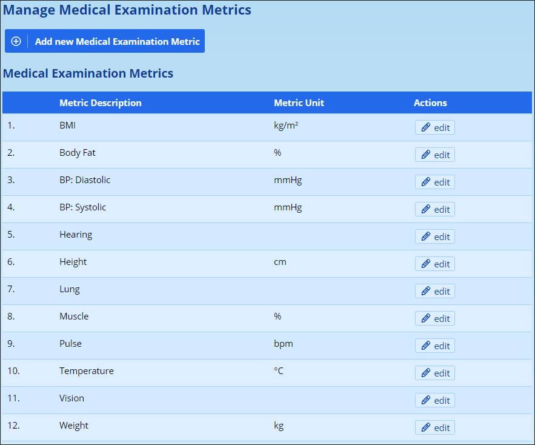

Here you can add (using the button at the top) new matrics and edit existing ones.

> [!WARNING]
> Note that editing a metric will have an impact on information already recorded. For example, if you change the height to rather be measured in metres instead of centimetres, then all previously taken measurements will appear to be in metres: 162cm will then show as 162m.

### Adding a new Metric

To add a new metric, click on the **Add a new Medical Examination Metric** button  that appears at the top of the table.

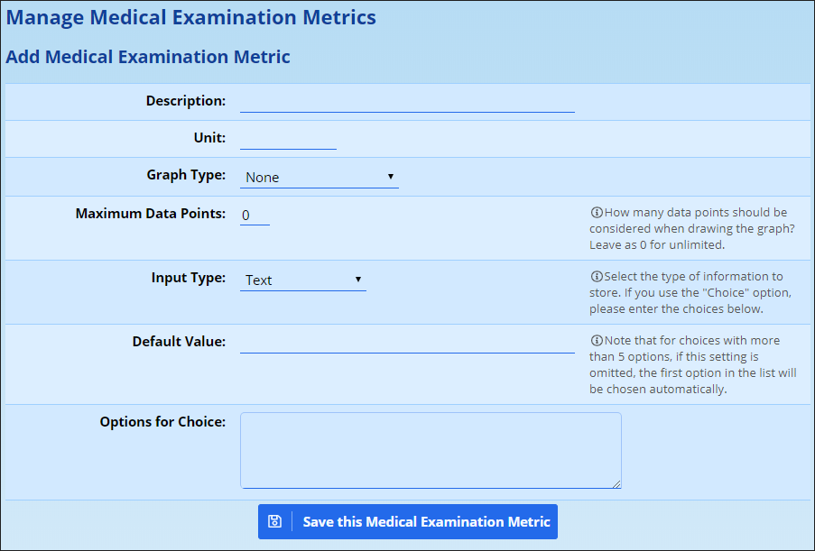

The **Description** is the name of the field and appears next to the input box. On the list of metrics that appeared above, these are listed in the left-hand column.

The **Unit** field will be displayed next to the input box. Examples of this are things like “cm”, “°C” or “mmHg”. This is to aid the data capturer in guiding them to choose the correct information.

For numerical data, you can choose to have ADAM show a **graph** of the information on the pupil’s medical information page. This should be saved for the most important information. It can be changed later. You might want to have temperature displayed while you are conducting daily health monitoring checks but then not displayed after that. In this case, you would need to edit this metric again and change the “Graph Type” to “None”.

> [!NOTE]
> While this list currently promises a “bar chart”, kindly note that all charts will currently be displayed as a line. We’ll get there!

If you are displaying a graph, ADAM can also limit the number of data points that it shows. A reading of “0” means that ADAM will show all the data points. If you want to limit the chart to show only the last 10 readings, then enter a 10 for **Maximum Data Points**.

You can specify what **type** of information you are collecting. Options here are:

-   **Text:** Use this for a note or a non-standard measurement like (e.g. vision “6/6” or “needs glasses”).
-   **Whole number:** Typically used for counting things or where smaller measurements are impractical. Often used for height measurements in cm, where the margin of error doesn’t make it worth measuring more accurately.
-   **Decimal number:** Used for measurements. The measurements will only be accurate to 1 decimal place. Often used for temperature measurements.
-   **Choice:** This provides the user with selectable choices. If you choose this option, enter in the choices you would like the user to choose from in the **Options for Choices** text box at the bottom of the list. Note that, depending on the number of options, the user must choose from, this will either display visible “radio” options (if 5 or fewer choices) or a dropdown list (if more than 5 choices).
-   An option to “choose more than one option” is not available.

The **Default Value** of the field will be entered or selected automatically. Use this with caution since it might be easy to submit the medical exam accidentally. A person viewing these results later won’t know if the option is genuine or whether it was entered in error.

Finally, the **Options for Choices** text box allows the different options to be used in the **Choice** option above. Adding a “Yes / No” choice, for example, would require you to enter the data as shown below:

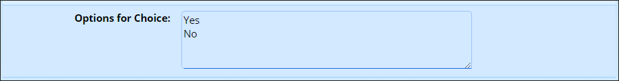

When you’re done, you can click on **Save this Medical Examination Metric**.

Once you’ve added a new metric, you may wish to have it [included in a specific medical examination](#managing-the-medical-examinations).

### Parents and Pupils Completing Medical Examinations

For the purposes of health screening, it may be desirable to have parents or pupils complete medical examinations in ADAM. For them to be able to do so, they will need to be [assigned the correct permissions](security-administration-for-families-and-pupils.md#security-administration-for-families-and-pupils).

> [!NOTE]
> Where schools would like to provide instructions for parents to complete the medical examination, the instructions below should serve as a starting point and not be relied on to provide the specific information required for the medical exam as set up by the school.

Parents and pupils with the permission to complete medical examinations will see a **Medical Records** heading in their portal menus:

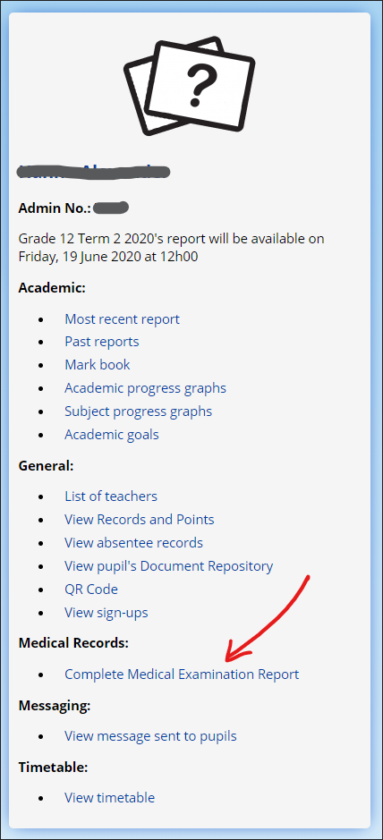

Once they select this option, one of three possible screens will appear.

If there are **no medical examinations** that have been [set to display on the portal](#managing-the-medical-examinations), then they will see an error message to this effect: “There are no medical examinations available for completion.”

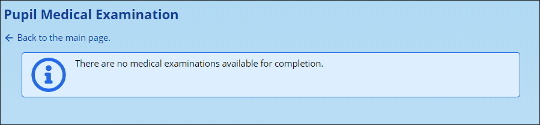

If there are **two or more medical examinations** available, they will need to select which medical examination they wish to record. They must select the appropriate examination from the drop-down list and click on the **Next** button.

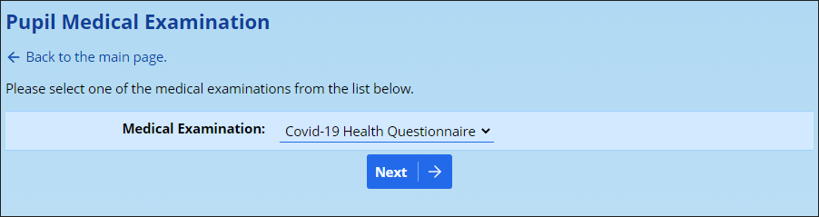

The third possibility is that there is **only one medical examination** available. In this instance, they will taken immediately to a screen to collect the results.

The following image shows an example of a medical examination that might be used for the Covid-19 pandemic information collection process. Please understand that this is provided as an illustrative example only and is not meant to reflect an actual Covid-19 pandemic screening test as might be required.

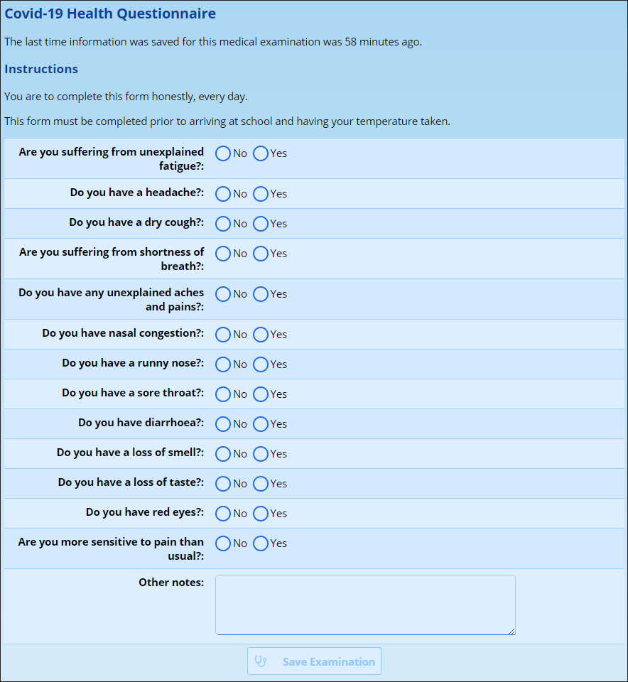

Underneath the heading for the medical examination, ADAM displays the time that the last medical examination was recorded. This will hopefully help avoid people submitting examinations twice in error.

The instructions for parents, as defined when editing the medical examination’s details are then shown. The instructions shown above are example instructions only and are the same as those reflected in the editing screenshot above.

Note that all questions, except for the **Other notes**, require a response before the user will be permitted to click on the **Save Examination** button at the bottom of the form and submit their readings.

Once submitted, ADAM will display a message confirming that the results have been saved:

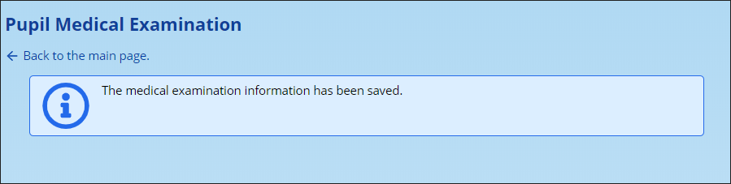

### Parents and Pupils Viewing Their Results

A medical examination type can also be set to show its **summaries** on the portal. A family or pupil holding **View medical reports** sees a **View Medical Examination Reports** option in their portal menu under **Medical Records**.

The screen shows a heading for each examination type that has been published this way, the pupil’s results for it, and — for any metric set to draw one — a graph of those readings over time.

> [!NOTE]
> Only the pupil’s five most recent examinations are considered, counted across all types rather than per type. A pupil who has had five examinations of one kind since their last vision test will find the vision heading empty until the next one is recorded. Publishing a small number of types to the portal keeps this from surprising anybody.

> [!WARNING]
> Viewing results currently also requires the **Complete medical exams** permission. A login group given only **View medical reports** is refused. Grant both until this is resolved.

## Off Sport

The off sport list records pupils who have been excused from sport, for how long, and why. It feeds the sports staff their daily list by email, and it can mark the pupil as absent in roll call.

### Viewing the Off Sport List

Navigate to **Pupils → Medical Records → View the Off Sport List**.

The list shows current and forthcoming entries — anything that has already ended drops off it — with the pupil’s **Surname**, **Firstname**, **Class** and **Grade**, the **Start** and **End** dates, the **Location**, **Type**, and the **Absent**, **Concussion** and **Antibiotics** flags, together with any **Comments**.

Above the table are dropdown filters for grade, start date, type, absent, concussion and antibiotics, and a search box. This is the screen a sports department works from at the start of an afternoon.

### Adding a Pupil to the Off Sport List

Navigate to **Pupils → Medical Records → Add a Pupil to the Off Sport List**, click **Add a new off-sport entry** on the **Off Sport** tab of a pupil’s medical records, or follow the link offered after saving a consultation.

Record:

-   the **Pupil**, the **Start Date** and the **End Date**;
-   the **Location** — where the pupil should be during sport, chosen from the school’s list;
-   the **Type** — the reason, chosen from the school’s list;
-   **Counts as Absent for Roll Call** — see below;
-   **Concussion** and **Antibiotics**, two flags a school needs to be able to find quickly;
-   any **Comments**.

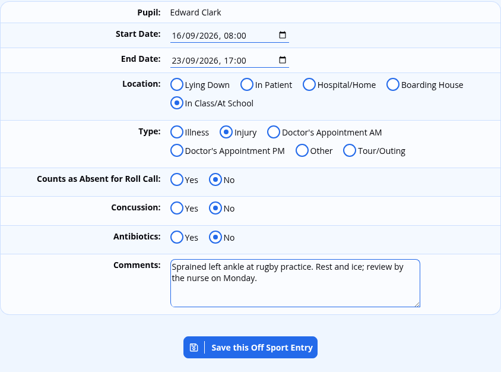

**Counts as Absent for Roll Call** starts at **No** for every new entry. Set it to **Yes** for a pupil who will be away from roll calls, not merely sitting out a practice.

> [!NOTE]
> Each off sport type carries its own absent setting, and the form is meant to copy that setting across when you choose a **Type**. At present it does not, so check **Counts as Absent for Roll Call** by hand every time.

> [!NOTE]
> **Concussion** and **Antibiotics** have their own columns and their own filters on the off sport list. A school with a concussion protocol can therefore produce the list of pupils currently under it without needing a separate record anywhere.

### Off Sport and Roll Call

An off sport entry marked **Counts as Absent for Roll Call** becomes a planned absence: the pupil is expected to be away from roll call for the period, and is shown as such rather than as unexplained. The reason that appears against them is set by a site setting — navigate to **Administration → Site Administration → Edit site settings** and, on the **Attendance** tab under the **Roll Call** heading, set **Reason to show for Off Sport**.

See [Roll Calls](roll-calls.md#roll-calls) for how planned absences behave.

### Managing Off Sport Types and Locations

Navigate to **Administration → Medical Administration → Manage Off Sport Types** to maintain the reasons, each of which records whether it normally counts as absent for roll call, and **Manage Off Sport Locations** to maintain the places a pupil can be sent.

### Off Sport Alerts

An off sport alert emails staff a list of the pupils who are off sport today. Each alert watches one off sport type, so a school can treat concussion differently from a sprained ankle.

Navigate to **Administration → Medical Administration → Manage Off Sport Alerts**. Existing alerts are shown under **Current Alerts**, with anything switched off under **Disabled Alerts**.

Click to add a new alert, or **edit** an existing one, and set:

-   **Off Sport reason:** which off sport type this alert watches. One alert watches one reason; set up several alerts to cover several reasons.
-   **Email staff:** staff who should always receive the full list, whoever they teach. This is for the director of sport or the head of the sanatorium, and should be the exception rather than the rule.
-   **Email teachers of these subjects:** choose subjects, and the teacher of each class in those subjects is emailed about the pupils they teach and nobody else. Choosing the sports subjects here is what gets each coach their own list.

The email carries a table of the pupils on the list, with their **Name**, **Class**, **From** and **To** dates and any **Notes**. No email is sent to a member of staff who has nobody to be told about, and if nobody is off sport at all, nothing goes out.

When editing an alert, **Save as a new alert** keeps the original and creates a copy carrying your changes, which is the quick way to build a second alert that differs only in its reason. **Save the alert** updates the one you opened.

Alerts can be disabled and re-enabled rather than deleted, which moves them between the two tables.

### When the Alerts Are Sent

Navigate to **Administration → Site Administration → Edit site settings** and, on the **Notifications & Scheduling** tab under the **Medical Alerts** heading:

-   **Off Sport Alerts** sets the times of day the alerts go out. More than one time can be chosen, in which case a revised list is sent at each. The default is 14:00, which is before most schools’ sport starts.
-   **Off Sport Alert Days** sets which days of the week they are sent at all. The default is Monday to Friday.

For any of this to happen, the [cron service](cron-service.md#cron-service) must be running.

## The Medical Report

The medical report is a printable summary of a pupil’s medical information, with their photograph — the thing a teacher takes on tour, to a match or on a camp.

Navigate to **Pupils → Lists and Labels → Medical report**. Choose a subject and then the classes you want, or reach the report with a pupil already chosen by clicking **Medical Report** on their medical records page.

Before generating it you can:

-   tick any **Custom Fields** that should be included, which is how a school gets its own medical questions onto the report;
-   narrow the list by **Gender**, for a report covering one team.

Click **Generate the medical report** to produce a PDF.

## Medical Records for Staff

Staff have medical records too. A member of staff with the **View medical staff information** permission sees a **Medical Records** section on a colleague’s profile, holding a **Consultations** tab that works exactly as the pupil one does, with an **Add a new Consultation** link and the same **edit** option.

Only consultations are kept for staff. There are no conditions, chronic medication, operations or off sport records on the staff side.

> [!NOTE]
> Staff medical records are separate from the [Leave Module](leave-module.md#leave-module), which is where sick leave is recorded and counted. A consultation in the sanatorium does not create a leave record, and neither one updates the other.

## Settings That Affect the Medical Module

Navigate to **Administration → Site Administration → Edit site settings**. The settings that shape this module are:

| Tab and heading | Setting | What it does |
| --- | --- | --- |
| **Pupils & Families → Medical Information** | **Medical Information** | Chooses which additional pupil fields appear on the medical records summary. |
| **Pupils & Families → Medical Information** | **Pupil Account Field**, **Staff Account Field** | Which field supplies the account number on the [stock transaction reports](medical-stock.md#account-numbers-on-the-reports). |
| **Documents → Categories** | **Medical Module Categories** | Which document repository categories appear on the **Documents** tab. Leaving this empty removes the tab. |
| **Notifications & Scheduling → Medical Alerts** | **Off Sport Alerts**, **Off Sport Alert Days** | When the [off sport alerts](#off-sport-alerts) are sent. |
| **Attendance → Roll Call** | **Reason to show for Off Sport** | The absence reason shown in roll call for a pupil who is off sport. |

## Permissions

The medical permissions sit in the **Wellbeing** group, and are [assigned to staff](security-administration-for-staff.md#changing-the-permissions-of-a-group) like any other. They are deliberately fine-grained: a school can let a sports coach see that a pupil is off sport without letting them read the diagnosis that put them there.

### Medical Records

| Permission | What it allows |
| --- | --- |
| **View medical information** (`medical_view`) | See a pupil’s medical records at all. Without it every tab shows a message in place of its contents. |
| **Add Medical Consultations** (`medical_consultations_add`) | Record consultations for pupils, staff and chargeable entities. |
| **Edit and Delete Medical Consultations** (`medical_consultations_edit_delete`) | Change or remove a consultation after it has been saved. |
| **Add Medical Exams** (`medical_exams_add`) | Record a medical examination for a pupil. |
| **Edit and Delete Medical Exams** (`medical_exams_edit_delete`) | Change or remove a recorded examination. |
| **Perform Health Monitoring** (`medical_healthcheck`) | Use [Health Monitoring](health-monitoring.md#health-monitoring). |
| **Add**, **Edit** and **Delete Allergies and Conditions** (`medical_allergies_add`, `_edit`, `_delete`) | Maintain a pupil’s allergies and conditions. |
| **Add**, **Edit** and **Delete Chronic Medications** (`medical_chronic_add`, `_edit`, `_delete`) | Maintain a pupil’s chronic medication. |
| **Add**, **Edit** and **Delete Operations and Vaccines** (`medical_interventions_add`, `_edit`, `_delete`) | Maintain a pupil’s operations and vaccinations. |

### Medical Administration

| Permission | What it allows |
| --- | --- |
| **Manage Medical Attendants** (`medical_attendant_manage`) | Maintain the list of attendants. |
| **Manage Medical Items** (`medical_items_manage`) | Maintain the lists of ailments, and of operations and vaccinations. |
| **Manage Medications** (`medical_medication_manage`) | Maintain the list of chronic medications and the [medical stock](medical-stock.md#medical-stock). |
| **Manage Causes** (`medical_causes_manage`) | Maintain the list of medical causes. |
| **View Off Sport** (`medical_offsport_view`) | See the off sport list and a pupil’s off sport tab. |
| **Manage Off Sport** (`medical_offsport_manage`) | Add and edit off sport entries, types and locations. |
| **Edit Off Sport Alerts** (`offsportalert_edit`) | Create and edit the off sport alerts. |
| **Manage Chargeable Entites** (`medical_billing_manage`) | Maintain the [chargeable entities](medical-stock.md#chargeable-entities). |
| **View Medical Transactions Report** (`medical_transaction_view`) | Intended for the [stock transaction reports](medical-stock.md#the-stock-transaction-reports). |
| **Manage Medical Examination Details** (`medical_exam_manage`) | Maintain examination types and metrics. |
| **View Medical Examination Report** (`medical_exam_report`) | Run the medical examinations report. |

The **Medical report** on the **Lists and Labels** menu has its own permission, **Medical report** (`reportmedical_view`), which sits with the other pupil reports rather than in the Wellbeing group.

Staff medical records are governed by **View medical staff information** (`medical_view_staff`), in the **Staff Admin** group.

> [!WARNING]
> **View medical staff information** is what puts the **Medical Records** section on a staff profile, but the consultations inside it are shown only to somebody who *also* holds **View medical information**. Until this is resolved, grant both together, or the section will appear empty.

### Permissions for Parents and Pupils

Two permissions are [assigned to family and pupil login groups](security-administration-for-families-and-pupils.md#security-administration-for-families-and-pupils) rather than to staff:

| Permission | What it allows |
| --- | --- |
| **Complete medical exams** (`medical_exams_complete`) | Complete, on the portal, any examination that has been set to appear there. Available to current pupils. |
| **View medical reports** (`medical_exams_view`) | View examination results on the portal. Available to current and past pupils. |

Neither is granted out of the box.
