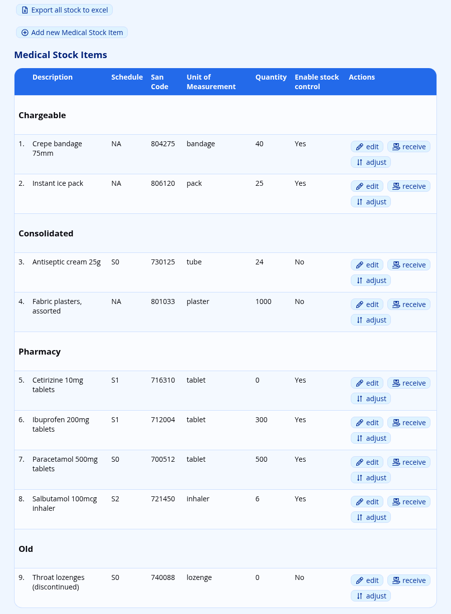
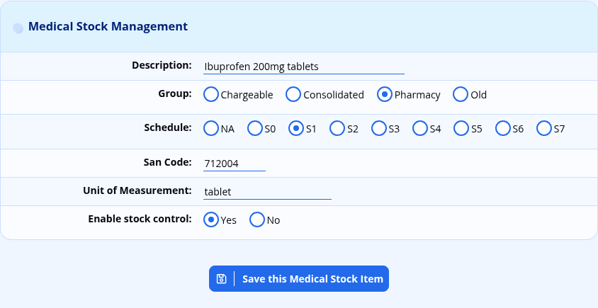
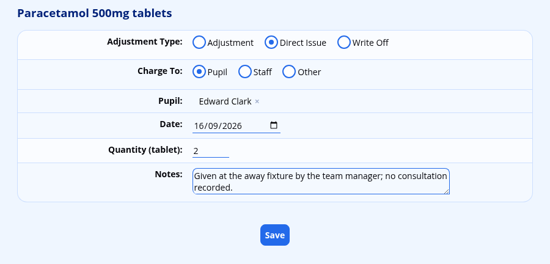
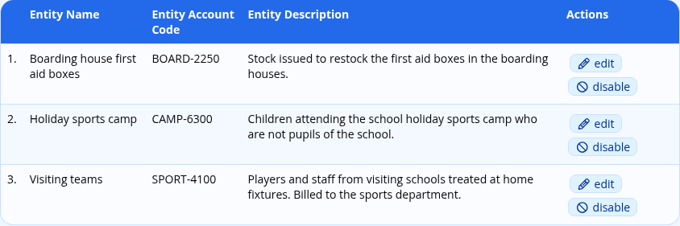
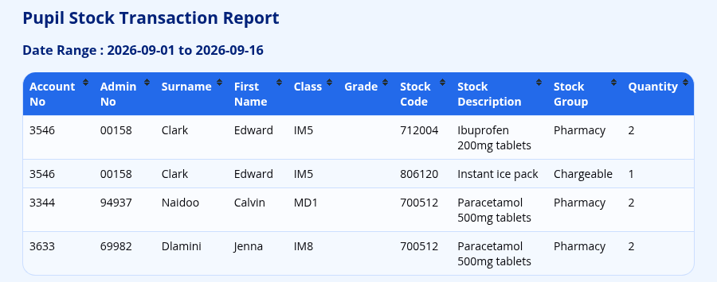

# Medical Stock

The medical module keeps a stock ledger of the medicines and consumables held in the sick bay. Every item dispensed during a [medical consultation](medical-module.md#dispensing-medication-during-a-consultation) draws the stock level down, and the stock transaction reports turn those movements into a list the bursar can bill from.

This page covers the stock ledger, the chargeable entities that medicines can be billed to, and the three stock transaction reports. The clinical side of the module — consultations, conditions, medication records and off sport — is covered in the [Medical Module](medical-module.md#medical-module).

## Managing Stock Items

Navigate to **Administration → Medical Administration → Manage Medical Stock**.

The table lists every stock item with its **Description**, **Schedule**, **San Code**, **Unit of Measurement**, **Quantity** and whether stock control is enabled. Items are grouped by their **Group**, so all the pharmacy items appear together, all the chargeable items together, and so on.

### Adding and Editing a Stock Item

Click on **Add new Medical Stock Item** at the top of the table to add a new stock item, or on the **edit** option next to an existing one. The following fields are recorded:

-   **Description:** the name of the item as the nurse will search for it. This is what appears in the medication list on the consultation screen, so use the name that staff will actually type.
-   **Group:** one of **Chargeable**, **Consolidated**, **Pharmacy** or **Old**. The group sorts the stock list, and is one of the filters on the transaction reports. **Old** is where to put items that are no longer bought, so that they can be filtered out of the reports without their history being lost.
-   **Schedule:** the South African medicines schedule, from **S0** to **S7**, or **NA** for an item that is not a scheduled medicine. This is recorded for your own dispensing records; ADAM does not restrict who may issue a scheduled medicine.
-   **San Code:** the item’s SAN code, used on the transaction reports so that the school’s figures can be matched against a supplier’s.
-   **Unit of Measurement:** the unit in which the item is counted, such as “tablet”, “ml” or “dressing”. This is shown next to every quantity field, so it is worth being consistent.
-   **Enable stock control:** whether ADAM should track the quantity on hand and refuse to issue more than there is. See [Stock Control](#stock-control) below.

An **Export all stock to excel** link at the top of the page downloads the whole stock table as a spreadsheet.

### Stock Control

**Enable stock control** changes what happens on the consultation screen when a nurse searches for a medicine.

With stock control switched on, each item in the search results is annotated with its group and the quantity remaining — “12 tablet(s) in stock” — and an item that has run out is shown as **\*\*\* No stock \*\*\*** and cannot be selected at all. If an issue would take the balance below zero, ADAM refuses it and reports: “Insufficient stock of ‘*item*’ on hand. The medication has not been added to the consultation.” The rest of the consultation is still saved; only that one medication is dropped.

With stock control switched off, no quantity is shown in the search results and no issue is ever refused. The stock level is still reduced, so it can go negative, which is how a school running an unmetered item can still see how much of it has gone out.

> [!NOTE]
> Stock control is set per item, not for the module as a whole. A school will typically switch it on for anything scheduled or expensive, and leave it off for plasters and paper cups.

## Receiving Stock

Click the **receive** action next to an item to book in a delivery. Record the **Date**, the **Quantity** (labelled with the item’s unit of measurement), the **Batch Number** and any **Notes**, then click **Save**.

This adds a **Received** transaction and increases the quantity on hand.

> [!TIP]
> The batch number is the only place ADAM records it. If your school is ever asked to trace a particular batch, the receipt transaction is what you will be searching, so it is worth capturing it every time.

## Adjusting, Issuing and Writing Off Stock

Click the **adjust** action next to an item. The **Adjustment Type** decides what ADAM does with the quantity:

-   **Adjustment:** *adds* the quantity to the stock on hand. Use this to correct a stock take upwards, or to reverse a mistake.
-   **Direct Issue:** subtracts the quantity, and records who it was issued to. Use this when medication is handed out without a consultation being recorded.
-   **Write Off:** subtracts the quantity without charging anybody. Use this for expired or damaged stock.

For a **Direct Issue**, **Charge To** determines who carries the cost — a **Pupil**, a **Staff** member, or **Other**, which bills a [chargeable entity](#chargeable-entities). Complete the matching field below, then the **Date**, the **Quantity** and any **Notes**, and click **Save**.

> [!WARNING]
> Stock levels change the moment you save. There is no confirmation step and no undo — a write-off entered against the wrong item has to be put back with an **Adjustment**, which leaves both transactions on the report.

Medication dispensed during a consultation is recorded as an **Issue** rather than a **Direct Issue**, and is entered on the consultation screen rather than here. The distinction matters on the reports: an **Issue** can be traced back to a diagnosis, a **Direct Issue** cannot.

## Chargeable Entities

A chargeable entity is anybody who can be billed for medication who is neither a pupil nor a member of staff — a visiting team, a hostel, a holiday club, or the school’s own first-aid boxes.

Navigate to **Administration → Medical Administration → Manage Chargeable Entities**. Each entity records an **Entity Name**, an **Entity Account Code** and an **Entity Description**. The account code is what appears in the **Account No** column of the transaction reports, so it should match whatever the school’s accounting system expects.

Entities can be disabled, which keeps their history but takes them out of the lists on the consultation and adjustment screens. To remove an entity altogether, disable it first: a **delete** option then appears next to it in the list of disabled entities, but only if nothing has ever been charged to it. An entity that has been used can only be disabled.

Consultations can be recorded against a chargeable entity in the same way as for a pupil or a staff member — see [Consultations for Chargeable Entities](medical-module.md#consultations-for-chargeable-entities).

## The Stock Transaction Reports

Three reports read the same ledger and present it three different ways. All three are on the **Administration** tab under the **Medical Administration** heading.

Each report is split into a section per charge type, so the pupil transactions, the staff transactions and the chargeable entity transactions appear under separate headings and can be handed to different people.

All three share the same criteria:

-   a **Start** and **End** date and time;
-   a **Transaction Type**, from **Issue**, **Direct Issue**, **Adjustment**, **Received** and **Write Off**;
-   a **Consultation Type** and a **Charge Type**, which filter on the consultation a transaction belongs to;
-   an **Output Format** of either **Web Browser** or **Excel**.

The first two reports add a stock group filter offering **Consolidated**, **Chargeable**, **Pharmacy** and **Old**, so a school that only bills for one group can exclude the rest.

> [!NOTE]
> That stock group filter is labelled **Transaction Type** on screen, which is the same label as the list above it. It is the second of the two. This is a known labelling error rather than a second set of transaction types.

All of the multiple-selection lists start with everything selected, so a report run without narrowing anything down returns the lot. Click **View Report** to produce it.

### Stock Transaction Report

**View Medical Stock Transaction Report** is the full ledger: one row per transaction, showing the **Date/Time**, consultation **Type**, **Stock Code**, **Stock Description**, **Stock Group**, transaction **Type**, **Notes**, **Quantity**, and the stock level **Stock Before** and **Stock After**. For pupils, each row also carries the **Admin No**, **Surname**, **First Name**, **Class** and **Grade**.

It defaults to the previous calendar month, which is the period most schools bill in arrears.

### Grouped Stock Transaction Report

**View Grouped Medical Stock Transaction Report** totals the quantities by pupil and by stock item, so a pupil who was given six headache tablets across a term appears once with a quantity of six rather than on six separate rows. The columns are the pupil’s details, the **Stock Code**, **Stock Description**, **Stock Group** and the total **Quantity**.

Only **Issue** and **Direct Issue** are selected by default here, since receipts and write-offs are not chargeable to anybody. This is the report to use for billing.

### Stock Transaction Report (by Stock Item)

**View Medical Stock Transaction Report (by Stock Item)** asks for a **Stock Item** first and then reports every movement of that one item, in the same columns as the full ledger. Use it to answer “where did all the antihistamine go?”, or to reconcile one line of a stock take.

The start date defaults to the first of the current month, and the end date is left for you to fill in.

### Account Numbers on the Reports

The **Account No** column is filled from a field on the pupil’s or staff member’s record, which the school chooses. Navigate to **Administration → Site Administration → Edit site settings** and, on the **Pupils & Families** tab under the **Medical Information** heading, set:

-   **Pupil Account Field** — the field holding the account number to charge for pupil medical transactions;
-   **Staff Account Field** — the same for staff.

Either may be a core field or a [custom field](database-field-management.md#database-field-management). If a school bills medical items to the family’s main school account, this is where you point ADAM at it.

## Permissions

Two permissions govern this page, both under the **Wellbeing** group in the [staff permissions](security-administration-for-staff.md#changing-the-permissions-of-a-group):

| Permission | What it allows |
| --- | --- |
| **Medical Administration → Manage Medications** (`medical_medication_manage`) | Managing stock items, receiving, adjusting and writing off stock, and reaching the three transaction reports. |
| **Medical Administration → Manage Chargeable Entites** (`medical_billing_manage`) | Adding and editing chargeable entities. |

> [!NOTE]
> A third permission, **View Medical Transactions Report** (`medical_transaction_view`), also exists and guards the reports themselves. Because the menu options that lead to them currently check **Manage Medications** instead, a staff member given only **View Medical Transactions Report** has no menu entry to click. Give the bursar **Manage Medications** until this is resolved.
