# Messaging Centre

## Sending Messages from the Messaging Centre

There are a number of entry points into the messaging centre.

### Messaging current pupils or parents

All of the following menu options can be used: they are all the same.

-   **Pupils → Messaging and Communications → Messaging Centre**
-   **Classes → Messaging and Communications → Messaging Centre**
-   **Families → Messaging and Communications → Messaging Centre**

The first step in any of these will be to select the module that you wish to use to send the message with. The “Email” module is available on most servers, and many schools have also enabled SMS sending. If SMS sending is available, you will see one of the SMS modules also available for you to use.

!!! warning
    Note that sending SMSs does incur costs!

You will then need to select a subject. By selecting a subject, ADAM will show you a list of classes in that subject and allow you to select which of those classes you would like to send your message to. Many schools will set up some classes specifically for communication so that it is easy to select a whole grade, or other specific groups of pupils/parents that you may need to communicate with on a regular basis.

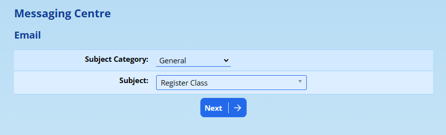

You can now choose the classes that you would like to message by ticking the boxes that appears next to each. If you wish to send to all classes, you can click on the “Select” box in the header column to select all classes.

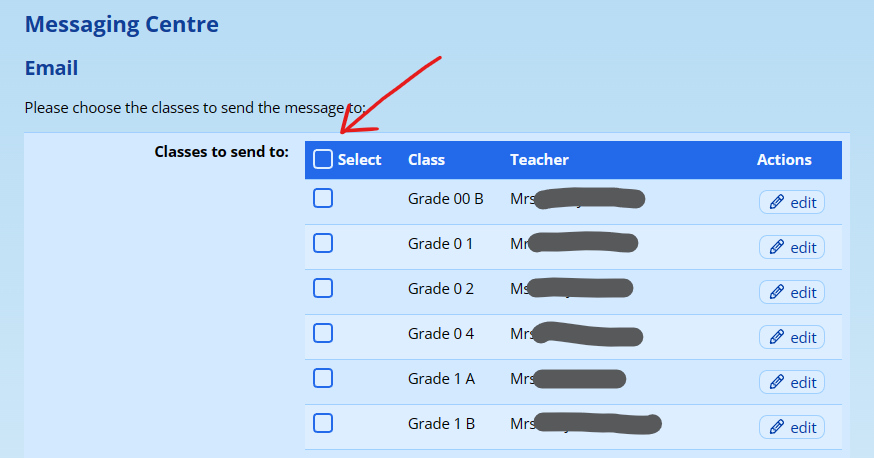

Once selected, click on the **Next** button that appears at the bottom of the page.

ADAM will now show you a list of pupils in the classes you selected and any staff that may be associated with those classes (either as teachers or teaching assistants):

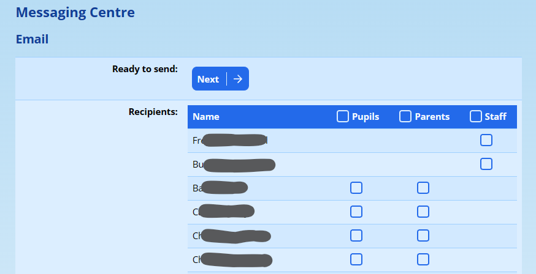

!!! warning
    Note that the list of staff might also include other senior teachers and management staff members who have a specific privilege to receive all copies of mail sent via the messaging centre.

There are three tick-boxes in the table header. You can click on these to send to ALL pupils, ALL parents or ALL staff. You’ll see that as you click on these, all the ticks in the column are selected.

!!! warning
    While sometimes necessary, if you plan on extensive personalisation of the emails with mail merge fields, you are strongly encouraged to limit your email to either only parents or only pupils. Mixing the audience types will be confusing for mail-merge scenarios.

Individual pupils, parents or staff members can either be added or removed from the recipient list by ticking or unticking the boxes next to their names.

At the top of the table is a **Next** button to click on when you are happy with your list of recipients.

ADAM now shows you the messaging centre composer. This works in a very similar way to your web-based email systems.

The image below shows all options that are available on the Messaging Centre and you may not see all of them depending on your privileges and will depend on the message type (e.g. SMSs do not have subjects or attachments).

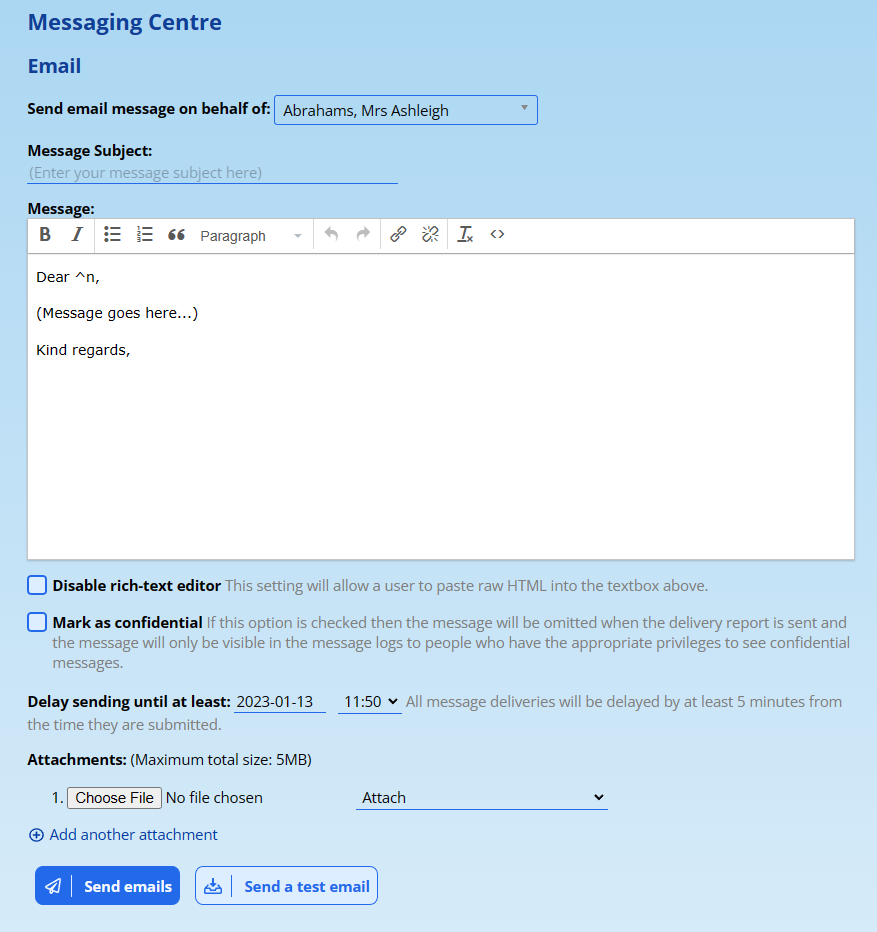

-   **Send email on behalf of:** ADAM will normally show your own name and email address as the sender of any messages from the messaging centre. However, where schools delegate the sending of messages to a central person, it is often useful for responses to be directed to the person who asked for the message to be sent rather than the person who actually sends it.
-   **Message Subject:** Enter the subject of your message here. This field is not visible for SMS messages.
-   **Message:** You can type in your message here. Please see the section below on [Composing your Message](#composing-your-message).
-   **Disable rich-text editor:** This will almost never be required, but some schools make use of specific design tools to format their emails in specific ways can use this to paste in a generated HTML email body that ADAM won’t attempt to fiddle with.
-   **Mark as confidential:** When notifications are sent out to administrators that a message has been sent from the messaging centre, ADAM normally includes the message body. However, when sending sensitive information via email or SMS, it can be useful to have the contents of the message not included. Such messages will also be restricted for viewing in the messaging centre logs.
-   **Delay sending until at least:** ADAM will accept your message and add it to the queue, but will not start processing that batch until the specified time has passed. Note that this will not be an exact time, and not all messages will be processed at once - and depending on the size and volume of messages, may take some time to process after that. But when sending embargoed information to your school community, this can be a useful tool.
-   **Attachments:** You can attach a number of files to your email for adam to send. Along side each is a drop-down list of options. If you are attaching an image file (e.g. JPG, PNG, GIF), ADAM will allow that to be embedded directly into the message body either at the top, bottom, or where it finds the code {embed} written in your email. Where you have multiple embedded images, they are placed in the order that you add them here. Note that for embedded images, ADAM does not attempt any resizing and so your original images that you use should take this into account. If you are unsure, use a 600px width as the maximum.

Once you have composed your message, click on the **Send** button to have ADAM queue the message for you.

!!! warning
    Note that regardless of your selected delivery time, all messages are queued with a minimum of 5 minutes lead time before they are processed.

## Composing Your Message

ADAM allows for the message you write to be customised for each recipient to allow them to receive a personalised message. This increases engagement with your communication.

### Formatting

The formatting options that are permitted are specifically kept to a minimum so that the school’s branding can be preserved. Note that formatting and school branding are applied to the message after it is sent and so you won’t get to appreciate the colours and fonts until ADAM sends the message. For more information on customising the branding of your emails, please see the section on [Editing the Default Template](email-message-templates.md#editing-the-default-template).

### Personalised Greeting

By default, ADAM includes the greeting “Dear ^n” as part of its template. This will ensure that regardless of who receives the message, it will be addressed to them. ADAM will substitute the “^n” out with the recipient’s name.

### Merge Codes

Below the email window is a list of merge codes that can be used in your message. These are the same fields that you can call on when you draw up a [scratch list](scratch-lists.md#scratch-lists) of pupils.

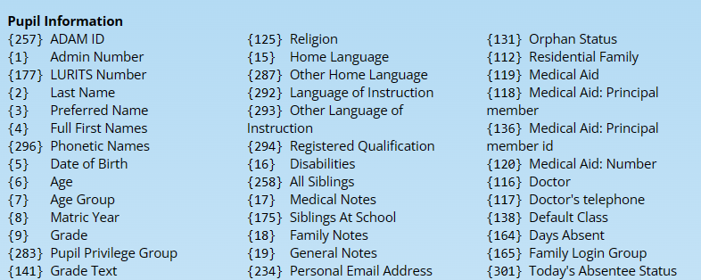

To have ADAM include the information in your messages, you can include the code where you would like it to appear. For example, the following message:

Please remember to send your reply slip with {3} to school tomorrow.

Will be substituted as sent as:

Please remember to send your reply slip with Johnny to school tomorrow.

#### A warning about context

Note that if you mix more than one type of recipient (parents, pupils, or staff) in the same email, ADAM won’t be able to substitute information reliably. Staff, for example, don’t have children linked to their profiles and so ADAM won’t be able to substitute anything when it finds a pupil code in the email.

Our advice: Send to one audience at a time, especially if you are using merge codes.

Note that this limitation does not apply to the “^n” greeting which will be substituted regardless.

### Duplicated Messages within Batches

If parents have multiple children at the school, one concern is that they will receive a copy of every message sent multiple times - once for each child.

ADAM handles this scenario quite cleverly in that, within a batch, it will check the contents of every message and if it sees that a parent is getting the exact same message more than once, it removes the duplicates.

This applies to all types of message, including SMS.

There are two caveats that you should be aware of:

1.  The messages must be sent in the same batch. ADAM will not detect duplicate messages that have been sent across multiple batches, regardless of how soon after each other they were sent. Some schools, for example, will send a message to the primary school separately to the high school and parents will children in both phases will receive the same message from each.
2.  If you personalise a message using merge codes, assuming that parents would give their children different names, using the first name merge code would mean that they would then get a copy for each child - even if these were sent in the same batch - because the content of the message, now including the different children’s names - is no longer identical.

## Privileges Required for using the Messaging Centre

Before a user can send messages from the messaging centre, they need a few privileges to be set first.

### Step 1:

The first privilege is a general one that is applied to the whole privilege group. They require, at a minimum, “Can make use of the messaginge centre (*messaging\_centre*)”. This is found on the **Messaging** tab, and under the heading **E-mail**. For more information on changing staff privileges, please see [Security Administration for Staff](security-administration-for-staff.md#security-administration-for-staff) elsewhere in this documentation.

### Step 2:

Once they can use the Messaging Centre, ADAM will need to know which messaging modules they may use and which people they may send to. Visit **Administration → Messaging Administration → Edit messaging privileges**.

Here you will see a list of privilege groups along the side and a list of enabled messaging modules along the top:

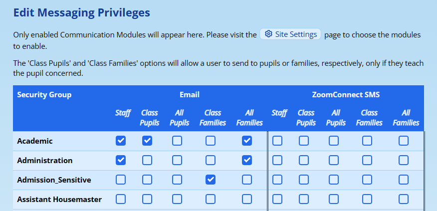

If you wish to set privileges for other messaging modules, you will need to enable these modules in the [Site Settings](logging-on-to-adam.md#site-settings). A link to the correct place inthe site settings is provided at the top of the page. Note that while it is possible to set privileges for enabled modules, the module must have the correct configuration details supplied in the Site Settings in order for it to be capable of delivering your messages.

Here you can specify which groups can use which modules to send to which audiences.

-   **Staff:** This allows the user to send messages to any staff members.
-   **Class Pupils:** This allows the user to send messages to any pupils who belong to any of their classes (i.e. they can send messages only if they “teach” the pupil).
-   **All Pupils:** This allows the user to send messages to all pupils in the school. This privilege is also needed to send messages to alumni and the pupil applicants.
-   **Class Families:** This allows the user to send messages to the parents of any pupils that they teach.
-   **All Families:** This allows the user to send messages to all parents of the school. This privilege is also required to send messages to the parents of applicants.

Once you’ve set up the privileges, please click on the **Save** button at the bottom of the page.

## Managing Messaging Centre Batches

Once you’ve sent a message, you have a number of options regarding the batch, including seeing delivery reports and more. To access a list of batches, navigate to **Administration → Messaging Administration → View Messaging Centre batches**. A list of batches will be shown.

To access the details of a specific batch, click on the **view** action.

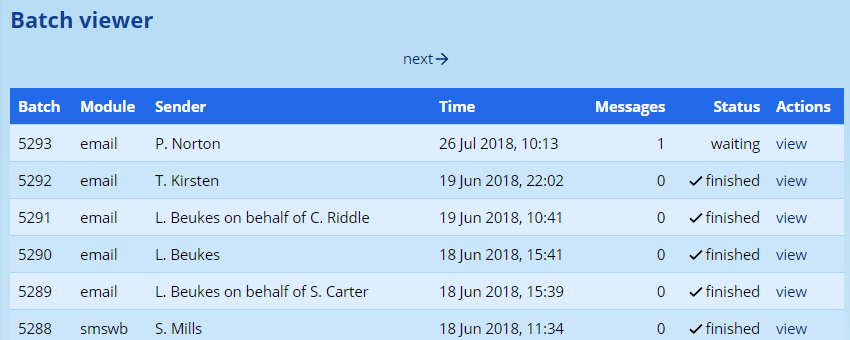

The medium of the message, the sender of the message, the time that the message was loaded and the number of recipients is shown. ADAM also indicates the batch’s current status being either “waiting”, “processing”, “paused”, or “finished”.

### Delaying a Batch

It is possible to delay a batch in ADAM for a customised delivery time. One can either access the batch details as shown above, or immediately after sending a message:

Batches will show different options based on their statuses. For example, one can abort and pause a batch that has started processing, but one cannot delay such a batch. ADAM will show the available options to you at the top of the batch. If the batch has finished processing, ADAM will not show any options.

If the batch can be delayed, an option will appear at the top of the list. This option will allow you to delay the sending of any messages that have not yet been processed. If a message has already been sent, ADAM cannot delay it, nor will it attempt to send it again.

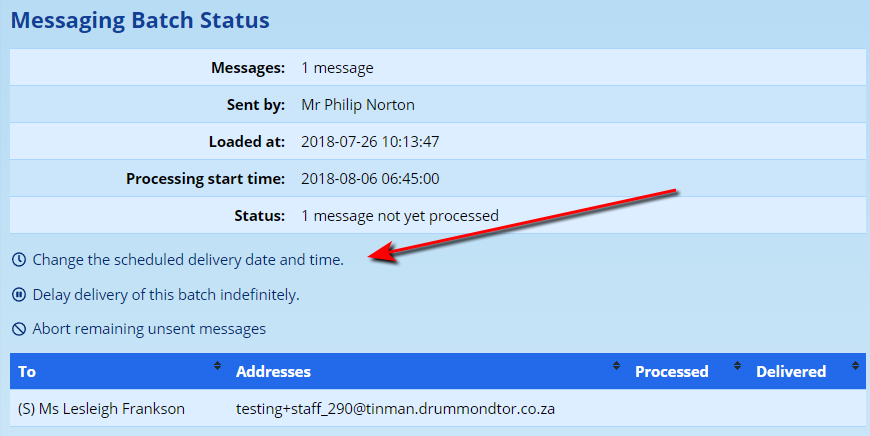

Clicking on this option brings up a screen where you can choose when you want the message delivered:

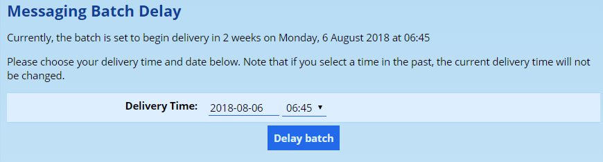

Simply enter the date and time that you would like delivery to begin on. Note that ADAM will only allow you to choose a time in the future. If you choose a time in the past, ADAM will leave the delivery time unchanged. The same goes if you enter an invalid time.

Click on the **Delay batch** button to delay any unsent messages to the time you’ve specified.

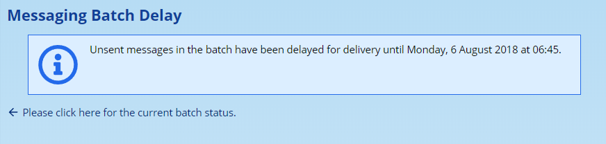

ADAM confirms that it has changed the delivery time.

## Sending SMSs from the Messaging Centre

Please see [SMS Service](sms-services.md#sms-services) elsewhere in this manual.

## The Messaging Centre and Email Spam

When computers see multiple copies of the same email emanating from a single IP address, they generally treat that email more suspiciously than they would any other email destined to only one or two recipients.

End users may find that mail sent via ADAM lands up in their spam or junk mail folders, or may not be delivered at all.

To combat this, it is important that you take precautions to ensure that your mail is properly configured. There are a number of techniques that can help with this.

We recommend using [MXToolbox’s Email Health service](https://www.google.com/url?q=https://mxtoolbox.com/emailhealth&sa=D&source=editors&ust=1778246676282232&usg=AOvVaw3FS2KdqQqWhznpMZfRzVE4) for more information regarding your email domain’s deliverability.

### Sender Framework Policy (SPF) Configuration

One of the simplest techniques to combat spam is to create or update your domain’s SPF record. This record, stored in your domain’s “zone file.” Your ISP may be required to make these changes for you.

The SPF record works by listing the IP addresses of all the servers that are permitted to send email addressed from your email domain. This reduces the chances of recipient email servers from treating your email as spam.

**Setting up an SPF record is strongly recommended.**

For schools that make use of our managed hosting service, we recommend adding our ADAM SPF configuration to your SPF record. Schools that send email via Google’s “Google Workspace for Education” would likely have an SPF record such as:

v=spf1 include:\_spf.google.com ~all

### Domain Keys Identified Mail (DKIM) Signing

DKIM is a robust method which signs individual emails with a cryptographic signature that can be verified online by a receiving email server. Because they are essentially impossible to fake, mail that has a valid DKIM signature is almost certainly not spam mail.

Setting up DKIM signing is different for each service provider. Google’s “Google Workspace for Education” makes this a simple 1-click operation to turn on, but does require further setup in your domain’s “zone file”. Your ISP may be required to make these changes for you.

If DKIM signing is enabled for your domain, it is recommended that email sent via ADAM is relayed to your DKIM-signing SMTP server so that it too can be sent with the benefit of DKIM signatures.

### DMARC Records

Although servers can voluntarily check and decide how to deal with mail based on the results of SPF and DKIM signing, DMARC records provide explicit instructions on how email servers should treat mail that emanates either from untrusted origins or from unsigned sources.

Once again, this does require configuration and setup in your domain’s “zone file”. Your ISP may be required to make these changes for you.

## Messaging a Pupil’s Teachers

It is very useful to be able to message the teachers of a single pupil. To do this, navigate to **Pupils → Messaging and Communications → Send email to a pupil’s teachers**.

Type in the name of a pupil and click on the **Next** button:

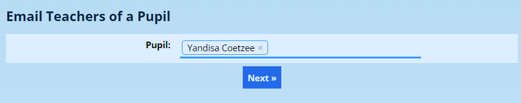

The following screen appears:

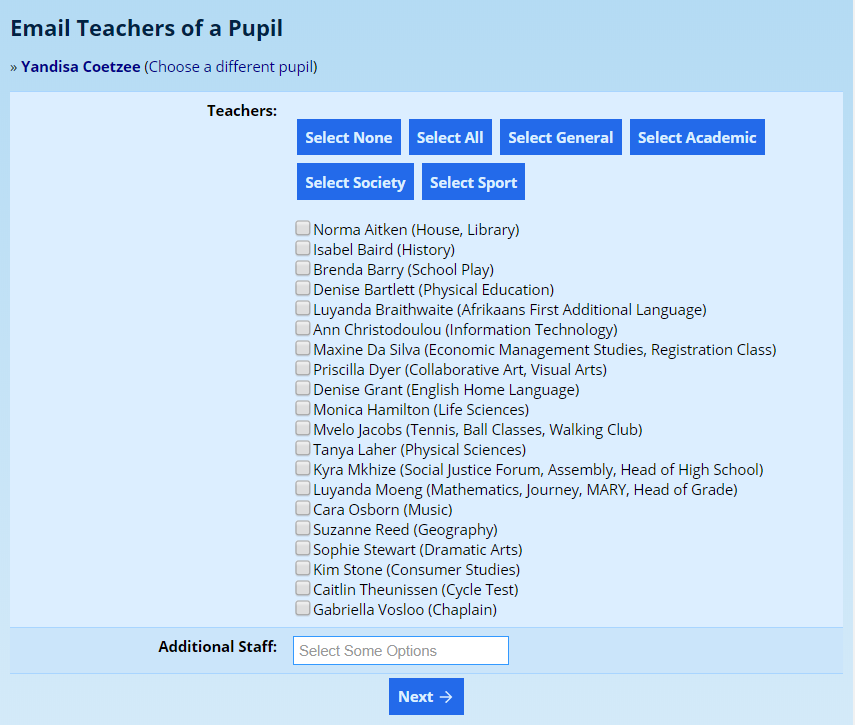

The buttons at the top allow you to select different types of teachers. For example, clicking on **Select Academic** will select only the teachers who are recorded against classes in the **Academic** subject category. Your server will show customised buttons depending on which categories are available on your server.

In the **Additional Staff** at the bottom, you can click and choose other staff members, not listed, to be included in the email. You can search for staff here by typing a part of their name. You can have many staff here if you require. If staff are duplicated by accident, they will *not* be sent the email twice.

Click on the **Next** button to begin composing your message.

The screen shown is the standard messaging centre screen, which may have different options to those shown below, depending on your privileges:

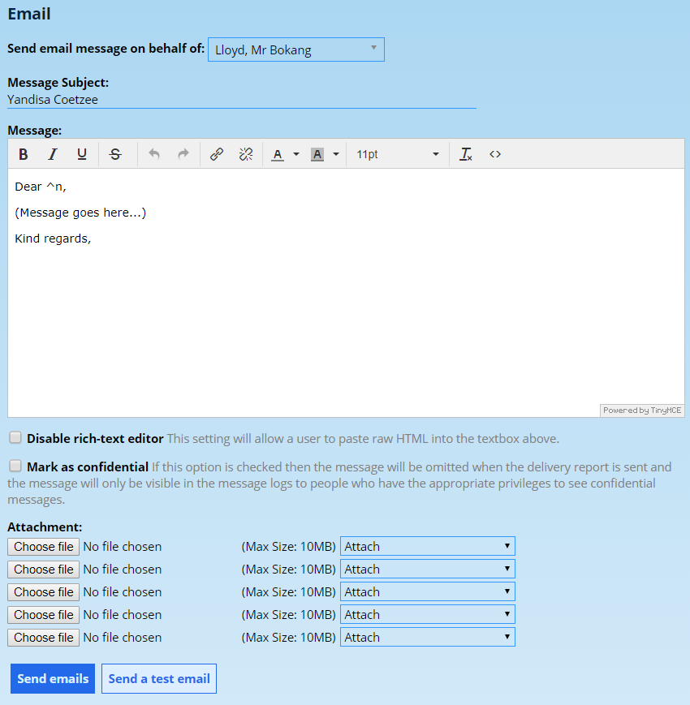

Click on **Send emails** to queue your email.
