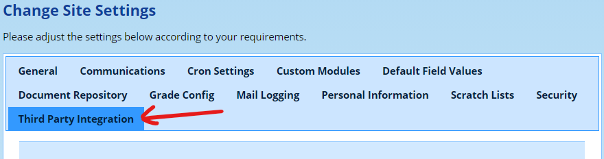
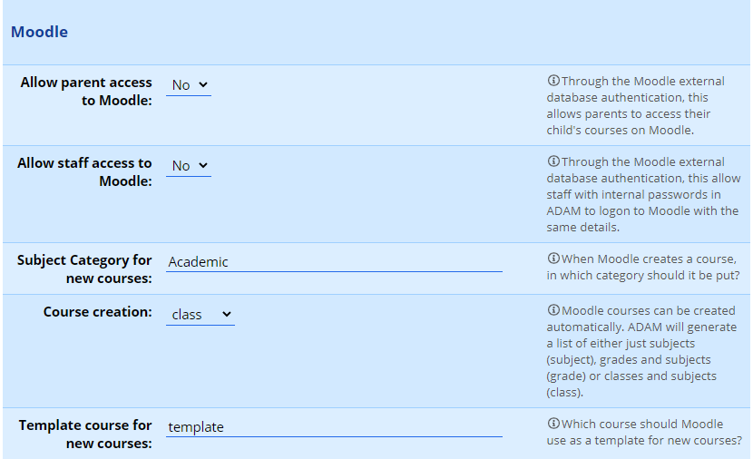
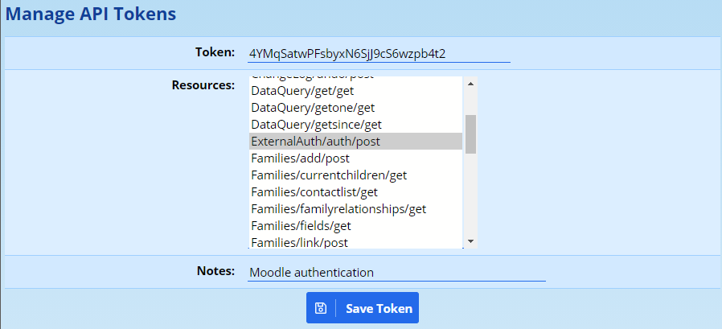

# Moodle Integration

ADAM stores information that is highly relevant to the management and structure of Moodle, particularly as most Moodle installations will follow the same structures of courses and class registrations that ADAM records.

ADAM supports integration with Moodle 3 servers and can make use of the “External Database” plugin in order to synchronise classes (Moodle’s “courses”) and enrolments, and “External Authentication” which allows Moodle to use ADAM as an authentication source. This can allow staff, pupils and parents to get access to Moodle.

## Preparing ADAM

In ADAM, log on with an Administrator account and, on the **Administration** tab, click on **Edit site settings**. For more details information about changing the site settings, please see the section [Changing Site Settings](changing-site-settings.md#changing-site-settings) elsewhere in this documentation.

Within the site settings, click on the **Third Party Integration** section, then scrolling down to find the **Moodle** section.

### Parent, Staff and Pupil access to ADAM

The first two settings determine whether the authentication plugin will authorise staff and parents to log into Moodle. Pupils are always allowed to log into Moodle if the authentication plugin is installed.

### Synchronising Courses to Moodle

When Moodle encounters a course in ADAM that it does not have, it can be configured to create it. When it is created, the first option, **Subject Category for new courses**, directs Moodle where to place the new course. Choose something generic. We will create this category on Moodle later.

The second option, **Course creation**, instructs Moodle how we want our courses structured:

-   **subject** will create a single course for each subject. This will be a very generic course and is recommended only if the Moodle usage at the school is not high since all grades will share a single course per subject. In this scenario, there will be one Mathematics course, one English course, and so on in Moodle.
-   **grade** allows each grade and each subject to have its own course. This is a little more specific and means that there will be separate subject courses in each grade. In this scenario we would have a Grade 8 English course, a Grade 9 English course, and so on.
-   The last option, **class**, creates a Moodle course for each class that is registered.

Most schools tend to opt for the **grade** option since this keeps grade specific information together, but also allows sharing of resources between teachers in the same subject who are teaching the same grade. It is generally a good compromise.

The last option, **Template course for new courses**, allows you to specify a template course that all new courses will be based on. This means that you can create some default settings which will be copied later. In the screenshot above, the course is called **template** and this will need to be created in Moodle also.

### Subject settings

It is possible to have some subjects included and others excluded from creation in Moodle. While the default value is to include all subjects, this can be changed by editing a specific subject and changing its value there.

Note that it is not possible to limit individual classes from being created or not. Of course, if the courses are created in Moodle but never used, it doesn’t matter too much!

### A note on integration

It is important that Moodle and ADAM use the same usernames. If the usernames do not match, then ADAM will not be able to assign the correct people to the correct courses with the correct privileges.

ADAM will use the usernames of teachers to assign them teacher privileges in Moodle and the usernames of pupils to assign them student access to their courses.

## Authentication

The ADAM authentication plugin needs to be installed. This plugin is not publicly available, but you can get it by emailing us at [help@adam.co.za](mailto:help@adam.co.za). We will send you a ZIP file containing an “adam” folder that needs to be extracted into Moodle’s **auth** folder on your Moodle server. Transferring the plugin to the server and extracting it there is not covered here because it depends on the configuration and setup of your server.

### Configuring ADAM to allow Authentication

While logged on to ADAM with a site administrator account, navigate to **Administration → Security Administration → Manage API Tokens**.

Click on the option to **Add a new API Token**.

Leave the provided **token** unchanged. This is a random value. There is no benefit to changing this value and may even weaken your security by doing so. Make a temporary copy of this value - you do not need to save it or write it down: it needs to be added to Moodle later so that Moodle can authenticate itself to ADAM. Once Moodle has the value, you have no further need for it.

*Please treat this token as highly confidential. Knowing this value can allow a malicious actor to access names and usernames of your users. We suggest that it is merely copied and pasted from this screen into Moodle. There is no need to save it anywhere.*

In the **Resources** section, select **ExternalAuth/auth/post** as shown in the diagram above.

Finally, in the **Notes** add a reason that this token has been generated. In this case, for Moodle authentication.

Now click on **Save Token**.

There is more information on [managing API tokens](api-access-to-adam.md#managing-api-tokens-in-adam) elsewhere in this manual. Please take special note of the **regenerate** option which should be used to get a new random token if you suspect that the token has been compromised.

### Configuring the Authentication Plugin

You will need to log in to Moodle as a site administrator and visit the “Site administration” page. Click on the **Plugins** section and then click on **Plugins Overview**. Scroll down to the **Authentication methods** and find **ADAM Authentication** in the list.

Ensure that the module is enabled, and click on the **Settings** link next to the module.

Into the ADAM URL field, enter the full URL to your ADAM site. This should end in a “/” forward-slash character.

In the “Shared Secret” field, enter the API token that you got from the section above.

While Moodle is now ready to accept logins via the plugin, any existing users may have another authentication type set. These users will need to have their Moodle profiles adjusted to allow them to authenticate with the ADAM Authentication plugin.

## Course Synchronisation

### Preparing Moodle for Course Synchronisation

We first need to create the subject category (“Subject Resources” in the example) and a template course. If you have an existing category, it is not necessary to create a new one.

Log on to your Moodle server with an administrators account. You should have access to the **Settings** block.

-   Expand the **Courses** section and click on **Add/edit courses**.
-   To create the new category for automatically created courses:

-   Click on **Add new category**.
-   Type in the name of the category to match that in ADAM. In the example above it would be **Subject Resources**.
-   Click on **Create category** to complete the process.

-   To create the new course to be used as a template for automatically created courses:

-   Click on **Add a new course**. 
-   For both the **Course full name** and **Course short name** type in the name of the template course. In the example above, it was **template**.
-   Feel free to change any of the settings here to configure the Moodle course to your liking. You can change these settings later by going into this template course and changing the settings there.
-   Click on **Save changes** to finish the process.

Note that when a new course is created, the template course is copied and becomes a fully-fledged stand-alone course. If you then make changes to the template course, these will only apply to courses that are made subsequently and will have no effect on courses that were made from it previously.

### Configuring Moodle for Course Synchronisation

In the settings block, expand the **Plugins** section and then expand on **Enrolments**. Click on **Manage enrol plugins** in the menu and ensure that **External database** is enabled. All enabled plugins will appear at the top of the list and will have an “open eye” icon. If the eye is shut, simply click on it to enable the plugin. Once the plugin is enabled, click on the **Settings** link. The following values need to be configured. Text to be entered is written in fixed width font.

-   **Database driver:** normally this is mysqli 
-   **Database host:** normally this is localhost but if you have installed your Moodle on a different server to your ADAM database server, then you will need to enter the IP address of that server here.
-   **Database user:** this user needs to be the same one that is configured to read your ADAM database. To find this value, open the **class\_config.php** file, found in your ADAM installation, in a text-editor. Look for the value next to **dbuser** and enter that value here.
-   **Database password:** this password needs to be the same on that is configured to read your ADAM database. Again, look in the **class\_config.php** file for the value next to **dbpass** and enter that value here. The password is case sensitive!
-   **Database name:** this is the name of the database in which ADAM stores its data. Again, look in the **class\_config.php** file for the value next to **dbname** and enter than value here. This will typically start with adam\_.
-   **Database encoding:** this should be the default value utf-8.
-   **Database setup command:** we need to ensure that we use the correct character set when talking to the database. This needs to read SET NAMES 'utf8';
-   **Use sybase quotes:** leave unticked
-   **Debug ADOdb:** leave unticked
-   **Local course field:** use the default value idnumber
-   **Local user field:** change to username
-   **Local role field:** use the default value shortname
-   **Remote user enrolment table:** change this to view\_moodle\_enrolments
-   **Remote course field:** change this to class
-   **Remote user field:** change this to username
-   **Remote role field:** change this to role
-   **Default role:** use the default value Student
-   **Ignore hidden courses:** tick this.
-   **External unenrol action:** use the default value Unenrol user from course
-   **Remote new courses table:** change this to view\_moodle\_courses
-   **New course full name field:** change this to description
-   **New course short name field:** change this to class
-   **New course ID number field:** change this to class
-   **New course category id field:** leave this empty
-   **Default new course category:** change this to match the category you created earlier. In the example, this was Subject Resources
-   **New course template:** change this to match the template course you created earlier. In the example above, it was Template

Once you have entered all that information, click on **Save changes**.

To test that it is working, logout and login as a teacher or student. You should see new course enrolments in the **Navigation** block under **My Courses**.

### Some Common Problems with Moodle Course Sync

#### I can log into Moodle, but I don’t see any courses

Once working, individuals tend to not be enrolled for courses if their username is not correctly set on ADAM.

Note that the enrolment procedure is not linked to the authentication procedure or user creation procedure. Those can be set up with the Active Directory/LDAP authentication mentioned above.

This all means that a pupil might well be able to log into Moodle even if their ADAM user is not correctly configured. They will have their names and e-mail addresses copied from AD/LDAP and so will give the impression that all is well in Moodle. The problem manifests itself by the pupil not having any courses assigned to them.

Once the username is entered into ADAM, they will need to log on again to Moodle to have their courses reflected there.

#### I have been enrolled in the wrong class

The courses that Moodle creates are based on the short codes and class descriptions stored within ADAM. A course is named using the subject’s full name but pupils and teachers are enrolled in the subject using the subject’s short name. It is thus important to ensure that the subjects have appropriate short names. A common oversight is to have a blank short-code in several subjects.

-   **Subject:** The course gets an identifier based on the subject’s short-code, e.g.: Mat, Eng, etc.
-   **Grade:** The course gets an identifier based on the subject’s short-code and grade, e.g.: Mat9, Eng8, Eng10, etc.
-   **Class:** The course gets an identifier based on the subject’s short-code, grade and the class description as entered in the class info, e.g.: Mat8R, Eng10C, IT12Ch1, etc.

#### I am being enrolled for subjects I don’t want

Remember you can turn off whether a subject has a course created or not by adjusting the subject settings. Note that if a course has already been created (in error), if the settings are changed in ADAM, the course will NOT be deleted, but pupils will be unenrolled from it. Moodle might create courses automatically, but won’t ever delete courses automatically.

#### What about next year?

Moodle will only create a course if it doesn’t exist. It automatically unenrols pupils from courses when they are no longer registered for them. At the end of the year, pupils will be taken out of the courses that they were enrolled for and automatically enrolled in other courses for which they are now enrolled. These courses may well have content from the year gone by and so teachers will need to ensure that they examine the content. However, it does mean that as time goes by, these courses can become excellent resources for pupils.

#### I want some subject-level courses and some grade level courses

This can’t be done automatically. However, Moodle has a useful feature called **Meta-courses** which you should investigate. Basically, this is a course that uses other courses to determine its enrolments.

The basic understanding is that if you are enrolled for another course, a **child-course**, you will instantly be a member of the parent meta-course.

If you have set ADAM to send Moodle **Grade** level courses, for example, you may find that some subjects would like a single course for all grades and would rather not worry about the individual grades. Because ADAM can’t run both systems at the same time, you can create a Meta-course and use the different grade-courses that have been automatically created to determine the enrolment criteria.

To prevent confusion, you could then hide the child courses so only the parent meta-course is visible. If the child courses are hidden, pupils and staff will only have access to the meta-course and not their actual enrolled course!
