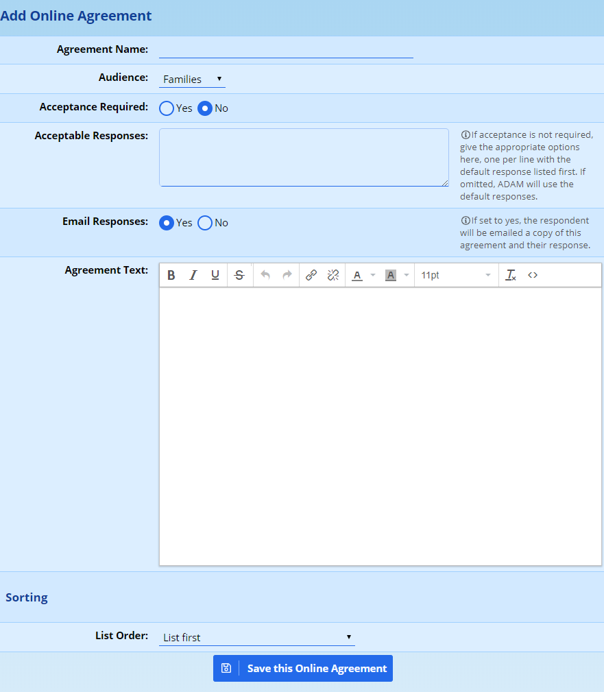
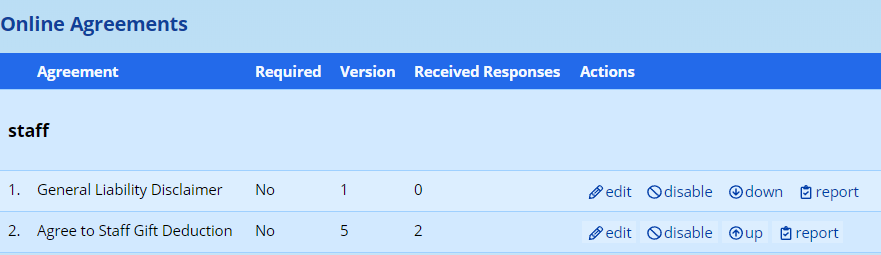
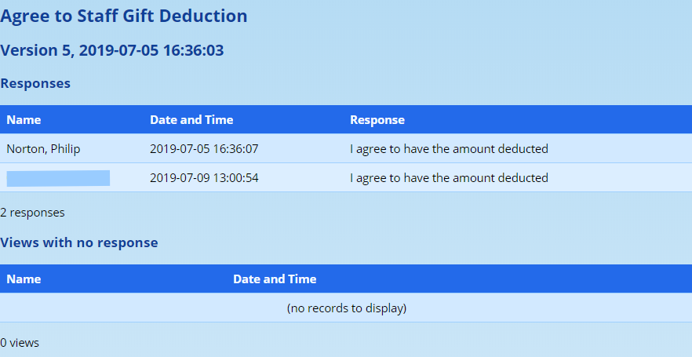
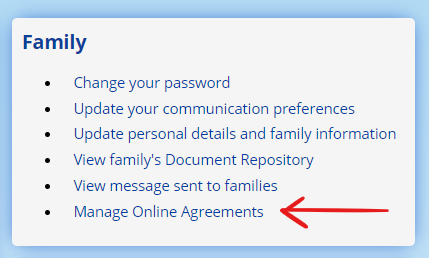
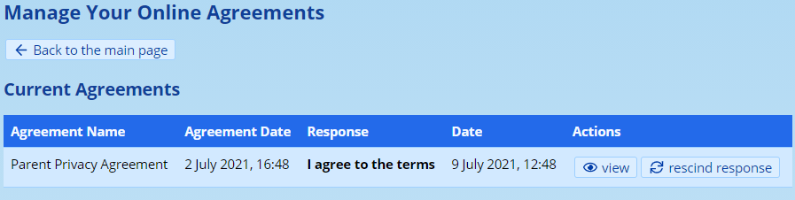
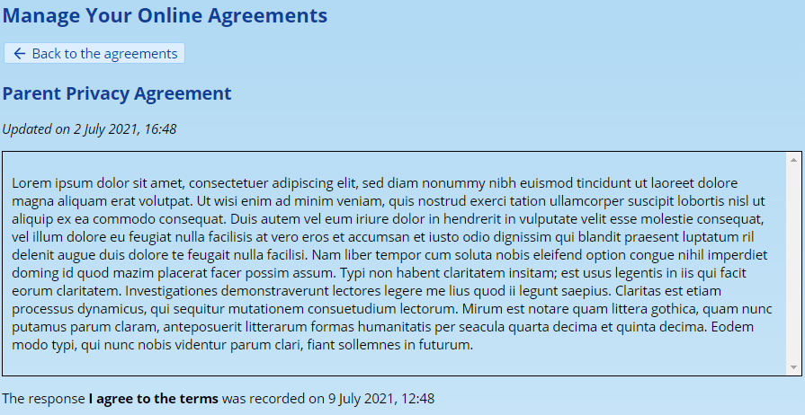
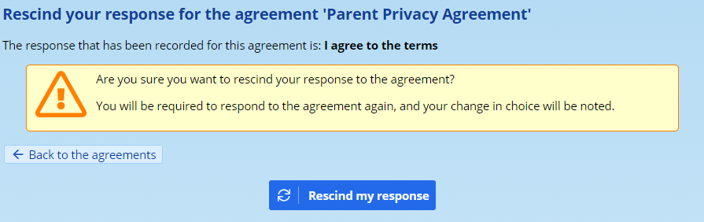
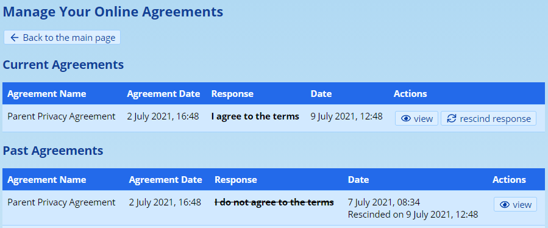

# Online Agreements

ADAM has the ability to ask staff, families and pupils to agree to, or decline, online agreements. These may include terms of enrolment, important notifications and so on.

## Creating Online Agreements

Online Agreements can be created for one of four different audiences:

-   Pupils
-   Current Parents
-   Admissions Parents
-   Staff

Agreements can be drafted and saved via **Administration → Online Agreements → Manage Online Agreements**.

Setting up a new agreement is as simple as clicking on the “Add new Online Agreement” button.

When setting up a new agreement, the following screen is displayed:

The agreement should be given a **name**. This is used to identify the broad contents and purpose of the document.

The **audience** can then be chosen. They will all be prompted to agree to the terms when they next log in to ADAM.

The next two fields determine whether acceptance is required and which responses are acceptable. If “**Acceptance Required**” is set to “Yes”, then ADAM provides a single button for the user to click on which reads “I agree to the conditions above”. If this option is set to “No”, then an additional button is shown which reads “I do NOT agree to the conditions above”.

However, should the second option be set to “No”, ADAM will also consider the possible responses listed in the next box: “**Acceptable Responses**”. These should be listed one-per-line. There can be as many as you’d like. Note that the first option will appear as a bright blue button (the “default” option) and any others will appear as a light blue button. The first option, therefore, should be the one that you expect most of your audience to choose.

We can now set whether we would like the text of the agreement and the response chosen by the parent to be **emailed** to them.

!!! warning
    Note that changing this setting on old agreements will cause users to be emailed a copy, even if they responded a long time ago.

!!! warning
    If one parent agrees to the conditions, both parents will be emailed a copy of the agreement and the response. This does not hold for divorced or otherwise split families where each family member must agree separately.

Next, we have the **text of the agreement**. This can be formatted using some basic formatting options as shown in the toolbar above the text entry area.

At the bottom of the screen is an option to **change the ordering of the agreements**. If a user has more than one agreement to view, they will be shown in the order specified.

## Other Options

From the list of agreements, each agreement will show the options to be edited or to view the associated report with the responses.

The “**up**” and “**down**” options will simply change the list ordering of the agreements. Where there are long lists, it is easier to edit the agreement and, at the bottom, choose a new list position for the agreement.

### Editing Agreements

It is possible to edit an agreement by clicking on the **edit** link next to the agreement name.

If you edit the text of an agreement in any way, ADAM will automatically archive the old version of the agreement and create a new version thereof. The old version of the email will be archived and a new version created. The “version” that appears in the list of agreements will also be incremented to help avoid confusion.

**Users who agreed to the old version will be required to agree to the new version.** For this reason, cosmetic changes to the agreement should be kept to a minimum because any changes to the agreement, even cosmetic, will be interpreted by ADAM as a new agreement.

!!! warning
    *Above, we mentioned that changing the email setting on old agreements would cause the agreements to be emailed out. This only holds if the text of the agreement is not changed when the setting is turned on. If the text is changed, then the instruction to email the agreements is saved with the* ***new*** *agreement and not the old one.*

### Disabling and Enabling Agreements

It is possible to disable an agreement. Disabling an agreement means that users will not be asked to agree.

!!! warning
    Please be careful when enabling agreements, particularly ones that are not the latest version. Editing these older agreements will cause confusion in the numbering.

### Viewing Agreement Responses

Next to the appropriate agreement, click on the “report” option. Currently ADAM shows a simple list of the names of people who have responded to the agreement.

The report shows those who have responded as well as their response and, in a second list, those who have viewed the agreement but who have not yet responded:

## Online Agreements in the Parent Portal

Parents are able to see and manage their online agreements in the Parent Portal. A menu option is provided in the **Family** block.

Clicking on this will show them a lis of all the agreements that they have responded to and the option to **view** or **rescind** their answers to any of the agreements:

Viewing the agreement shows them the text of the agreement and their response:

### Recission of Online Agreements

If a parent choses to rescind an agreement, they are presented with the following screen:

Once rescinded by clicking on the button at the bottom to **Rescind my response**, ADAM will list the agreement and their past response in a list of rescinded agreements:

Note that the previous response, the date and time it was agreed to and the date and time that it was rescinded are shown and cannot be modified.

As soon as the agreement is rescinded and the parent returns to the main page, ADAM will identify that there is an agreement outstanding and prompt the parents to respond to that agreement once again. They will not be able to view the parent portal until such time as they have responded to the agreement.

If the online agreement requires an affirmative response, they will not be able to proceed unless they once again agree to the terms set out in the agreement.

### Viewing Rescinded Agreements

When viewing the [Online Agreement report](#viewing-agreement-responses), ADAM will list all recisions in that report, including the date the agreement was initially responded to and the date and time that the agreement was rescinded.
