# Online Applications {#h-ukga4uow4b68}

## How Does It Work? {#h-lgzwj9ilmt37}

ADAM has an online application facility which allows parents to complete their enrolment information forms online and have those directly included in the ADAM database without any manual data capture.

ADAM provides a similar data capture form that staff would normally use to add a new pupil. However, this can be customised to have custom fields included if necessary. Applicants can submit their and their children’s details onto ADAM.

All online applicants are manually screened first to ensure data quality and eligibility (e.g. girls into a boys school) and to fix minor errors.

Once the application is approved, parents can then also upload supporting documentation directly into the document repository.

### High-level Overview {#h-b72fnbcmkoeb}

The following steps provide an overview of the process for both parents and staff. Included below are links to more specific information that might be required to set up or manage the step or process described.

#### Step 0: {#h-67sn0c84mya8}

The school sets up the online application process. This includes:

1.  Customising the [application form](#h-3thgd1vt1gdm)
2.  Customising the [application notification emails](#h-4mhrvuqt8qbh)
3.  Customising [document upload requirements](document-repository.md#h-erpi5roz7byn)
4.  Enabling the [application form and notifications](#h-6if3z3k5vedw) in site settings

#### Step 1: {#h-wizh0aqwdszq}

Parents visit the online application form and submit their ID number, cell number and email address to begin the process. ADAM checks to see whether the ID number entered belongs to an existing parent. If it does, ADAM requires a login for the parents to ensure that a genuine application is being made and to ensure that no data is leaked about that family to unknown third parties.

#### Step 2: {#h-iet5h13xbx1o}

After submitting their details, ADAM sends an email to confirm the parents email address. The email will contain a link to the application form which they will need to click on to proceed. The parent will be asked to complete the application form with both their and the applicant child’s information.

If ADAM determines that the family already exists in its database, they will be prompted to log in first. Only the child’s information will be requested.

The parents can save the contents of the form and revisit it as necessary to complete it.

#### Step 3: {#h-msocy8sq049r}

Once completed, parents finalise and submit their application. No further changes are possible to that application form from this point.

Internally, the school’s designated contacts are notified that a new application has been received.

#### Step 4: {#h-l8zd59z2ulxp}

The application form is reviewed. The school has the option to “Accept” or “Reject” the application form. This does not *enrol* the pupil to the school. If accepted, the pupil and the family - if they don’t already exist - are added to the database as *applicants* and ADAM can then manage them further.

If the application is rejected, the information is not added to the database and will remain in a list of rejected applicants for a period of 30 days before all information related to that application is deleted.

Any applicant is only searchable from the “Pupil Info” page and will only appear in the list of applicants once the application form has been accepted.

A real world analogy to this process is having a parent fill out a paper form. The form is handed to you. If the form is filled in correctly, you add the form to your list of applicants (i.e. you “accept” the application). If the form is filled out incorrectly, or perhaps they’ve applied for a boy to attend a girls-only school, then you throw the application form in the bin (i.e. you “reject” the application form). Nothing about accepting or rejecting the application form implies anything about whether a future place will be offered to the applicant or not.

#### Step 5: {#h-m4bwh65pryua}

At the point that the application is accepted or rejected, ADAM can send out an optional email to notify parents thereof. This email would include further information such as the need to pay a deposit, submit forms and so on.

We strongly recommend enabling and customising the acceptance email, but we strongly recommend not using the rejection email at all. An application can be rejected for hundreds of reasons and it seems improper to send a generic rejection mail out when there are either material or minor issues with the application. In these cases, we strongly suggest that schools respond directly to the applying parents directly to address any issues that might have arisen.

#### Step 6: {#h-icfykky5vqt8}

Once the application is accepted, the pupil is added to the database in the default application status of “Applicant”. This is a generic status that every new pupil added to the database is added to. Based on the progress of the application, the pupil can be moved to different statuses to indicate this progress.

The pupils would typically end up in one of two broad categories of applicant: “confirmed enrolment” or “not to be enrolled”. The latter is general and schools might prefer different subcategorisations such as “application withdrawn,” “position not offered,” or even “application deferred” (i.e. a waitlist).

## Setting up Online Applications {#h-6if3z3k5vedw}

### Checking your site settings {#h-21ga2a7m7g8l}

There are a few things that need to be checked first. In the [Site Settings](changing-site-settings.md#h-3j2qqm3), check the following settings:

-   **General / Online Applications:**

-   **Online application recipients:** Enter an email address or a comma-separated list of email addresses of people who will be notified when a online application has been received by the school.
-   **Enable online applications:** Ensure that this is set to “Yes” to allow parents access to the application form.
-   **Expire applications (days):** This setting will automatically expire and eventually remove incomplete applications. These are applications that were started, but never submitted to the school for consideration. The default setting is 7 days, but some schools have it as low as 2 or 3. Ask yourself how long it should take a person to complete this information.

-   **General / Site Settings:**

-   **URL for external access:** Ensure that this matches the address that you normally type in to get to ADAM. Note that this setting might not be configurable on some servers and a message will appear saying “Set in the configuration file.” If this is the case, you can carry on!

Don’t forget to save the settings when you’ve updated them!

### Customising the Application Form {#h-3thgd1vt1gdm}

ADAM has four different data capture screens for each of families and pupils. These are:

-   Adding a new family/pupil: this is done internally by staff when a new pupil is added.
-   Editing a family/pupil: this is done internally by staff when information changes.
-   Applying: this is done *externally* by a parent applying for a position at your school.
-   Updating: this is done *externally* by a parent updating their contact details.

Each of these screens can be customised, within reason, to show only the fields that are required.

Spend a moment deciding which fields are necessary for an application form. Our advice is to be conservative in what you ask for. Remember that with the introduction of the Protection of Personal Information Act, it will be an offence to store information unnecessarily.

The most important fields are, from ADAM’s point of view:

-   Families:

-   Primary parent’s names
-   Primary parent’s ID number
-   Primary parent’s email address
-   Primary parent’s cell number

-   Pupils:

-   Pupil’s names
-   Pupil’s ID number
-   Pupil’s grade and year of entry (these fields appear differently after the pupil has been added, as “date of entry” and “grade 12 year”.

Anything more than this is, strictly speaking, not required for ADAM’s functionality. Other information is certainly required, as mentioned, later in the process once the child has been admitted to the school.

If you would like to add in fields which are not part of ADAM’s default setup, then please read up about adding [custom fields](database-field-management.md#h-1hmsyys).

### Finding the address of your Application Form {#h-mzh3j9q7d87i}

There are a number of steps that need to be considered before opening up your online application portal. The application portal is easy to find. You can link to it either from your website or by sending parents and email link. The application form can be found by simply adding “apply” to the end of your ADAM address. For example:

https://demo.adam.co.za**/apply**

### Communication from the Online Application Module {#h-4mhrvuqt8qbh}

During the applicaiton process, ADAM sends an email to applicants in order for them to confirm their email addresses. There are three other emails that can be sent out, but each of these must be enabled before they will be sent:

1.  **Confirmation of receipt of application form:** This email is sent at the end of the application process once they have clicked on the “Submit Application” button at the end of their application procedure.
2.  **Application approval:** When the school accepts the application by “approving” it, an email can be sent to parents with further steps. This may include instructions for paying a deposit and for [uploading documents into ADAM](document-repository.md#h-erpi5roz7byn).
3.  **Application rejection:** When the school rejects an application, an email can be sent to parents with further information. Note that we do not recommend that this feature be used since the email, apart from general customisation below, cannot be tailored to provide reasons why the application was rejected. Given that there are so many reasons that one might decide to reject an application, we strongly recommend personalised communication to parents in this regard.

The contents of the emails that ADAM sends [can be customised](email-message-templates.md#h-5rkfadj40kta).

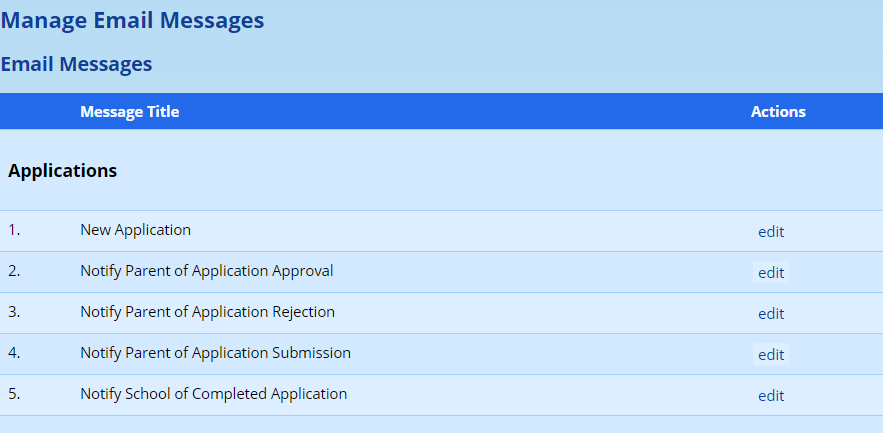

In the “**Applications**” section, you will find the emails that are relevant here. The first, **New Application**, is the email confirmation message that is sent is to confirm a parent’s email address. Note that it is crucial that this email contain the “{link}” code for parents to be able to continue the application process.

-   The template listed second, **Notify Parent of Application Approval**, is used when the application is approved. Edit this template to give the parent information for appropriate next steps.
-   The template listed third, **Notify Parent of Application Rejection**, is used when the application is rejected. We strongly discourage the use of this email template and suggest that schools make direct contact with parents.
-   The fourth template, **Notify Parent of Application Submission**, is sent to parents when they click on the final button to submit their application.
-   The fifth template, **Notify School of Completed Application**, is used to notify a member of staff at the school that a new application form is waiting for acceptance of rejection.

Because you are customising the template for your school, you do not have to make use of the other codes that are provided.

The three additional emails are enabled via the site settings. Under the **General** tab, look for the section on **Online Applications**. The three settings that control the three emails are shown below:

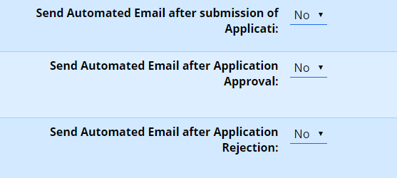

Change the relevant settings to “Yes” where you’d like ADAM to send the emails.

Note, again, that we **do not recommend that the Rejection email is sent automatically** and rather suggest that schools engage directly with the applicants in this regard.

### Testing the Application Form {#h-mrr9dian5u6x}

Once you have completed the steps outlined above, you are encouraged to complete the application form to ensure that you are happy with its content. To do this, follow the [instructions for parents](#h-g6bjptapubx3) below.

Once the application process has been completed, you will need to put on your “staff member” hat in order to finalise the admission. More of this is provided in the [instructions for staff](#h-g93if5i1qg45) below.

## Online Application Reminder Emails {#h-2028syiy36nw}

### Overview {#h-jqx3xxn0yn6j}

The Online Application Reminder Emails feature automatically sends reminder emails to parents who have incomplete online applications. This helps improve application completion rates by gently prompting parents to finish the admissions process.

The system sends reminders for two types of incomplete applications:

1.  Not Started - Parents who confirmed their email address but never began filling out the application form
2.  Incomplete - Parents who started the application but haven't submitted it yet

Reminders are sent on a configurable schedule and stop automatically when the maximum number of reminders has been reached or when the application link is about to expire.

### Enabling the Feature {#h-qq5clzsg1yap}

To enable automatic reminder emails:

1.  Go to **Administration → Site Administration → Edit site settings**
2.  Navigate to the **Admissions** category
3.  Set **Enable Reminder Emails** to Yes

When disabled, no reminder emails will be sent regardless of other settings.

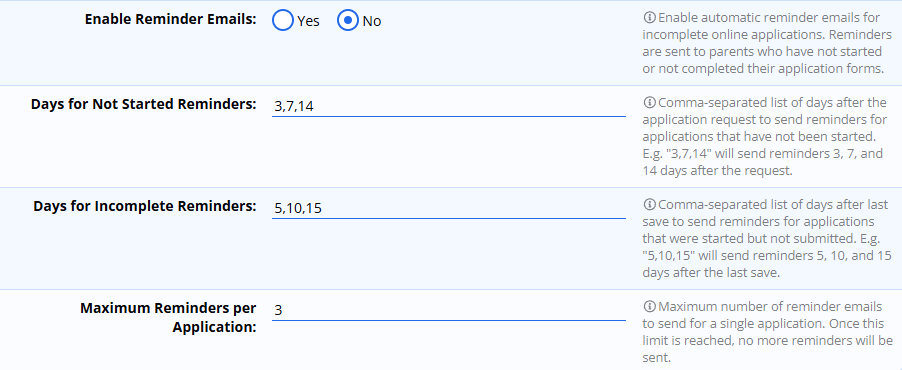

### Configuration Settings {#h-af7ahaoyaqtv}

There are four settings that control how reminders work:

#### Enable Reminder Emails {#h-d1h00726nt4b}

-   Setting name: Enable Reminder Emails
-   Options: Yes / No
-   Default: No

This is the master switch for the feature. Set to "Yes" to enable automatic reminders.

#### Days for Not Started Reminders {#h-497gakywcwob}

-   Setting name: Days for Not Started Reminders
-   Default: 3,7,14

This controls when reminders are sent to parents who requested an application but never started filling it out. The days are counted from when the parent first requested the application.

Example: With the default setting of 3,7,14, a parent will receive reminders:

-   3 days after requesting the application
-   7 days after requesting the application
-   14 days after requesting the application

#### Days for Incomplete Reminders {#h-1xvt38r4rul5}

-   Setting name: Days for Incomplete Reminders
-   Default: 5,10,15

This controls when reminders are sent to parents who started an application but haven't submitted it. The days are counted from when the parent last saved their progress.

Example: With the default setting of 5,10,15, a parent will receive a reminder:

-   5 days after they last saved the application
-   10 days after they last saved the application
-   15 days after they last saved the application

#### Maximum Reminders per Application {#h-11gsyukpk3pk}

-   Setting name: Maximum Reminders per Application
-   Default: 3

This limits the total number of reminder emails sent for a single application. Once this limit is reached, no more reminders will be sent, even if additional reminder days are configured.

Example: If set to 3, each application will receive at most 3 reminder emails total, regardless of whether they are "not started" or "incomplete" reminders.

### Understanding the Day Sequence {#h-eix29qui957w}

The day settings accept a comma-separated list of numbers. Each number represents how many days after the relevant date a reminder should be sent.

#### Format {#h-kpmpf9dc3wcf}

-   Use whole numbers only (e.g., 3, 7, 14)
-   Separate multiple days with commas (e.g., 3,7,14)
-   Spaces around commas are optional (e.g., 3, 7, 14 works the same as 3,7,14)
-   Days do not need to be in order, but listing them in ascending order is recommended for clarity

#### Examples {#h-idfguu3ntz41}

**Setting**

**Meaning**

3

Send one reminder on day 3

3,7

Send reminders on days 3 and 7

3,7,14,21

Send reminders on days 3, 7, 14, and 21

1,2,3,5,7

Send reminders on days 1, 2, 3, 5, and 7 (more frequent early reminders)

#### How the Base Date Works {#h-oxoke8ab3pcf}

-   Not Started reminders: Days are counted from the date the application was first requested
-   Incomplete reminders: Days are counted from the date the application was last saved

If a parent saves their application, the incomplete reminder countdown resets. For example, if reminders are set for days 5, 10, and 15, and a parent saves on day 4, the next reminder would be 5 days from that save date.

### Email Templates {#h-cgpnxf9ypj7i}

Two email templates are used for reminder messages. These can be customised in **Administration → Site Admnistration → Edit email templates**, under the **Applications** section.

#### Reminder: Application Not Started {#h-oa86oj2ryigk}

This template is used for parents who haven't begun their application form.

**Available merge codes:**

**Merge Code**

**Description**

{school}

The name of your school

{requestdate}

The date the application was requested

{daysremaining}

Number of days until the application link expires

{childcount}

Number of children on the application

{link}

The URL to the application form

{button:Text}

A clickable button linking to the application (e.g., {button:Start Application})

#### Reminder: Application Incomplete {#h-n1am1fm92kim}

This template is used for parents who started but haven't submitted their application.

**Available merge codes:**

**Merge Code**

**Description**

{school}

The name of your school

{greeting}

Parent/guardian name if available, or a default greeting

{children}

Names of children on the application

{daysremaining}

Number of days until the application link expires

{link}

The URL to the application form

{schoolphone}

The school's phone number

{button:Text}

A clickable button linking to the application (e.g., {button:Complete Application})

### Expiry Protection {#h-um3329bj134r}

The system automatically protects against sending reminders for applications that are about to expire or have already expired.

#### How It Works {#h-cvb314nwmngv}

-   Reminders are only sent for applications where the link has not yet expired
-   The {daysremaining} merge code shows parents how many days they have left
-   Once an application expires, no further reminders are sent

#### Application Expiry Setting {#h-t6h6anmgixsj}

The application expiry period is controlled by a separate setting:

-   Go to Setup > Settings > General > Online Applications
-   Find the Application Expiry setting (typically set to 30 days)

When planning your reminder schedule, ensure your last reminder day is well before the expiry period. For example, if applications expire after 30 days, setting reminders for days 3, 7, and 14 gives parents at least 16 days to complete their application after the final reminder.

### Best Practices {#h-b90dlp77w951}

#### Recommended Settings {#h-qxfgacszq6l5}

For most schools, the default settings work well:

-   Not Started reminders: 3, 7, 14 days
-   Incomplete reminders: 5, 10, 15 days
-   Maximum reminders: 3

#### Tips for Effective Reminders {#h-j6m60gzbahca}

1.  Don't send too many reminders - Excessive emails may annoy parents. Three reminders is usually sufficient.
2.  Space reminders appropriately - Allow enough time between reminders for parents to respond. Sending reminders on consecutive days may seem pushy.
3.  Start reminders early - The first reminder should come before parents might forget about their application. Day 3 is a good starting point.
4.  Leave room before expiry - Ensure your final reminder gives parents adequate time to complete the application before it expires.
5.  Customise your templates - Personalise the email templates to match your school's tone and include any specific instructions parents might need.
6.  Include clear calls to action - Use the {button:Text} merge code to create prominent, clickable buttons that make it easy for parents to access their application.

### Frequently Asked Questions {#h-f842r9kzjmzi}

#### When are reminders sent? {#h-stml6fepm1jd}

The reminder system runs automatically every 6 hours. When a reminder is due (based on the configured days), it will be sent during the next run.

#### Will parents receive reminders after they submit their application? {#h-sajbm9go9hgk}

No. Once an application is submitted, it is no longer considered "incomplete" and no further reminders are sent.

#### Can I see which applications have received reminders? {#h-9la6dxf39hw}

Yes. In the online applications list, you can see the reminder count for each application. The database tracks both the number of reminders sent and the date of the last reminder.

#### What if a parent saves their application - does that reset the reminders? {#h-uylr5egkyyq4}

Yes. For "incomplete" applications, the reminder countdown is based on the last save date. If a parent saves their application, the days are counted from that new date.

#### Can I manually send a reminder to a specific applicant? {#h-1gtkipjagwy8}

The automatic system does not support manual triggering. However, you can contact individual applicants directly through the online applications interface.

#### Will reminders be sent during school holidays? {#h-z083ddqzvpn9}

Yes, the automatic reminder system runs continuously regardless of term dates or holidays. If you wish to pause reminders during certain periods, you can temporarily set Enable Reminder Emails to "No".

## The Application Process: Procedure for Parents {#h-g6bjptapubx3}

Generally, schools will link through to the application form in ADAM from their website, or perhaps and email. Simply add on “apply” to the end of your ADAM URL for the correct address to visit:

E.g. https://demo.adam.co.za**/apply**

Parents will first be asked to enter an ID number. This is used to determine whether they are existing parents in the database or are new parents:

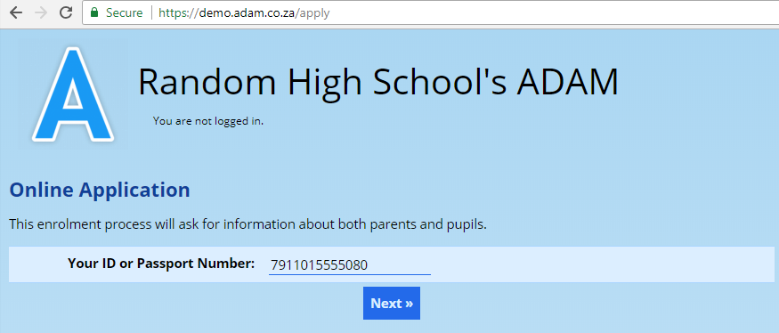

Parents will click on the “Next” button to check the status of their ID number. If their ID number does not match anyone in the database, they will see this message:

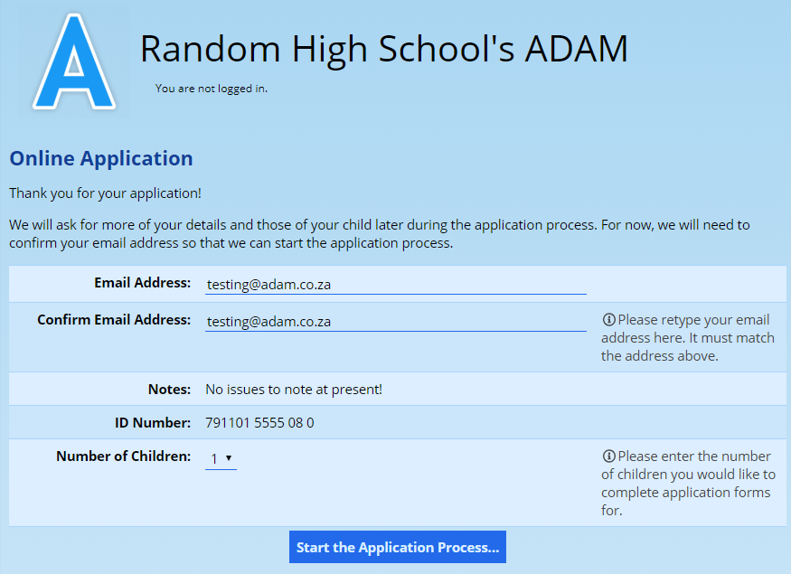

On this screen, they will enter their email address and confirm the number of children that they wish to apply for. They will only be able to proceed if they have entered the same email address twice correctly.

If the ID number does match an existing family in ADAM, the screen will only offer them the ability to choose the number of children. ADAM already has all of their information on file.

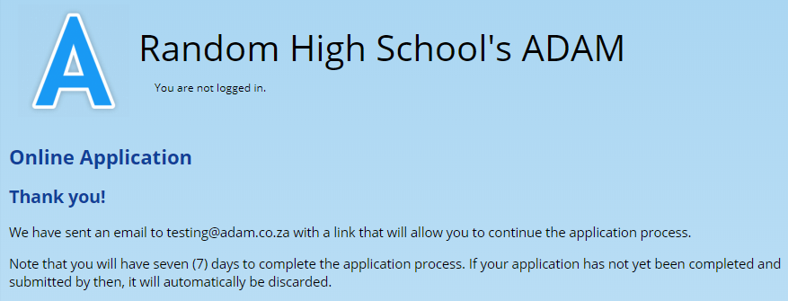

ADAM follows this with an email to confirm the email address. A link should be clicked on in the email to request that they set a password to confirm their information:

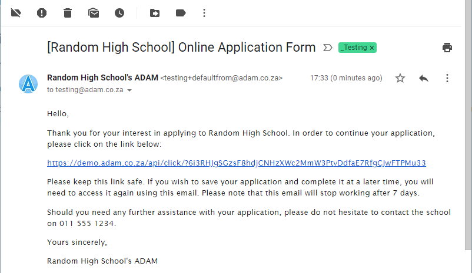

The contents of this email [are customisable](email-message-templates.md#h-5rkfadj40kta).

When parents click on the link provided, ADAM will provide an application form for them to complete. The parent information is completed first with the pupil (or pupils, if more than one was chosen) appearing below.

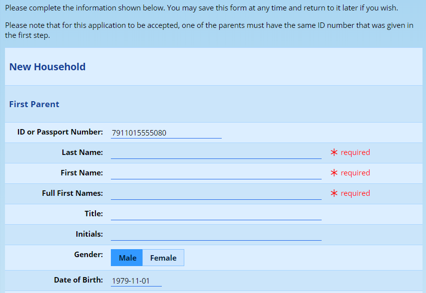

The contents of this application form can be customised by controlling which fields appear in the application form within the core database field management screen.

There is a button at the bottom of the form to save it.

Parents can return at any time within the 7 day window they are given to continue completing the form. To return to the screen, they simply need to use the email link that was sent to them.

Once the form is fully complete, they will need to finalise their submission before it will be sent to the school:

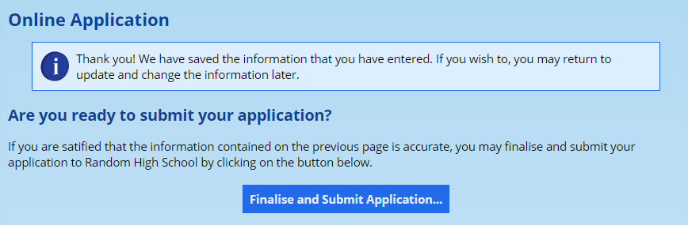

They are asked to confirm their contact details and the details of their children:

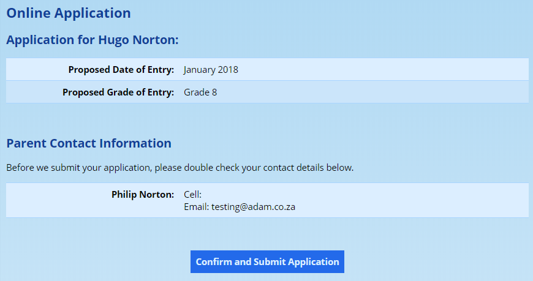

Finally, they click on the **Confirm and Submit Application** button.

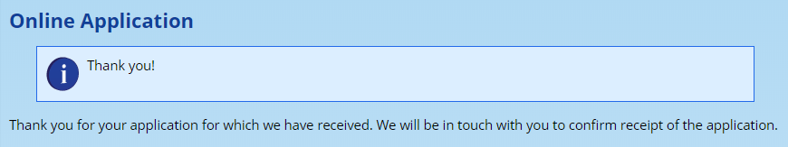

## Application Process: Procedure for Staff {#h-g93if5i1qg45}

At this point a notification is sent to the system administrator, or the configured contact in site settings if one has been set.

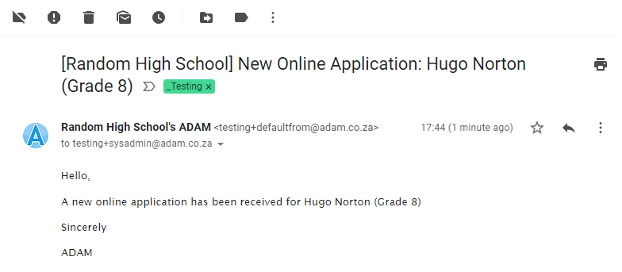

The content of this email can be [changed in the email templates](email-message-templates.md#h-5rkfadj40kta). This template is called “Notify School of Completed Application”.

The staff member can now visit **Admissions → Online Applications → Manage Online Applications** within ADAM. Here they will see a list of all the applications and their statuses. This list will include any applications that might be incomplete, might have expired (not completed within the 7 days) or which were rejected.

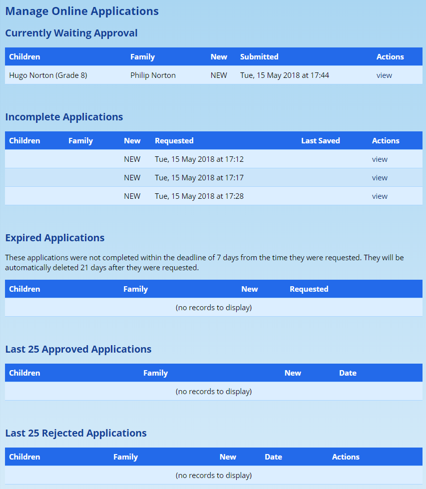

Note that applications can be revived from any status here by clicking on the “view” button. However, if an expired application is not viewed and approved within 3 weeks of it being requested by the parents, it will be deleted. Note that this expiry and deletion only happens if the application was never submitted to the school in the final step. However, it is possible for you to pick up an application that has expired (before it is deleted) and perform the enrolment from there.

Click on **view** next to the application you’d like to see. ADAM brings up the same application form that the parents saw.

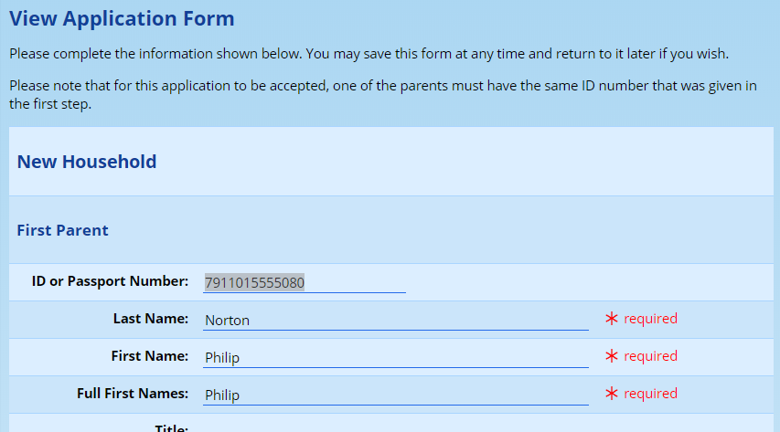

The admissions officer can make changes to this form, correcting spelling, or making sure that the data conforms to the required standards.

At the bottom of this form are three options:

-   **Saving the information** will update the information in the application form, but will not process it. The applicant will remain on the list of submitted application forms. The pupil will not be added to the database.
-   **Approving the Application** will add the pupil and family (if it is new) to the database. The pupil is added as an applicant in the [default admissions status](enrolment-process.md#h-2dlolyb). This does *not* guarantee them a place or add them as a current pupil. *Remember that no communication is sent by ADAM.*
-   **Reject Application** will remove the application from the pile. Typically, applicants are rejected here for stechnical reasons (incomplete form, incorrect grades, incorrect gender for monastic schooling, and so on). Rejection here essentially means tossing the application form into the bin. The pupil and the family will *not* be added to the database.

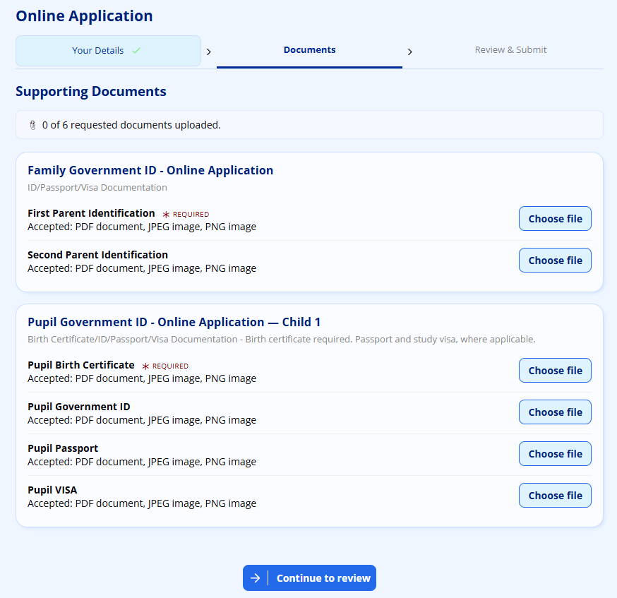***Please note well: “Accepting” and “Rejecting” applications refers specifically to the*** ***application form******. This will add these details into your database as an Applicant profile.*** ***No decisions about enrolment into the school have been made*** ***at this point. Enrolment (or not!) will only happen at the very end of the application process.***

## Uploading of Supporting Documents {#h-191sp14o2w5f}

Part of the admissions process is normally to collect documentation for your applicants, including past school reports and a copy of a birth certificate, for example.

ADAM can process uploads from parents, but it does require that their application has been approved first. The reason for this is that ADAM needs to be able to link these to a profile and, before they’ve been accepted, they don’t technically have a profile in the database.

Read more about [setting up the document repository](document-repository.md#h-3l18frh) and [allowing parents to upload documents](document-repository.md#h-erpi5roz7byn).
