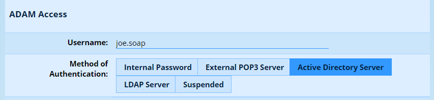
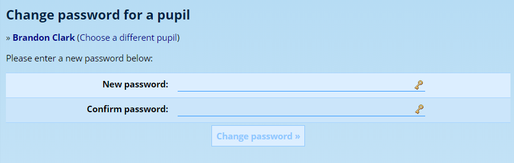
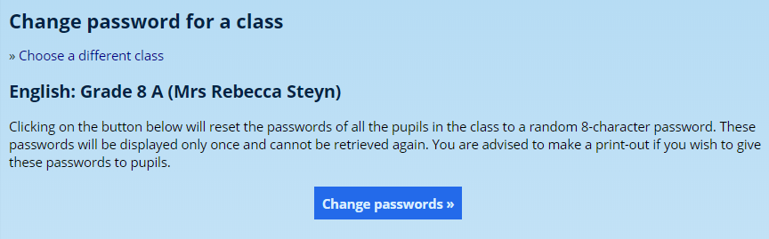
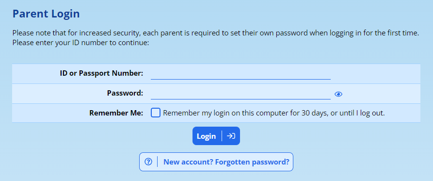
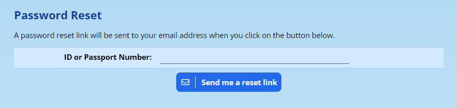
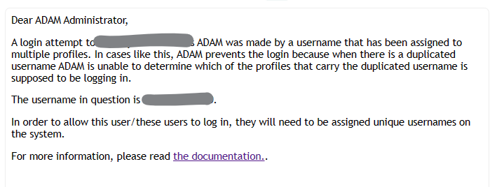
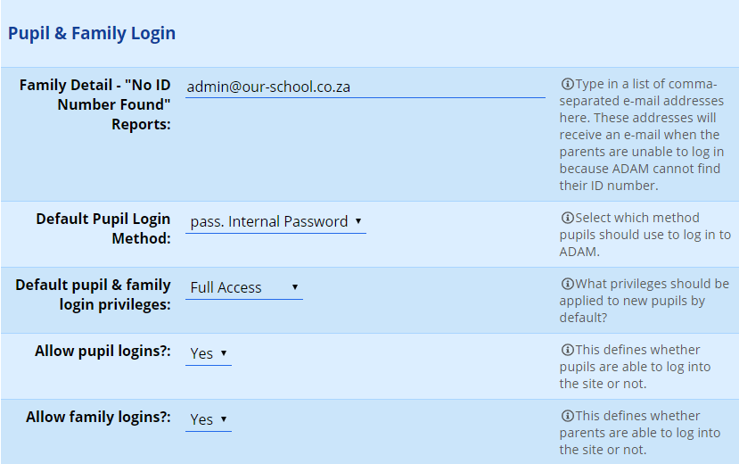

# Parent and Pupil Portal {#h-f2h1db358hth}

Many schools open the parent and pupil portals to improve the information that is available to parents. There are a number of different steps that need to be taken before parent and pupil access can be successfully given. This particular section in the manual will provide you with links to other parts that will guide you through the tasks in more detail.

## Pupil Privilege Groups {#h-jepq6a1v6j35}

It may seem counterintuitive, but parent *and* pupil access to ADAM is controlled through Pupil Privilege groups. This is done because it allows parents to see different views for each of their children. For example, a parent with a child in the high school might get to see the mark book for that child but this may not be available for their child in the primary school.

Please read more about [Pupil Login Groups](security-administration-for-families-and-pupils.md#h-mg1sc7iv8w2n) and, once customised, how to [assign them to classes of pupils](security-administration-for-families-and-pupils.md#h-dhbrfm3k0p0c) at a time.

## Understanding Pupil Login {#h-g3b7qwfm794s}

Pupils can log in to the portal using one of two different ways.

### Username and Password {#h-cj4hcfgwlg61}

The first is using a username or password. Most schools will either have this match their school usernames and use external Active Directory authentication to ensure that their passwords are correct. ADAM can store internal passwords too, if required.

The username and authentication method can be set individually for each pupil. If you require a lot of pupils to be changed, please let us know so that we can update the database for you. In a user’s profile, check that their username and authentication method are set under the **ADAM Access** heading.

If a pupil has an *internal* password and it needs to be changed, this can be done by a staff member by navigating to **Pupils → Security → Change a pupil’s password**.

If the passwords match and are secure, ADAM will allow you to click on the “Change password” button.

ADAM can also set a class’s passwords to a random password by navigating to **Pupils → Security → Change a class’s passwords**. Here, ADAM will prompt you to click on a button:

After this, it will show you a list of randomly generated passwords. You will not see this list again, so make sure to copy it to a spreadsheet if you need it! The passwords generated are case-sensitive.

Pupils will be asked to change these passwords when they next log in.

Pupils and parents who prefer not to type a password each time can also enrol a passkey from the portal at **Pupil Portal → Security → Manage your passkeys** or **Family Portal → Security → Manage your passkeys**. Once a passkey has been enrolled, the pupil or parent can log in with their device’s fingerprint or face instead of a password. Their existing password remains valid as a fallback. See [Passkey Authentication](passkey-authentication.md#h-68qerlruak0n) for more.

### OAuth logins using Google or Microsoft accounts {#h-lrvac6oeqz1e}

It is also possible to enable logins using your organisation’s Google or Microsoft accounts. Please see the [Security section](configuring-logins.md#h-qsh70q) for more information on enabling this setting.

## Understanding Parent Login {#h-j9oqjiq3ubit}

Parents do not use a username to log into ADAM. Instead they type in their ID number (or passport number in the case of foreign parents):

### Logging in for the First Time {#h-oxx1bnpvyvpa}

If you have never logged into ADAM before, click on the button at the bottom of the screen “**New Account? Forgotten password?**”

Enter your ID number or Passport number and click on the **Send me a reset link**.

Check your inbox for the email to arrive. You may also want to make sure that it does not arrive in your spam folder.

### Forgotten Passwords {#h-eu2jzab8dpvd}

If they forget their password, a button is provided at the bottom of the login page for them to click on to get a password reset link sent to their email.

### Guide for Parent Logins {#h-1nd5o9vnedvh}

We have drawn up [a guide for parents to follow](logging-on-to-adam-a-guide-for-parents.md#h-3wf37gt5yaio), guiding them through the login process which you are welcome to point them to, or adjust for your own uses.

## Troubleshooting Parent Logins {#h-8u68nd892osi}

The following is a checklist that you can go through when parents are having a problem logging in.

### Duplicate ID Numbers {#h-nd6jryf75nhx}

The most common problem arises when the same ID number is assigned to multiple families on ADAM. When parents login, they provide their ID number and ADAM uses this ID number to identify the family profile that is logging in. If there is more than one profile, ADAM is unable to determine which should be logging in and denies the login.

When parents attempt to login with an ID number that is duplicated, administrators will receive an email warning them that there is a duplicate ID number on the system. They can then investigate this to find out why. Parents will receive a standard error message saying that their login credentials are invalid.

Similarly, when parents attempt to change their passwords and provide a duplicated ID number, ADAM will not be able to determine which profile should have its password change. In this instance, no email is sent to the parent and they will not be able to change their password. However, as with the login attempts above, the ADAM Administrator will receive an email notification that the duplicated ID number exists on the system.

### Spam Email and Email Delivery Problems {#h-5gixko28a1rx}

For reasons of privacy and security, ADAM does not put password reset emails into the parent’s messaging log. It is thus difficult to tell if a password reset email has been sent to parents.

It often happens, by the nature of the email, that password reset emails are often filtered to users’ junk mail or spam folders in their email programs, or, occasionally, are rejected outright by their email server which is often managed by a company with strict email policies.

You will need to check your email service’s delivery logs to ensure that ADAM sent the password reset email and that the receipient server accepted delivery thereof. This is normally sufficient, since most recipient email servers will report it when they reject an email, but it can happen that a recipient server will receive and silently delete such emails. This remains out of ADAM’s control and, if this is happening, additional work will need to be done to improve the deliverability of email from your school’s domain, including things like ensuring SPF records, DKIM signing and DMARC policies are in place to improve the reputation of your email.

### Password Changing {#h-pzalq31he3g8}

ADAM [scans all passwords against a database of passwords](passwords-and-security-information.md#h-ew9mw0a78pk2) that have been scraped from database breaches from around the world. This is in an effort to make sure that users are using unique, strong passwords. If a parent chooses a new password that might be already in this database, ADAM may prevent it immediately (depending on how weak the password is) or allow it for a few months. Parents who have existing passwords which are later added to this database from other breaches, may suddenly find that they are being forced to change their passwords.

This is normal and is part of our commitment to keeping the information that is stored within ADAM safe.

## Enabling The Portal, The Final Settings {#h-lhaocp6w28nv}

Once the privileges are set up, you must enable the portal for parents and/or pupils. This is done in Site Settings:

Navigate to **Administration → Site Administration → Edit site settings**. Once the settings are loaded, click on the **Security** tab and scroll down to **Pupil and Family Login**.

**Faily Detail - “No ID Number Found” Reports:** If a parent attempts a login to ADAM but their ID number cannot be found on the system, ADAM will offer to send a report to the school alerting them of the parent and their attempt to log in. ADAM will request some identifying information from the parent so that the school can manually follow up with the parent concerned and investigate the matter.

**Default Pupil Login Method:** Your preferred authentication method for pupils is set here. Note that changing this setting alone does not affect any pupils - this is the setting that is applied to any new pupils. Note that this is applied when they are *first* captured into the database.

Once set, this can be changed individually for pupils in the database. This could allow, for example, senior pupils to use Active Directory passwords and junior pupils to use internal ADAM-managed passwords. It is also possible to change a pupil’s authentication mechanism to prevent them from logging in at all.

If your pupils use an Active Directory server, choose this here. ADAM can also manage the passwords internally if you require. Set the method to “internal passwords.” Other authentication mechanisms are also provided.

**Default Privilege Group:** It is an excellent idea to set this [privilege group](security-administration-for-families-and-pupils.md#h-mg1sc7iv8w2n) so that it gives new pupils and their families an appropriate level of access to the portal. Normally, this should be set to the same privilege group that would normally be applied to the bulk of your student intake.

Again, be aware that this privilege group is set when the child is *first* captured onto the system.

ADAM provides some simple privilege groups “out the box”, but these can be [customised and new ones added as required](security-administration-for-families-and-pupils.md#h-mg1sc7iv8w2n).

**Allow Family/Pupil Logins:** Change these settings to “Yes” as required.

Finally, save the Site Settings.

## Testing the Logins and Privileges {#h-wwwrxezhbpfl}

Many schools have a staff member who has children at the school. Such a staff member makes an excellent test subject when testing parent logins.

Alternatively, an excellent way to test is to create a new family and link some children to the family. Then use this new family to log in.

If you want to verify the information that can be seen by a specific family, system administrators can navigate to **Families → Security → Login as a family**. Then, by searching for the family concerned, ADAM will perform a login as if you were that family. This login is in all senses indistinguishable from a normal family login.

## Parent Login Instructions {#h-emx8xsm3513q}

[Please see this separately maintained instruction guide for parents.](https://www.google.com/url?q=https://docs.google.com/document/d/1vHiaDoheupdosNEEv32az8MjiVfSFUNmRiAk3TBZuuo/edit&sa=D&source=editors&ust=1778246676379604&usg=AOvVaw2atf3cB6ua9dNXHaOMewVK) You are welcome to amend this guide for your own purposes, or simply send it to parents in its current form.

## Accessing the QR Code {#h-sfc4hv43rhd3}

Any parent or student who has access to the portal will see a **QR Code** menu option listed under the **General** heading. Tap on the link to see the QR Code.

*For users with limited data access or who may wish to avoid problems of bad signal, it may be sensible to take a screenshot of the QR code and store that in their phone’s photo gallery for future use.*

Note that this QR Code is meant only for scanning by ADAM when searching for a pupil. It is not intended to work in any other website or QR Code scanner.
